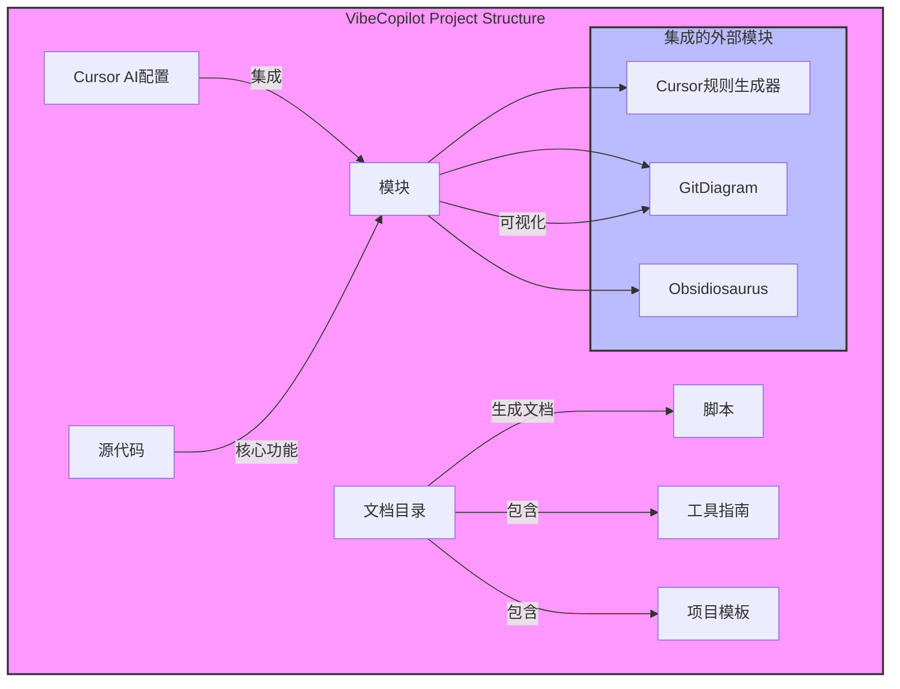

# 项目架构图



<style>
    .config { fill: #ffcc00; }
    .directory { fill: #66ccff; }
    .module { fill: #99ff99; }
    .script { fill: #ff9999; }
    .guide { fill: #ffccff; }
    .template { fill: #ffff99; }
    .source { fill: #ffccff; }
    .submodule { fill: #ccffcc; }
</style>
```
