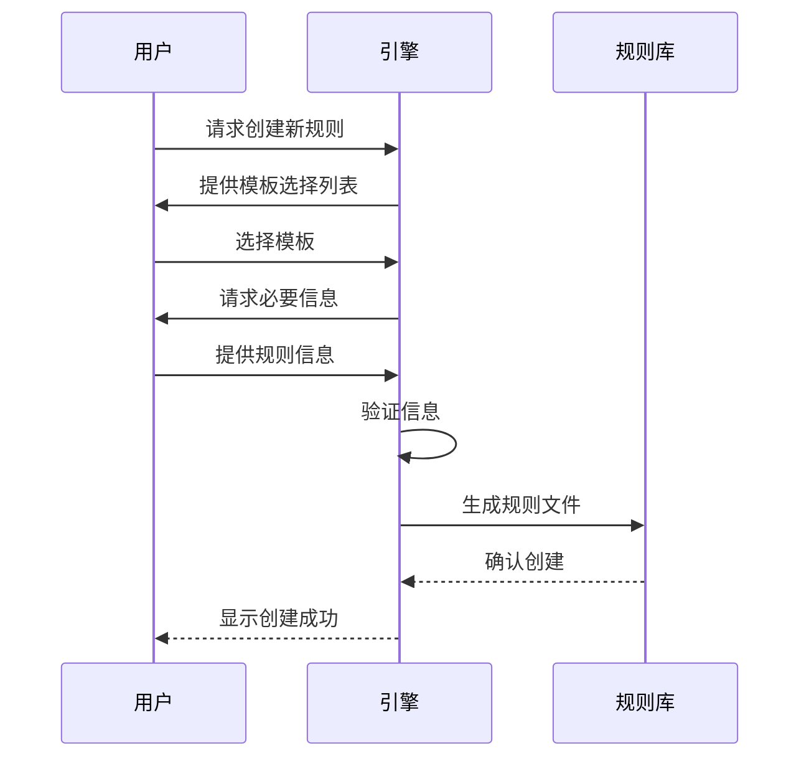

# 规则模版引擎 PRD

## 需求背景

根据VibeCopilot项目白皮书中的核心定位，项目需要建立多层次规则体系来规范和优化AI辅助开发流程。目前，规则创建和管理过程较为繁琐，缺乏标准化的模板和自动化工具，导致规则质量参差不齐、格式不一致，且难以高效扩展。规则模板引擎旨在解决这一问题，提供统一的规则创建、管理和应用机制。

## 功能描述

规则模板引擎是一个用于生成、管理和应用Cursor规则的专用工具，它能根据预定义的模板快速创建规范化的规则文件，确保一致性和质量，同时提供规则版本管理、依赖分析和应用推荐功能。

## 功能范围

### 包含内容

1. **规则模板系统**
   - 预定义的规则模板库，覆盖各类规则类型
   - 模板字段智能填充机制
   - 模板验证和质量检查

2. **规则生成器**
   - 基于模板的规则文件生成
   - 规则元数据自动管理
   - 规则间依赖关系处理

3. **规则管理功能**
   - 规则版本控制
   - 规则冲突检测
   - 规则效果评估指标

4. **规则应用推荐**
   - 基于上下文的规则推荐
   - 自动规则选择建议
   - 规则应用场景识别

5. **规则索引与文档**
   - 自动生成规则文档
   - 规则搜索与索引
   - 规则使用统计分析

### 不包含内容

- 实际规则内容的编写（仅提供框架）
- 规则的具体执行逻辑实现
- 与非Cursor IDE的集成
- 大型语言模型的自定义训练
- 底层AI推理优化

## 验收标准

1. **规则模板系统**
   - 至少提供10个核心规则类型的模板
   - 模板填充错误率低于5%
   - 模板生成速度<2秒/规则

2. **规则生成器**
   - 生成的规则100%符合cursor规则格式规范
   - 支持所有必要的规则类型（-agent, -auto, -manual, -always）
   - 规则依赖分析准确率>95%

3. **规则管理功能**
   - 版本控制支持完整的历史追踪
   - 冲突检测准确率>90%
   - 提供至少3种评估规则效果的量化指标

4. **规则应用推荐**
   - 推荐相关性达到80%以上
   - 推荐响应时间<1秒
   - 上下文理解正确率>85%

5. **规则索引与文档**
   - 文档生成覆盖率100%
   - 规则搜索结果相关性>90%
   - 使用统计分析覆盖所有重要指标

## 优先级与依赖

- 优先级：高
- 依赖：
  - T2.1：核心引擎实现
  - T2.4：AI集成基础功能

## UI/UX设计

### 规则创建流程

### 模板结构设计

规则模板将采用结构化格式，包含以下关键部分：

- 元数据区域（frontmatter）
- 核心规则区域
- 示例区域
- 文档生成指导

### 命令界面

通过命令行方式提供以下命令：

- `/rule new <规则类型>` - 创建新规则
- `/rule validate <规则文件>` - 验证规则格式
- `/rule update <规则文件>` - 更新现有规则
- `/rule search <关键词>` - 搜索相关规则

---

*注：本PRD基于VibeCopilot的产品规范与实现白皮书，结合当前项目需求编写。后续可能根据需求变化进行调整。*
