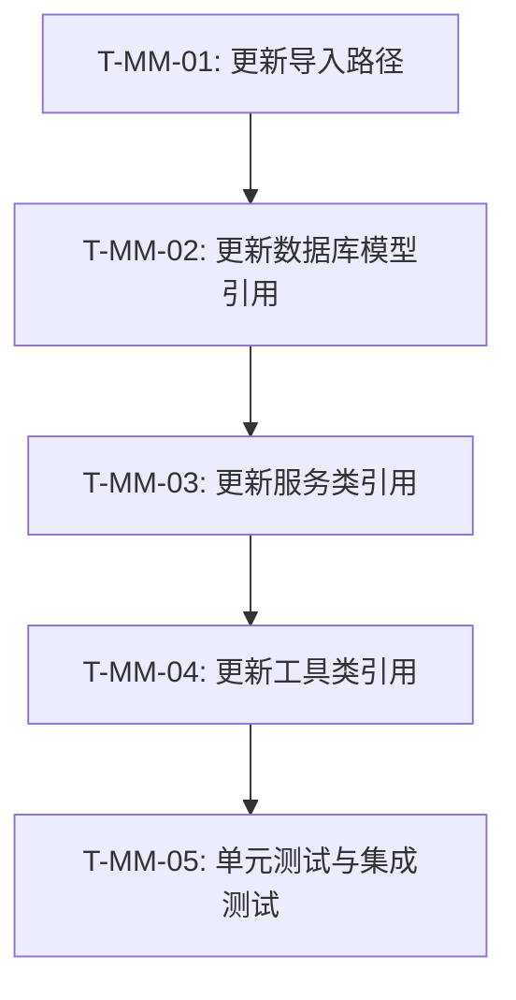

# 模型统一迁移任务状态

## 当前状态

- **分支**: main
- **阶段**: COMPLETED
- **进度**: 已完成并合并到主分支

## 任务列表

| 任务ID | 任务名称 | 状态 | 优先级 | 预计工时 | 责任人 |
|--------|---------|------|--------|----------|--------|
| T-MM-01 | 更新导入路径 | 已完成 | P1 | 4h | jacobcy |
| T-MM-02 | 更新数据库模型引用 | 已完成 | P1 | 4h | jacobcy |
| T-MM-03 | 更新服务类引用 | 已完成 | P2 | 8h | jacobcy |
| T-MM-04 | 更新工具类引用 | 已完成 | P2 | 6h | jacobcy |
| T-MM-05 | 单元测试与集成测试 | 已完成 | P0 | 16h | jacobcy |

## 任务依赖关系

## 里程碑计划

| 里程碑 | 计划日期 | 状态 |
|--------|----------|------|
| 开发计划完成 | 2024-06-01 | 已完成 |
| 导入路径更新 | 2024-06-05 | 已完成 |
| 数据库模型更新 | 2024-06-08 | 已完成 |
| 模型转换更新 | 2024-06-11 | 已完成 |
| 枚举处理完成 | 2024-06-13 | 已完成 |
| 测试完成 | 2024-06-15 | 已完成 |

## 最近更新

- **2024-06-02**: 将feature/model-migration分支合并到主分支，完成模型迁移任务
- **2024-06-02**: 完成任务T-MM-05：单元测试与集成测试
- **2024-06-02**: 修复了模板测试中的问题，更新了Pydantic模型和SQLAlchemy模型的转换方法
- **2024-06-02**: 完成了templates目录下所有测试用例的适配
- **2024-06-01**: 更新rule_engine和CLI命令相关模块的导入路径
- **2024-06-01**: 更新了规则生成器和模板模型的导入路径
- **2024-06-01**: 完成任务T-MM-04：更新工具类引用
- **2024-06-01**: 完成任务T-MM-03：更新服务类引用
- **2024-06-01**: 完成任务T-MM-02：更新数据库模型引用
- **2024-06-01**: 完成任务T-MM-01：更新导入路径
- **2024-06-01**: 创建开发分支feature/model-migration
- **2024-06-01**: 完成开发计划文档
- **2024-06-01**: 初始化任务列表
