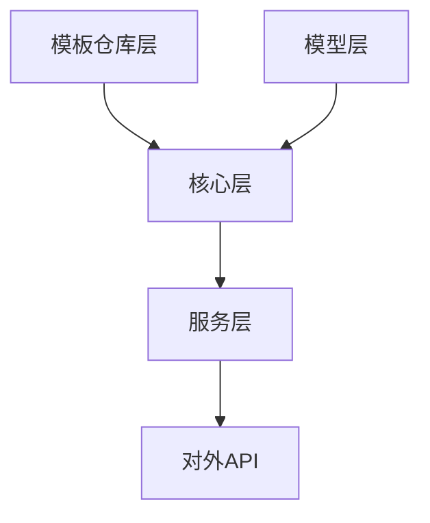

# 规则模板引擎 - 开发指南

## 架构简述

规则模板引擎采用分层架构设计，将模板处理流程分解为清晰的组件和职责：



### 主要组件

1. **模型层** (`models/`): 定义数据模型和验证规则
2. **核心层** (`core/`): 包含模板引擎、管理器和规则生成器
3. **仓库层** (`repositories/`): 负责模板数据的存储和检索
4. **服务层** (`services/`): 提供高级功能和业务逻辑
5. **工具函数** (`utils/`): 通用辅助功能

### 数据流

```
模板定义 -> 模板加载 -> 变量验证 -> 模板渲染 -> 规则生成 -> 规则存储
```

## 核心代码

### 模板引擎 (TemplateEngine)

位置: `src/rule_templates/core/template_engine.py`

关键功能:

- 基于Jinja2的模板渲染引擎
- 支持自定义过滤器
- 提供变量验证和替换

核心方法:
```python
def render_template(self, template: Template, variables: Dict[str, Any]) -> str:
    """渲染模板，返回生成的内容"""

def apply_template(self, template: Template, variables: Dict[str, Any],
                  output_path: Optional[str] = None) -> str:
    """应用模板并可选地保存到文件"""
```

### 模板管理器 (TemplateManager)

位置: `src/rule_templates/core/template_manager.py`

关键功能:

- 模板的CRUD操作
- 模板搜索和过滤
- 模板缓存管理

核心方法:
```python
def load_templates_from_directory(self) -> int:
    """从目录加载模板"""

def get_template(self, template_id: str) -> Optional[Template]:
    """获取特定模板"""

def search_templates(self, **filters) -> List[Template]:
    """搜索符合条件的模板"""
```

### 规则生成器 (RuleGenerator)

位置: `src/rule_templates/core/rule_generator.py`

关键功能:

- 根据模板生成规则对象
- 生成规则文件
- 批量规则生成

核心方法:
```python
def generate_rule(self, template: Template, variables: Dict[str, Any]) -> Rule:
    """生成规则对象"""

def generate_rule_file(self, template: Template, variables: Dict[str, Any],
                     output_path: str) -> Rule:
    """生成规则文件"""
```

## 数据模型

### 模板模型 (Template)

位置: `src/rule_templates/models/template.py`

关键字段:

- `id`: 模板唯一标识符
- `name`: 模板名称
- `type`: 模板类型 (cmd, flow, role等)
- `content`: 模板内容
- `variables`: 模板变量定义
- `metadata`: 模板元数据

### 规则模型 (Rule)

位置: `src/rule_templates/models/rule.py`

关键字段:

- `id`: 规则唯一标识符
- `name`: 规则名称
- `type`: 规则类型 (AGENT, AUTO, MANUAL, ALWAYS)
- `description`: 规则描述
- `content`: 规则内容
- `metadata`: 规则元数据

## 注意事项

### 变量验证

变量验证是模板系统的关键环节。每个模板必须定义其所需变量，包括:

- 变量名称
- 变量类型
- 是否必填
- 默认值

验证失败时会抛出ValueError，包含详细的错误信息。

### HTML实体转义

在处理模板内容时，单引号会被自动转义为HTML实体(`&#39;`)。在编写测试或处理模板内容时需要注意这一点。

解决方案:
```python
# 在断言比较时考虑HTML实体转义
self.assertIn("console.log(&#39;测试示例&#39;)", rule.content)

# 或者在模板配置中禁用HTML自动转义
env = Environment(autoescape=False)
```

### Pydantic模型序列化

使用Pydantic v2时，需要注意:

- `json()`方法已被废弃，应使用`model_dump_json()`
- 调整序列化参数适应新API，如使用`exclude_none=True`代替`skip_defaults=True`

## 技术债务

1. **模板服务层测试覆盖不足**
   - 服务层(`services/`)目前缺少单元测试
   - 计划在下一迭代补充

2. **模板文件格式限制**
   - 当前仅支持Markdown和Jinja2格式模板
   - 可能需要扩展支持更多模板格式

3. **错误处理改进**
   - 某些边缘情况下的错误消息不够明确
   - 计划改进错误诊断和提示

4. **性能优化空间**
   - 大量模板时的加载性能可能有问题
   - 考虑实现惰性加载或更高效的缓存策略

## 扩展指南

### 添加新类型模板

1. 在`models/template.py`中扩展模板类型枚举
2. 创建对应的模板文件
3. 考虑为新类型添加专用的验证逻辑

### 实现新的存储后端

1. 实现`TemplateRepository`接口
2. 在`repositories/`目录下创建新的存储类
3. 更新`TemplateManager`以使用新的存储后端

### 添加自定义过滤器

在`TemplateEngine`的`_setup_custom_filters`方法中注册新的过滤器:

```python
def _setup_custom_filters(self):
    # 现有过滤器...

    # 添加新过滤器
    self.env.filters['my_custom_filter'] = lambda s: s.replace(' ', '_')
```
