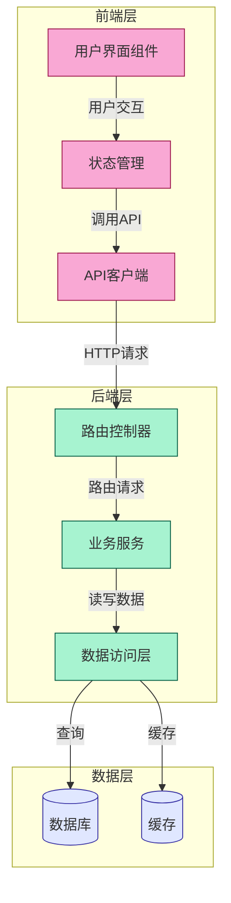

# GitMap - 项目结构分析与路线图生成工具

GitMap是VibeCopilot的项目结构分析工具，基于GitDiagram技术，能够自动分析项目代码结构并生成可视化架构图，帮助开发者快速了解项目框架、生成路线图或在代码重构后更新项目文档。

## 🚀 功能特点

- **项目结构可视化**：将任何项目转换为交互式架构图
- **组件关系分析**：自动识别组件之间的关系和数据流
- **重构前后对比**：支持代码重构后的项目分析，便于更新路线图
- **智能组件映射**：将图中组件与实际代码文件/目录关联
- **定制化分析**：通过指令调整分析重点，如突出数据流或API接口

## 🛠️ 使用方法

### 安装依赖

```bash
pip install requests python-dotenv
```

### 基本用法

分析项目并生成架构图：

```bash
chmod +x ./scripts/gitdiagram/gitmap.sh
./scripts/gitdiagram/gitmap.sh /path/to/your/project
```

### 高级用法

#### 自定义输出目录

```bash
./scripts/gitdiagram/gitmap.sh -o ./diagrams /path/to/your/project
```

#### 添加自定义分析指令

```bash
./scripts/gitdiagram/gitmap.sh -i "突出显示数据流和API接口" /path/to/your/project
```

#### 分析重构后的项目

```bash
./scripts/gitdiagram/gitmap.sh -r /path/to/refactored/project
```

#### 使用自定义API密钥

```bash
./scripts/gitdiagram/gitmap.sh -k "your-openai-api-key" /path/to/your/project
```

#### 显示帮助信息

```bash
./scripts/gitdiagram/gitmap.sh -h
```

## 🔧 配置选项

GitMap可以通过环境变量进行配置，在项目根目录创建或编辑`.env`文件：

```
# OpenAI API密钥(必需)
OPENAI_API_KEY=your-openai-api-key

# GitHub个人访问令牌(可选，用于访问私有仓库)
GITHUB_PAT=your-github-personal-access-token

# GitDiagram后端URL(可选，如果自己部署了GitDiagram后端)
GITDIAGRAM_BACKEND_URL=http://localhost:8000
```

## 📊 输出文件

GitMap会生成两个主要文件：

1. **project_explanation.md**：项目架构的详细文字说明
2. **project_diagram.md**：包含Mermaid格式架构图的Markdown文件

可以使用任何支持Mermaid的Markdown查看器查看图表，或将Mermaid代码粘贴到[Mermaid Live Editor](https://mermaid.live)进行查看和编辑。

## 🔄 与VibeCopilot集成

GitMap可以与VibeCopilot的其他功能无缝集成：

1. **路线图生成**：分析项目后自动生成开发路线图
2. **文档更新**：将生成的架构图集成到项目文档
3. **重构辅助**：在重构前后分析项目结构，确保架构一致性

## 💡 使用建议

- 对于大型项目，建议按模块分别分析，然后合并结果
- 添加有针对性的指令以获得更精确的分析结果
- 定期运行分析以保持架构文档的更新
- 在重大重构前后运行分析，对比架构变化

## 📝 示例指令

以下是一些有用的分析指令示例：

- `"突出显示前后端交互流程"`
- `"识别核心业务逻辑组件"`
- `"分析数据流动路径"`
- `"重点分析性能瓶颈"`
- `"识别外部依赖和集成点"`

## 📋 示例输出

架构图示例：



## 📚 相关资源

- [GitDiagram原始项目](https://github.com/ahmedkhaleel2004/gitdiagram)
- [Mermaid文档](https://mermaid-js.github.io/mermaid/#/)
- [VibeCopilot文档](https://docs.vibecopilot.com)

## 🤝 贡献指南

欢迎贡献改进和新功能！请遵循VibeCopilot的贡献指南。
