# VibeCopilot 应用流程设计

本文档详细描述VibeCopilot的应用流程，包括用户交互流程和主要功能流程图，旨在为开发和使用提供清晰的流程指导。

## 1. 用户交互流程

### 1.1 项目初始化流程

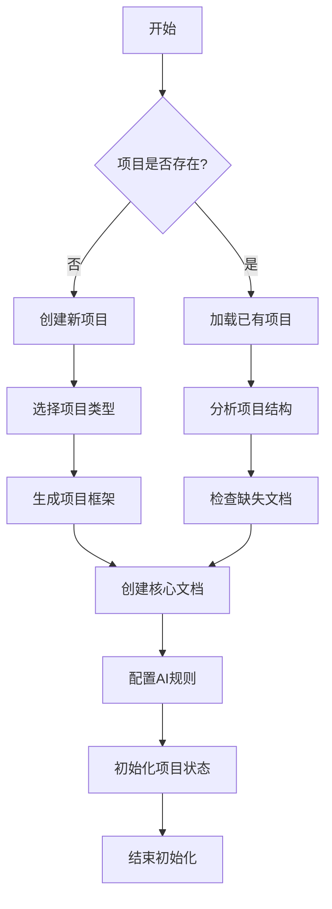

### 1.2 开发流程引导

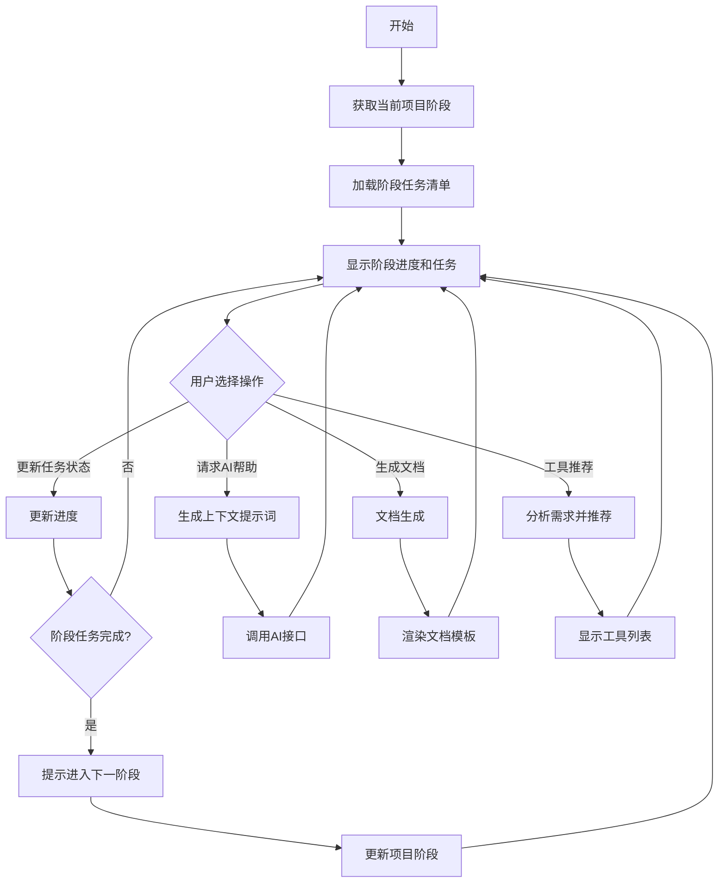

### 1.3 文档管理流程

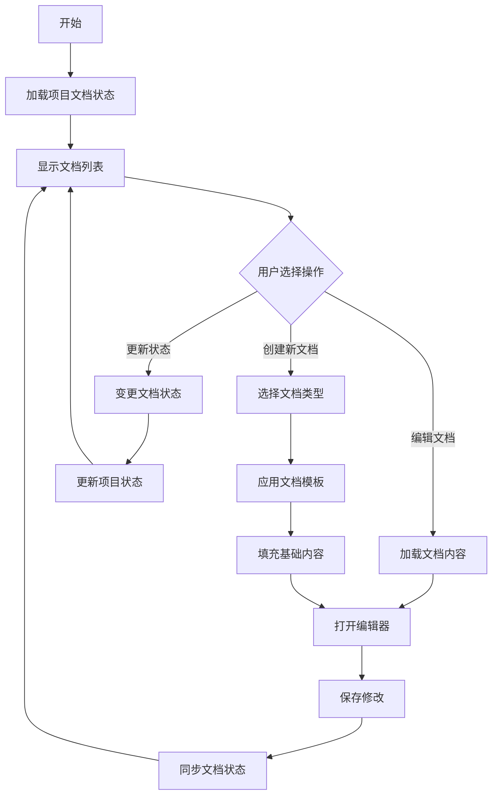

## 2. 主要功能流程

### 2.1 AI辅助集成流程

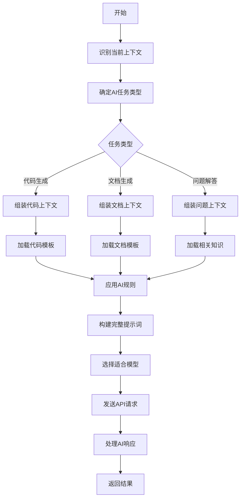

### 2.2 项目状态跟踪流程

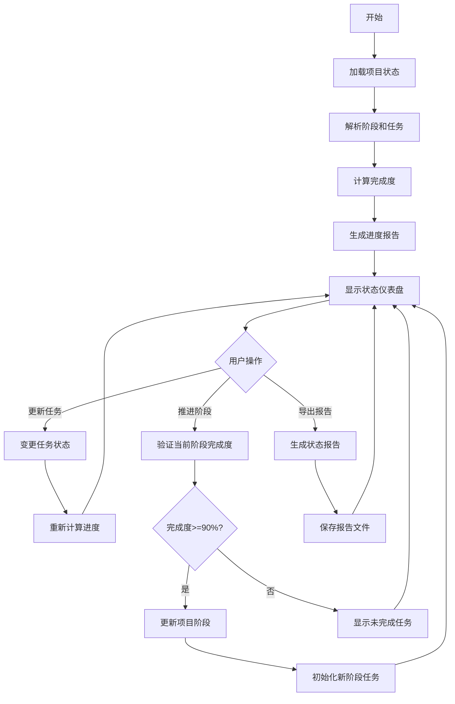

### 2.3 工具推荐流程

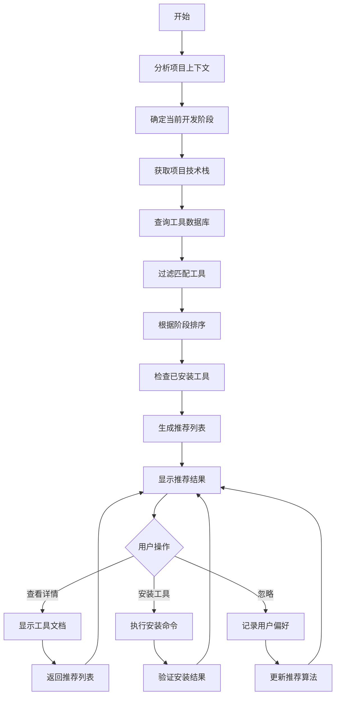

## 3. 数据流程

### 3.1 配置与状态数据流

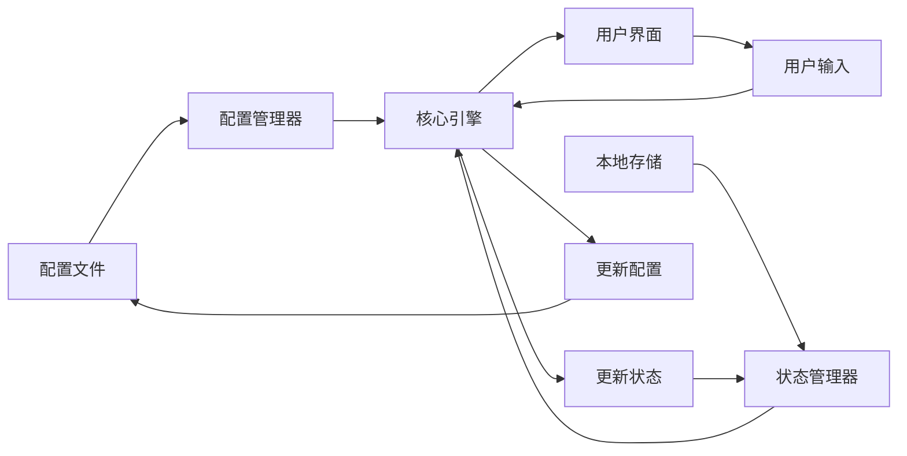

### 3.2 文档生成数据流

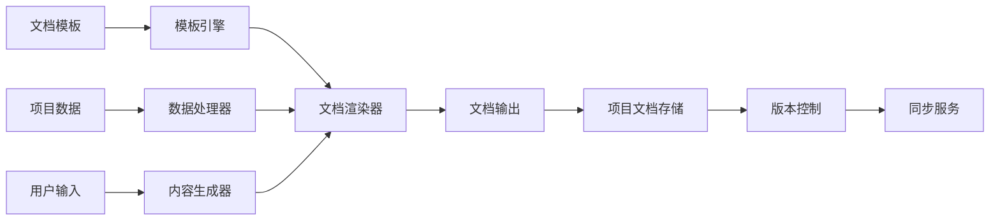

## 4. 用户场景流程

### 4.1 新项目开发流程

1. 用户初始化新项目
2. 系统引导用户完成PRD创建
3. 系统推荐技术栈选择
4. 用户配置开发环境
5. 系统生成项目结构
6. 用户开始设计和开发
7. 系统提供阶段性检查和建议
8. 用户完成阶段并请求进入下一阶段
9. 系统验证完成度并更新状态
10. 循环直到项目完成

### 4.2 AI辅助编码流程

1. 用户请求AI编码帮助
2. 系统分析当前编辑文件和上下文
3. 系统构建提示词并选择合适模型
4. 系统发送请求并获取响应
5. 系统格式化结果并展示给用户
6. 用户审查并应用代码
7. 系统记录成功应用的代码模式
8. 系统更新AI提示词数据库

### 4.3 项目文档管理流程

1. 用户请求查看文档状态
2. 系统显示文档列表和完成状态
3. 用户选择创建或更新文档
4. 系统加载适当模板
5. 系统预填充可自动生成的内容
6. 用户补充和编辑内容
7. 系统验证文档完整性
8. 用户确认保存
9. 系统更新文档状态和版本
10. 系统同步相关文档索引

## 5. 系统交互流程

### 5.1 组件交互流程

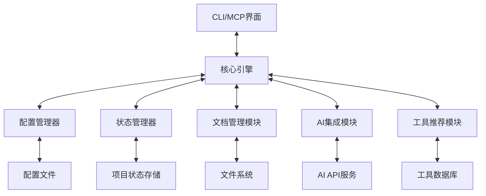

### 5.2 跨项目交互流程

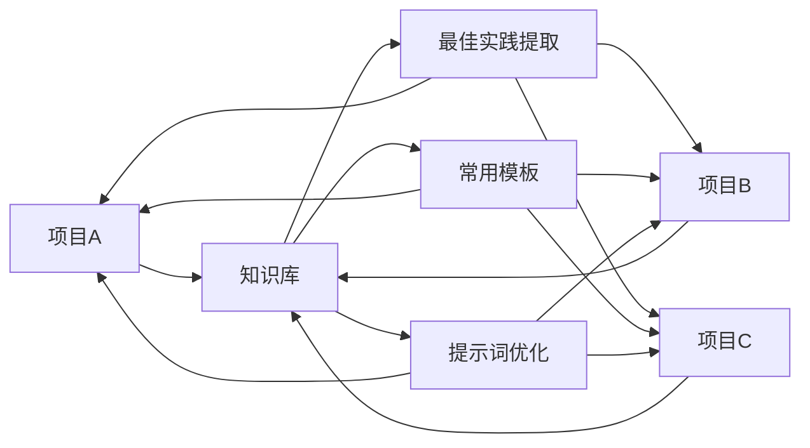

## 6. 错误处理流程

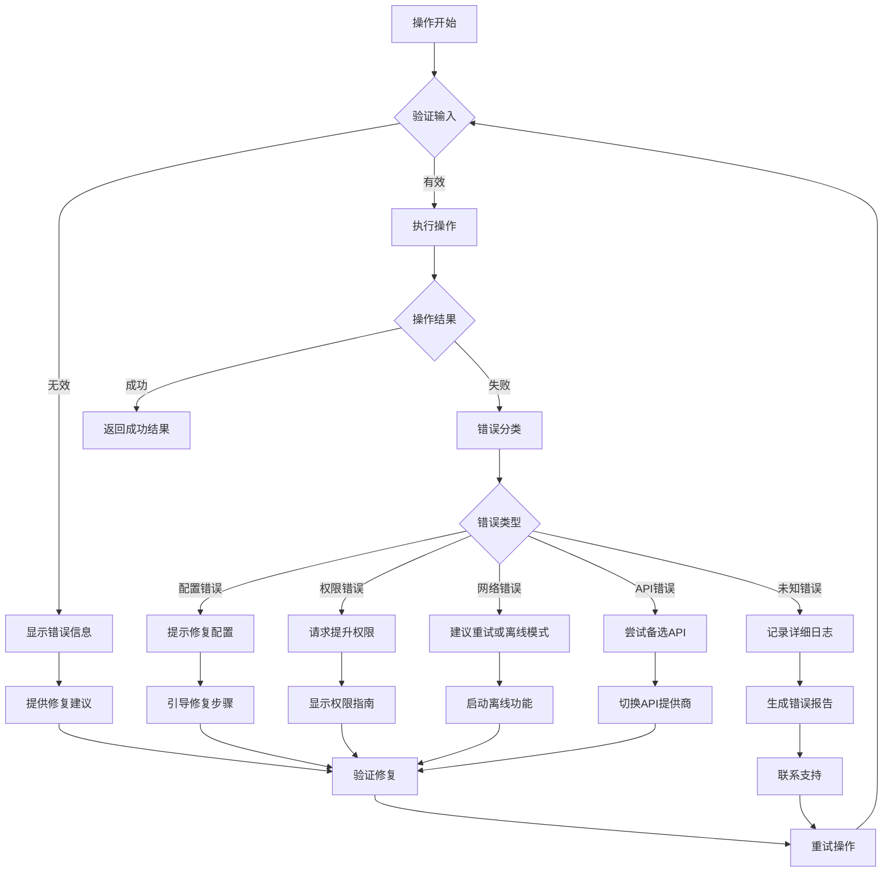

以上流程图提供了VibeCopilot主要功能和交互的流程可视化，这将帮助开发团队理解系统的工作方式，同时为用户提供清晰的使用指导。
