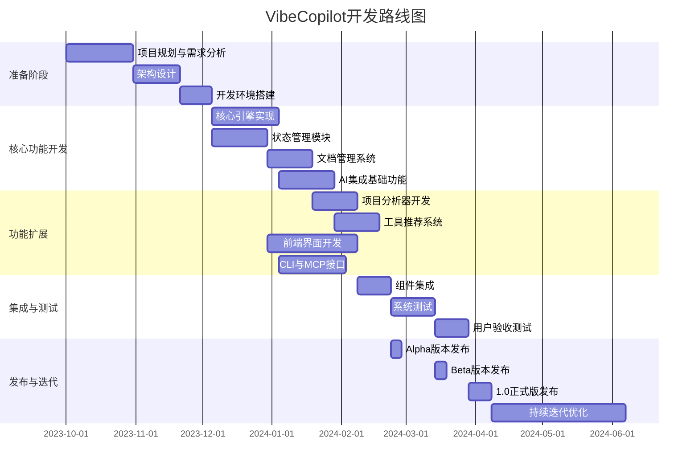

# VibeCopilot 开发路线图

本文档提供了VibeCopilot项目的开发路线图，明确各阶段目标、里程碑和时间线，帮助团队成员了解开发进度和计划。

## 1. 项目开发阶段概览

VibeCopilot项目开发分为以下几个主要阶段：

## 2. 详细开发路线

### 2.1 准备阶段 (M1)

**目标**：完成项目基础规划、架构设计和开发环境搭建。

#### 2.1.1 项目规划与需求分析 (W1-W4)

- [x] 定义项目愿景和范围
- [x] 创建产品需求文档(PRD)
- [x] 应用流程设计
- [x] 技术栈选型
- [x] 前后端开发规范制定
- [x] AI集成策略规划

#### 2.1.2 架构设计 (W5-W7)

- [x] 前端架构设计
- [x] 后端架构设计
- [x] 数据模型设计
- [x] API接口规范
- [x] 组件交互设计
- [x] 安全策略设计

#### 2.1.3 开发环境搭建 (W8-W9)

- [ ] 代码仓库设置
- [ ] 开发环境配置
- [ ] CI/CD流程搭建
- [ ] 代码规范和工具配置
- [ ] 测试框架选择与配置
- [ ] 文档系统设置

**里程碑 M1**: 完成项目规划与开发准备，形成详细的开发计划和技术规范。

### 2.2 核心功能开发阶段 (M2)

**目标**：实现系统核心功能模块，建立基础架构。

#### 2.2.1 核心引擎实现 (W10-W13)

- [ ] 服务注册与发现机制
- [ ] 事件总线实现
- [ ] 工作流管理器
- [ ] 插件系统设计
- [ ] 核心配置管理
- [ ] 错误处理机制

#### 2.2.2 状态管理模块 (W10-W12)

- [ ] 项目状态模型实现
- [ ] 状态持久化机制
- [ ] 状态变更通知系统
- [ ] 进度计算与报告
- [ ] 阶段与任务管理
- [ ] 状态可视化基础

#### 2.2.3 文档管理系统 (W13-W16)

- [ ] 文档模板引擎
- [ ] Markdown渲染系统
- [ ] 版本控制实现
- [ ] 文档存储机制
- [ ] 文档生成流程
- [ ] 文档索引与搜索

#### 2.2.4 AI集成基础功能 (W14-W18)

- [ ] AI服务提供商抽象层
- [ ] 提示词模板系统
- [ ] 上下文构建机制
- [ ] 响应解析器
- [ ] 模型选择策略
- [ ] 错误处理与重试机制

**里程碑 M2**: 核心功能模块完成，系统可以执行基本操作流程。

### 2.3 功能扩展阶段 (M3)

**目标**：在核心功能基础上扩展更多高级特性和用户界面。

#### 2.3.1 项目分析器开发 (W17-W20)

- [ ] 代码解析器实现
- [ ] 依赖分析系统
- [ ] 项目结构提取器
- [ ] 代码复杂度分析
- [ ] 项目健康报告生成
- [ ] 多语言支持

#### 2.3.2 工具推荐系统 (W19-W22)

- [ ] 工具数据库建设
- [ ] 推荐算法实现
- [ ] 上下文匹配机制
- [ ] 用户偏好学习
- [ ] 集成示例生成
- [ ] 工具使用指南生成

#### 2.3.3 前端界面开发 (W13-W22)

- [ ] 组件库开发
- [ ] 页面布局实现
- [ ] 状态管理集成
- [ ] 响应式设计适配
- [ ] 主题与样式系统
- [ ] 用户交互流程实现
- [ ] 可访问性优化
- [ ] 性能优化

#### 2.3.4 CLI与MCP接口 (W14-W20)

- [ ] 命令行接口设计
- [ ] CLI命令实现
- [ ] MCP协议支持
- [ ] 交互式提示
- [ ] 命令自动完成
- [ ] 输出格式化
- [ ] Shell集成

**里程碑 M3**: 完整功能集实现，系统具备全面的项目管理和AI辅助能力。

### 2.4 集成与测试阶段 (M4)

**目标**：确保系统各组件协同工作并满足质量要求。

#### 2.4.1 组件集成 (W23-W25)

- [ ] 前后端集成
- [ ] 模块间交互测试
- [ ] 数据流验证
- [ ] 性能基准测试
- [ ] 集成问题修复
- [ ] 配置参数优化

#### 2.4.2 系统测试 (W26-W29)

- [ ] 功能测试执行
- [ ] 回归测试开发
- [ ] 负载与性能测试
- [ ] 安全测试
- [ ] 错误处理测试
- [ ] 跨平台兼容性测试

#### 2.4.3 用户验收测试 (W30-W32)

- [ ] 用户测试计划
- [ ] 测试用户招募
- [ ] 用户测试执行
- [ ] 反馈收集与分析
- [ ] 关键问题修复
- [ ] 用户体验优化

**里程碑 M4**: 系统通过全面测试，达到发布质量标准。

### 2.5 发布与迭代阶段 (M5)

**目标**：正式发布产品并持续优化。

#### 2.5.1 Alpha版本发布 (W25)

- [ ] 内部测试版发布
- [ ] 开发者文档完善
- [ ] 已知问题列表
- [ ] 早期用户反馈收集
- [ ] 关键问题修复

#### 2.5.2 Beta版本发布 (W29)

- [ ] 公开测试版发布
- [ ] 用户指南完善
- [ ] 社区支持渠道建立
- [ ] 广泛反馈收集
- [ ] 性能与稳定性优化

#### 2.5.3 1.0正式版发布 (W33-W34)

- [ ] 产品正式发布
- [ ] 完整文档发布
- [ ] 营销与推广活动
- [ ] 用户支持系统启用
- [ ] 社区建设开始

#### 2.5.4 持续迭代优化 (W35-W45)

- [ ] 定期功能更新
- [ ] 性能优化
- [ ] 用户反馈处理
- [ ] 插件生态系统构建
- [ ] 新特性规划与开发

**里程碑 M5**: 产品成功发布并建立持续改进机制。

## 3. 关键里程碑时间线

| 里程碑 | 描述 | 预计日期 | 状态 |
|--------|------|----------|------|
| M1 | 准备阶段完成 | 2023-12-15 | 进行中 |
| M2 | 核心功能开发完成 | 2024-03-01 | 计划中 |
| M3 | 功能扩展完成 | 2024-05-15 | 计划中 |
| M4 | 集成与测试完成 | 2024-07-15 | 计划中 |
| M5.1 | Alpha版本发布 | 2024-05-25 | 计划中 |
| M5.2 | Beta版本发布 | 2024-07-05 | 计划中 |
| M5.3 | 1.0正式版发布 | 2024-08-15 | 计划中 |

## 4. 优先级与资源分配

### 4.1 开发优先级

1. **最高优先级** (P0):
   - 核心引擎
   - 状态管理
   - 基础AI集成
   - 主要用户界面

2. **高优先级** (P1):
   - 文档管理
   - CLI接口
   - 工具推荐核心
   - 前端基础组件

3. **中优先级** (P2):
   - 项目分析器
   - MCP接口
   - 高级AI功能
   - 响应式适配

4. **低优先级** (P3):
   - 高级可视化
   - 插件系统
   - 社区功能
   - 高级集成

### 4.2 团队分工

| 团队 | 负责领域 | 主要任务 |
|------|----------|----------|
| 核心开发团队 | 后端架构 | 核心引擎、状态管理、API实现 |
| AI集成团队 | AI功能 | 提示词系统、模型集成、上下文处理 |
| 前端团队 | 用户界面 | 组件开发、页面实现、响应式设计 |
| 工具团队 | 开发工具 | CLI实现、MCP接口、项目分析器 |
| QA团队 | 质量保证 | 测试自动化、测试执行、性能测试 |
| 文档团队 | 文档与支持 | 开发文档、用户指南、示例代码 |

## 5. 风险与缓解策略

| 风险 | 影响 | 可能性 | 缓解策略 |
|------|------|--------|----------|
| AI服务不稳定 | 高 | 中 | 多提供商支持、本地备选方案、优雅降级 |
| 开发延期 | 中 | 高 | 敏捷开发、优先级管理、范围控制 |
| 集成复杂性 | 高 | 中 | 早期原型验证、接口稳定性、增量集成 |
| 用户采纳度低 | 高 | 低 | 用户研究、早期反馈、易用性优化 |
| 性能问题 | 中 | 中 | 持续性能测试、架构审查、可扩展设计 |
| 安全漏洞 | 高 | 低 | 安全代码审查、定期扫描、最小权限原则 |

## 6. 成功标准

VibeCopilot 1.0 版本发布需满足以下标准：

1. **功能完整性**: 实现所有核心功能和优先级P0/P1特性
2. **质量指标**: 零P0/P1级别bug，测试覆盖率>85%
3. **性能要求**: 响应时间<500ms，AI交互<3秒
4. **用户体验**: 用户验收测试满意度>85%
5. **文档完整性**: 完整的开发文档和用户指南
6. **安全合规**: 通过所有安全审查，无高风险漏洞

## 7. 后续规划

VibeCopilot 1.0发布后的发展方向包括：

1. **生态系统扩展**: 发展插件生态系统，支持更多工具集成
2. **企业版开发**: 针对企业需求的特性与安全增强
3. **更多AI集成**: 支持更多AI提供商和专业化模型
4. **社区建设**: 开源社区发展，贡献者生态
5. **高级分析**: 代码质量分析、项目健康评估、团队协作分析
6. **跨平台支持**: 扩展到更多IDE和开发环境

本路线图将随项目进展定期更新，团队应参照此计划协同工作，同时保持足够的灵活性以应对新需求和挑战。
