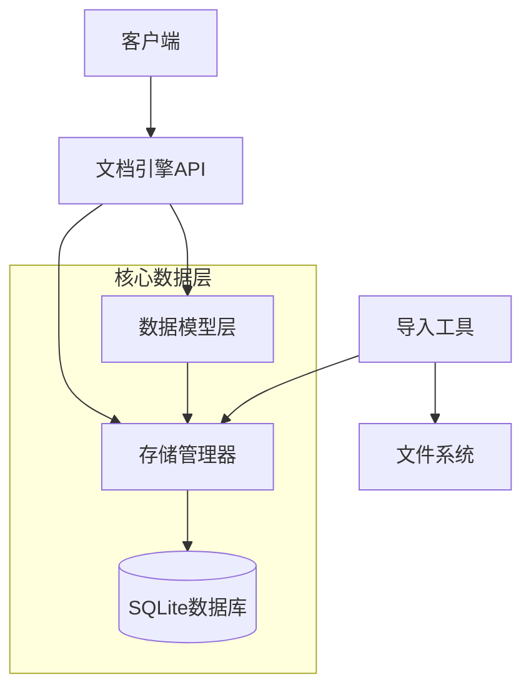
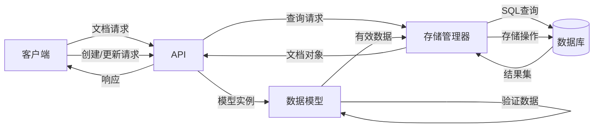
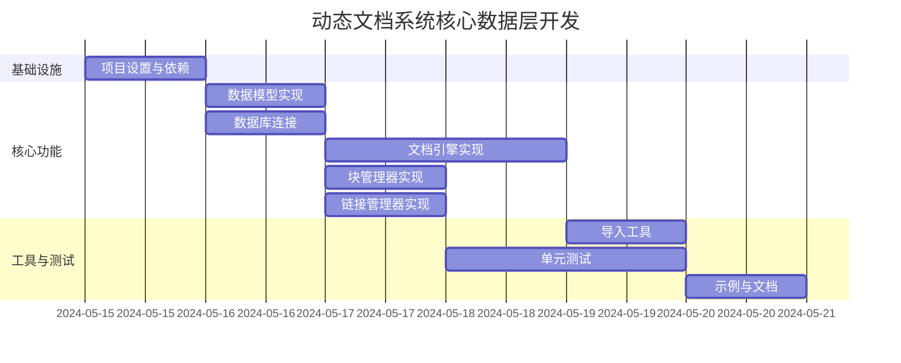

# 动态文档系统核心数据层开发计划

## 项目概览

- **任务ID**: T-DE-01
- **计划状态**: draft
- **关联PRD**: docs/dev_guide/doc_engine.md
- **项目阶段**: demo (概念验证)
- **预计开发时间**: 16小时

## 1. 技术选型

| 技术/库 | 用途 | 选择理由 |
|---------|------|----------|
| SQLAlchemy | ORM框架 | Python生态系统中最成熟的ORM框架，提供灵活的查询和映射功能 |
| SQLite | 数据库 | 轻量级、无需服务器配置，适合demo阶段快速开发 |
| UUID | ID生成 | 生成全局唯一标识符，确保文档和块的唯一性 |
| Pydantic | 数据验证 | 类型提示和验证，确保数据一致性 |
| pytest | 测试框架 | 简单易用，支持参数化测试和mock |

## 2. 架构设计

### 2.1 组件图



### 2.2 数据流图



## 3. 数据模型设计

### 3.1 核心实体

```python
# Document模型
class Document(Base):
    __tablename__ = "documents"

    id = Column(String, primary_key=True)  # UUID
    title = Column(String, nullable=False)
    status = Column(Enum("active", "draft", "deprecated"), default="draft")
    created_at = Column(DateTime, default=datetime.utcnow)
    updated_at = Column(DateTime, default=datetime.utcnow, onupdate=datetime.utcnow)
    metadata = Column(JSON)
    replaced_by = Column(String, ForeignKey("documents.id"), nullable=True)

    # 关系
    blocks = relationship("Block", back_populates="document", cascade="all, delete-orphan")

# Block模型
class Block(Base):
    __tablename__ = "blocks"

    id = Column(String, primary_key=True)  # UUID
    document_id = Column(String, ForeignKey("documents.id"), nullable=False)
    type = Column(Enum("text", "code", "heading", "image"), nullable=False)
    content = Column(Text, nullable=False)
    order = Column(Integer, nullable=False)
    metadata = Column(JSON)

    # 关系
    document = relationship("Document", back_populates="blocks")

# Link模型
class Link(Base):
    __tablename__ = "links"

    id = Column(String, primary_key=True)  # UUID
    source_doc_id = Column(String, ForeignKey("documents.id"), nullable=False)
    target_doc_id = Column(String, ForeignKey("documents.id"), nullable=False)
    source_block_id = Column(String, ForeignKey("blocks.id"), nullable=True)
    target_block_id = Column(String, ForeignKey("blocks.id"), nullable=True)
    text = Column(String)
    created_at = Column(DateTime, default=datetime.utcnow)
```

### 3.2 持久化ID格式

使用UUID格式生成唯一标识符:

- 文档ID: `doc-{uuid4}`
- 块ID: `blk-{uuid4}`
- 链接ID: `lnk-{uuid4}`

## 4. API接口设计

### 4.1 文档管理API

```python
class DocumentEngine:
    def create_document(self, title, content=None, metadata=None) -> Document:
        """创建新文档"""

    def get_document(self, doc_id) -> Document:
        """获取文档对象"""

    def update_document(self, doc_id, **updates) -> Document:
        """更新文档"""

    def delete_document(self, doc_id) -> bool:
        """删除文档"""

    def list_documents(self, filters=None) -> List[Document]:
        """列出文档"""
```

### 4.2 块管理API

```python
class BlockManager:
    def create_block(self, document_id, content, type="text", metadata=None) -> Block:
        """创建块"""

    def update_block(self, block_id, **updates) -> Block:
        """更新块"""

    def delete_block(self, block_id) -> bool:
        """删除块"""

    def get_block(self, block_id) -> Block:
        """获取块"""

    def list_blocks(self, document_id) -> List[Block]:
        """列出文档的所有块"""
```

### 4.3 链接管理API

```python
class LinkManager:
    def create_link(self, source_doc_id, target_doc_id, text=None,
                   source_block_id=None, target_block_id=None) -> Link:
        """创建链接"""

    def delete_link(self, link_id) -> bool:
        """删除链接"""

    def get_outgoing_links(self, doc_id) -> List[Link]:
        """获取文档的出链"""

    def get_incoming_links(self, doc_id) -> List[Link]:
        """获取文档的入链"""
```

## 5. 工作分解

| 任务 | 描述 | 预计工时 | 依赖 |
|------|------|----------|------|
| T1 | 设置项目基础结构和依赖 | 1h | - |
| T2 | 实现核心数据模型 | 2h | T1 |
| T3 | 实现数据库连接和初始化 | 1h | T1 |
| T4 | 实现DocumentEngine | 3h | T2, T3 |
| T5 | 实现BlockManager | 2h | T2, T3 |
| T6 | 实现LinkManager | 2h | T2, T3 |
| T7 | 开发基本导入工具 | 2h | T4, T5, T6 |
| T8 | 单元测试 | 2h | T4, T5, T6 |
| T9 | 创建示例脚本和文档 | 1h | T4, T5, T6, T7 |

### 进度时间表



## 6. 文件结构

```
src/
  docs_engine/
    __init__.py
    models/
      __init__.py
      document.py   # Document, Block, Link模型
      base.py       # Base类和通用工具
    storage/
      __init__.py
      engine.py     # 存储引擎实现
    api/
      __init__.py
      document_engine.py  # 文档API
      block_manager.py    # 块管理API
      link_manager.py     # 链接管理API
    utils/
      __init__.py
      id_generator.py     # ID生成器
      markdown_parser.py  # Markdown解析
    tools/
      __init__.py
      importer.py         # 导入工具
tests/
  __init__.py
  test_models.py
  test_document_engine.py
  test_block_manager.py
  test_link_manager.py
  test_importer.py
examples/
  create_document.py
  block_operations.py
  link_management.py
```

## 7. 风险评估

| 风险 | 可能性 | 影响 | 缓解措施 |
|------|--------|------|----------|
| 数据库性能瓶颈 | 低 | 中 | 针对大型文档实现优化的查询策略和索引 |
| ID冲突 | 低 | 高 | 使用UUID确保全局唯一性并进行ID验证 |
| 复杂文档导入问题 | 中 | 中 | 增量实现导入功能，先支持基础格式再扩展 |
| 大型文档处理内存消耗 | 中 | 中 | 实现分块处理和惰性加载策略 |

## 8. 概念验证重点

作为demo阶段的实现，将重点验证以下核心概念:

1. **持久化ID机制**: 验证基于UUID的持久化ID能否在文档重命名和移动时保持链接稳定
2. **块级管理**: 验证文档分块存储和块级引用的可行性和效率
3. **链接分析**: 验证入链和出链分析的准确性和性能
4. **数据导入**: 验证从现有Markdown文件导入到数据库的可行性

## 9. 下一步工作

成功完成核心数据层后，后续工作方向:

1. 扩展块类型支持
2. 实现更高级的查询功能
3. 添加版本控制功能
4. 开发更完善的UI界面
5. 实现多用户协作功能
