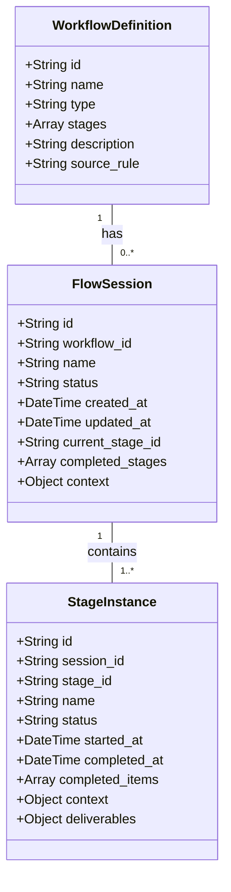

# 工作流会话(Flow Session)开发计划

## 1. 概念定义与架构设计

### 1.1 核心概念

- **工作流定义(Workflow Definition)**: 工作流的静态模板，定义了可用阶段和规则
- **工作流会话(Flow Session)**: 工作流的运行实例，表示正在执行的工作流
- **阶段实例(Stage Instance)**: 工作流会话中的单个阶段运行
- **会话状态(Session State)**: 包括`ACTIVE`, `PAUSED`, `COMPLETED`, `ABORTED`

### 1.2 数据模型设计



## 2. 技术实现方案

### 2.1 数据存储方案

- 使用SQLite作为会话数据的持久化存储
- 设计三个表:`workflow_definitions`, `flow_sessions`, `stage_instances`
- 会话上下文和阶段上下文使用JSON格式序列化存储
- 提供会话查询和重载机制

### 2.2 会话管理器组件

```python
class FlowSessionManager:
    """工作流会话管理器，处理会话的CRUD操作"""

    def create_session(self, workflow_id, name=None):
        """创建新的工作流会话"""

    def get_session(self, session_id):
        """获取会话详情"""

    def list_sessions(self, status=None, workflow_id=None):
        """列出会话，可按状态和工作流ID过滤"""

    def update_session(self, session_id, data):
        """更新会话数据"""

    def delete_session(self, session_id):
        """删除会话"""

    def pause_session(self, session_id):
        """暂停会话"""

    def resume_session(self, session_id):
        """恢复会话"""

    def complete_session(self, session_id):
        """完成会话"""

    def abort_session(self, session_id):
        """终止会话"""
```

### 2.3 阶段实例管理器组件

```python
class StageInstanceManager:
    """阶段实例管理器，处理阶段实例的CRUD操作"""

    def create_instance(self, session_id, stage_id, name=None):
        """创建新的阶段实例"""

    def get_instance(self, instance_id):
        """获取阶段实例详情"""

    def list_instances(self, session_id=None, status=None):
        """列出阶段实例，可按会话ID和状态过滤"""

    def update_instance(self, instance_id, data):
        """更新阶段实例数据"""

    def complete_instance(self, instance_id, deliverables=None):
        """完成阶段实例"""
```

### 2.4 与状态系统集成

```python
class FlowStatusIntegration:
    """工作流与状态系统的集成"""

    def sync_session_to_status(self, session_id):
        """将会话状态同步到状态系统"""

    def sync_status_to_session(self, status_id):
        """从状态系统更新会话状态"""

    def register_session_change_hooks(self):
        """注册会话变更钩子"""
```

## 3. 命令行接口设计

### 3.1 会话管理命令

```
vc flow session list                              # 列出所有活动会话
vc flow session list --status=<status>            # 按状态筛选会话
vc flow session list --workflow=<workflow_id>     # 按工作流筛选会话

vc flow session show <session_id>                 # 显示会话详情
vc flow session pause <session_id>                # 暂停会话
vc flow session resume <session_id>               # 恢复会话
vc flow session abort <session_id>                # 终止会话

vc flow session create <workflow_id> --name=<名称> # 创建新会话
```

### 3.2 修改现有命令

```
# 修改现有的run命令，与会话集成
vc flow run <workflow_name>:<stage_name> [--session=<session_id>] [--name=<名称>]

# 当提供session_id时，将在现有会话中执行阶段
# 否则创建新会话
```

### 3.3 新增工具函数

```python
def get_active_session():
    """获取当前活动的会话，如果有多个则提示选择"""

def switch_active_session(session_id):
    """切换当前活动会话"""

def get_session_progress(session_id):
    """获取会话进度，包括已完成和未完成的阶段"""
```

## 4. 与src/status的集成

### 4.1 状态同步机制

- 会话创建时，在状态系统中创建对应的任务
- 会话状态变更时，同步更新状态系统
- 阶段完成时，更新任务进度
- 提供双向同步机制，允许从状态系统触发会话操作

### 4.2 状态映射

```python
SESSION_STATUS_MAPPING = {
    "ACTIVE": "IN_PROGRESS",
    "PAUSED": "ON_HOLD",
    "COMPLETED": "COMPLETED",
    "ABORTED": "CANCELED"
}

def map_session_to_status(session):
    """将会话映射到状态系统的格式"""
    return {
        "id": f"flow-{session['id']}",
        "name": session["name"],
        "type": "FLOW",
        "status": SESSION_STATUS_MAPPING[session["status"]],
        "progress": calculate_session_progress(session),
        "created_at": session["created_at"],
        "updated_at": session["updated_at"],
        "workflow_id": session["workflow_id"],
        "current_stage": session["current_stage_id"]
    }
```

## 5. 用户界面设计

### 5.1 命令行输出

```
> vc flow session list

✅ 活动工作流会话:

ID                     | 工作流      | 名称         | 状态   | 当前阶段      | 创建时间
-----------------------|------------|-------------|--------|--------------|------------------
dev-flow-auth-123      | dev        | 用户认证功能  | 活动   | coding       | 2023-06-15 10:30
doc-flow-api-456       | doc        | API文档更新  | 暂停   | draft        | 2023-06-14 14:15

总计: 2个会话

提示: 使用 'vc flow session show <ID>' 查看详情
      使用 'vc flow session resume <ID>' 恢复暂停的会话
```

### 5.2 会话详情展示

```
> vc flow session show dev-flow-auth-123

📋 工作流会话: dev-flow-auth-123 (用户认证功能)

基本信息:
- 工作流: dev (开发工作流)
- 状态: 活动
- 创建时间: 2023-06-15 10:30
- 最后更新: 2023-06-15 14:45

阶段进度:
✅ story - 已完成 (2023-06-15 11:00)
✅ spec - 已完成 (2023-06-15 13:30)
▶️ coding - 进行中
⏳ test - 待进行
⏳ review - 待进行

当前阶段详情:
- 名称: 实现用户认证模块
- 开始时间: 2023-06-15 13:45
- 已完成项: 3/8 (37.5%)
  ✅ 搭建基础结构
  ✅ 实现用户模型
  ✅ 设计数据库schema
  ⏳ 实现登录API
  ⏳ 实现注册API
  ⏳ 实现密码重置
  ⏳ 添加JWT认证
  ⏳ 实现权限控制

操作:
- 继续此会话: vc flow session resume dev-flow-auth-123
- 暂停此会话: vc flow session pause dev-flow-auth-123
- 终止此会话: vc flow session abort dev-flow-auth-123
```

## 6. 实现路径与里程碑

### 6.1 数据层实现

1. 设计并创建数据库表
2. 实现基本CRUD操作
3. 添加数据迁移工具

### 6.2 业务逻辑层实现

1. 实现FlowSessionManager
2. 实现StageInstanceManager
3. 实现状态同步机制

### 6.3 命令行接口实现

1. 修改现有命令以支持会话
2. 添加新的会话管理命令
3. 实现格式化输出

### 6.4 测试与验证

1. 单元测试覆盖核心功能
2. 集成测试验证与状态系统的交互
3. 端到端测试模拟完整工作流

## 7. 技术与安全考量

1. **并发处理**：确保多个用户同时使用时的数据一致性
2. **数据持久化**：定期备份会话数据，防止数据丢失
3. **异常恢复**：实现会话的自动保存点和异常恢复机制
4. **性能优化**：高效查询和缓存机制，特别是对大量会话的处理
5. **安全性**：保护敏感的会话数据，防止未授权访问

## 8. 扩展性设计

1. **插件架构**：允许通过插件扩展会话管理功能
2. **事件系统**：实现会话生命周期事件，允许外部系统订阅
3. **导出与导入**：支持会话数据的导出和导入，便于迁移和备份
4. **统计与分析**：收集会话执行数据，支持工作流优化分析

此开发计划立足于现有架构，同时引入会话管理的最佳实践，确保工作流能够可靠地中断和恢复，提升开发体验和工作效率。
