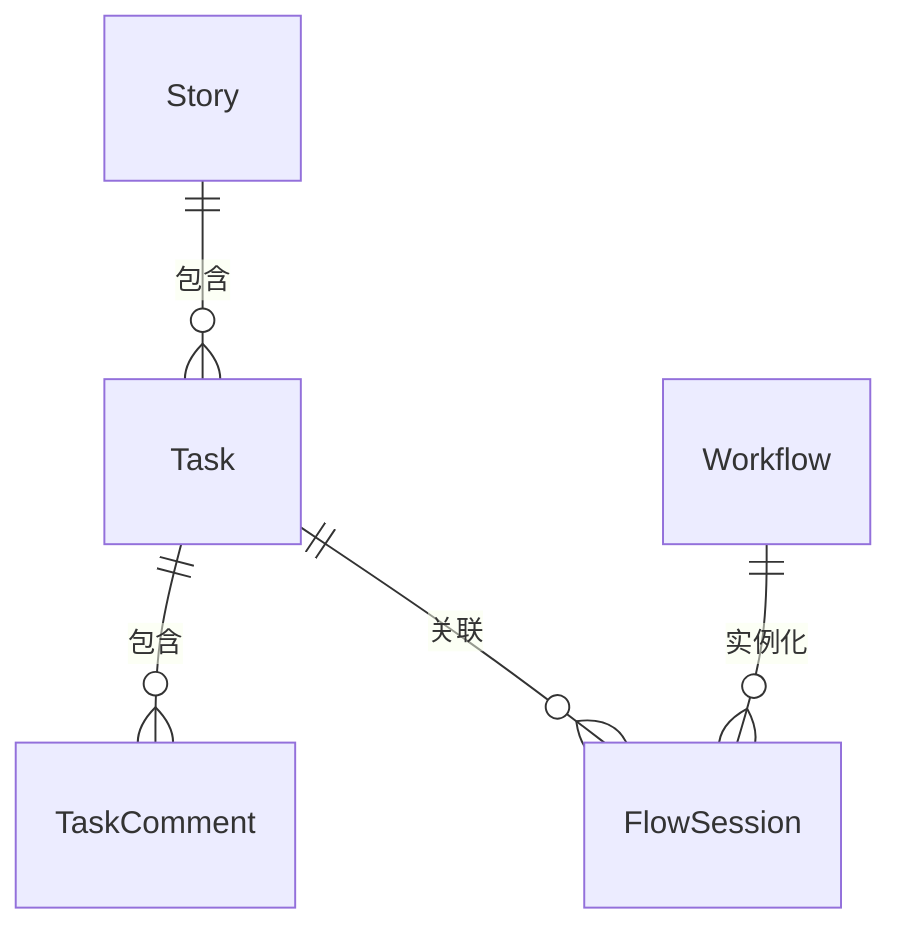

# VibeCopilot 任务-会话系统架构设计报告

## 1. 架构概述

`task-session`架构是VibeCopilot中任务管理与工作流会话的集成设计，旨在将独立的任务连接到结构化的工作流程中。通过这种集成，用户可以在完成特定任务时获得工作流程的指导和支持，确保工作按照预定义的最佳实践进行。

## 2. 核心数据模型

### 2.1 任务模型 (Task)

```
任务(Task)
├── id: String [PK] - 任务唯一标识符，格式为"task_{uuid[:8]}"
├── title: String - 任务标题
├── description: Text - 任务详细描述
├── status: String - 任务状态 (todo, in_progress, done等)
├── priority: String - 优先级 (low, medium, high)
├── estimated_hours: Integer - 预估工时
├── is_completed: Boolean - 是否完成
├── story_id: String [FK] - 关联的故事ID
├── assignee: String - 任务负责人
├── labels: JSON - 标签列表
├── created_at: String - 创建时间
├── updated_at: String - 更新时间
├── completed_at: String - 完成时间
├── github_issue: String - GitHub Issue链接
├── current_session_id: String - 当前会话ID
└── is_current: Boolean - 是否为当前活动任务
```

### 2.2 工作流会话模型 (FlowSession)

```
工作流会话(FlowSession)
├── id: String [PK] - 会话唯一标识符
├── workflow_id: String [FK] - 关联的工作流ID
├── name: String - 会话名称
├── status: String - 会话状态
├── current_stage: String - 当前阶段
├── task_id: String [FK] - 关联的任务ID
├── created_at: String - 创建时间
├── updated_at: String - 更新时间
├── flow_type: String - 工作流类型 (dev, review, deploy等)
└── is_current: Boolean - 是否为当前活动会话
```

### 2.3 任务评论模型 (TaskComment)

```
任务评论(TaskComment)
├── id: String [PK] - 评论唯一标识符
├── task_id: String [FK] - 关联的任务ID
├── author: String - 评论作者
├── content: Text - 评论内容
└── created_at: String - 创建时间
```

## 3. 关系映射



关键关系：

1. 一个任务(Task)可以有多个评论(TaskComment)
2. 一个任务(Task)可以关联多个工作流会话(FlowSession)
3. 一个故事(Story)可以包含多个任务(Task)
4. 一个工作流(Workflow)可以实例化为多个会话(FlowSession)

## 4. 服务层设计

### 4.1 TaskService

任务服务负责任务的基础管理功能和与其他实体的关联：

- **核心功能**:
  - 创建/更新/删除任务
  - 任务状态管理
  - 任务评论管理
  - 任务标签管理
  - 查询和过滤任务

- **集成功能**:
  - 关联任务到工作流会话
  - 关联任务到故事(Story)
  - 关联任务到GitHub Issue
  - 设置和获取当前活动任务

### 4.2 FlowSessionManager

工作流会话管理器负责会话的创建和管理：

- **核心功能**:
  - 创建工作流会话
  - 更新会话状态
  - 推进会话阶段
  - 查询会话信息
  - 设置和获取当前活动会话

## 5. 命令行接口

命令行接口提供了与任务-会话系统交互的主要方式：

### 5.1 任务命令

- `task list`: 列出任务，支持多种过滤条件
- `task show`: 显示任务详情
- `task create`: 创建新任务，可选关联工作流
- `task update`: 更新任务信息
- `task delete`: 删除任务
- `task comment`: 添加任务评论
- `task link`: 关联任务到工作流会话

### 5.2 工作流会话命令

- `flow list`: 列出工作流会话
- `flow show`: 显示会话详情
- `flow run`: 执行工作流创建会话
- `flow next`: 推进会话到下一阶段
- `flow complete`: 完成当前会话

## 6. 集成场景

### 6.1 开发工作流

当开发者需要实现一个新功能时：

1. 创建功能任务: `task create "实现用户登录" --priority high`
2. 关联开发工作流: `task link --flow dev`
3. 工作流会指导开发者完成设计、编码和测试等步骤
4. 完成工作后更新任务状态: `task update --status done`

### 6.2 审核工作流

当需要审核代码变更时：

1. 创建审核任务: `task create "审核登录功能" --priority medium`
2. 关联审核工作流: `task link --flow review`
3. 工作流会指导审核者完成代码检查、测试验证等步骤
4. 添加审核评论: `task comment --content "代码已审核，需要修改XYZ"`

## 7. 当前任务和工作流唯一性实现

VibeCopilot在任何时刻都只允许一个活动任务和一个活动工作流会话，这通过一系列机制来实现。

### 7.1 当前任务管理

- **数据库标志**：Task模型中的`is_current`字段用于标记当前活动任务
- **唯一性保证**：设置新的当前任务时，先将所有任务的`is_current`重置为False，然后只将一个任务设为当前任务

```python
def set_current_task(self, task_id: str) -> bool:
    """设置当前任务"""
    try:
        # 清除其他任务的当前状态
        self.session.query(Task).filter(Task.is_current == True).update(
            {"is_current": False}
        )
        # 设置新的当前任务
        task = self.get_by_id(task_id)
        if task:
            task.is_current = True
            self.session.commit()
            return True
        return False
    except Exception as e:
        self.session.rollback()
        return False
```

- **获取当前任务**：通过`is_current=True`条件查询单个任务记录

```python
def get_current_task(self) -> Optional[Task]:
    """获取当前任务"""
    return self.session.query(Task).filter(Task.is_current == True).first()
```

### 7.2 当前会话管理

- 与任务类似，FlowSession模型也使用`is_current`字段标记当前活动会话
- 任务和会话之间通过双向关联确保一致性：
  - Task.current_session_id 保存当前关联的会话ID
  - 设置当前会话时，会同时设置对应的任务为当前任务

### 7.3 状态模块集成与查看

状态模块(StatusService)集成了任务状态提供者，使得可以通过统一的接口查询当前任务和工作流状态：

1. **注册任务状态提供者**：

```python
# 在StatusService._register_default_providers中
self.register_provider("task", get_task_status_summary)
```

2. **任务状态提供者实现**：

```python
class TaskStatusProvider(IStatusProvider):
    @property
    def domain(self) -> str:
        return "task"

    def get_status(self, entity_id: Optional[str] = None) -> Dict[str, Any]:
        # 获取特定任务或任务系统整体状态
```

3. **通过命令行查看状态**：

```bash
# 查看当前任务状态
vc status task

# 查看详细状态
vc status task --verbose
```

4. **特定视图**：

```bash
# 查看任务完成度统计
vc status task --view=completion
```

### 7.4 任务与会话切换同步

当切换当前任务或会话时，系统确保另一个实体同步更新，保持状态一致：

- 调用`task_service.set_current_task()`时，更新任务的`is_current`标志
- 调用`flow_session_manager.switch_session()`时，同步调用`task_service.set_current_task()`
- 通过`task link`命令将任务关联到新会话时，自动更新当前任务和会话

这种双向关联确保了任务和工作流会话的一致性，避免了状态不同步的问题。

## 8. 架构优势

1. **工作流程标准化**: 通过预定义的工作流，确保任务按照最佳实践完成
2. **上下文连续性**: 在不同会话阶段之间保持任务上下文
3. **灵活性**: 任务可以独立存在，也可以关联到工作流
4. **可追踪性**: 任务的整个生命周期和相关活动都有记录
5. **集成能力**: 与故事、GitHub等外部系统集成

## 9. 实现注意事项

1. **当前状态管理**: 正确维护当前任务和当前会话状态
2. **事务完整性**: 确保任务和会话状态变更的原子性
3. **异常处理**: 优雅处理工作流异常情况
4. **权限控制**: 适当限制不同角色对任务和会话的操作权限
5. **扩展性**: 设计应支持添加新的工作流类型和任务属性

## 10. 未来发展方向

1. **任务依赖关系**: 实现任务之间的依赖和阻塞关系
2. **团队协作**: 增强多用户环境下的任务分配和协作
3. **自动化触发**: 基于事件自动创建任务和关联工作流
4. **报告和分析**: 任务完成情况的统计和可视化
5. **AI辅助**: 智能推荐任务优先级和工作流选择
