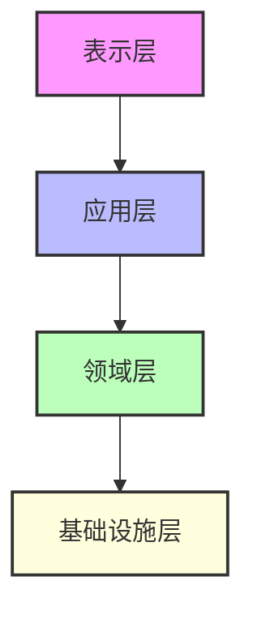
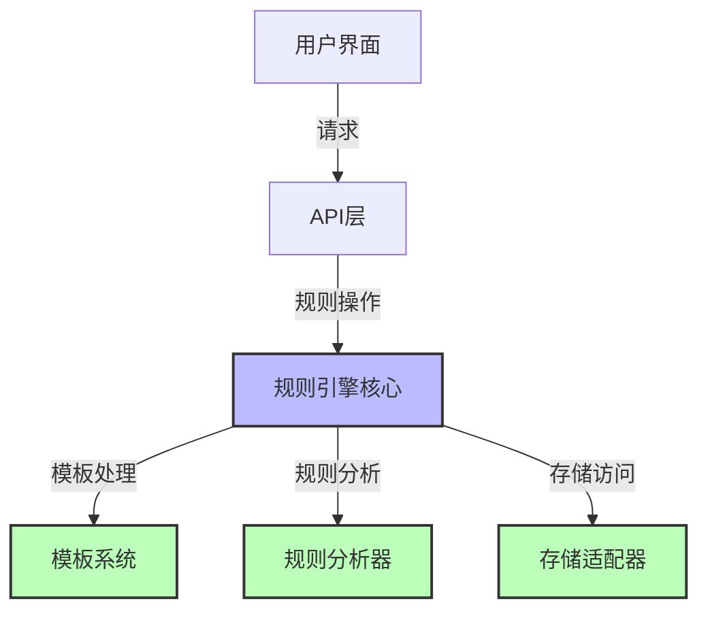
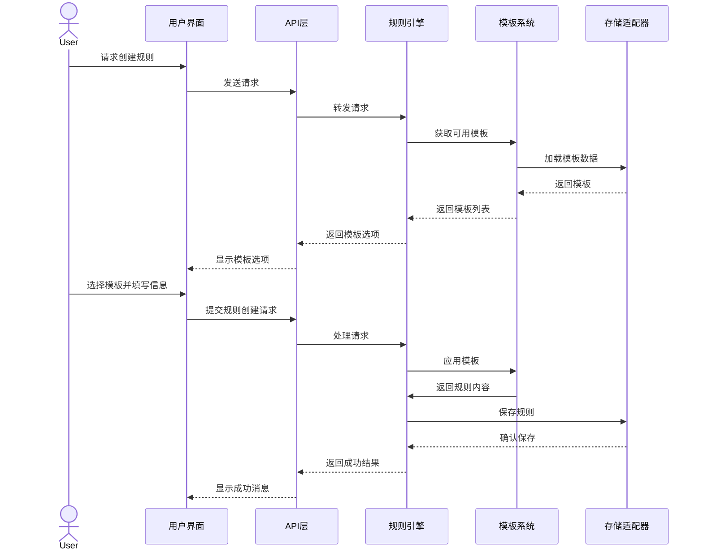

# 规则引擎架构

> **文档元数据**
> 版本: 1.0
> 更新日期: 2025-04-05
> 状态: 已审核
> 负责团队: 系统架构团队

## 1. 架构概述

规则引擎采用模块化、分层设计，确保系统的可维护性和扩展性。每个组件职责单一，遵循单一职责原则，代码量控制在200行以内。

## 2. 系统分层

### 2.1 表示层

负责用户交互，包括命令行界面和Web UI，提供规则管理和使用的交互界面。

**主要组件**:

- 命令行工具
- Web管理界面
- 编辑器插件

### 2.2 应用层

协调领域对象和服务，实现业务用例，处理用户请求并组织工作流。

**主要组件**:

- 规则管理服务
- 模板应用服务
- 规则验证服务
- 用户会话管理

### 2.3 领域层

包含核心业务逻辑和领域模型，实现规则引擎的核心功能。

**主要组件**:

- 规则引擎核心
- 规则分析器
- 模板系统
- 规则推荐器

### 2.4 基础设施层

提供技术支持，包括数据持久化、外部服务集成等。

**主要组件**:

- 存储适配器
- 外部API集成
- 缓存系统
- 日志服务

## 3. 组件架构

### 3.1 规则引擎核心

作为系统中枢，协调各组件工作，实现规则的生成、分析和应用。

**关键职责**:

- 规则生命周期管理
- 组件间通信协调
- 业务流程编排
- 事件处理

### 3.2 模板系统

管理规则模板，支持模板的创建、修改和应用。

**关键职责**:

- 模板加载和解析
- 模板验证
- 模板应用（将模板转换为规则）
- 模板版本管理

### 3.3 规则分析器

分析规则内容，检测依赖关系和潜在冲突。

**关键职责**:

- 规则解析
- 依赖分析
- 冲突检测
- 规则验证

### 3.4 存储适配器

提供统一的存储接口，支持多种存储后端。

**关键职责**:

- 文件系统操作
- 数据库交互
- 缓存管理
- 数据同步

## 4. 数据流

## 5. 扩展点

系统设计了以下关键扩展点，支持未来功能扩展：

1. **存储后端接口**: 允许添加新的存储实现
2. **模板解析器**: 支持不同格式的模板
3. **规则分析策略**: 可扩展的分析算法
4. **推荐算法插件**: 可替换的推荐策略
5. **UI适配器**: 支持不同的用户界面

## 6. 部署架构

系统支持三种部署模式，适应不同的使用场景：

1. **单体部署**: 适合个人开发环境，所有组件在单一进程中运行
2. **微服务部署**: 适合团队协作环境，各组件独立部署和扩展
3. **云原生部署**: 支持容器化和Kubernetes，实现自动扩展和高可用

## 7. 技术考量

### 7.1 安全考量

- **访问控制**: 基于角色的访问控制
- **数据验证**: 严格的输入验证
- **审计日志**: 操作记录和追踪
- **版本控制**: 防止意外更改

### 7.2 性能优化

- **缓存策略**: 多级缓存设计
- **异步处理**: 非阻塞操作
- **批处理**: 高效处理大量规则
- **索引优化**: 加速查询操作

### 7.3 可维护性

- **模块化设计**: 每个模块职责单一
- **代码规范**: 遵循项目编码标准
- **完整测试**: 单元测试和集成测试
- **文档化**: 详细的API和实现文档
