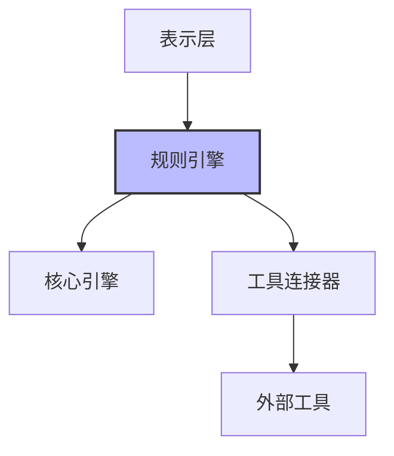

# 规则引擎实现指南

> **文档元数据**
> 版本: 1.0
> 更新日期: 2025-04-05
> 状态: 已审核
> 负责团队: 系统架构团队

## 1. 模块概述

规则引擎实现模块是VibeCopilot的核心组件，负责规则的生成、管理、验证和应用。本模块特别支持Cursor自定义代理规则的处理，是提升AI开发效率的关键组件。

### 1.1 核心职责

- 管理规则生命周期（创建、读取、更新、删除）
- 提供场景化规则模板
- 验证和优化规则内容
- 导出规则到目标环境（如Cursor编辑器）

### 1.2 架构位置

规则引擎位于业务层，依赖于工具连接器和核心引擎：



## 2. 模块设计

### 2.1 核心接口

```typescript
// 规则引擎接口
interface RuleEngine {
  // 生命周期管理
  initialize(): Promise<void>;
  shutdown(): Promise<void>;
  getStatus(): EngineStatus;

  // 规则操作
  createRule(template: Template, params: RuleParams): Promise<Rule>;
  getRule(id: string): Promise<Rule | null>;
  updateRule(id: string, updates: Partial<Rule>): Promise<Rule>;
  deleteRule(id: string): Promise<boolean>;
  listRules(filters?: RuleFilters): Promise<Rule[]>;

  // 模板操作
  getTemplate(id: string): Promise<Template | null>;
  listTemplates(filters?: TemplateFilters): Promise<Template[]>;

  // 规则验证与应用
  validateRule(rule: Rule): Promise<ValidationResult>;
  applyRule(rule: Rule, context: RuleContext): Promise<ApplyResult>;

  // 分析功能
  analyzeRuleDependencies(rule: Rule): Promise<Dependency[]>;
  detectRuleConflicts(rules: Rule[]): Promise<Conflict[]>;
}

// 规则接口
interface Rule {
  id: string;
  name: string;
  type: RuleType;
  description: string;
  content: string;
  globs?: string[];
  alwaysApply: boolean;
  version: string;
  createdAt: Date;
  updatedAt: Date;
  metadata: Record<string, any>;
}

// 模板接口
interface Template {
  id: string;
  name: string;
  description: string;
  content: string;
  parameters: TemplateParameter[];
  version: string;
  category: string;
  metadata: Record<string, any>;
}
```

### 2.2 组件结构

规则引擎由以下主要组件组成：

1. **规则引擎实现类**: 实现RuleEngine接口
2. **规则存储库**: 管理规则的持久化
3. **模板存储库**: 管理模板的持久化
4. **规则验证器**: 验证规则的有效性
5. **规则应用器**: 在特定上下文中应用规则
6. **分析服务**: 提供规则分析功能

## 3. 实现细节

### 3.1 规则引擎实现

```typescript
@injectable()
export class RuleEngineImpl implements RuleEngine {
  private status: EngineStatus = EngineStatus.STOPPED;

  constructor(
    @inject('RuleRepository') private ruleRepo: RuleRepository,
    @inject('TemplateRepository') private templateRepo: TemplateRepository,
    @inject('RuleValidator') private validator: RuleValidator,
    @inject('RuleApplier') private applier: RuleApplier,
    @inject('AnalysisService') private analyzer: AnalysisService,
    @inject('ConfigSystem') private config: ConfigSystem,
    @inject('LoggerService') private logger: Logger
  ) {}

  async initialize(): Promise<void> {
    this.logger.info('初始化规则引擎');
    this.status = EngineStatus.INITIALIZING;

    try {
      await this.ruleRepo.initialize();
      await this.templateRepo.initialize();
      this.status = EngineStatus.RUNNING;
      this.logger.info('规则引擎初始化完成');
    } catch (error) {
      this.status = EngineStatus.ERROR;
      this.logger.error('规则引擎初始化失败', error);
      throw error;
    }
  }

  // 其他方法实现...
}
```

### 3.2 文件存储库实现

```typescript
@injectable()
export class FileRuleRepository implements RuleRepository {
  private rulesDir: string;
  private rules: Map<string, Rule> = new Map();

  constructor(@inject('ConfigSystem') private config: ConfigSystem) {
    this.rulesDir = this.config.get('rules.directory', '.cursor/rules');
  }

  async initialize(): Promise<void> {
    await this.loadRules();
  }

  private async loadRules(): Promise<void> {
    // 从文件系统加载规则
    const files = await fs.readdir(this.rulesDir);
    for (const file of files) {
      if (file.endsWith('.mdc')) {
        const rule = await this.loadRuleFromFile(path.join(this.rulesDir, file));
        if (rule) {
          this.rules.set(rule.id, rule);
        }
      }
    }
  }

  // 其他方法实现...
}
```

## 4. 关键算法

### 4.1 规则验证算法

```typescript
@injectable()
export class RuleValidatorImpl implements RuleValidator {
  async validate(rule: Rule): Promise<ValidationResult> {
    const issues: ValidationIssue[] = [];

    // 基本验证
    if (!rule.name || rule.name.trim() === '') {
      issues.push({
        type: 'error',
        message: '规则名称不能为空',
        field: 'name'
      });
    }

    if (!rule.content || rule.content.trim() === '') {
      issues.push({
        type: 'error',
        message: '规则内容不能为空',
        field: 'content'
      });
    }

    // 内容结构验证
    const structureIssues = this.validateStructure(rule.content);
    issues.push(...structureIssues);

    // 语法验证
    const syntaxIssues = await this.validateSyntax(rule.content);
    issues.push(...syntaxIssues);

    return {
      valid: issues.filter(i => i.type === 'error').length === 0,
      issues
    };
  }

  // 其他验证方法...
}
```

### 4.2 规则应用算法

```typescript
@injectable()
export class RuleApplierImpl implements RuleApplier {
  async apply(rule: Rule, context: RuleContext): Promise<ApplyResult> {
    // 检查规则是否适用于当前上下文
    if (!this.isApplicable(rule, context)) {
      return {
        applied: false,
        reason: 'Rule not applicable to current context'
      };
    }

    // 准备规则内容
    const processedContent = this.processRuleContent(rule.content, context);

    // 应用规则
    const result = await this.applyProcessedContent(processedContent, context);

    return {
      applied: true,
      result
    };
  }

  // 其他应用方法...
}
```

## 5. 最佳实践

### 5.1 规则设计原则

1. **单一职责**: 每个规则应专注于单一方面
2. **明确边界**: 清晰定义规则的适用范围
3. **可组合性**: 规则应可与其他规则组合使用
4. **可测试性**: 规则应易于测试和验证
5. **版本控制**: 规则应有明确的版本标识

### 5.2 性能优化

1. **缓存策略**: 缓存频繁使用的规则和模板
2. **延迟加载**: 按需加载规则内容
3. **批处理**: 批量处理规则操作
4. **索引优化**: 优化规则查询性能

### 5.3 错误处理

1. **优雅降级**: 单个规则失败不应影响整个系统
2. **详细日志**: 记录详细的错误信息
3. **重试机制**: 对临时错误实施重试策略
4. **用户反馈**: 提供清晰的错误反馈

## 6. 测试策略

### 6.1 单元测试

为每个组件编写单元测试，确保独立功能正确：

```typescript
describe('RuleEngine', () => {
  let engine: RuleEngineImpl;
  let mockRuleRepo: any;
  let mockTemplateRepo: any;

  beforeEach(() => {
    mockRuleRepo = {
      initialize: jest.fn(),
      getRule: jest.fn(),
      // 其他方法...
    };

    mockTemplateRepo = {
      initialize: jest.fn(),
      getTemplate: jest.fn(),
      // 其他方法...
    };

    engine = new RuleEngineImpl(
      mockRuleRepo,
      mockTemplateRepo,
      // 其他依赖...
    );
  });

  test('初始化成功', async () => {
    await engine.initialize();
    expect(engine.getStatus()).toBe(EngineStatus.RUNNING);
    expect(mockRuleRepo.initialize).toHaveBeenCalled();
    expect(mockTemplateRepo.initialize).toHaveBeenCalled();
  });

  // 其他测试...
});
```

### 6.2 集成测试

测试组件之间的交互，确保系统作为整体正常工作。

### 6.3 性能测试

测试系统在高负载下的表现，确保性能满足要求。

## 7. 部署与配置

### 7.1 配置选项

```typescript
interface RuleEngineConfig {
  // 存储配置
  storage: {
    type: 'file' | 'database';
    path?: string;
    connectionString?: string;
  };

  // 规则配置
  rules: {
    directory: string;
    defaultType: RuleType;
    maxSize: number;
  };

  // 模板配置
  templates: {
    directory: string;
    refreshInterval: number;
  };

  // 性能配置
  performance: {
    cacheSize: number;
    batchSize: number;
    timeout: number;
  };

  // 日志配置
  logging: {
    level: 'debug' | 'info' | 'warn' | 'error';
    file?: string;
  };
}
```

### 7.2 部署检查清单

- [ ] 配置文件正确设置
- [ ] 存储路径可访问
- [ ] 权限设置正确
- [ ] 日志系统配置完成
- [ ] 依赖服务可用
- [ ] 初始模板已加载
