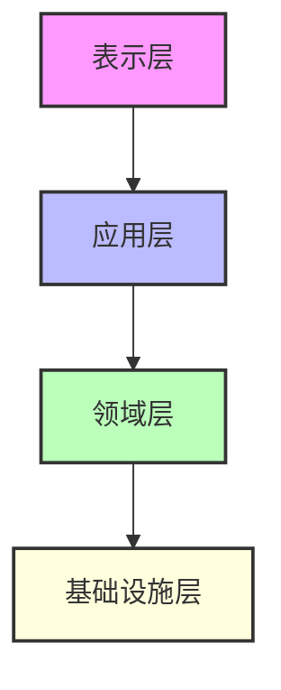
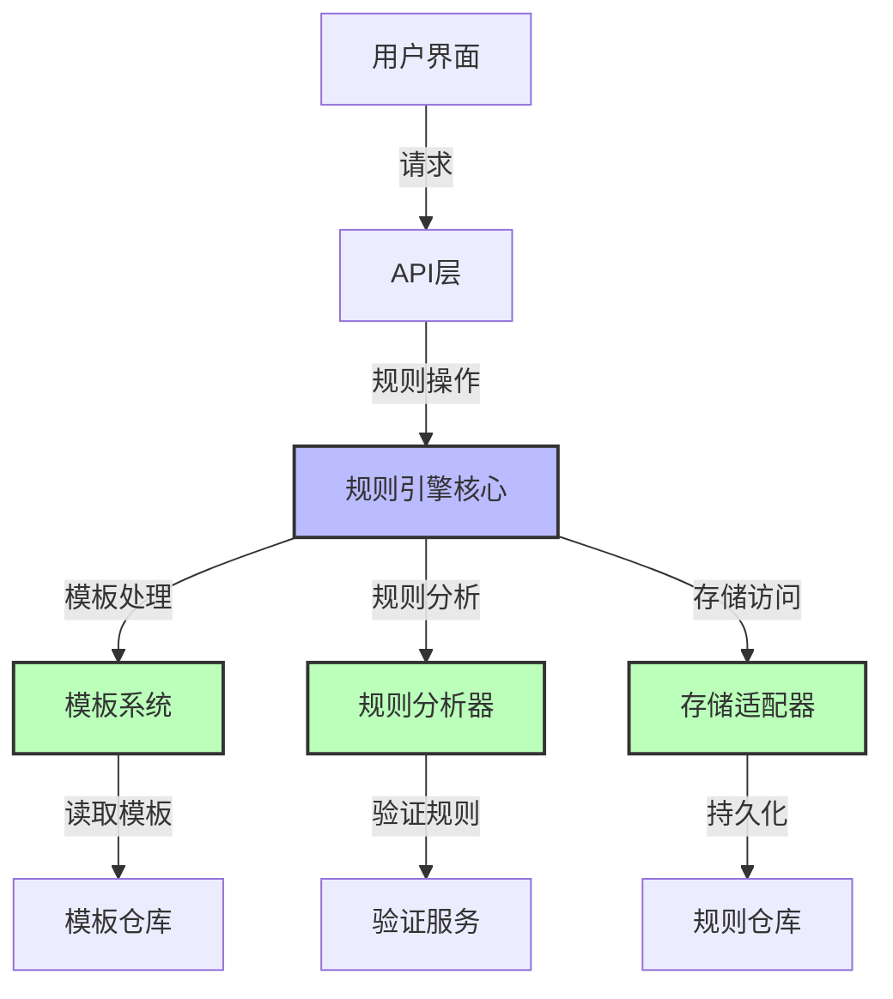
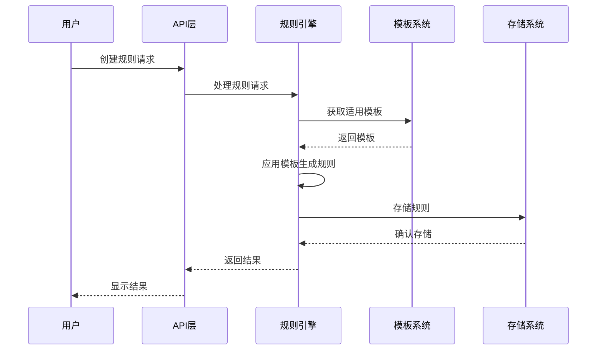
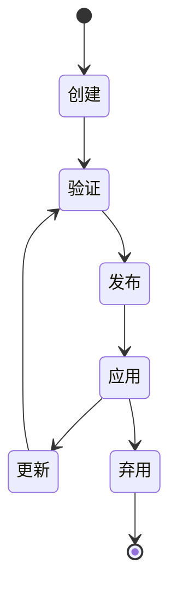
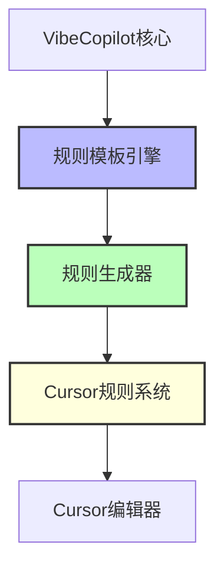
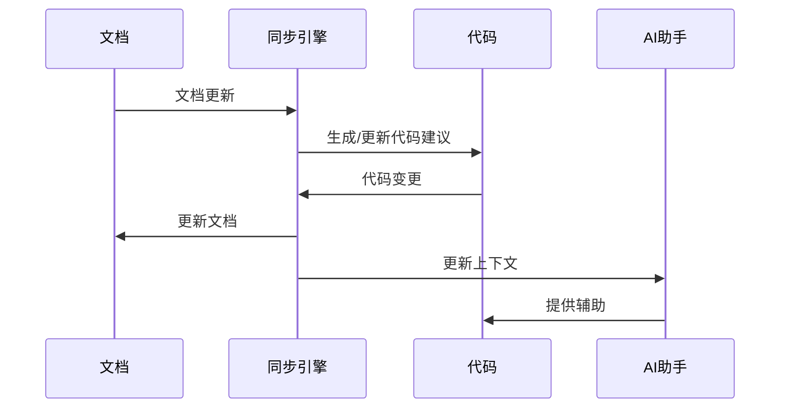

# 规则模板引擎技术文档

> **文档元数据**
> 版本: 1.0
> 更新日期: 2025-04-05
> 状态: 已审核
> 负责团队: 系统架构团队

## 目录

1. [概述](#1-概述)
2. [系统架构](#2-系统架构)
3. [核心组件](#3-核心组件)
4. [规则系统详解](#4-规则系统详解)
5. [API规范](#5-api规范)
6. [实现指南](#6-实现指南)
7. [集成方案](#7-集成方案)
8. [最佳实践](#8-最佳实践)
9. [附录](#9-附录)

## 1. 概述

### 1.1 系统定义

规则模板引擎是VibeCopilot的核心模块之一，通过结构化规则和自定义代理机制对AI行为进行精确控制，实现高效的AI辅助开发。该系统支持动态生成、管理和应用规则，特别适配Cursor编辑器环境，提供一致且专业的AI辅助体验。

### 1.2 核心价值

1. **AI行为一致性**
   - 确保AI在项目中行为一致
   - 避免重复解释项目标准
   - 减少由于AI行为不一致导致的开发障碍

2. **专业分工优化**
   - 通过角色专用代理提高开发效率
   - 使AI助手专注于特定领域任务
   - 实现"文档驱动开发"的工作流

3. **标准化与自动化**
   - 自动实施项目编码和文档标准
   - 降低维护项目规范的成本
   - 实现开发流程的自动化指导

### 1.3 核心功能

1. **自动化规则生成系统**
   - 通过自然语言请求创建和更新规则文件
   - 自动确定规则类型和应用场景
   - 将规则存储在合适的目录结构中

2. **自定义代理管理**
   - 通过配置定义专用AI助手
   - 为不同任务角色配置专用指令
   - 支持多角色协作开发流程

3. **规则类型与应用机制**
   - 代理选择型规则：根据场景自动选择应用
   - 全局规则：自动应用于所有对话
   - 自动选择规则：基于文件类型自动应用
   - 手动规则：需要在对话中手动调用

4. **工作流集成**
   - 支持敏捷开发工作流
   - 文档驱动的开发模式
   - 规范化的项目管理流程

## 2. 系统架构

### 2.1 架构概述

规则模板引擎采用模块化、可扩展的分层架构设计，清晰划分职责，确保系统的可维护性和扩展性。

### 2.2 系统分层



#### 表示层

负责用户交互，包括命令行界面和Web UI。

#### 应用层

协调领域对象和服务，实现业务用例。

#### 领域层

包含核心业务逻辑和领域模型。

#### 基础设施层

提供技术支持，包括数据持久化、外部服务集成等。

### 2.3 组件架构



### 2.4 数据流



### 2.5 部署架构

系统支持三种部署模式，适应不同的使用场景：

1. **单体部署**：适合个人开发环境
2. **微服务部署**：适合团队协作环境
3. **云原生部署**：支持容器化和Kubernetes

## 3. 核心组件

### 3.1 规则引擎核心

规则引擎是系统的中枢，负责协调各组件工作，实现规则的生成、验证和应用。

#### 主要职责

- 接收并处理规则操作请求
- 协调模板系统和规则分析器
- 管理规则生命周期
- 提供规则应用机制

#### 关键接口

```typescript
interface RuleEngine {
  // 初始化引擎
  initialize(): Promise<void>;

  // 创建规则
  createRule(params: CreateRuleParams): Promise<Rule>;

  // 更新规则
  updateRule(id: string, params: UpdateRuleParams): Promise<Rule>;

  // 删除规则
  deleteRule(id: string): Promise<boolean>;

  // 应用规则
  applyRule(id: string, context: RuleContext): Promise<ApplyResult>;

  // 获取规则
  getRule(id: string): Promise<Rule | null>;

  // 查询规则
  queryRules(filter: RuleFilter): Promise<Rule[]>;
}
```

### 3.2 模板系统

模板系统负责管理和处理规则模板，支持规则的结构化生成。

#### 主要职责

- 管理模板仓库
- 提供模板渲染服务
- 支持模板变量替换
- 实现模板版本控制

#### 关键接口

```typescript
interface TemplateSystem {
  // 获取模板
  getTemplate(id: string): Promise<Template | null>;

  // 渲染模板
  renderTemplate(templateId: string, data: any): Promise<string>;

  // 创建模板
  createTemplate(params: CreateTemplateParams): Promise<Template>;

  // 更新模板
  updateTemplate(id: string, params: UpdateTemplateParams): Promise<Template>;

  // 删除模板
  deleteTemplate(id: string): Promise<boolean>;

  // 查询模板
  queryTemplates(filter: TemplateFilter): Promise<Template[]>;
}
```

### 3.3 规则分析器

规则分析器负责分析和验证规则，确保规则的质量和有效性。

#### 主要职责

- 验证规则语法
- 分析规则适用性
- 检测规则冲突
- 优化规则结构

#### 关键接口

```typescript
interface RuleAnalyzer {
  // 验证规则
  validateRule(rule: Rule): Promise<ValidationResult>;

  // 分析规则适用性
  analyzeApplicability(rule: Rule, context: RuleContext): Promise<ApplicabilityResult>;

  // 检测规则冲突
  detectConflicts(rule: Rule, existingRules: Rule[]): Promise<ConflictResult[]>;

  // 优化规则
  optimizeRule(rule: Rule): Promise<Rule>;
}
```

### 3.4 存储适配器

存储适配器负责规则和模板的持久化存储，支持不同的存储后端。

#### 主要职责

- 规则持久化
- 模板持久化
- 数据一致性维护
- 存储后端适配

#### 关键接口

```typescript
interface StorageAdapter {
  // 保存规则
  saveRule(rule: Rule): Promise<string>;

  // 读取规则
  loadRule(id: string): Promise<Rule | null>;

  // 删除规则
  removeRule(id: string): Promise<boolean>;

  // 查询规则
  findRules(query: any): Promise<Rule[]>;

  // 保存模板
  saveTemplate(template: Template): Promise<string>;

  // 读取模板
  loadTemplate(id: string): Promise<Template | null>;

  // 删除模板
  removeTemplate(id: string): Promise<boolean>;

  // 查询模板
  findTemplates(query: any): Promise<Template[]>;
}
```

## 4. 规则系统详解

### 4.1 规则文件格式

规则使用`.mdc`文件格式（Markdown with YAML frontmatter）定义，包含元数据和内容两部分。

#### 元数据部分

```yaml
---
description: "规则的详细描述，用于说明规则的用途和适用场景"
globs: ["*.ts", "*.tsx"]  # 适用的文件类型，仅用于自动选择规则
alwaysApply: false        # 是否全局应用
---
```

#### 内容部分

内容部分使用Markdown格式，包含规则的详细说明、示例和指导。

```markdown
# 规则标题

## 规则说明
详细说明规则的目的、适用场景和使用方法。

## 规则内容
- 规则条目1
- 规则条目2
- ...

## 示例
提供规则应用的具体示例。
```

### 4.2 规则类型

系统支持四种类型的规则，各有不同的应用场景和触发机制。

#### 代理选择型规则 (Agent Selected)

由AI根据上下文自动选择是否应用，特别适合特定开发场景。

**元数据配置**:
```yaml
---
description: [详细说明规则适用场景的描述]
globs: [留空]
alwaysApply: false
---
```

**适用场景**:

- 代码审查标准
- 架构设计指南
- 技术选型原则

#### 全局规则 (Always)

应用于所有对话场景，无需显式调用。

**元数据配置**:
```yaml
---
description: [简短描述]
globs: [留空]
alwaysApply: true
---
```

**适用场景**:

- 项目通用规范
- 团队协作准则
- 基础开发标准

#### 自动选择规则 (Auto Select)

基于文件类型自动应用，适合特定文件类型的开发规范。

**元数据配置**:
```yaml
---
description: [简短描述]
globs: ["*.ts", "*.tsx"] # 适用的文件类型
alwaysApply: false
---
```

**适用场景**:

- 语言特定编码规范
- 文件类型处理准则
- 框架特定开发标准

#### 手动规则 (Manual)

需要在对话中手动调用，适合特定任务的专用规则。

**元数据配置**:
```yaml
---
description: [简短描述]
globs: [留空]
alwaysApply: false
---
```

**适用场景**:

- 特定工作流程
- 专用工具使用指南
- 特殊任务处理规则

### 4.3 规则目录结构

规则按功能分类组织在`.cursor/rules/`目录下：

```
.cursor/rules/
├── core-rules/       # 核心规则和规则生成器
├── global-rules/     # 全局应用规则
├── tool-rules/       # 工具使用规则
├── ts-rules/         # TypeScript规则
├── ui-rules/         # UI开发规则
└── workflows/        # 工作流规则
```

### 4.4 规则生命周期

规则从创建到弃用经历完整的生命周期管理：



## 5. API规范

### 5.1 API概述

规则模板引擎API是一组RESTful接口，提供规则和模板的创建、读取、更新、删除及其他管理功能。API使用JSON作为数据交换格式，遵循标准HTTP方法和状态码。

### 5.2 基础URL

```
/api/v1
```

### 5.3 认证

所有API请求需要通过Bearer Token认证：

```
Authorization: Bearer <token>
```

### 5.4 通用响应格式

#### 成功响应

```json
{
  "success": true,
  "data": { ... },
  "meta": {
    "page": 1,
    "limit": 10,
    "total": 100
  }
}
```

#### 错误响应

```json
{
  "success": false,
  "error": {
    "code": "ERROR_CODE",
    "message": "Error message",
    "details": { ... }
  }
}
```

### 5.5 主要端点

| 端点 | 方法 | 描述 |
|------|------|------|
| `/api/v1/rules` | GET | 获取规则列表 |
| `/api/v1/rules/{id}` | GET | 获取单个规则 |
| `/api/v1/rules` | POST | 创建规则 |
| `/api/v1/rules/{id}` | PUT | 更新规则 |
| `/api/v1/rules/{id}` | DELETE | 删除规则 |
| `/api/v1/templates` | GET | 获取模板列表 |
| `/api/v1/templates/{id}` | GET | 获取单个模板 |
| `/api/v1/templates` | POST | 创建模板 |
| `/api/v1/templates/{id}` | PUT | 更新模板 |
| `/api/v1/templates/{id}` | DELETE | 删除模板 |
| `/api/v1/rules/apply` | POST | 应用规则 |
| `/api/v1/rules/validate` | POST | 验证规则 |
| `/api/v1/templates/render` | POST | 渲染模板 |

## 6. 实现指南

### 6.1 开发环境准备

#### 依赖安装

```bash
# 安装 AI 规则生成器所需依赖
npm install --save langchain openai tiktoken handlebars
```

#### 环境配置

在 `.env` 文件中配置必要的环境变量：

```
OPENAI_API_KEY=your_api_key_here
AI_MODEL=gpt-4-turbo
AI_TEMPERATURE=0.1
AI_MAX_TOKENS=2048
RULES_TEMPLATES_DIR=./templates/rules
```

### 6.2 核心模块实现

#### 规则引擎实现

```typescript
// src/rule_engine/implementations/rule_engine_impl.ts
import { injectable, inject } from 'inversify';
import {
  RuleEngine, Template, Rule, ValidationResult, ApplyResult,
  CreateRuleParams, UpdateRuleParams, RuleContext, RuleFilter
} from '../interfaces';

@injectable()
export class RuleEngineImpl implements RuleEngine {
  constructor(
    @inject('TemplateSystem') private templateSystem: TemplateSystem,
    @inject('RuleAnalyzer') private ruleAnalyzer: RuleAnalyzer,
    @inject('StorageAdapter') private storageAdapter: StorageAdapter
  ) {}

  async initialize(): Promise<void> {
    // 初始化逻辑
  }

  async createRule(params: CreateRuleParams): Promise<Rule> {
    // 创建规则逻辑
  }

  async updateRule(id: string, params: UpdateRuleParams): Promise<Rule> {
    // 更新规则逻辑
  }

  async deleteRule(id: string): Promise<boolean> {
    // 删除规则逻辑
  }

  async applyRule(id: string, context: RuleContext): Promise<ApplyResult> {
    // 应用规则逻辑
  }

  async getRule(id: string): Promise<Rule | null> {
    // 获取规则逻辑
  }

  async queryRules(filter: RuleFilter): Promise<Rule[]> {
    // 查询规则逻辑
  }
}
```

#### 模板系统实现

```typescript
// src/template_system/implementations/template_system_impl.ts
import { injectable, inject } from 'inversify';
import {
  TemplateSystem, Template, CreateTemplateParams, UpdateTemplateParams,
  TemplateFilter
} from '../interfaces';
import * as Handlebars from 'handlebars';

@injectable()
export class TemplateSystemImpl implements TemplateSystem {
  constructor(
    @inject('TemplateRepository') private templateRepository: TemplateRepository
  ) {}

  async getTemplate(id: string): Promise<Template | null> {
    // 获取模板逻辑
  }

  async renderTemplate(templateId: string, data: any): Promise<string> {
    // 渲染模板逻辑
  }

  async createTemplate(params: CreateTemplateParams): Promise<Template> {
    // 创建模板逻辑
  }

  async updateTemplate(id: string, params: UpdateTemplateParams): Promise<Template> {
    // 更新模板逻辑
  }

  async deleteTemplate(id: string): Promise<boolean> {
    // 删除模板逻辑
  }

  async queryTemplates(filter: TemplateFilter): Promise<Template[]> {
    // 查询模板逻辑
  }
}
```

### 6.3 存储实现

#### 文件系统存储

```typescript
// src/storage/implementations/file_storage_adapter.ts
import { injectable, inject } from 'inversify';
import { StorageAdapter, Rule, Template } from '../interfaces';
import * as fs from 'fs/promises';
import * as path from 'path';
import * as yaml from 'js-yaml';

@injectable()
export class FileStorageAdapter implements StorageAdapter {
  private rulesDir: string;
  private templatesDir: string;

  constructor(@inject('ConfigSystem') private configSystem: any) {
    this.rulesDir = this.configSystem.get('RULES_DIR', './rules');
    this.templatesDir = this.configSystem.get('TEMPLATES_DIR', './templates');
  }

  async saveRule(rule: Rule): Promise<string> {
    // 保存规则逻辑
  }

  async loadRule(id: string): Promise<Rule | null> {
    // 加载规则逻辑
  }

  async removeRule(id: string): Promise<boolean> {
    // 删除规则逻辑
  }

  async findRules(query: any): Promise<Rule[]> {
    // 查询规则逻辑
  }

  async saveTemplate(template: Template): Promise<string> {
    // 保存模板逻辑
  }

  async loadTemplate(id: string): Promise<Template | null> {
    // 加载模板逻辑
  }

  async removeTemplate(id: string): Promise<boolean> {
    // 删除模板逻辑
  }

  async findTemplates(query: any): Promise<Template[]> {
    // 查询模板逻辑
  }
}
```

## 7. 集成方案

### 7.1 与Cursor自定义代理系统整合

VibeCopilot与Cursor自定义代理系统的整合旨在增强已有规则系统，而非改写它。这种整合通过两种规则增强机制实现：

#### 7.1.1 双层规则系统

1. **VibeCopilot项目内部规则**
   - 用于指导VibeCopilot自身开发的规则
   - 确保团队遵循一致的开发标准
   - 提高VibeCopilot项目代码质量

2. **VibeCopilot生成的项目规则**
   - 为使用VibeCopilot的项目生成定制规则
   - 自动适应不同项目的需求和标准
   - 提供项目特定的AI辅助功能

#### 7.1.2 整合架构



### 7.2 文档驱动的AI协作流程

VibeCopilot的核心价值通过结构化文档提升AI辅助开发的效率和一致性，强调以文档为中心的开发模式。

#### 7.2.1 文档-代码同步机制



#### 7.2.2 文档驱动开发流程

1. **文档先行**：先编写需求和设计文档
2. **规则生成**：基于文档生成项目规则
3. **AI辅助**：AI根据规则提供开发辅助
4. **代码实现**：开发者实现代码
5. **同步更新**：文档和代码保持同步

## 8. 最佳实践

### 8.1 规则编写指南

#### 8.1.1 规则结构

有效的规则应包含以下部分：

1. **清晰的标题**：简明扼要描述规则目的
2. **详细说明**：解释规则的背景和重要性
3. **具体规则条目**：清晰列出所有规则要点
4. **实际示例**：提供规则应用的具体例子
5. **例外情况**：说明规则的例外情况

#### 8.1.2 规则编写原则

- **简洁明了**：使用简单直接的语言
- **具体详细**：避免模糊不清的表述
- **提供示例**：通过示例说明规则应用
- **解释原因**：说明规则背后的原因
- **保持一致**：与项目其他规则保持一致

### 8.2 模板设计指南

#### 8.2.1 模板结构

有效的模板应包含以下部分：

1. **元数据部分**：定义模板的属性和适用范围
2. **变量定义**：明确定义所有可替换变量
3. **内容结构**：组织良好的内容结构
4. **示例部分**：展示模板使用的示例

#### 8.2.2 模板设计原则

- **模块化**：将模板分解为可重用的部分
- **灵活性**：允许适当的自定义
- **一致性**：保持风格和格式一致
- **可维护性**：易于更新和维护
- **文档化**：提供充分的使用说明

### 8.3 规则应用场景

#### 8.3.1 开发规范

- 编码风格规则
- 命名约定规则
- 文档注释规则
- 代码组织规则

#### 8.3.2 架构设计

- 设计模式规则
- 架构原则规则
- 组件设计规则
- 接口设计规则

#### 8.3.3 工作流程

- 敏捷开发规则
- 代码审查规则
- 测试规范规则
- 发布流程规则

## 9. 附录

### 9.1 术语表

| 术语 | 定义 |
|------|------|
| 规则 | 定义AI行为的结构化指令 |
| 模板 | 用于生成规则的结构化文档 |
| 代理 | 专门执行特定任务的AI角色 |
| MDC文件 | Markdown with YAML frontmatter格式的文件 |
| 规则引擎 | 管理和应用规则的核心组件 |
| 模板系统 | 管理和处理规则模板的组件 |
| 规则分析器 | 分析和验证规则的组件 |
| 存储适配器 | 负责规则和模板持久化的组件 |

### 9.2 常见问题解答

#### 9.2.1 规则创建问题

| 问题 | 解决方法 |
|------|---------|
| 规则不生效 | 检查规则元数据配置是否正确 |
| 规则冲突 | 使用规则分析器检测并解决冲突 |
| 模板渲染失败 | 检查模板变量是否正确定义和使用 |

#### 9.2.2 规则应用问题

| 问题 | 解决方法 |
|------|---------|
| AI不遵循规则 | 检查规则是否正确应用和加载 |
| 规则应用不一致 | 检查规则优先级和冲突情况 |
| 性能问题 | 优化规则数量和复杂度 |

### 9.3 参考资源

- [Cursor官方文档](https://cursor.sh/docs)
- [OpenAI API文档](https://platform.openai.com/docs/api-reference)
- [Markdown语法指南](https://www.markdownguide.org/)
- [YAML语法指南](https://yaml.org/spec/1.2.2/)
- [Handlebars模板引擎](https://handlebarsjs.com/)

---

**文档结束**
