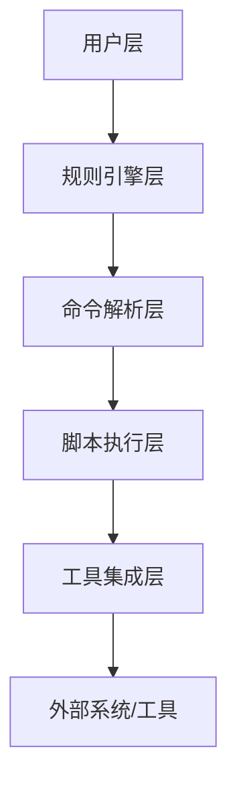
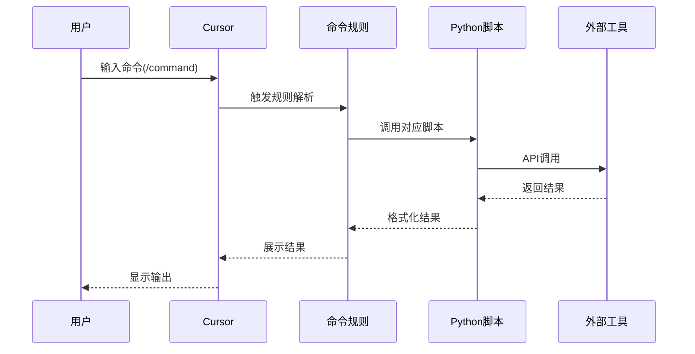

# VibeCopilot 技术实现方案

> **文档元数据**
> 版本: 2.0
> 上次更新: 2024-04-25
> 负责人: 技术架构团队

## 1. 系统架构概述

VibeCopilot采用轻量级、可扩展的架构设计，专注于通过规则文件和脚本实现对开发流程的标准化和工具的集成。核心架构分为以下几层：



### 1.1 核心技术选型

| 层级 | 技术选择 | 主要职责 |
|------|---------|---------|
| 规则引擎层 | MDC规则文件 | 定义AI行为和响应逻辑 |
| 命令解析层 | Python文本处理 | 解析命令和参数 |
| 脚本执行层 | Python, Shell | 执行具体功能逻辑 |
| 工具集成层 | API接口, SDK | 与外部工具通信 |

## 2. 规则系统实现

规则系统是VibeCopilot的核心，基于MDC (Markdown Code)格式实现：

### 2.1 规则文件结构

```
# 规则标题

## 规则元数据
- 触发条件: [条件描述]
- 优先级: [优先级]
- 类别: [规则类别]

## 规则内容
[规则详细描述]

## 示例
[示例内容]
```

### 2.2 规则类型与组织

VibeCopilot规则按功能分为以下几类：

| 规则类型 | 存储位置 | 主要功能 | 优先级 |
|---------|---------|---------|-------|
| 核心规则 | `core-rules/` | 定义基础AI行为 | 最高 |
| 开发规则 | `dev-rules/` | 规范开发流程和标准 | 高 |
| 流程规则 | `flow-rules/` | 定义工作流检查点 | 高 |
| 命令规则 | `cmd-rules/` | 实现命令行接口 | 中 |
| 角色规则 | `role-rules/` | 定义专家角色行为 | 中 |
| 工具规则 | `tool-rules/` | 规范工具使用方式 | 低 |

## 3. 命令系统设计

命令系统是用户与VibeCopilot交互的主要方式，采用"/"前缀规范：

### 3.1 命令处理流程



### 3.2 命令实现方式

每个命令由两部分组成：

1. **命令规则文件**：定义命令格式、参数和处理逻辑
2. **执行脚本**：实现命令的具体功能

示例命令规则文件结构：
```markdown
# /memory命令

## 规则元数据
- 触发条件: 用户输入以"/memory"开头的命令
- 优先级: 高
- 类别: 命令规则

## 命令语法
/memory [子命令] [参数]

## 子命令
- save：保存当前内容到记忆库
- search：搜索记忆库
- link：关联记忆

## 实现逻辑
1. 解析子命令和参数
2. 调用memory_handler.py脚本处理
3. 格式化并返回结果
```

## 4. 工具集成实现

VibeCopilot通过Python脚本实现与外部工具的集成：

### 4.1 GitHub集成

```python
# github_integration.py
import requests
import json
import os

class GitHubAPI:
    def __init__(self, token):
        self.token = token
        self.base_url = "https://api.github.com"
        self.headers = {
            "Authorization": f"token {token}",
            "Accept": "application/vnd.github.v3+json"
        }

    def create_issue(self, repo, title, body):
        url = f"{self.base_url}/repos/{repo}/issues"
        data = {"title": title, "body": body}
        response = requests.post(url, headers=self.headers, data=json.dumps(data))
        return response.json()
```

### 4.2 Obsidian集成

```python
# obsidian_integration.py
import os
import json
import shutil

class ObsidianConnector:
    def __init__(self, vault_path):
        self.vault_path = vault_path

    def create_note(self, folder, title, content):
        folder_path = os.path.join(self.vault_path, folder)
        os.makedirs(folder_path, exist_ok=True)

        file_path = os.path.join(folder_path, f"{title}.md")
        with open(file_path, "w", encoding="utf-8") as f:
            f.write(content)

        return file_path
```

### 4.3 基本内存系统

```python
# memory_handler.py
import os
import json
from datetime import datetime

class MemorySystem:
    def __init__(self, memory_dir):
        self.memory_dir = memory_dir
        os.makedirs(memory_dir, exist_ok=True)

    def save_memory(self, title, content, tags=None):
        timestamp = datetime.now().isoformat()
        memory_id = f"{timestamp}_{title.replace(' ', '_')}"

        memory_data = {
            "id": memory_id,
            "title": title,
            "content": content,
            "tags": tags or [],
            "created_at": timestamp
        }

        file_path = os.path.join(self.memory_dir, f"{memory_id}.json")
        with open(file_path, "w", encoding="utf-8") as f:
            json.dump(memory_data, f, indent=2)

        return memory_id
```

## 5. 配置管理

VibeCopilot使用简单的JSON配置文件管理设置：

```json
{
  "github": {
    "enabled": true,
    "token": "${GITHUB_TOKEN}",
    "default_repo": "username/repo"
  },
  "obsidian": {
    "enabled": true,
    "vault_path": "/path/to/vault"
  },
  "memory": {
    "enabled": true,
    "memory_dir": "${HOME}/.vibcopilot/memory"
  },
  "commands": {
    "enabled": ["help", "memory", "plan", "task", "check", "story", "branch", "update"]
  }
}
```

### 5.1 环境变量支持

配置文件支持环境变量替换，格式为`${ENV_NAME}`，增强安全性和灵活性。

## 6. 数据流和状态管理

VibeCopilot采用简单的文件系统进行状态管理，避免复杂的数据库依赖：

### 6.1 会话状态

```json
{
  "session_id": "uuid-string",
  "start_time": "ISO-datetime",
  "current_context": {
    "command": "last-cmd",
    "workspace": "current-directory",
    "active_rule": "current-rule-id"
  },
  "history": [
    {
      "timestamp": "ISO-datetime",
      "command": "cmd-string",
      "status": "success|error"
    }
  ]
}
```

### 6.2 项目状态

```json
{
  "project_id": "project-name",
  "last_updated": "ISO-datetime",
  "status": "in-progress",
  "current_task": "task-id",
  "statistics": {
    "tasks_completed": 10,
    "tasks_pending": 5,
    "commands_executed": 120
  }
}
```

## 7. 扩展与插件机制

VibeCopilot支持简单的插件机制，主要通过规则文件和脚本扩展功能：

### 7.1 规则扩展

新规则可以放置在对应的规则目录中，系统会自动加载。

### 7.2 命令扩展

新命令需要添加两个文件：

1. 命令规则文件：`cmd-rules/new-cmd.md`
2. 命令脚本：`scripts/new_command.py`

### 7.3 工具集成扩展

通过实现标准接口扩展工具集成：

```python
# tool_integration_interface.py
class ToolConnector:
    def __init__(self, config):
        self.config = config

    def connect(self):
        """建立连接"""
        pass

    def execute(self, command, params):
        """执行操作"""
        pass

    def disconnect(self):
        """断开连接"""
        pass
```

## 8. 安全性考虑

### 8.1 认证信息处理

- 敏感信息存储在环境变量中，不直接保存在配置文件
- 支持临时token和会话级认证
- API密钥和令牌使用环境变量存储

### 8.2 权限管理

- 文件操作使用最小权限原则
- 命令执行前进行权限检查
- 外部API调用使用范围最小的权限

## 9. 部署与安装

VibeCopilot采用简单的安装方式，避免复杂的依赖：

```bash
# 安装命令
git clone https://github.com/jacobcy/vibecopilot.git
cd vibcopilot
pip install -r requirements.txt

# 配置环境变量
export GITHUB_TOKEN="your-token"
export OBSIDIAN_VAULT="/path/to/vault"

# 启动服务
python scripts/setup.py
```

### 9.1 依赖清单

```
# requirements.txt
requests==2.28.1
python-dotenv==0.21.0
markdown==3.4.1
pyyaml==6.0
rich==12.6.0
```

## 10. 测试策略

VibeCopilot采用轻量级测试策略：

### 10.1 单元测试

```python
# test_memory_handler.py
import unittest
import tempfile
import os
from memory_handler import MemorySystem

class TestMemorySystem(unittest.TestCase):
    def setUp(self):
        self.temp_dir = tempfile.mkdtemp()
        self.memory = MemorySystem(self.temp_dir)

    def test_save_memory(self):
        memory_id = self.memory.save_memory("Test Memory", "Test Content")
        self.assertTrue(os.path.exists(os.path.join(self.temp_dir, f"{memory_id}.json")))
```

### 10.2 命令测试

通过模拟用户输入测试命令系统的工作流程。

## 11. 后续发展方向

VibeCopilot的技术实现将按以下方向发展：

1. **增强规则引擎**：
   - 支持更复杂的条件逻辑
   - 规则优先级智能调整
   - 上下文感知规则选择

2. **扩展工具集成**：
   - 支持更多版本控制系统
   - IDE和编辑器插件
   - 项目管理工具集成

3. **知识图谱增强**：
   - 基于文档关系构建知识图谱
   - 智能推荐相关信息
   - 可视化知识结构

## 附录：核心模块文件结构

```
vibcopilot/
├── rules/
│   ├── core-rules/
│   ├── dev-rules/
│   ├── flow-rules/
│   ├── cmd-rules/
│   ├── role-rules/
│   └── tool-rules/
├── scripts/
│   ├── github/
│   ├── basic_memory/
│   ├── utils/
│   ├── setup.py
│   └── main.py
├── config/
│   ├── default_config.json
│   └── user_config.json
├── docs/
│   ├── commands/
│   ├── rules/
│   └── integrations/
├── tests/
│   ├── unit/
│   └── integration/
├── .env.example
├── requirements.txt
└── README.md
```
