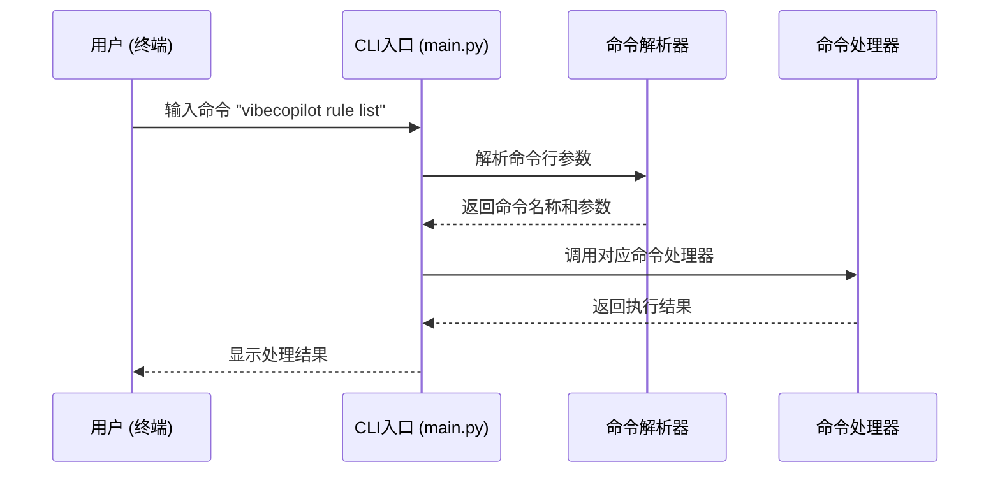
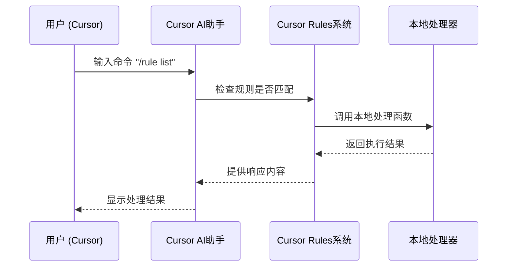

# VibeCopilot 命令系统开发指南 - 基础篇

## 1. 命令系统概述

VibeCopilot 提供两种不同的命令使用方式：

1. **Cursor IDE 中的智能助手命令**：在 IDE 内使用斜杠命令（如 `/rule`），由 Cursor Rules 系统处理
2. **命令行工具命令**：在终端中使用命令行工具（如 `vibecopilot rule`），直接执行本地代码

本指南主要关注**命令行工具命令**的开发，详细说明了如何扩展和开发新的命令处理器。有关 Cursor IDE 命令的开发，请参阅 [Cursor Rules 开发指南](../cursor-rules/README.md)。

## 2. 目录结构

命令系统的核心代码位于以下目录结构中：

```
src/
  ├── cursor/
  │   ├── __init__.py
  │   └── command_handler.py   # Cursor命令处理器
  ├── cli/
  │   ├── __init__.py
  │   ├── base_command.py      # 命令基类
  │   ├── command_parser.py    # 命令解析器
  │   └── commands/            # 具体命令实现
  │       ├── __init__.py
  │       ├── check_command.py
  │       ├── update_command.py
  │       └── ...
  └── core/
      ├── __init__.py
      └── rule_engine.py       # 规则引擎
```

## 3. 命令处理流程

VibeCopilot 的两种命令方式有不同的处理流程：

### 3.1 命令行工具处理流程



这是标准的命令行工具处理流程，直接在终端中执行，不涉及 AI 助手。

### 3.2 Cursor IDE 命令处理流程



IDE 命令通过 Cursor Rules 系统处理，可以与 AI 助手进行交互，提供更智能的响应。

本文档的其余部分将主要关注命令行工具命令的开发。
