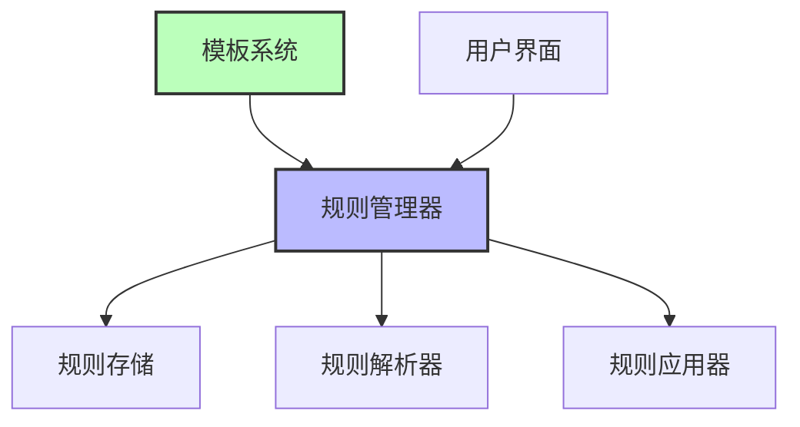

# 规则引擎概述

> **文档元数据**  
> 版本: 1.0  
> 更新日期: 2025-04-05  
> 状态: 已审核  
> 负责团队: 系统架构团队

## 1. 什么是规则引擎

规则引擎是VibeCopilot的核心组件，为AI助手提供行为指导和标准化控制的系统。它允许开发者定义结构化规则，使AI按照项目标准和最佳实践工作，从而提高开发效率和代码质量。

## 2. 核心价值

- **行为一致性**: AI助手始终遵循项目规范，无需重复解释
- **专业化分工**: 不同任务类型由专门配置的AI角色处理
- **标准化保证**: 自动实施项目编码和文档标准
- **效率提升**: 减少沟通成本，加速开发流程

## 3. 规则类型

规则引擎支持四种类型的规则，各有不同的应用场景：

| 规则类型 | 描述 | 触发方式 | 适用场景 |
|---------|------|---------|---------|
| **代理选择型** | AI根据上下文自动选择 | 自动应用 | 特定开发任务（如代码审查、架构设计） |
| **全局规则** | 应用于所有对话 | 自动应用 | 项目通用规范、团队协作准则 |
| **自动选择型** | 基于文件类型自动应用 | 打开特定文件时 | 语言特定编码规范、框架规范 |
| **手动规则** | 需要显式调用 | `@规则名` | 特定工作流程、专用工具指南 |

## 4. 系统组件

规则引擎由以下核心组件组成：



- **规则管理器**: 协调各组件工作，管理规则生命周期
- **规则存储**: 持久化存储规则定义和元数据
- **规则解析器**: 解析和验证规则内容
- **规则应用器**: 在适当的上下文中应用规则
- **模板系统**: 提供规则模板，简化规则创建
- **用户界面**: 提供规则管理和使用的交互界面

## 5. 规则文件格式

规则使用`.mdc`文件格式（Markdown with YAML frontmatter）定义：

```yaml
---
description: "TypeScript开发的最佳实践规则"
globs: ["*.ts", "*.tsx"]
alwaysApply: false
---

# TypeScript最佳实践

## 关键规则

- 使用类型注解
- 避免使用any类型
- 优先使用接口而非类型别名

## 示例

```typescript
// 推荐
interface User {
  id: number;
  name: string;
}

// 不推荐
type User = {
  id: number;
  name: string;
};
```

## 6. 快速开始

1. **查看可用规则**:
   ```bash
   ls -la .cursor/rules/
   ```

2. **使用规则**:
   - 自动应用规则会在适当的上下文中自动触发
   - 手动规则需要在对话中使用 `@规则名` 格式调用

3. **创建规则**:
   - 使用规则模板创建新规则
   - 将规则文件放置在适当的目录中

## 7. 后续阅读

- [规则引擎架构](02-rule-engine-architecture.md) - 深入了解系统架构
- [规则引擎API](03-rule-engine-api.md) - API参考文档
- [规则引擎实现](04-rule-engine-implementation.md) - 开发指南
- [规则引擎使用](05-rule-engine-usage.md) - 详细使用说明
- [规则引擎分析](06-rule-engine-analysis.md) - 技术分析报告
