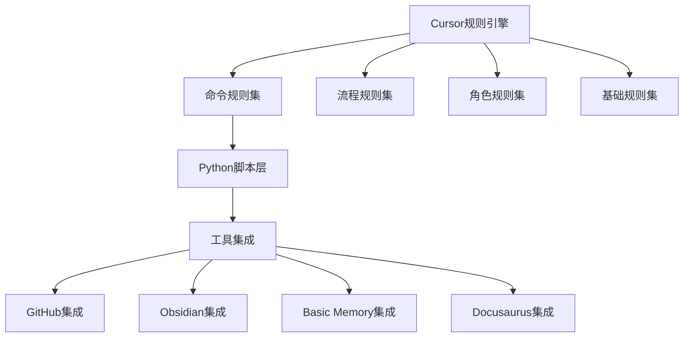

# VibeCopilot 发展路线图

> **文档元数据**
> 版本: 2.0
> 上次更新: 2024-04-25
> 负责人: 产品规划团队

## 1. 当前发展战略

VibeCopilot已调整为轻量级集成框架，主要通过以下方式实现：

1. **Cursor规则系统**：创建MDC格式规则文件，驱动Cursor行为
2. **Python脚本**：开发工具集成脚本，处理外部工具交互
3. **命令集接口**：通过规则定义命令，调用底层脚本
4. **最小化TypeScript**：仅用于辅助功能，不作为核心技术栈

这种轻量级架构能够更加灵活、快速地构建功能，避免过度工程化。

## 2. 核心组件与模块

### 2.1 规则组件系统

| 规则类型 | 主要功能 | 实现方式 |
|---------|---------|---------|
| **核心规则** | 基础行为定义 | MDC规则文件 |
| **开发规则** | 开发流程标准 | MDC规则文件 |
| **流程规则** | 工作流检查点 | MDC规则文件 |
| **命令规则** | 命令行接口 | MDC规则文件 |
| **角色规则** | 专家角色定义 | MDC规则文件 |
| **工具规则** | 工具使用规范 | MDC规则文件 |

### 2.2 脚本组件系统

| 脚本模块 | 主要功能 | 技术栈 |
|---------|---------|-------|
| **工具连接器** | 与外部工具通信 | Python |
| **数据转换器** | 数据格式转换 | Python |
| **命令处理器** | 执行命令逻辑 | Python |
| **知识图谱** | 文档关系处理 | Python + LangChain |

## 3. 实现路线与优先级

VibeCopilot采用渐进式开发方法，按功能价值优先实现：

### 3.1 当前阶段（4周内）

1. **命令规则系统**：
   - 完善通用命令规则结构 ✓
   - 实现基本命令集（/help, /memory, /plan等）✓
   - 优化命令交互体验 ⚙️

2. **Python脚本层**：
   - 建立基础脚本框架 ✓
   - 实现工具连接能力 ⚙️
   - 开发命令处理流程 ⚙️

3. **基础工具集成**：
   - GitHub基础集成 ✓
   - Obsidian连接器 ⚙️
   - Basic Memory接口 ⚙️

### 3.2 下一阶段（2-3个月）

1. **规则系统扩展**：
   - 完善角色规则体系
   - 增强流程检查点规则
   - 优化工具使用规则

2. **知识管理增强**：
   - LangChain文档处理
   - 知识图谱可视化
   - 长期记忆优化

3. **专业化命令**：
   - 开发流程管理命令
   - 项目健康度命令
   - 文档同步命令

### 3.3 长期规划（4-6个月）

1. **自适应规则系统**：
   - 规则自优化机制
   - 用户行为学习
   - 上下文感知规则

2. **多平台支持**：
   - VS Code适配
   - 其他编辑器支持
   - 网页版查看器

3. **企业级功能**：
   - 团队协作增强
   - 项目模板库
   - 安全和权限管理

## 4. 每周迭代计划

VibeCopilot采用周迭代方式，每周关注一个主题：

| 周次 | 主题 | 重点任务 |
|-----|------|---------|
| 当前周 | 命令稳定 | 完善现有命令集，修复已知问题 |
| 第2周 | 脚本增强 | 增强Python脚本功能，提高稳定性 |
| 第3周 | Memory增强 | 优化Basic Memory集成，提升知识管理 |
| 第4周 | 规则扩展 | 扩展规则集，增加专业角色规则 |
| 第5周 | 工具集成 | 增强外部工具集成能力 |
| 第6周 | 用户体验 | 优化交互流程，提升使用体验 |
| 第7周 | 文档系统 | 完善项目文档，建立知识库 |
| 第8周 | 测试与稳定 | 全面测试，修复问题，提高稳定性 |

## 5. 技术债务与优化

当前已识别的技术债务和优化机会：

| 问题 | 影响 | 解决方案 | 优先级 |
|-----|------|---------|-------|
| 规则文件重复代码 | 维护困难 | 建立规则组织系统 | 高 |
| 命令错误处理不完善 | 用户体验差 | 增强错误处理和提示 | 高 |
| 文档不够完整 | 使用难度大 | 完善命令文档和示例 | 中 |
| 工具连接稳定性问题 | 功能中断 | 改进连接管理和重试机制 | 中 |
| 测试覆盖率低 | 质量风险 | 增加自动化测试 | 低 |

## 6. 关键成功指标

VibeCopilot成功将通过以下指标衡量：

1. **用户效率提升**：
   - 命令使用频率 > 每日10次
   - 规则应用成功率 > 95%
   - 开发流程完成时间缩短 > 30%

2. **系统健康度**：
   - 规则应用错误率 < 5%
   - 命令执行成功率 > 98%
   - 工具连接稳定性 > 99%

3. **项目成长指标**：
   - 活跃规则数量 > 50个
   - 命令集数量 > 15个
   - 用户贡献规则数 > 10个

## 7. 贡献与参与

VibeCopilot欢迎社区贡献，特别是以下方面：

1. **规则贡献**：贡献新的MDC规则文件
2. **脚本改进**：增强Python脚本功能
3. **工具集成**：增加更多工具的集成
4. **文档与示例**：改进文档和使用示例
5. **Bug修复**：修复已知问题

## 附录：命令集开发计划

| 命令类别 | 当前状态 | 计划增强 |
|---------|---------|---------|
| **/help** | 基础完成 | 增加上下文相关帮助 |
| **/memory** | 基础完成 | 增加知识图谱集成 |
| **/plan** | 基础完成 | 增加任务跟踪和时间线 |
| **/task** | 基础完成 | 增加进度报告和提醒 |
| **/check** | 基础完成 | 增加多维度检查和建议 |
| **/story** | 基础完成 | 增加用户故事模板和分析 |
| **/branch** | 基础完成 | 增加分支策略和自动化 |
| **/update** | 基础完成 | 增加变更汇总和通知 |
| **/doc** | 计划中 | 自动文档生成和同步 |
| **/test** | 计划中 | 自动测试生成和执行 |

> **注**：本路线图会根据实际进展和用户反馈持续调整
