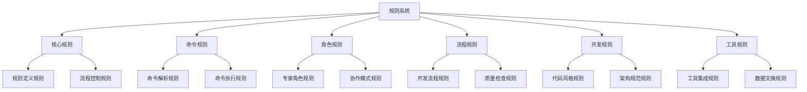
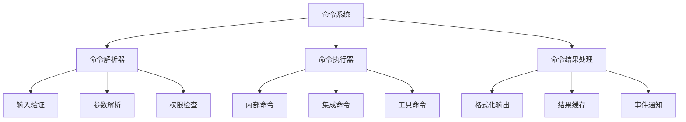
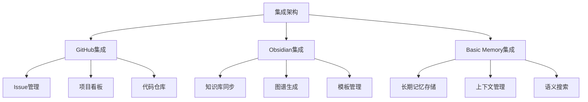

# VibeCopilot 项目结构

> **文档元数据**
> 版本: 2.0
> 上次更新: 2024-04-25
> 负责人: 系统架构团队

## 1. 项目目录结构

VibeCopilot采用基于规则和脚本的组织架构，确保轻量级和高扩展性。

```
/VibeCopilot
├── .ai/                    # Cursor agent产出物，workflow状态文档
├── .cursor/                # 静态规则存放目录
├── config/                 # 配置文件目录
│   ├── default/            # 默认配置
│   ├── development/        # 开发环境配置
│   └── production/         # 生产环境配置
├── docs/                   # 开发文档
│   ├── blog/               # 开发日志
│   ├── dev/                # 开发文档
│   │   ├── arch/           # 系统架构
│   │   ├── guides/         # 开发指南
│   │   ├── issues/         # 开发任务
│   │   ├── references/     # 外部参考
│   │   └── research/       # 研究报告
│   └── user/               # 用户文档
│       ├── commands/       # 命令参考
│       ├── modules/        # 模块使用指南
│       └── tutorials/      # 教程和示例
├── src/                    # 核心模块
│   ├── adapters/           # 适配器模块
│   │   ├── github/         # GitHub适配器
│   │   ├── n8n/            # n8n适配器
│   │   └── status_sync/    # 状态同步适配器
│   ├── core/               # 核心功能
│   │   ├── config/         # 配置管理
│   │   ├── engine/         # 核心引擎
│   │   └── logging/        # 日志系统
│   ├── cli/                # 命令行接口
│   ├── db/                 # 数据库模型和操作
│   │   ├── models/         # 数据模型
│   │   └── repositories/   # 数据仓库
│   ├── services/           # 服务层
│   │   ├── api/            # API服务
│   │   └── data/           # 数据处理服务
│   ├── types/              # 类型定义
│   └── utils/              # 通用工具函数
├── modules/                # 外部导入的模块
├── scripts/                # 脚本目录
│   ├── setup/              # 环境设置脚本
│   ├── tools/              # 开发工具脚本
│   └── ci/                 # CI/CD脚本
├── tests/                  # 测试目录
│   ├── unit/               # 单元测试
│   ├── integration/        # 集成测试
│   └── e2e/                # 端到端测试
├── example/                # 范例代码
├── website/                # 文档网站前端
│   └── docusaurus/         # Docusaurus配置
└── infra/                  # 基础设施模块
    ├── docker/             # Docker配置
    └── deployment/         # 部署配置
├── .github/                  # GitHub配置
├── README.md                 # 项目简介
├── LICENSE                   # 许可证
└── requirements.txt          # Python依赖
```

## 2. 核心组件结构

### 2.1 规则系统结构

VibeCopilot的规则系统是项目的基础，通过MDC格式定义了与Cursor交互的标准。



### 2.2 命令系统结构

命令系统基于Python脚本实现，负责处理用户通过Cursor发起的各类命令。



### 2.3 集成架构

集成架构通过轻量级客户端连接各种外部工具和服务。



## 3. 关键文件说明

### 3.1 核心脚本文件

| 文件路径 | 主要职责 | 关键功能 |
|---------|---------|---------|
| `scripts/main.py` | 脚本入口 | 命令分发、初始化流程 |
| `scripts/commands/__init__.py` | 命令注册 | 命令系统初始化和注册 |
| `scripts/utils/config.py` | 配置管理 | 读取和更新配置信息 |
| `scripts/integrations/__init__.py` | 集成管理 | 工具集成初始化和配置 |

### 3.2 关键规则文件

| 文件路径 | 主要职责 | 适用场景 |
|---------|---------|---------|
| `rules/core-rules/rule.mdc` | 规则定义标准 | 创建或修改规则时 |
| `rules/cmd-rules/help-cmd.mdc` | 帮助命令解析 | 用户需要帮助信息时 |
| `rules/flow-rules/workflow-instruction.mdc` | 工作流定义 | 开发流程管理 |
| `rules/role-rules/requirement_analyst.mdc` | 需求分析专家 | 需求分析和PRD编写 |
| `rules/dev-rules/vibe_convention.mdc` | 开发约定 | 代码和文档标准化 |

## 4. 配置文件结构

### 4.1 主配置文件 (settings.json)

```json
{
  "version": "2.0.0",
  "environment": "development",
  "logging": {
    "level": "info",
    "file": "./logs/vibe.log",
    "rotate": true
  },
  "commands": {
    "enabled": ["help", "memory", "plan", "task", "story", "branch", "check", "update"],
    "aliases": {
      "h": "help",
      "m": "memory",
      "p": "plan",
      "t": "task",
      "s": "story"
    }
  },
  "rules": {
    "directories": [
      "./rules/core-rules",
      "./rules/cmd-rules",
      "./rules/role-rules",
      "./rules/dev-rules",
      "./rules/flow-rules",
      "./rules/tool-rules"
    ],
    "autoload": true
  },
  "templates": {
    "docs": "./templates/docs",
    "rules": "./templates/rules"
  }
}
```

### 4.2 集成配置文件 (integrations.json)

```json
{
  "github": {
    "enabled": true,
    "repo": "username/VibeCopilot",
    "token_env": "GITHUB_TOKEN",
    "issues": {
      "enabled": true,
      "auto_create": true,
      "labels": ["documentation", "enhancement", "bug"]
    },
    "projects": {
      "enabled": true,
      "board_id": "PROJECT_ID",
      "auto_sync": true
    }
  },
  "obsidian": {
    "enabled": true,
    "vault_path": "~/Documents/VibeCopilot",
    "templates_dir": "Templates",
    "sync_interval": 30,
    "exclude_patterns": ["*.tmp", "*.log"]
  },
  "basic_memory": {
    "enabled": true,
    "api_key_env": "MEMORY_API_KEY",
    "base_url": "https://api.memory.example.com",
    "auto_save": true,
    "context_window": 5
  }
}
```

## 5. 项目扩展指南

### 5.1 添加新命令

要添加新命令，需要：

1. 在`scripts/commands/`目录中创建新的Python文件
2. 实现命令处理类，遵循命令接口标准
3. 在`__init__.py`中注册命令
4. 创建对应的命令规则文件
5. 更新配置启用新命令

**示例：添加新命令 `stats`**

```python
# scripts/commands/stats.py
from commands.base import BaseCommand

class StatsCommand(BaseCommand):
    def __init__(self):
        super().__init__("stats", "显示项目统计信息")

    def execute(self, args):
        # 命令实现逻辑
        return {
            "status": "success",
            "data": {
                "files": 120,
                "rules": 25,
                "commands": 8
            }
        }
```

### 5.2 添加新集成

要添加新外部工具集成，需要：

1. 在`scripts/integrations/`目录中创建新的Python客户端
2. 实现标准集成接口
3. 在配置文件中添加相关配置
4. 可选：创建对应的工具规则

**示例配置：集成新工具**

```json
"new_tool": {
  "enabled": true,
  "api_key_env": "NEW_TOOL_API_KEY",
  "base_url": "https://api.newtool.com",
  "features": ["feature1", "feature2"],
  "timeout": 30
}
```

### 5.3 创建新规则

要创建新的Cursor规则，需要：

1. 确定规则类型（核心、命令、角色、开发、流程或工具）
2. 在对应目录创建MDC格式的规则文件
3. 遵循规则模板标准编写规则内容
4. 在规则系统中注册新规则

**规则文件模板结构**：

```
# 规则标题

> **规则元数据**
> 类型: [规则类型]
> 优先级: [1-5]
> 版本: 1.0
> 作者: [作者]

## 使用场景

本规则应在以下情况下应用：
1. [场景一]
2. [场景二]
3. [场景三]

## 规则说明

[详细说明规则的内容和目的]

## 实现指南

[如何实现和遵循该规则]

## 示例

[规则应用示例]
```

## 6. 依赖关系

VibeCopilot的核心依赖包括：

- **Python** (>= 3.8): 主要开发语言
- **PyGithub**: GitHub API集成
- **Jinja2**: 模板处理
- **Markdown**: Markdown文档处理
- **Requests**: API调用
- **PyYAML**: 配置文件处理
- **Python-dotenv**: 环境变量管理
- **pytest**: 测试框架

完整依赖列表见`requirements.txt`。
