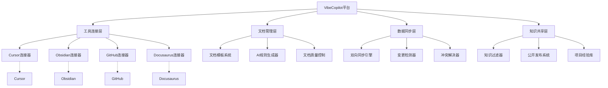

# VibeCopilot 项目概述

VibeCopilot是一个专注于整合现有AI工具和开发工具链的平台，通过标准化文档、协作流程和知识管理，实现工具间无缝协作，提升开发团队效率。

## 1. 项目定位

VibeCopilot 不是创建新的AI功能或替代现有工具，而是作为多工具整合平台，解决以下核心问题：

- **工具孤岛问题**：现有AI工具（如Cursor）和团队协作工具（如GitHub）各自独立，缺乏有效连接
- **知识碎片化**：AI辅助开发生成的知识难以系统化保存和共享
- **标准化缺失**：缺乏统一的AI使用规范和最佳实践
- **上下文丢失**：开发过程中的上下文在工具切换时经常丢失
- **长期记忆缺失**：AI工具普遍缺乏长期记忆能力，不能积累项目经验

通过解决这些问题，VibeCopilot旨在成为连接各工具生态系统的中枢，而非另一个独立工具。

## 2. 核心价值主张

VibeCopilot的核心价值在于"整合"而非"创造"：

1. **工具连接器**：建立Cursor、Obsidian、GitHub和Docusaurus等工具间的桥梁
2. **文档标准化**：提供结构化文档模板和同步机制，确保知识一致性
3. **知识流转优化**：实现从AI生成内容→知识库→团队共享的完整流程
4. **协作流程增强**：通过文档与GitHub项目的双向关联提升团队协作
5. **最佳实践沉淀**：建立AI辅助开发的规范和知识库

## 3. 工具整合架构

VibeCopilot采用模块化设计，围绕四个核心工具构建整合架构：

### 3.1 工具整合策略

1. **Cursor整合**：
   - 生成和管理自定义AI代理规则
   - 提供结构化提示词模板
   - 将AI生成内容直接同步到文档系统

2. **Obsidian整合**：
   - 作为AI长期记忆库和知识管理中心
   - 与项目文档实现双向同步
   - 利用图谱功能展示知识关联

3. **GitHub整合（gitdiagram + Octokit）**：
   - 使用gitdiagram分析和可视化项目结构
   - 通过Octokit实现与GitHub API的深度交互
   - 建立文档与Issues、PR的关联关系

4. **Docusaurus整合**：
   - 作为公开知识展示平台
   - 从Obsidian单向同步精选内容
   - 构建团队最佳实践和项目手册

## 4. 当前进展

目前VibeCopilot处于规划和原型设计阶段:

- 完成了核心架构设计
- 建立了各模块功能规范
- 完成了gitdiagram、Obsidian和Cursor规则系统的研究
- 规划了详细的实现路径

下一步将开始构建基础连接器和文档同步引擎的核心功能。

## 5. 总结

VibeCopilot通过整合现有工具生态而非创造新功能，解决了AI辅助开发中的碎片化问题。其核心价值在于建立工具间的无缝连接，实现知识的系统化管理和团队共享，从而显著提升开发效率和协作体验。

> 注：详细实现路径见《实施路径》文档，功能详情见《功能设计》文档，工作流程见《工作流程指南》文档
