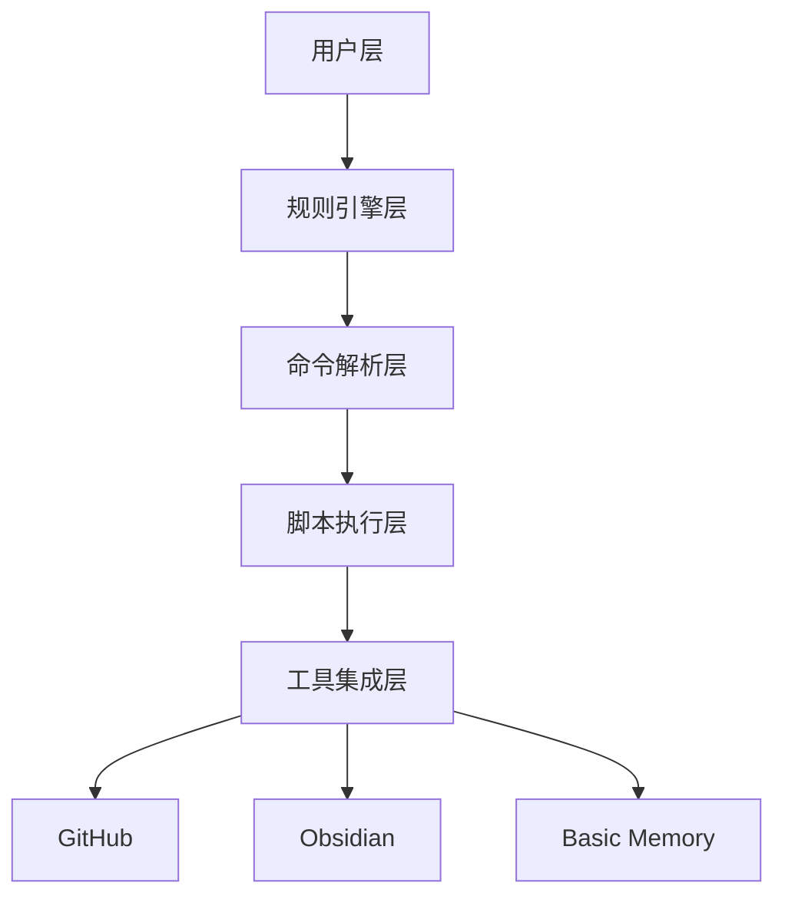
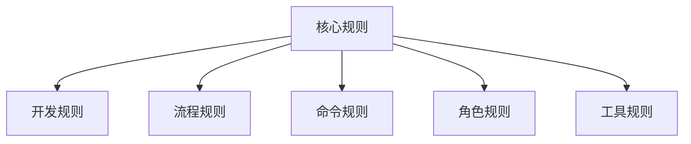
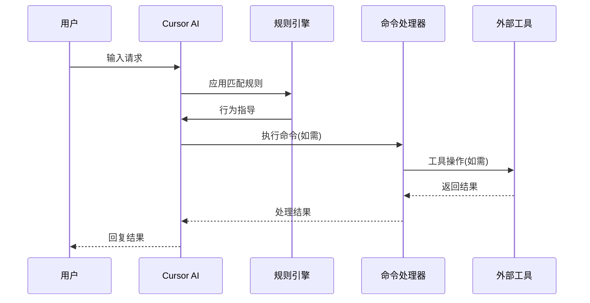
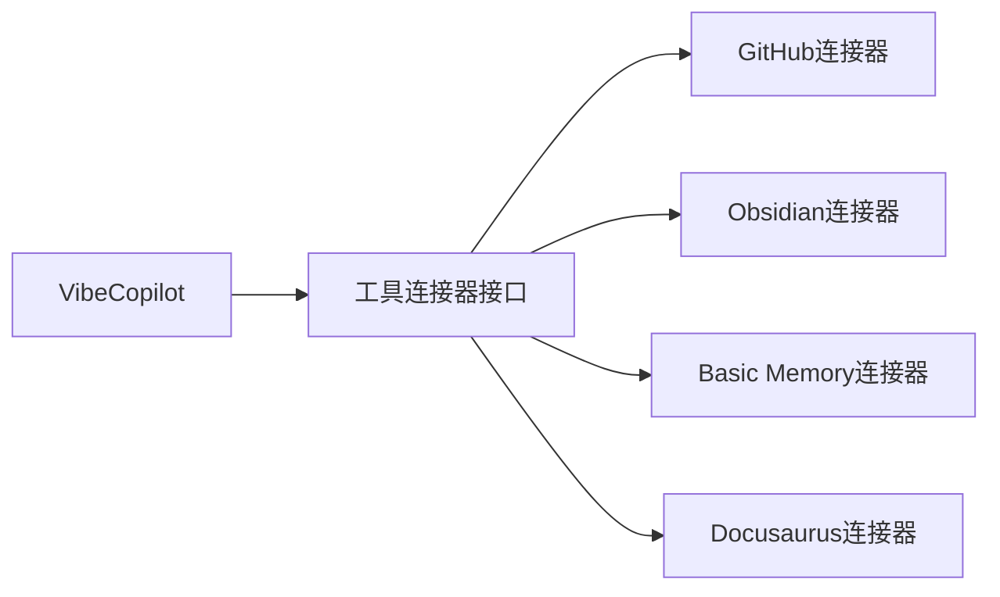
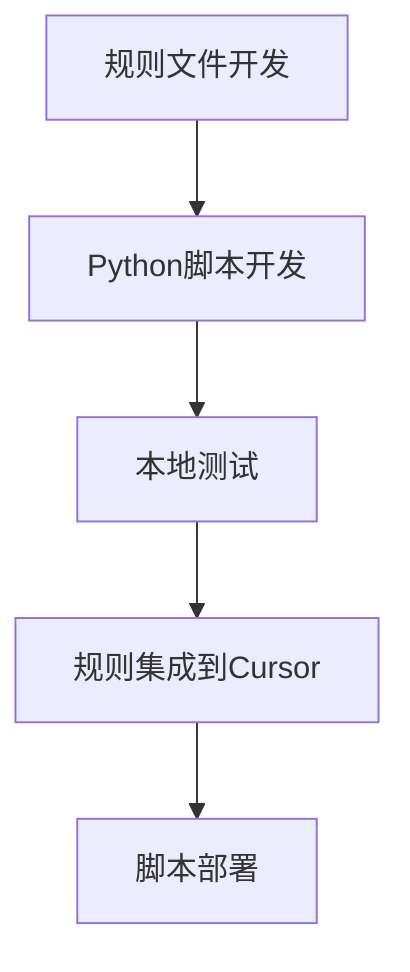

# VibeCopilot 架构概述

> **文档元数据**
> 版本: 2.0
> 上次更新: 2024-04-25
> 负责人: 技术架构团队

## 1. 项目定位与架构思想

VibeCopilot是一个轻量级AI辅助开发流程标准化框架，通过规则驱动和脚本集成实现多工具协同。核心理念是：

1. **轻量级连接器**：通过简单规则和脚本连接现有工具，而非重建完整应用
2. **规则驱动**：使用MDC格式规则文件定义AI行为和响应模式
3. **命令中心化**：统一命令接口简化用户交互
4. **流程强制检查点**：在关键节点执行强制性验证

VibeCopilot白皮书《AI辅助开发流程标准化白皮书》已完成，系统地阐述了项目背景、问题、解决方案和实现成果。

## 2. 核心架构组件

| 架构层 | 核心组件 | 技术实现 | 主要职责 |
|-------|---------|---------|---------|
| 规则引擎层 | 规则文件系统 | MDC格式规则 | 定义AI行为模式 |
| 命令解析层 | 命令处理器 | Python解析器 | 解析命令和参数 |
| 脚本执行层 | 功能执行器 | Python脚本 | 执行具体任务 |
| 工具集成层 | 工具连接器 | API客户端 | 与外部工具交互 |

## 3. 规则系统架构

VibeCopilot的规则系统是核心创新点，按层次组织：

### 3.1 规则类型层次

| 规则类型 | 作用范围 | 优先级 | 主要功能 |
|---------|---------|-------|---------|
| 核心规则 | 全局 | 最高 | 基础行为规范和规则生成 |
| 开发规则 | 开发流程 | 高 | 开发过程标准和规范 |
| 流程规则 | 工作流 | 高 | 工作流程检查点和验证 |
| 命令规则 | 命令处理 | 中 | 命令语法和执行逻辑 |
| 角色规则 | 专家角色 | 中 | 特定领域专家行为模式 |
| 工具规则 | 工具使用 | 低 | 工具使用规范和集成 |

### 3.2 规则执行流程

## 4. 命令系统设计

VibeCopilot命令系统采用"/"前缀规范，简化用户交互：

| 命令类别 | 示例命令 | 实现状态 | 功能描述 |
|---------|---------|---------|---------|
| 帮助命令 | `/help` | 完成 | 显示可用命令和用法 |
| 记忆命令 | `/memory` | 完成 | 知识存储和检索 |
| 计划命令 | `/plan` | 完成 | 创建和管理开发计划 |
| 任务命令 | `/task` | 完成 | 管理开发任务 |
| 检查命令 | `/check` | 完成 | 执行代码和流程检查 |
| 故事命令 | `/story` | 完成 | 用户故事管理 |
| 分支命令 | `/branch` | 完成 | Git分支管理 |
| 更新命令 | `/update` | 完成 | 项目状态更新 |

## 5. 工具集成架构

VibeCopilot通过标准化连接器集成外部工具：

### 5.1 工具集成方式

1. **GitHub集成**：通过API实现仓库管理、Issue跟踪
2. **Obsidian集成**：通过文件系统操作实现知识管理
3. **Basic Memory集成**：通过API实现长期记忆存储
4. **Docusaurus集成**：通过文件生成实现文档站点

## 6. 数据流与状态管理

VibeCopilot采用简单高效的数据流设计：

1. **配置数据**：JSON格式配置文件
2. **状态数据**：本地JSON文件存储
3. **会话数据**：临时内存存储
4. **持久化数据**：通过工具集成存储

## 7. 技术文档体系

VibeCopilot项目文档已按新架构重新组织：

| 文档类型 | 文件位置 | 主要内容 |
|---------|---------|---------|
| 项目白皮书 | `docs/dev/architecture/1_init.md` | 项目背景、问题与解决方案 |
| 规范白皮书 | `docs/dev/architecture/2_prd.md` | 详细实现规范与成果 |
| 技术实现 | `docs/dev/architecture/3_technical.md` | 技术实现细节 |
| 路线图 | `docs/dev/architecture/10_roadmap.md` | 发展计划和里程碑 |
| 技术栈 | `docs/dev/architecture/7_Tech_Stack.md` | 技术选型和原因 |
| 项目结构 | `docs/dev/architecture/8_project_structure.md` | 目录结构和组织方式 |

## 8. 开发与部署流程

VibeCopilot采用简单直观的开发部署方式：

### 8.1 开发流程

1. **规则开发**：创建或修改MDC规则文件
2. **脚本开发**：实现命令处理逻辑
3. **工具集成**：连接外部工具API
4. **测试验证**：验证规则和脚本功能
5. **部署集成**：部署到Cursor环境

## 9. 架构优势

VibeCopilot基于规则+脚本的轻量级架构具有显著优势：

1. **低侵入性**：不改变现有工具的使用方式
2. **高灵活性**：简单添加新规则和脚本即可扩展
3. **快速实现**：避免复杂基础设施建设
4. **易于维护**：明确的职责边界和模块化设计
5. **适应性强**：能适应不同团队和项目需求

## 10. 演进路径

VibeCopilot未来将沿以下方向演进：

1. **规则引擎增强**：支持更复杂的条件逻辑和上下文
2. **命令系统扩展**：增加更多专业化命令
3. **知识图谱增强**：实现更智能的知识关联和检索
4. **多平台支持**：支持更多编辑器和平台
5. **社区贡献**：引入规则和脚本的社区贡献机制
