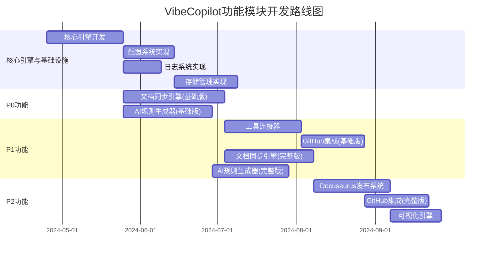

# VibeCopilot 模块开发路线图

> **文档元数据**
> 版本: 1.1
> 上次更新: 2024-04-20
> 负责人: 产品规划团队

## 1. 基于功能模块的开发路线图

VibeCopilot开发按照功能模块设计文档中定义的优先级和依赖关系进行。主要功能模块开发路径如下：

## 2. 按功能模块的里程碑规划

VibeCopilot将围绕核心功能模块实现五个主要里程碑：

| 里程碑 | 功能模块交付 | 预计完成 | 状态 |
|-------|------------|---------|------|
| M1 | - 核心引擎 - 基础设施层 | 2024-05-15 | 规划中 |
| M2 | - 文档同步引擎(基础版) - AI规则生成器(基础版) | 2024-06-30 | 计划中 |
| M3 | - 工具连接器 - GitHub集成(基础版) - 文档同步引擎(完整版) | 2024-08-15 | 计划中 |
| M4 | - AI规则生成器(完整版) - Docusaurus发布系统 - GitHub集成(完整版) | 2024-09-30 | 计划中 |
| M5 | - 可视化引擎 - 集成验证 - 发布准备 | 2024-10-31 | 计划中 |

## 3. 核心功能模块详细任务

### 3.1 文档同步引擎 (P0)

| 任务 | 描述 | 对应接口/类 | 优先级 | 估计工时 |
|-----|------|------------|-------|---------|
| 文件变更监控 | 监控本地文件变化 | `ChangeDetector` | P0 | 5人天 |
| 双向同步实现 | 本地与Obsidian文档同步 | `SyncController` | P0 | 10人天 |
| 文档格式转换 | 处理不同格式间转换 | `FormatConverter` | P0 | 7人天 |
| 冲突检测与解决 | 冲突识别与处理 | `ConflictResolver` | P0 | 8人天 |
| 同步状态管理 | 维护文档同步状态 | `StatusManager` | P1 | 5人天 |

### 3.2 AI规则生成器 (P0)

| 任务 | 描述 | 对应接口/类 | 优先级 | 估计工时 |
|-----|------|------------|-------|---------|
| 模板库管理 | 规则模板管理与分类 | `TemplateManager` | P0 | 6人天 |
| 规则生成 | 基于模板生成规则 | `RuleGenerator` | P0 | 8人天 |
| 规则验证 | 验证规则有效性 | `RuleValidator` | P0 | 5人天 |
| Cursor规则集成 | 将规则部署到Cursor | `CursorDeployer` | P0 | 4人天 |
| 规则优化建议 | 提供规则改进建议 | `OptimizationEngine` | P1 | 7人天 |

### 3.3 GitHub集成模块 (P1)

| 任务 | 描述 | 对应接口/类 | 优先级 | 估计工时 |
|-----|------|------------|-------|---------|
| GitHub API客户端 | 封装GitHub API操作 | `GitHubAPIClient` | P1 | 5人天 |
| 文档与Issue关联 | 文档与Issues双向关联 | `DocumentLinking` | P1 | 6人天 |
| 仓库结构分析 | 分析项目结构和依赖 | `RepositoryAnalyzer` | P1 | 8人天 |
| 路线图生成 | 根据Issues生成路线图 | `RoadmapGenerator` | P1 | 7人天 |
| PR自动管理 | 自动创建与管理PR | `PRManager` | P2 | 5人天 |

## 4. 开发策略与关键路径

### 4.1 关键开发路径

1. **核心引擎** → **文档同步引擎(基础版)** → **工具连接器** → **文档同步引擎(完整版)** → **Docusaurus发布系统**
2. **核心引擎** → **AI规则生成器(基础版)** → **AI规则生成器(完整版)**
3. **工具连接器** → **GitHub集成(基础版)** → **GitHub集成(完整版)**

### 4.2 增量开发策略

每个模块采用渐进式开发方法：

1. **最小可行实现**：优先实现核心功能
2. **阶段性迭代**：通过短期迭代增加功能
3. **持续测试**：每次迭代进行单元测试和集成测试
4. **反馈驱动改进**：根据实际使用效果调整

## 5. 技术债务处理计划

根据模块设计文档中的技术债务追踪，制定以下解决计划：

| 技术债务 | 关联模块 | 解决时间点 | 解决策略 |
|---------|---------|-----------|---------|
| 冲突解决优化 | 文档同步引擎 | M3后期 | 实现三路合并算法 |
| GitLab/Gitee支持 | GitHub集成 | M5之后 | 抽象VCS接口层 |
| 多AI模型支持 | AI规则生成器 | M4期间 | 设计模型适配器 |
| VS Code集成 | 工具连接器 | M4期间 | 开发VS Code适配器 |

## 6. 资源分配与团队结构

### 6.1 核心模块开发团队

| 团队 | 负责模块 | 所需技能 | 人员配置 |
|-----|---------|---------|---------|
| 核心引擎组 | 核心引擎与基础设施 | TypeScript, 事件系统设计 | 2开发 + 1测试 |
| 文档同步组 | 文档同步引擎 | Markdown处理, 同步算法 | 2开发 + 1测试 |
| AI规则组 | AI规则生成器 | AI提示词工程, JS/TS | 2开发 + 1测试 |
| 工具集成组 | 工具连接器, GitHub集成 | API集成, 适配器设计 | 2开发 + 1测试 |

### 6.2 跨职能需求

- **DevOps支持**：CI/CD流程建设
- **UX设计**：界面和交互设计
- **技术文档**：开发文档和用户指南
- **产品管理**：需求优先级和路线图维护

## 7. 风险管理

| 风险 | 相关模块 | 缓解策略 |
|-----|---------|---------|
| 外部库API变更 | 工具连接器, GitHub集成 | 模块化设计, 适配器隔离层 |
| 同步冲突频繁 | 文档同步引擎 | 改进冲突检测算法, 用户提示优化 |
| Cursor规则限制 | AI规则生成器 | 持续监控Cursor规则变化, 保持兼容 |
| 外部依赖更新延迟 | 所有模块 | 依赖版本策略, 自动更新检查 |

---

**注**：详细开发任务和当前进度在GitHub Projects中管理。本文档提供功能模块层面的规划视图。
