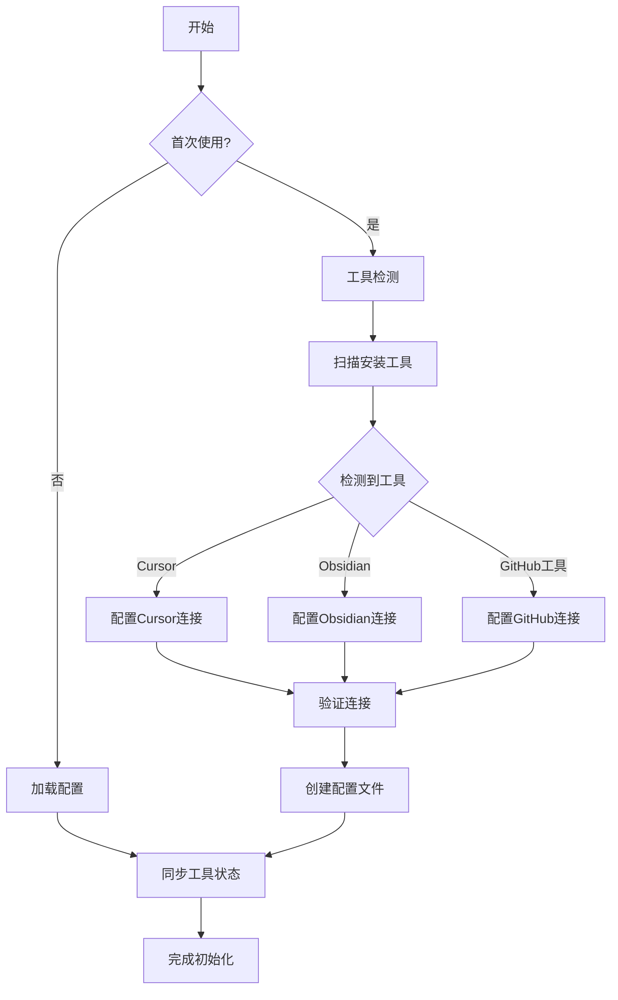
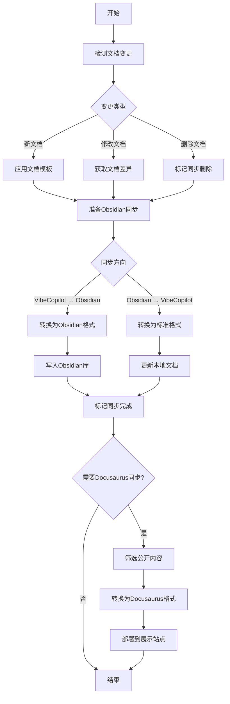
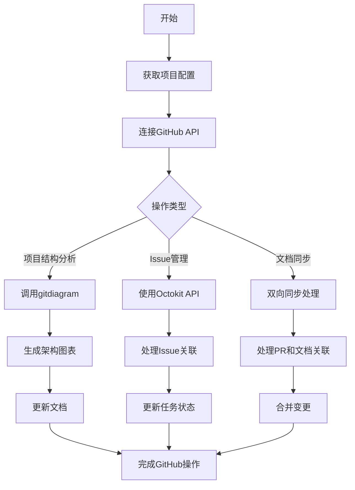
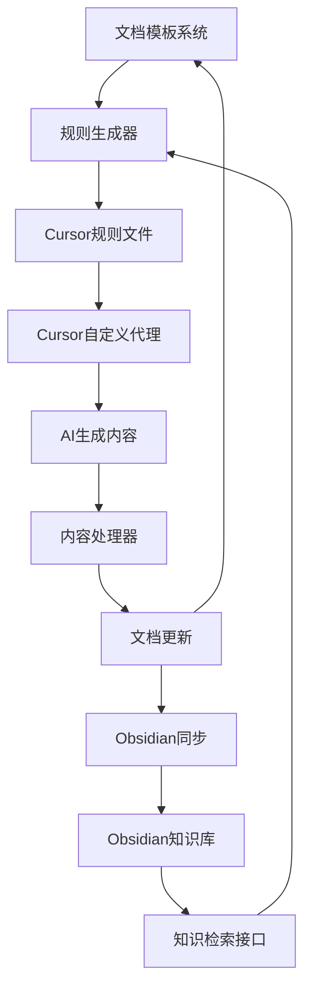
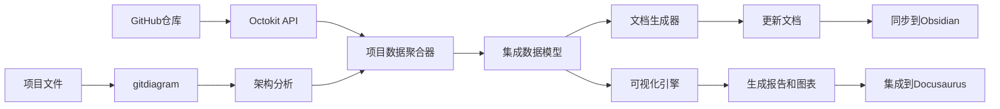
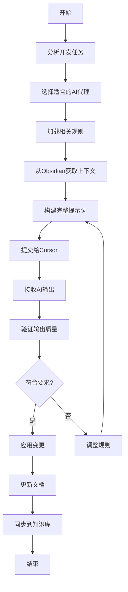
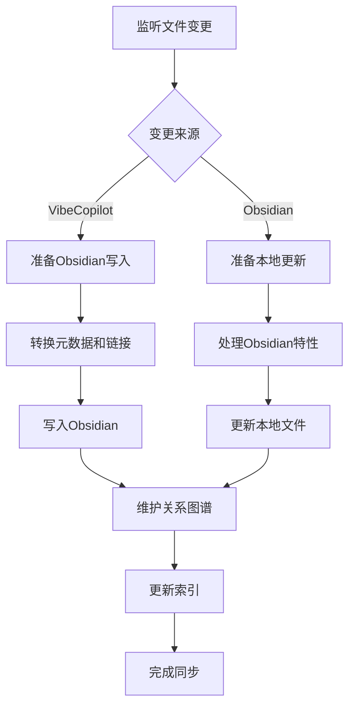
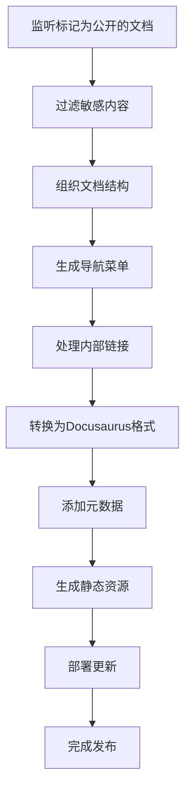
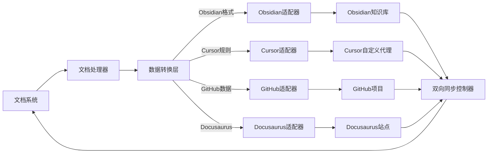
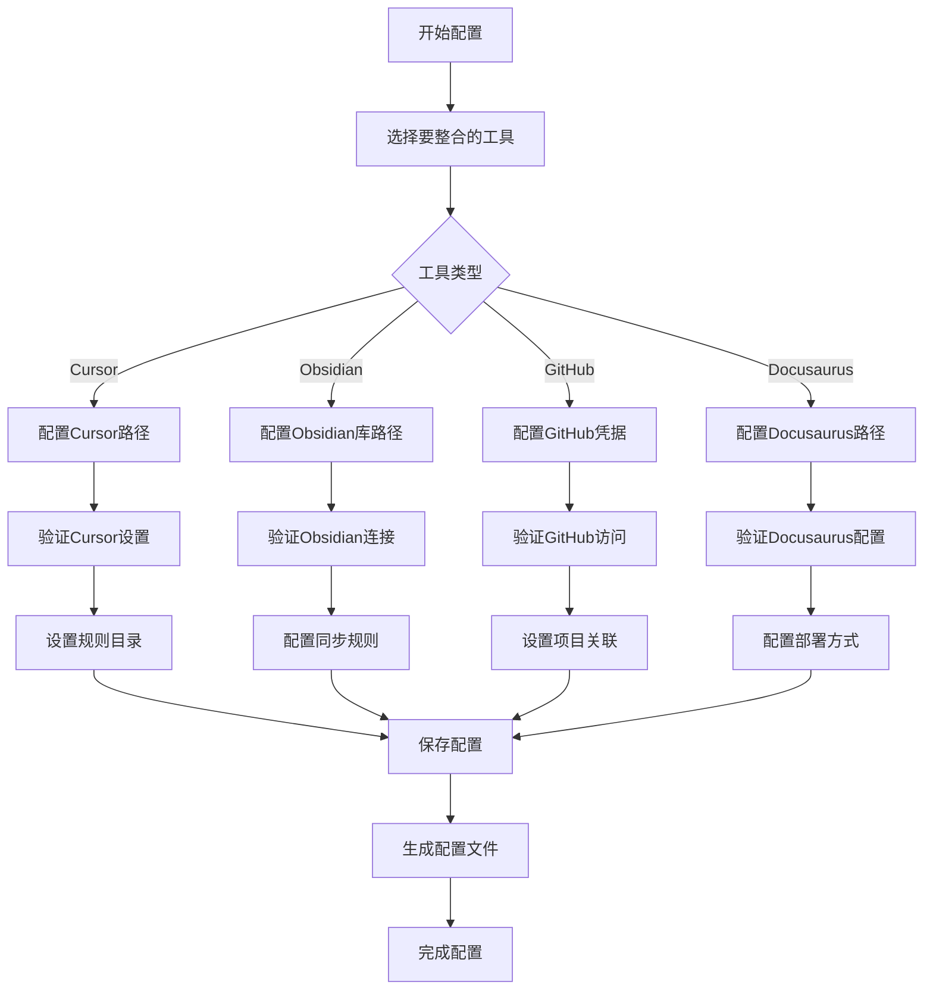

# VibeCopilot 应用流程设计

本文档通过流程图和数据流图详细说明VibeCopilot的应用工作流程，展示最终用户将如何使用该产品。

## 1. 多工具连接流程

### 1.1 系统初始化流程

### 1.2 文档与知识库同步流程

### 1.3 GitHub集成流程

## 2. 主要数据流程

### 2.1 AI代理规则与文档流

### 2.2 项目数据整合流

## 3. 工具交互流程

### 3.1 Cursor自定义代理集成

### 3.2 Obsidian知识库同步

### 3.3 Docusaurus展示系统

## 4. 跨工具数据流

## 5. 用户交互场景

### 5.1 开发者工作流程

1. 开发者连接工具并初始化VibeCopilot配置
2. 项目文档自动同步到Obsidian知识库
3. 开发者基于gitdiagram生成的架构图表理解项目
4. 使用预配置的Cursor代理规则进行开发
5. 文档与GitHub Issues保持双向关联
6. PR创建时自动关联相关文档
7. 知识和经验自动积累在Obsidian中
8. 精选内容发布到Docusaurus供团队参考

### 5.2 团队协作流程

1. 项目管理者在GitHub Projects创建任务
2. 任务自动与文档关联并反映在知识库中
3. 开发者使用标准化提示词模板与AI工具协作
4. 团队在Obsidian中共享和优化知识
5. 通过Docusaurus访问公开的最佳实践
6. GitHub状态变化自动反映在文档系统
7. 新成员通过Docusaurus快速了解项目
8. 跨项目知识在Obsidian中积累并共享

## 6. 工具整合配置流程

> 注：本文档仅展示VibeCopilot应用的工作流程，项目的详细功能请参阅《功能设计》文档，开发流程请参阅《开发流程指南》文档，整体架构请参阅《项目概述》文档。
