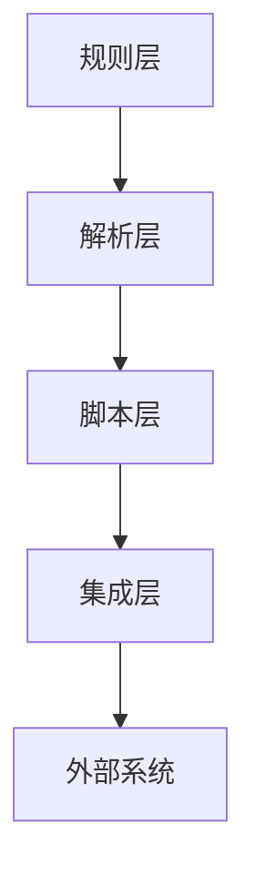

# VibeCopilot 技术栈

> **文档元数据**
> 版本: 2.0
> 上次更新: 2024-04-25
> 负责人: 技术架构团队

## 1. 核心技术栈

VibeCopilot采用轻量级技术栈，以灵活性和易于集成为核心原则：

| 类别 | 技术选择 | 用途 |
|------|---------|------|
| **主要语言** | Python 3.10+ | 脚本开发、工具集成、命令处理 |
| **辅助语言** | TypeScript (最小化) | 少量辅助功能 |
| **规则格式** | MDC (Markdown Code) | AI行为规则定义 |
| **配置格式** | JSON, YAML | 配置文件与数据交换 |
| **工具集成** | GitHub API, Obsidian API | 外部系统集成 |
| **文档处理** | Markdown, LangChain | 文档解析与知识处理 |

## 2. 技术栈选型理由

### 2.1 Python作为主要语言

- **优势**：
  - 广泛的库生态系统，特别是对API集成的支持
  - 快速开发和原型设计能力
  - 良好的文本处理和脚本能力
  - 跨平台兼容性
  - LangChain等AI工具链原生支持

- **使用场景**：
  - 命令处理脚本
  - 工具集成模块
  - 文件系统操作
  - API调用和处理

### 2.2 MDC规则文件

- **优势**：
  - 与Cursor规则引擎完美兼容
  - 人类可读的格式
  - 版本控制友好
  - 易于编辑和共享
  - 结构化且灵活

- **使用场景**：
  - 定义AI行为规则
  - 指定命令语法和处理流程
  - 描述开发流程和检查点
  - 定义专家角色行为

### 2.3 工具集成技术

- **GitHub API**：
  - REST API与GraphQL API
  - 用于项目管理和代码仓库交互
  - 支持Issue跟踪和PR管理

- **Obsidian API**：
  - 本地文件系统操作
  - 插件系统利用
  - 用于知识管理和文档处理

## 3. 开发环境和工具

### 3.1 开发环境

| 工具类型 | 推荐工具 | 用途 |
|---------|---------|------|
| **代码编辑器** | VSCode, Cursor | 代码编写和AI辅助 |
| **版本控制** | Git, GitHub | 代码版本管理 |
| **虚拟环境** | venv, conda | Python环境隔离 |
| **文档编辑** | Obsidian, Markdown编辑器 | 文档和规则编写 |

### 3.2 关键开发工具

- **VSCode扩展**：
  - Python扩展
  - Markdown All in One
  - GitLens

- **命令行工具**：
  - git
  - pytest (测试)
  - black (代码格式化)
  - isort (导入排序)

## 4. 依赖管理

### 4.1 核心Python依赖

```
# 核心依赖
requests>=2.28.1        # HTTP请求
python-dotenv>=0.21.0   # 环境变量处理
markdown>=3.4.1         # Markdown处理
pyyaml>=6.0             # YAML处理
rich>=12.6.0            # 终端格式化输出

# 知识处理相关
langchain>=0.0.27       # 知识图谱和文档处理

# 测试工具
pytest>=7.2.0           # 测试框架
black>=22.12.0          # 代码格式化
isort>=5.11.4           # 导入排序
```

### 4.2 最小化TypeScript依赖 (仅用于特定场景)

```json
{
  "dependencies": {
    "axios": "^1.3.4",     // HTTP客户端
    "commander": "^10.0.0" // 命令行解析
  },
  "devDependencies": {
    "typescript": "^4.9.5",    // TypeScript编译器
    "ts-node": "^10.9.1",      // TypeScript运行环境
    "jest": "^29.4.3"          // 测试框架
  }
}
```

## 5. 技术架构层次

VibeCopilot采用简洁的分层架构：



### 5.1 规则层

- **职责**：定义AI行为、命令语法、流程规范
- **技术**：MDC格式规则文件
- **关键组件**：核心规则、命令规则、流程规则、角色规则

### 5.2 解析层

- **职责**：解析用户输入、识别命令、提取参数
- **技术**：Python文本处理
- **关键组件**：命令解析器、参数验证器

### 5.3 脚本层

- **职责**：执行命令逻辑、处理数据、调用集成层
- **技术**：Python脚本
- **关键组件**：命令处理器、状态管理器

### 5.4 集成层

- **职责**：与外部系统通信、API调用、数据转换
- **技术**：Python API客户端
- **关键组件**：GitHub集成、Obsidian集成、记忆系统

## 6. 部署和环境要求

### 6.1 系统要求

- **操作系统**：Windows, macOS, Linux
- **Python版本**：3.10或更高
- **Node.js版本**：16.x或更高 (仅用于特定功能)
- **硬件要求**：最低2GB RAM, 500MB磁盘空间

### 6.2 环境变量配置

基本环境变量配置示例：

```
# .env文件示例
GITHUB_TOKEN=your_github_token
OBSIDIAN_VAULT_PATH=/path/to/vault
MEMORY_DIR=/path/to/memory_store
LOG_LEVEL=INFO
```

## 7. 技术决策记录

### 7.1 选择Python而非全TypeScript

| 考虑因素 | Python | TypeScript |
|---------|--------|------------|
| 开发速度 | 优秀 ✓ | 良好 |
| 文本处理 | 优秀 ✓ | 一般 |
| AI工具集成 | 原生支持 ✓ | 需要额外适配 |
| 跨平台 | 优秀 ✓ | 依赖Node |
| 学习曲线 | 平缓 ✓ | 较陡 |

**结论**: 选择Python作为主要语言，仅在特定场景使用TypeScript

### 7.2 选择MDC格式而非JSON配置

| 考虑因素 | MDC | JSON配置 |
|---------|-----|---------|
| 可读性 | 优秀 ✓ | 一般 |
| 版本控制友好 | 优秀 ✓ | 良好 |
| 注释支持 | 原生支持 ✓ | 不支持 |
| 与Cursor集成 | 完美兼容 ✓ | 需要转换 |
| 复杂性表达 | 结构化且灵活 ✓ | 有限 |

**结论**: 选择MDC作为规则定义格式，保持与Cursor规则引擎的一致性

## 8. 后续技术演进考虑

1. **规则系统增强**:
   - 引入规则DSL (领域特定语言)
   - 规则优先级动态调整机制
   - 规则冲突检测与解决

2. **知识图谱增强**:
   - 接入向量数据库
   - 基于LangChain的知识处理管道优化
   - 文档关系自动发现

3. **多平台支持**:
   - 支持VS Code插件
   - 网页版知识库查看器
   - 移动端轻量客户端

4. **性能优化**:
   - 规则引擎性能提升
   - 命令响应速度优化
   - 多进程处理能力
