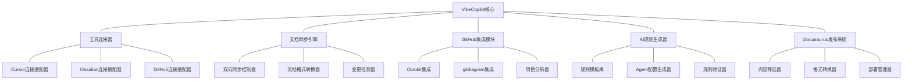
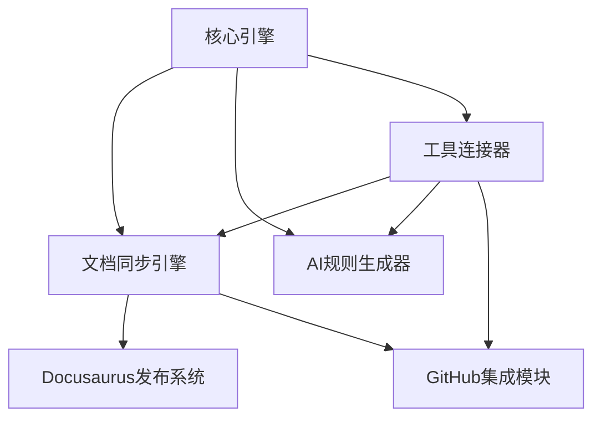

# VibeCopilot 功能设计规范

> **文档元数据**
> 版本: 1.0
> 上次更新: 2024-04-19
> 负责人: 系统架构团队

## 1. 功能优先级映射

本节将PRD中定义的功能需求与系统功能模块直接关联，确保开发优先级与产品需求一致。

| PRD功能需求 | 功能模块 | 优先级 | 状态 |
|------------|----------|--------|------|
| 文档模板与知识库同步 | 文档同步引擎 | P0 | 规划中 |
| Cursor自定义代理规则整合 | AI规则生成器 | P0 | 规划中 |
| GitHub项目深度集成 | GitHub集成模块 | P1 | 规划中 |
| AI长期记忆与知识积累 | 文档同步引擎 | P1 | 规划中 |
| 标准化开发流程 | 核心引擎 | P1 | 规划中 |
| 文档质量与一致性 | 文档同步引擎 | P2 | 计划中 |
| 项目展示与分享 | Docusaurus发布系统 | P2 | 计划中 |
| 工具链集成增强 | 工具连接器 | P3 | 未规划 |
| AI辅助团队协作 | AI规则生成器 | P3 | 未规划 |
| 高级可视化 | 可视化引擎 | P3 | 未规划 |

## 2. 系统功能架构

VibeCopilot采用模块化设计，核心功能围绕文档驱动开发和工具集成展开：



## 3. 核心功能模块（P0）

### 3.1 文档同步引擎

作为VibeCopilot的核心，负责在本地、Obsidian和Docusaurus之间同步文档内容。

**主要功能：**

- 本地与Obsidian的双向同步
- 内容向Docusaurus的单向同步
- 文档格式转换与兼容性处理
- 变更检测与冲突解决

**核心接口：**

```typescript
interface IDocumentSyncEngine {
  // 同步特定文档
  syncDocument(docPath: string, direction: SyncDirection): Promise<SyncResult>;

  // 检测并处理变更
  detectAndProcessChanges(): Promise<ChangeResult[]>;

  // 解决冲突
  resolveConflict(conflict: SyncConflict, resolution: Resolution): Promise<void>;

  // 获取同步状态
  getSyncStatus(docPath: string): Promise<SyncStatus>;
}
```

**验收标准：**

- 文档同步成功率达到95%以上
- 冲突解决成功率达到90%以上
- 支持Markdown格式及其扩展语法
- 文档同步延迟不超过5秒

### 3.2 AI规则生成器

管理和优化AI交互的提示词，实现高效的AI辅助开发。

**主要功能：**

- 管理Cursor自定义代理规则
- 提供场景化提示词模板
- 验证和优化AI规则
- 导出规则到Cursor环境

**核心接口：**

```typescript
interface IAIRuleGenerator {
  // 获取规则模板
  getTemplate(category: string, taskType: string): Promise<Template>;

  // 生成自定义代理规则
  generateRule(template: Template, variables: Record<string, string>): Promise<Rule>;

  // 验证规则有效性
  validateRule(rule: Rule): Promise<ValidationResult>;

  // 部署规则到Cursor
  deployToCursor(rule: Rule): Promise<DeployResult>;
}
```

**验收标准：**

- 支持至少5种常见开发场景的规则模板
- 规则生成与部署成功率达到95%
- 生成的规则符合Cursor规范要求
- 支持模板变量替换和自定义

## 4. 扩展功能模块（P1）

### 4.1 GitHub集成模块

实现与GitHub的深度集成，支持项目管理和文档同步。

**主要功能：**

- 连接GitHub API
- 关联文档与Issues
- 通过gitdiagram分析项目结构
- 生成项目报告和路线图

**核心接口：**

```typescript
interface IGitHubIntegration {
  // 关联文档与Issue
  linkDocumentToIssue(docPath: string, issueNumber: number): Promise<void>;

  // 从文档创建Issue
  createIssueFromDocument(docPath: string): Promise<number>;

  // 分析仓库结构
  analyzeRepository(owner: string, repo: string): Promise<RepositoryAnalysis>;

  // 生成项目路线图
  generateRoadmap(owner: string, repo: string): Promise<Roadmap>;
}
```

**验收标准：**

- 文档与GitHub Issues的关联成功率达到95%
- 项目结构分析准确率达到90%
- 支持主要GitHub功能（Issues, PRs, Projects）
- API调用失败时有适当的重试和降级机制

### 4.2 工具连接器

负责与各种外部工具建立和维护连接，是VibeCopilot整合能力的核心。

**主要功能：**

- 检测和连接工具（Cursor, Obsidian, GitHub）
- 管理工具配置
- 监听工具状态变化
- 提供统一的工具访问接口

**核心接口：**

```typescript
interface IToolConnector {
  // 连接工具
  connectTool(type: ToolType, config: ToolConfig): Promise<boolean>;

  // 获取工具状态
  getToolStatus(type: ToolType): Promise<ToolStatus>;

  // 监听工具状态变化
  watchToolStatus(type: ToolType): Observable<ToolStatus>;

  // 获取适配器实例
  getAdapter<T>(type: ToolType): T;
}
```

**验收标准：**

- 支持所有核心工具（Cursor, Obsidian, GitHub, Docusaurus）
- 工具连接成功率达到95%
- 配置变更能自动重连
- 提供明确的错误提示和故障排除指导

## 5. 辅助功能模块（P2）

### 5.1 Docusaurus发布系统

负责将内部文档转换为公开可访问的项目手册和最佳实践库。

**主要功能：**

- 内容筛选和敏感信息移除
- Markdown到Docusaurus格式转换
- 静态站点构建和部署
- 导航结构自动生成

**核心接口：**

```typescript
interface IDocusaurusPublisher {
  // 筛选适合公开的内容
  filterContent(docs: Document[]): Document[];

  // 转换为Docusaurus格式
  convertToDocusaurus(doc: Document): DocusaurusContent;

  // 生成站点结构
  generateSiteStructure(docs: Document[]): SiteStructure;

  // 部署站点
  deploySite(contents: DocusaurusContent[]): Promise<DeployResult>;
}
```

**验收标准：**

- 内容筛选准确率达到95%
- 格式转换准确率达到98%
- 部署成功率达到99%
- 支持增量更新，仅处理变更内容

## 6. 功能依赖关系



## 7. 功能实现路径

功能实现将遵循以下优先级和依赖关系：

1. **第一阶段（基础功能）**
   - 核心引擎
   - 工具连接器（基础版）
   - 文档同步引擎（基础版）

2. **第二阶段（核心功能）**
   - AI规则生成器
   - 文档同步引擎（完整版）
   - GitHub集成（基础版）

3. **第三阶段（扩展功能）**
   - GitHub集成（完整版）
   - Docusaurus发布系统
   - 工具连接器（扩展版）

## 8. 跨功能需求

所有功能模块必须满足以下跨功能需求：

1. **性能要求**
   - 同步操作响应时间不超过2秒
   - 规则生成不超过1秒
   - 内存占用不超过200MB

2. **安全要求**
   - 敏感信息（如API密钥）加密存储
   - 文档内容在传输过程中加密
   - 权限控制和访问审计

3. **兼容性要求**
   - 支持Windows/macOS/Linux
   - 支持主流浏览器最新版本
   - 向下兼容旧版本的工具

4. **可测试性**
   - 所有模块提供模拟接口
   - 单元测试覆盖率不低于80%
   - 支持自动化集成测试

> **相关文档**
>
> - [产品需求文档](2_prd.md)
> - [模块设计文档](6_modules.md)
> - [技术栈文档](7_Tech_Stack.md)
> - [开发流程指南](3_dev_workflow.md)
