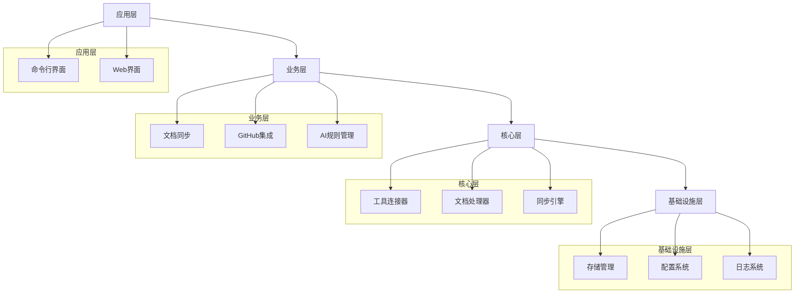
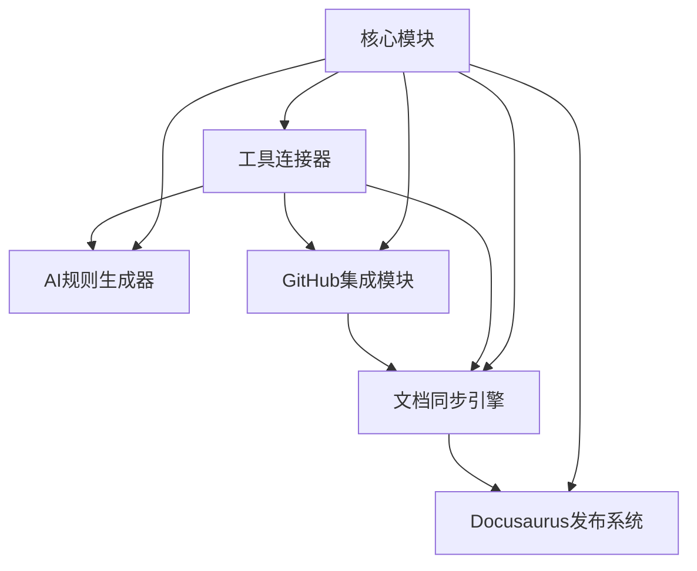

# VibeCopilot 模块设计规范

> **文档元数据**
> 版本: 1.0
> 上次更新: 2024-04-19
> 负责人: 系统架构团队

## 1. 模块架构总览

VibeCopilot采用分层架构设计，确保职责分离和模块间低耦合，提高代码可维护性和可扩展性。

### 1.1 架构分层



### 1.2 核心模块关系图



## 2. 模块设计原则

### 2.1 职责分离原则

1. **单一职责**：每个模块只负责系统的一个方面
2. **接口与实现分离**：所有模块通过接口暴露功能，隐藏实现细节
3. **分层职责**：
   - 应用层：负责用户交互和展示
   - 业务层：实现业务逻辑
   - 核心层：提供核心功能
   - 基础设施层：提供底层支持

### 2.2 模块间通信原则

1. **依赖注入**：模块通过依赖注入解耦
2. **事件驱动**：通过事件总线解耦异步操作
3. **统一接口**：所有模块遵循统一的接口约定
4. **最小知识**：模块只与直接相关的模块通信

### 2.3 扩展设计原则

1. **插件化**：核心功能通过插件机制扩展
2. **配置驱动**：通过配置改变行为，避免硬编码
3. **适配器模式**：外部工具集成通过适配器实现

## 3. 核心模块设计

### 3.1 核心引擎模块

作为连接其他模块的中央协调器，处理模块间通信和生命周期管理。

**职责：**

- 模块注册与发现
- 模块生命周期管理
- 全局事件分发
- 统一配置管理

**关键接口：**

```typescript
interface CoreEngine {
  // 模块注册
  registerModule(moduleId: string, module: Module): void;

  // 获取模块实例
  getModule<T extends Module>(moduleId: string): T;

  // 发布事件
  publishEvent(eventType: string, payload: any): void;

  // 订阅事件
  subscribeToEvent(eventType: string, handler: EventHandler): Subscription;

  // 获取配置
  getConfig(configPath: string): any;
}

interface Module {
  // 模块初始化
  initialize(): Promise<void>;

  // 模块启动
  start(): Promise<void>;

  // 模块停止
  stop(): Promise<void>;

  // 获取模块状态
  getStatus(): ModuleStatus;
}
```

### 3.2 文档同步引擎模块

负责在不同系统间同步文档内容，确保一致性。

**职责：**

- 文档变更监控
- 双向同步逻辑实现
- 冲突检测与解决
- 格式转换与兼容性处理

**关键接口：**

```typescript
interface DocumentSyncEngine extends Module {
  // 同步特定文档
  syncDocument(docPath: string, direction: SyncDirection): Promise<SyncResult>;

  // 检测并处理变更
  detectAndProcessChanges(): Promise<ChangeResult[]>;

  // 解决冲突
  resolveConflict(conflict: SyncConflict, resolution: Resolution): Promise<void>;

  // 获取同步状态
  getSyncStatus(docPath: string): Promise<SyncStatus>;
}

interface DocumentTransformer {
  // 格式转换
  transform(doc: Document, targetFormat: DocumentFormat): Document;

  // 内容合并
  mergeDocuments(base: Document, local: Document, remote: Document): Document;

  // 检测冲突
  detectConflicts(local: Document, remote: Document): Conflict[];
}
```

### 3.3 AI规则生成器模块

管理AI交互规则，实现高效的AI辅助开发。

**职责：**

- 规则模板管理
- 自定义规则生成
- 规则验证与优化
- 规则部署与应用

**关键接口：**

```typescript
interface AIRuleGenerator extends Module {
  // 获取规则模板
  getTemplate(category: string, taskType: string): Promise<Template>;

  // 生成自定义代理规则
  generateRule(template: Template, variables: Record<string, string>): Promise<Rule>;

  // 验证规则有效性
  validateRule(rule: Rule): Promise<ValidationResult>;

  // 部署规则到Cursor
  deployToCursor(rule: Rule): Promise<DeployResult>;
}

interface RuleRepository {
  // 保存规则
  saveRule(rule: Rule): Promise<string>;

  // 获取规则
  getRule(ruleId: string): Promise<Rule>;

  // 查询规则
  queryRules(filter: RuleFilter): Promise<Rule[]>;

  // 删除规则
  deleteRule(ruleId: string): Promise<boolean>;
}
```

### 3.4 GitHub集成模块

提供与GitHub深度集成的能力，实现项目管理和文档同步。

**职责：**

- GitHub API交互
- 文档与Issues关联
- 项目结构分析
- 路线图与报告生成

**关键接口：**

```typescript
interface GitHubIntegration extends Module {
  // 关联文档与Issue
  linkDocumentToIssue(docPath: string, issueNumber: number): Promise<void>;

  // 从文档创建Issue
  createIssueFromDocument(docPath: string): Promise<number>;

  // 分析仓库结构
  analyzeRepository(owner: string, repo: string): Promise<RepositoryAnalysis>;

  // 生成项目路线图
  generateRoadmap(owner: string, repo: string): Promise<Roadmap>;
}

interface GitHubAPIClient {
  // 获取Issue详情
  getIssue(owner: string, repo: string, number: number): Promise<Issue>;

  // 创建Issue
  createIssue(owner: string, repo: string, data: IssueData): Promise<Issue>;

  // 获取仓库内容
  getRepositoryContent(owner: string, repo: string, path: string): Promise<Content>;

  // 获取仓库结构
  getRepositoryStructure(owner: string, repo: string): Promise<RepoStructure>;
}
```

### 3.5 工具连接器模块

负责与外部工具的连接与通信，是VibeCopilot整合能力的核心。

**职责：**

- 工具发现与连接
- 统一适配器管理
- 工具状态监控
- 连接配置管理

**关键接口：**

```typescript
interface ToolConnector extends Module {
  // 连接工具
  connectTool(type: ToolType, config: ToolConfig): Promise<boolean>;

  // 获取工具状态
  getToolStatus(type: ToolType): Promise<ToolStatus>;

  // 监听工具状态变化
  watchToolStatus(type: ToolType): Observable<ToolStatus>;

  // 获取适配器实例
  getAdapter<T extends ToolAdapter>(type: ToolType): T;
}

interface ToolAdapter {
  // 连接工具
  connect(config: ToolConfig): Promise<boolean>;

  // 执行操作
  execute<T>(action: string, params: any): Promise<T>;

  // 断开连接
  disconnect(): Promise<void>;

  // 获取连接状态
  getConnectionStatus(): ToolStatus;
}
```

### 3.6 Docusaurus发布系统模块

负责将内部文档转换为公开可访问的项目手册和最佳实践库。

**职责：**

- 内容筛选与敏感信息移除
- 格式转换与优化
- 站点结构生成
- 部署与更新管理

**关键接口：**

```typescript
interface DocusaurusPublisher extends Module {
  // 筛选适合公开的内容
  filterContent(docs: Document[]): Document[];

  // 转换为Docusaurus格式
  convertToDocusaurus(doc: Document): DocusaurusContent;

  // 生成站点结构
  generateSiteStructure(docs: Document[]): SiteStructure;

  // 部署站点
  deploySite(contents: DocusaurusContent[]): Promise<DeployResult>;
}

interface ContentProcessor {
  // 处理敏感信息
  processSensitiveInfo(content: string): string;

  // 优化内容格式
  optimizeContent(content: string): string;

  // 处理内部链接
  processInternalLinks(content: string, linkMap: Map<string, string>): string;

  // 生成SEO友好的元数据
  generateMetadata(doc: Document): Metadata;
}
```

## 4. 基础设施模块设计

### 4.1 存储管理模块

提供统一的数据存储抽象，支持不同存储后端。

**职责：**

- 配置存储
- 文档缓存
- 元数据存储
- 规则仓库

**关键接口：**

```typescript
interface StorageManager extends Module {
  // 获取存储实例
  getStorage<T extends Storage>(storageType: StorageType): T;

  // 注册存储实例
  registerStorage(storageType: StorageType, storage: Storage): void;
}

interface Storage {
  // 存储数据
  store(key: string, value: any): Promise<void>;

  // 检索数据
  retrieve(key: string): Promise<any>;

  // 删除数据
  delete(key: string): Promise<boolean>;

  // 查询数据
  query(filter: any): Promise<any[]>;
}
```

### 4.2 配置系统模块

管理全局和模块配置，支持不同配置源。

**职责：**

- 配置加载与解析
- 配置验证
- 配置变更管理
- 环境特定配置

**关键接口：**

```typescript
interface ConfigurationSystem extends Module {
  // 获取配置值
  get<T>(path: string, defaultValue?: T): T;

  // 设置配置值
  set<T>(path: string, value: T): void;

  // 监听配置变更
  watch(path: string, handler: ConfigChangeHandler): Subscription;

  // 重新加载配置
  reload(): Promise<void>;
}

interface ConfigProvider {
  // 加载配置
  load(): Promise<ConfigData>;

  // 保存配置
  save(data: ConfigData): Promise<void>;

  // 验证配置
  validate(data: ConfigData): ValidationResult;
}
```

### 4.3 日志系统模块

提供统一的日志记录和管理功能。

**职责：**

- 多级别日志记录
- 不同输出目标支持
- 日志过滤与格式化
- 日志分析

**关键接口：**

```typescript
interface LoggingSystem extends Module {
  // 获取特定模块的日志器
  getLogger(moduleName: string): Logger;
}

interface Logger {
  // 记录调试信息
  debug(message: string, ...args: any[]): void;

  // 记录信息
  info(message: string, ...args: any[]): void;

  // 记录警告
  warn(message: string, ...args: any[]): void;

  // 记录错误
  error(message: string, error?: Error, ...args: any[]): void;
}
```

## 5. 模块间通信机制

VibeCopilot采用多种通信机制，确保模块间低耦合、高内聚的通信。

### 5.1 事件总线

提供发布/订阅模式的事件总线，用于模块间异步通信。

```typescript
interface EventBus {
  // 发布事件
  publish(eventType: string, payload: any): void;

  // 订阅事件
  subscribe(eventType: string, handler: EventHandler): Subscription;

  // 取消订阅
  unsubscribe(subscription: Subscription): void;
}

interface Subscription {
  // 取消订阅
  unsubscribe(): void;

  // 是否活跃
  isActive(): boolean;
}

type EventHandler = (eventType: string, payload: any) => void;
```

### 5.2 依赖注入

使用依赖注入容器管理模块依赖，实现松耦合的模块组合。

```typescript
interface DependencyContainer {
  // 注册依赖
  register<T>(token: symbol | string, implementation: Constructor<T> | T): void;

  // 解析依赖
  resolve<T>(token: symbol | string): T;

  // 创建对象及其依赖
  createInstance<T>(ctor: Constructor<T>): T;
}

interface Inject {
  // 装饰器：标记需注入的依赖
  (token: symbol | string): ParameterDecorator;
}
```

### 5.3 命令模式

用于模块间的请求-响应通信，特别是跨层通信时。

```typescript
interface CommandBus {
  // 注册命令处理器
  registerHandler<T extends Command>(
    commandType: Constructor<T>,
    handler: CommandHandler<T>
  ): void;

  // 执行命令
  execute<T extends Command, R = any>(command: T): Promise<R>;
}

interface Command {
  readonly type: string;
}

interface CommandHandler<T extends Command, R = any> {
  // 处理命令
  handle(command: T): Promise<R>;
}
```

## 6. 插件系统设计

VibeCopilot采用插件架构，支持功能扩展和自定义。

### 6.1 插件注册机制

```typescript
interface PluginSystem extends Module {
  // 注册插件
  registerPlugin(plugin: Plugin): void;

  // 加载插件
  loadPlugin(pluginPath: string): Promise<Plugin>;

  // 获取已注册插件
  getRegisteredPlugins(): Plugin[];

  // 启用/禁用插件
  setPluginEnabled(pluginId: string, enabled: boolean): Promise<void>;
}

interface Plugin {
  // 插件元数据
  readonly metadata: PluginMetadata;

  // 插件初始化
  initialize(context: PluginContext): Promise<void>;

  // 插件启动
  start(): Promise<void>;

  // 插件停止
  stop(): Promise<void>;
}

interface PluginMetadata {
  id: string;
  name: string;
  version: string;
  description: string;
  author: string;
  dependencies: string[];
}
```

### 6.2 扩展点系统

```typescript
interface ExtensionPointRegistry {
  // 注册扩展点
  registerExtensionPoint<T>(pointId: string, schema: ExtensionPointSchema): void;

  // 添加扩展
  addExtension<T>(pointId: string, extension: T): void;

  // 获取扩展
  getExtensions<T>(pointId: string): T[];

  // 验证扩展
  validateExtension<T>(pointId: string, extension: T): ValidationResult;
}

interface ExtensionPointSchema {
  properties: Record<string, PropertySchema>;
  required: string[];
}

interface PropertySchema {
  type: string;
  description: string;
  default?: any;
  enum?: any[];
}
```

## 7. 模块实现路径

VibeCopilot的模块实现将遵循以下原则和顺序：

1. **核心层**
   - 核心引擎
   - 基础设施模块（配置、日志、存储）
   - 模块通信机制

2. **工具连接层**
   - 工具连接器
   - 基础适配器（本地文件系统）
   - 核心工具适配器（Cursor、Obsidian）

3. **功能层**
   - 文档同步引擎
   - GitHub集成模块
   - AI规则生成器

4. **应用层**
   - CLI应用
   - Web界面
   - Docusaurus发布系统

5. **插件扩展**
   - 插件系统
   - 核心插件
   - 示例插件

## 8. 模块依赖矩阵

| 模块 | 核心引擎 | 工具连接器 | 文档同步 | AI规则 | GitHub集成 | Docusaurus |
|------|---------|------------|---------|--------|-----------|------------|
| 核心引擎 | - | ✓ | ✓ | ✓ | ✓ | ✓ |
| 工具连接器 | 依赖 | - | ✓ | ✓ | ✓ | ✓ |
| 文档同步 | 依赖 | 依赖 | - | ○ | ✓ | ✓ |
| AI规则 | 依赖 | 依赖 | ○ | - | ○ | ○ |
| GitHub集成 | 依赖 | 依赖 | ✓ | ○ | - | ○ |
| Docusaurus | 依赖 | 依赖 | 依赖 | ○ | ○ | - |

- ✓ 表示强依赖
- ○ 表示弱依赖/可选依赖
- 依赖 表示单向依赖

## 9. 技术债务追踪

| 模块 | 技术债务 | 优先级 | 预计工作量 | 状态 |
|------|---------|--------|-----------|------|
| 文档同步引擎 | 冲突解决策略需优化 | 中 | 3天 | 待解决 |
| GitHub集成 | 需支持GitLab/Gitee | 低 | 5天 | 计划中 |
| AI规则生成器 | 支持更多AI模型 | 中 | 4天 | 待解决 |
| 工具连接器 | VS Code集成 | 低 | 3天 | 未规划 |
| Docusaurus发布 | 自定义主题支持 | 低 | 2天 | 未规划 |

> **相关文档**
>
> - [系统架构概览](4_architecture.md)
> - [功能设计文档](5_functions.md)
> - [技术栈文档](7_Tech_Stack.md)
> - [接口规范](9_api_spec.md)
