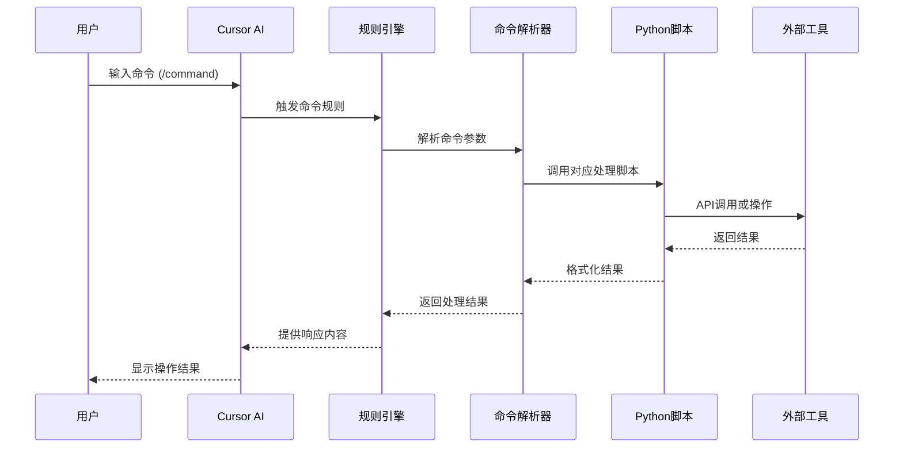
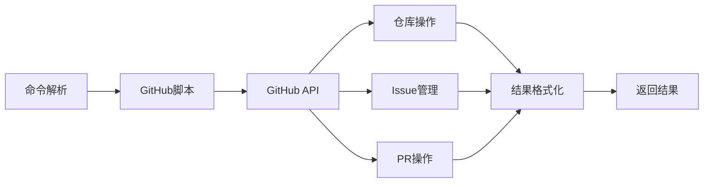
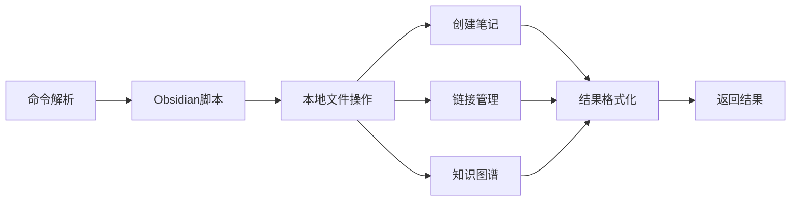
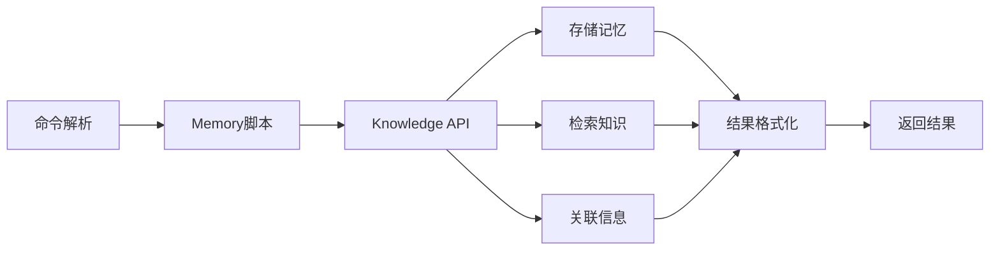
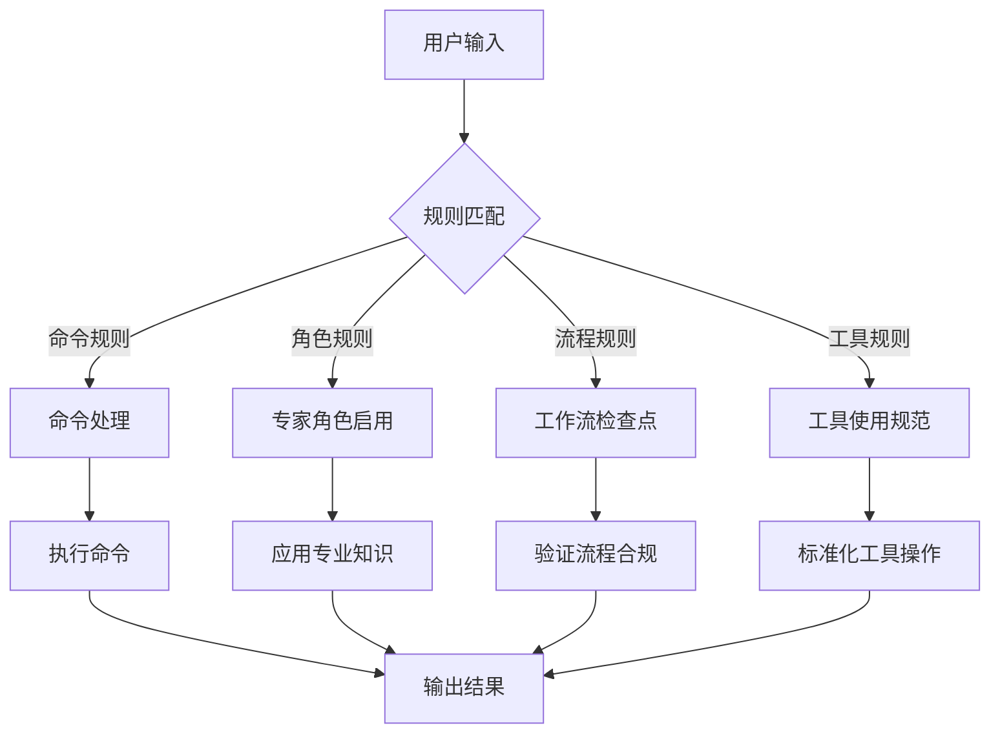

# VibeCopilot 工作流程

> **文档元数据**
> 版本: 2.0
> 上次更新: 2024-04-25
> 负责人: 技术架构团队

## 1. 命令处理流程

VibeCopilot的核心工作流基于规则驱动的命令处理模式，实现与多种工具的轻量级集成：



## 2. 工具集成流程

VibeCopilot通过轻量级脚本实现与外部工具的无缝集成：

### 2.1 GitHub集成流程



### 2.2 Obsidian集成流程



### 2.3 Basic Memory集成流程



## 3. 规则驱动流程

VibeCopilot使用分层规则系统驱动所有操作：



## 4. 开发工作流程

VibeCopilot支持的开发流程，基于规则和命令：

### 4.1 功能开发流程

1. **需求阶段**
   - 使用`/story`命令创建用户故事
   - 生成并审批PRD文档
   - 确认范围和验收标准

2. **规划阶段**
   - 使用`/plan`命令制定开发计划
   - 设计技术方案
   - 任务分解和排序

3. **实现阶段**
   - 使用`/task`命令管理开发任务
   - 遵循TDD流程进行开发
   - 使用`/branch`命令管理分支

4. **验证阶段**
   - 使用`/check`命令验证代码质量
   - 执行测试和审核
   - 确保文档完整

5. **发布阶段**
   - 使用`/update`命令更新项目状态
   - 完成变更记录
   - 合并到主分支

## 5. 用户交互场景

### 5.1 标准命令工作流

```mermaid
flowchart LR
    A[开始] --> B[/help命令]
    B --> C[/plan命令]
    C --> D[/task命令]
    D --> E[编码实现]
    E --> F[/check命令]
    F --> G[/update命令]
    G --> H[下一任务]
    H --> D
```

### 5.2 跨工具协作流

1. **知识管理**
   - 使用`/memory`命令存储关键信息
   - 将代码设计记录到Obsidian
   - 与团队共享最佳实践

2. **项目管理**
   - 在GitHub创建Issues
   - 关联文档与代码
   - 自动化状态同步

3. **开发辅助**
   - 使用规则驱动的AI辅助
   - 标准化提示词模板
   - 保持上下文连贯性

## 6. 工作流配置

VibeCopilot工作流通过配置文件和环境变量管理：

```json
{
  "workflow": {
    "commands": {
      "enabled": ["help", "memory", "plan", "task", "check", "update"],
      "default_prefix": "/"
    },
    "integrations": {
      "github": true,
      "obsidian": true,
      "basic_memory": true
    },
    "checkpoints": {
      "prd_approval": true,
      "code_review": true,
      "test_coverage": true
    }
  }
}
```

> 注：VibeCopilot的工作流程基于轻量级规则和脚本实现，可根据项目需求灵活调整。详细规则定义请参阅规则目录，具体命令用法请使用`/help`命令查看。
