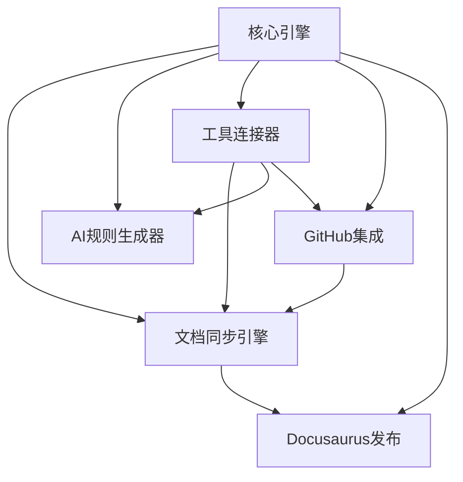

# VibeCopilot 项目结构规范

> **文档元数据**
> 版本: 1.1
> 上次更新: 2024-04-20
> 负责人: 系统架构团队

## 1. 基于模块设计的目录结构

根据功能设计和模块设计文档，VibeCopilot项目采用以下标准化目录结构：

```
/VibeCopilot
├── src                      # 源代码
│   ├── core                 # 核心引擎模块
│   │   ├── engine.ts        # 核心引擎实现
│   │   ├── events.ts        # 事件总线
│   │   ├── plugin.ts        # 插件系统
│   │   └── interfaces.ts    # 公共接口定义
│   ├── document_sync        # 文档同步引擎模块
│   │   ├── sync_engine.ts   # 同步引擎实现
│   │   ├── transformer.ts   # 文档转换器
│   │   ├── conflict.ts      # 冲突检测与解决
│   │   └── interfaces.ts    # 模块接口定义
│   ├── ai_rules             # AI规则生成器模块
│   │   ├── generator.ts     # 规则生成器
│   │   ├── templates/       # 规则模板
│   │   ├── validator.ts     # 规则验证器
│   │   └── interfaces.ts    # 模块接口定义
│   ├── github               # GitHub集成模块
│   │   ├── client.ts        # GitHub API客户端
│   │   ├── linking.ts       # 文档与Issues关联
│   │   ├── analyzer.ts      # 仓库分析器
│   │   └── interfaces.ts    # 模块接口定义
│   ├── tool_connector       # 工具连接器模块
│   │   ├── connector.ts     # 连接器实现
│   │   ├── adapters/        # 工具适配器
│   │   ├── monitors.ts      # 工具状态监控
│   │   └── interfaces.ts    # 模块接口定义
│   ├── docusaurus           # Docusaurus发布系统模块
│   │   ├── publisher.ts     # 发布器实现
│   │   ├── filter.ts        # 内容筛选器
│   │   ├── converter.ts     # 格式转换器
│   │   └── interfaces.ts    # 模块接口定义
│   └── infrastructure       # 基础设施层
│       ├── storage/         # 存储管理
│       ├── config/          # 配置系统
│       ├── logging/         # 日志系统
│       └── interfaces.ts    # 基础设施接口
├── modules                  # 集成的开源模块
│   ├── cursor-custom-agents # AI规则生成库
│   │   ├── wrappers/        # 封装层
│   │   └── extensions/      # 扩展功能
│   ├── gitdiagram           # Git可视化库
│   │   ├── wrappers/        # 封装层
│   │   └── extensions/      # 扩展功能
│   ├── obsidiosaurus        # 文档系统集成
│   │   ├── wrappers/        # 封装层
│   │   └── extensions/      # 扩展功能
│   └── octokit              # GitHub API集成
│       ├── wrappers/        # 封装层
│       └── extensions/      # 扩展功能
├── docs                     # 项目文档
│   ├── ai                   # AI专用文档
│   ├── dev                  # 开发者文档
│   ├── shared               # 共享文档
│   └── user                 # 用户文档
├── scripts                  # 工具脚本
├── tests                    # 测试代码
├── config                   # 配置文件
└── website                  # 项目网站
```

## 2. 模块与文件对应关系

### 核心引擎模块

根据模块设计中的`CoreEngine`接口实现：

```typescript
// src/core/interfaces.ts
interface CoreEngine {
  registerModule(moduleId: string, module: Module): void;
  getModule<T extends Module>(moduleId: string): T;
  publishEvent(eventType: string, payload: any): void;
  subscribeToEvent(eventType: string, handler: EventHandler): Subscription;
  getConfig(configPath: string): any;
}

// src/core/engine.ts
class CoreEngineImpl implements CoreEngine {
  private modules = new Map<string, Module>();
  private eventBus: EventBus;
  private configSystem: ConfigurationSystem;

  constructor(eventBus: EventBus, configSystem: ConfigurationSystem) {
    this.eventBus = eventBus;
    this.configSystem = configSystem;
  }

  // 实现接口方法...
}
```

### 文档同步引擎模块

根据模块设计中的`DocumentSyncEngine`接口实现：

```typescript
// src/document_sync/interfaces.ts
interface DocumentSyncEngine extends Module {
  syncDocument(docPath: string, direction: SyncDirection): Promise<SyncResult>;
  detectAndProcessChanges(): Promise<ChangeResult[]>;
  resolveConflict(conflict: SyncConflict, resolution: Resolution): Promise<void>;
  getSyncStatus(docPath: string): Promise<SyncStatus>;
}

// src/document_sync/sync_engine.ts
class DocumentSyncEngineImpl implements DocumentSyncEngine {
  private transformer: DocumentTransformer;
  private toolConnector: ToolConnector;

  // 实现接口方法...
}
```

## 3. 模块封装策略

### 适配器模式实现

对外部工具的集成采用适配器模式，提供统一接口：

```typescript
// src/tool_connector/adapters/cursor_adapter.ts
class CursorAdapter implements ToolAdapter {
  connect(config: ToolConfig): Promise<boolean> {
    // 实现与Cursor的连接逻辑
  }

  execute<T>(action: string, params: any): Promise<T> {
    // 实现对Cursor的操作执行
  }

  // 实现其他接口方法...
}

// src/tool_connector/adapters/obsidian_adapter.ts
class ObsidianAdapter implements ToolAdapter {
  // 实现Obsidian适配器...
}
```

### 外部库封装示例

```typescript
// modules/cursor-custom-agents/wrappers/rule_generator.ts
import { generateRule as originalGenerateRule } from 'cursor-custom-agents-rules-generator';

export class RuleGeneratorWrapper {
  generateRule(template: Template, variables: Record<string, string>): Promise<Rule> {
    // 对原始库的封装与扩展
    const baseRule = await originalGenerateRule(template.id, variables);
    return this.enhanceRule(baseRule);
  }

  private enhanceRule(rule: any): Rule {
    // 添加VibeCopilot特有的增强
    return {
      ...rule,
      metadata: {
        source: 'VibeCopilot',
        version: '1.0',
        generatedAt: new Date().toISOString()
      }
    };
  }
}
```

## 4. 主要模块依赖关系

各模块间依赖关系参照模块设计文档中的依赖矩阵：



## 5. 命名与组织规范

### 命名约定

1. **接口命名**: `I`前缀或描述性名称，如`DocumentSyncEngine`
2. **实现类命名**: 接口名+`Impl`后缀，如`DocumentSyncEngineImpl`
3. **文件命名**:
   - TypeScript: 小驼峰，如`syncEngine.ts`
   - 目录名: 小写下划线，如`document_sync`
4. **常量命名**: 大写下划线，如`DEFAULT_SYNC_INTERVAL`

### 模块内部结构

每个功能模块保持一致的内部结构：

1. **接口定义文件**: `interfaces.ts`
2. **核心实现文件**: 功能名+`.ts`
3. **工具文件**: `utils.ts`
4. **类型定义**: `types.ts`
5. **测试文件**: 源文件名+`.spec.ts`

## 6. 开发流程与模块关系

新功能开发流程遵循以下顺序，确保与项目结构一致：

1. 在核心层定义接口
2. 在业务层实现功能
3. 在适配器层连接外部工具
4. 在应用层提供用户界面

这种结构确保了VibeCopilot能够模块化地实现功能设计文档中定义的所有功能，同时保持代码的可维护性和可扩展性。
