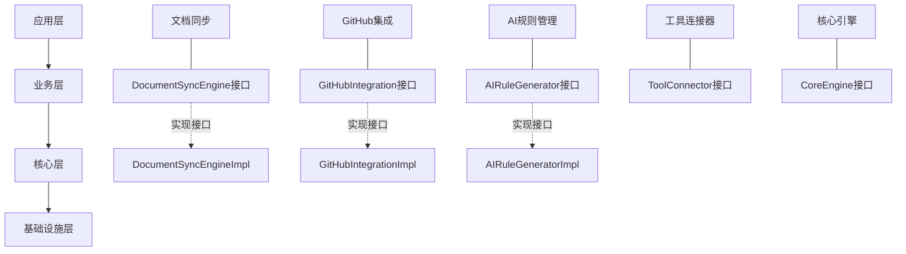

# VibeCopilot 功能模块与初始设计对齐

> **文档元数据**
> 版本: 1.1
> 上次更新: 2024-04-20
> 负责人: 项目对齐团队

## 1. 核心功能模块与初始理念对应

根据功能设计和模块设计文档，VibeCopilot实现了以下核心模块，与初始理念的对应关系如下：

| 初始设计理念 | 对应功能模块 | 实现状态 |
|------------|------------|--------|
| 文档驱动开发 | 文档同步引擎 | P0，规划中 |
| AI辅助编程 | AI规则生成器 | P0，规划中 |
| 项目管理自动化 | GitHub集成模块 | P1，规划中 |
| 工具链集成 | 工具连接器 | P1，规划中 |
| 知识共享与传递 | Docusaurus发布系统 | P2，计划中 |

## 2. 系统架构与模块映射

VibeCopilot系统架构完全遵循模块设计中的分层架构：



## 3. 实现差距与优先级

### 3.1 优先级P0功能的实施路径

**文档同步引擎**:

- **核心功能**: 双向同步、变更检测、冲突解决
- **实现路径**: 基于`DocumentSyncEngine`接口实现
- **关键类**:
  - `DocumentSyncEngineImpl`: 主实现类
  - `DocumentTransformer`: 格式转换类
  - `ConflictResolver`: 冲突处理类

**AI规则生成器**:

- **核心功能**: 规则模板管理、规则生成、规则验证
- **实现路径**: 基于`AIRuleGenerator`接口实现
- **关键类**:
  - `AIRuleGeneratorImpl`: 主实现类
  - `RuleTemplateManager`: 模板管理类
  - `RuleValidator`: 规则验证类

### 3.2 优先级P1功能的实施路径

**GitHub集成模块**:

- **核心功能**: API交互、文档关联、仓库分析
- **实现路径**: 基于`GitHubIntegration`接口实现
- **关键类**:
  - `GitHubIntegrationImpl`: 主实现类
  - `GitHubAPIClient`: API客户端实现
  - `RepositoryAnalyzer`: 仓库分析类

**工具连接器**:

- **核心功能**: 工具发现与连接、状态监控
- **实现路径**: 基于`ToolConnector`接口实现
- **关键类**:
  - `ToolConnectorImpl`: 主实现类
  - `ToolAdapterRegistry`: 适配器注册类
  - `ToolStatusMonitor`: 状态监控类

## 4. 模块间关系与集成点

各模块通过三种关键机制集成：

1. **依赖注入**:

```typescript
// 依赖注入示例
class DocumentSyncEngineImpl implements DocumentSyncEngine {
  constructor(
    private toolConnector: ToolConnector,
    private transformer: DocumentTransformer,
    private eventBus: EventBus
  ) {}
}
```

2. **事件通信**:

```typescript
// 事件驱动通信示例
class GitHubIntegrationImpl implements GitHubIntegration {
  // 发布更新事件
  async createIssueFromDocument(docPath: string): Promise<number> {
    // 创建Issue逻辑...
    this.eventBus.publish("issue:created", { docPath, issueNumber });
    return issueNumber;
  }
}

// 文档同步引擎订阅事件
constructor() {
  this.eventBus.subscribe("issue:created", this.handleIssueCreated.bind(this));
}
```

3. **适配器模式**:

```typescript
// 工具适配器示例
interface ToolAdapter {
  connect(config: ToolConfig): Promise<boolean>;
  execute<T>(action: string, params: any): Promise<T>;
  disconnect(): Promise<void>;
}

class CursorAdapter implements ToolAdapter {
  // 实现适配器方法...
}
```

## 5. 技术债务管理

根据模块设计文档中的技术债务追踪，关键技术债务项与解决计划：

| 技术债务 | 关联模块 | 优先级 | 解决方案 |
|---------|---------|--------|---------|
| 冲突解决策略优化 | 文档同步引擎 | 中 | 实现三路合并算法 |
| 多平台支持(GitLab/Gitee) | GitHub集成 | 低 | 设计通用VCS适配器 |
| 支持更多AI模型 | AI规则生成器 | 中 | 实现模型抽象层 |
| VS Code集成 | 工具连接器 | 低 | 开发VS Code适配器 |

## 6. 下一步计划

基于功能模块的优先级和项目进展，接下来将：

1. **核心引擎实现**:
   - 完成事件总线实现
   - 实现插件系统基础框架
   - 开发配置管理功能

2. **文档同步引擎**:
   - 实现基本文件监控
   - 开发简单的同步算法
   - 建立文档模型

3. **AI规则生成器**:
   - 集成cursor-custom-agents库
   - 开发基础规则模板
   - 实现规则验证机制

此计划与功能设计文档的优先级和依赖关系完全一致，确保项目发展遵循预定路线。
