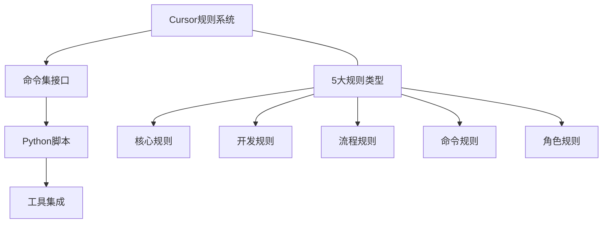

# VibeCopilot 工作流使用指南

> **文档元数据**
> 版本: 2.0
> 上次更新: 2024-04-25
> 负责人: 技术架构团队

## 1. VibeCopilot工作流概述

VibeCopilot提供基于规则驱动的AI辅助开发流程，通过命令集和规则系统实现高效且标准化的开发体验。本指南帮助开发者掌握VibeCopilot的核心工作流程和最佳实践。

### 1.1 工作流核心组件



### 1.2 工作项层次结构

```mermaid
graph TD
    A[史诗(Epic)] --> B[故事(Story)]
    B --> C[任务(Task)]
    C --> D[子任务(Subtask)]

    style A fill:#f9f,stroke:#333,stroke-width:2px
    style B fill:#dfd,stroke:#333,stroke-width:2px
    style C fill:#bbf,stroke:#333,stroke-width:2px
    style D fill:#ffd,stroke:#333,stroke-width:2px
```

## 2. 命令使用指南

VibeCopilot提供简洁统一的命令接口，所有命令以`/`前缀开始：

### 2.1 常用命令

| 命令 | 用途 | 使用场景 |
|-----|-----|---------|
| `/help` | 获取命令帮助 | 不确定如何使用命令时 |
| `/memory` | 知识存储和检索 | 保存重要信息或检索过去内容时 |
| `/plan` | 创建开发计划 | 开始新功能开发前 |
| `/task` | 管理开发任务 | 分解、分配和跟踪任务时 |
| `/check` | 代码和流程检查 | 提交前检查代码质量和流程合规性 |
| `/story` | 故事管理 | 创建、更新用户故事时 |
| `/branch` | 分支管理 | 创建或切换功能分支时 |
| `/update` | 状态更新 | 更新开发进度和项目状态时 |

### 2.2 命令使用示例

```
# 创建计划
/plan create "实现用户认证功能" --priority high

# 创建任务
/task add "设计数据模型" --plan "实现用户认证功能" --assignee "开发者"

# 检查代码
/check code ./src/auth.py

# 创建用户故事
/story create "作为用户，我希望能通过邮箱重置密码"

# 创建分支
/branch create feature/user-auth
```

## 3. 开发工作流最佳实践

### 3.1 需求与规划阶段

1. **创建清晰的用户故事**
   - 使用`/story`命令创建结构化用户故事
   - 确保包含验收标准
   - 与相关利益方确认需求

2. **制定详细计划**
   - 使用`/plan`命令创建开发计划
   - 分解为可管理的任务
   - 设置优先级和时间线

### 3.2 实现阶段

1. **任务管理**
   - 使用`/task`命令管理和更新任务状态
   - 一次专注于一个任务
   - 定期提交代码并记录进度

2. **分支策略**
   - 使用`/branch`命令创建功能分支
   - 保持分支与特定任务的关联
   - 经常从主分支同步更新

3. **测试驱动开发**
   - 先编写测试，再实现功能
   - 使用`/check`命令验证测试覆盖率
   - 确保所有测试通过后再提交

### 3.3 验证与发布阶段

1. **代码审查**
   - 使用`/check`命令执行预审查
   - 确保代码符合项目规范
   - 解决所有高优先级问题

2. **知识记录**
   - 使用`/memory`命令记录关键设计决策
   - 更新文档反映最新实现
   - 记录经验教训供团队参考

3. **状态更新**
   - 使用`/update`命令更新开发状态
   - 记录完成的功能和遗留问题
   - 准备下一阶段工作

## 4. 工具集成最佳实践

### 4.1 GitHub集成

1. **高效Issue管理**
   - 使用`/memory`将讨论保存为GitHub issue
   - 保持代码提交与issue的关联
   - 通过提交消息自动更新issue状态

2. **PR规范**
   - PR标题遵循约定式提交规范
   - 包含相关文档链接
   - 使用模板确保PR质量

### 4.2 Obsidian集成

1. **知识管理**
   - 将重要文档同步到Obsidian
   - 使用图谱功能查看知识关联
   - 建立项目知识库结构

2. **文档组织**
   - 按功能模块组织文档
   - 使用标签提高可发现性
   - 定期整理和更新内容

### 4.3 Basic Memory集成

1. **长期记忆存储**
   - 保存关键上下文和决策
   - 创建链接以关联相关内容
   - 使用标签便于后续检索

2. **知识检索**
   - 使用语义搜索找到相关内容
   - 利用上下文优化搜索结果
   - 在新会话开始时恢复关键上下文

## 5. 与Cursor AI协作最佳实践

### 5.1 高效提示技巧

1. **提供清晰上下文**
   - 明确任务目标和约束
   - 引用相关文件或章节
   - 指明期望的输出格式

2. **步骤分解**
   - 将复杂任务分解为小步骤
   - 一次专注于一个子问题
   - 在解决方案间建立连接

3. **反馈循环**
   - 提供具体反馈而非泛泛评价
   - 指出需要改进的具体部分
   - 解释为什么某些建议不适用

### 5.2 规则驱动开发

1. **使用专家角色**
   - 根据任务需求选择合适的专家角色
   - 使用`/help role`命令查看可用角色
   - 指明任务背景以优化角色表现

2. **流程检查点**
   - 在关键阶段使用`/check`命令
   - 遵循流程规则中的强制检查点
   - 记录并解决任何流程违规

### 5.3 持续记忆维护

1. **会话管理**
   - 使用简短、聚焦的会话
   - 在任务完成后使用`/memory save`保存关键内容
   - 开始新会话时使用`/memory load`恢复上下文

2. **知识结构化**
   - 按功能、模块组织知识
   - 创建链接建立知识网络
   - 定期审查和整理知识库

## 6. 故障排除指南

### 6.1 常见问题与解决方案

| 问题 | 可能原因 | 解决方案 |
|-----|---------|---------|
| 命令无响应 | 命令格式错误 | 使用`/help <命令>`查看正确用法 |
| 工具集成失败 | 配置或权限问题 | 检查环境变量和配置文件 |
| 规则冲突 | 多个规则同时应用 | 检查规则优先级和触发条件 |
| 命令执行错误 | 脚本问题 | 查看日志并修复对应脚本 |
| 记忆检索失败 | 搜索条件不精确 | 尝试使用不同关键词或标签 |

### 6.2 性能优化

1. **命令响应速度**
   - 使用明确的参数减少解析时间
   - 限制API请求范围和频率
   - 使用缓存减少重复操作

2. **会话管理**
   - 定期结束长会话，开始新会话
   - 只加载必要的上下文
   - 使用更精确的记忆检索

> **提示**：本指南旨在提供VibeCopilot工作流的最佳实践，实际使用时应根据项目特点和团队习惯进行调整。如有特殊需求，可以通过编写自定义规则和脚本进行扩展。🚀
