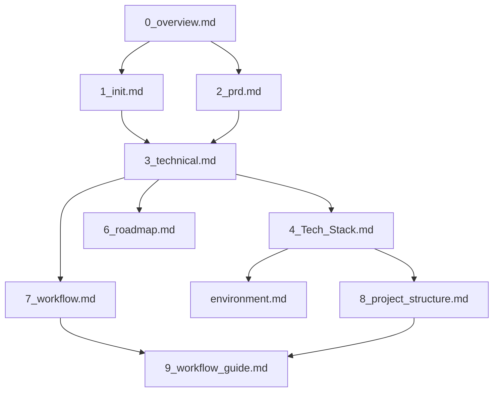

# VibeCopilot 文档使用指南

> **文档元数据**
> 版本: 2.0
> 上次更新: 2024-04-25
> 负责人: 文档架构团队

本文档明确定义VibeCopilot项目架构文档的使用范围、适用场景和主要受众，帮助团队成员理解不同文档的定位和用途。

## 1. 架构文档体系概览

VibeCopilot项目采用结构化的文档体系，按照从概念到实现的顺序组织：

| 文档序号 | 文档名称 | 主要职责 | 主要受众 |
|---------|---------|---------|---------|
| 0 | `0_overview.md` | 项目总体概述与价值定位 | 所有相关人员 |
| 1 | `1_init.md` | 项目白皮书，阐述背景与愿景 | 产品经理、技术负责人 |
| 2 | `2_prd.md` | 产品规范与实现路径 | 开发团队、产品经理 |
| 3 | `3_technical.md` | 技术实现与架构设计 | 开发人员、架构师 |
| 4 | `4_Tech_Stack.md` | 技术栈选择与依赖管理 | 开发人员、架构师 |
| 5 | `environment.md` | 开发环境配置指南 | 开发人员 |
| 6 | `6_roadmap.md` | 开发路线图与里程碑 | 项目经理、开发团队 |
| 7 | `7_workflow.md` | 工作流程定义与命令处理 | 开发人员、用户 |
| 8 | `8_project_structure.md` | 项目结构与代码组织 | 开发人员 |
| 9 | `9_workflow_guide.md` | 工作流使用指南与最佳实践 | 开发人员、用户 |

## 2. 核心文档使用指南

### 2.1 顶层文档

#### `0_overview.md`

- **使用范围**：项目初识和整体理解
- **主要内容**：
  - 项目定位和核心价值
  - 轻量级架构概览
  - 规则与脚本驱动方法
- **使用场景**：
  - 新成员快速了解项目
  - 项目介绍会议参考资料
  - 高层决策者了解项目范围
- **维护责任**：技术负责人
- **更新频率**：重大架构调整时更新

#### `1_init.md`

- **使用范围**：理解项目背景和解决方案
- **主要内容**：
  - 项目背景与面临的问题
  - 规则驱动的解决方案
  - 标准化流程的价值
  - 成果与实施效果
- **使用场景**：
  - 了解项目创立背景
  - 评估解决方案有效性
  - 项目推广与介绍
- **维护责任**：产品负责人
- **更新频率**：项目方向重大变更时更新

### 2.2 需求与技术文档

#### `2_prd.md`

- **使用范围**：产品规范与实现路径
- **主要内容**：
  - 开发背景与痛点分析
  - 规则驱动解决方案
  - 用户价值场景
  - 技术实现路径
  - 核心功能与特性
- **使用场景**：
  - 开发参考与决策依据
  - 功能实现指导
  - 项目范围控制
- **维护责任**：产品经理
- **更新频率**：产品规划变更时更新

#### `3_technical.md`

- **使用范围**：技术实现与架构设计
- **主要内容**：
  - 系统架构概述
  - 规则系统设计
  - 命令系统实现
  - 工具集成方法
  - 扩展机制说明
- **使用场景**：
  - 理解系统架构
  - 实现功能模块
  - 扩展系统功能
- **维护责任**：架构师
- **更新频率**：架构变更时更新

### 2.3 工程实施文档

#### `4_Tech_Stack.md`

- **使用范围**：技术栈选择与依赖管理
- **主要内容**：
  - Python作为主要语言的理由
  - MDC规则格式说明
  - 核心依赖列表
  - 工具集成技术
  - 环境要求
- **使用场景**：
  - 技术选型决策
  - 开发环境搭建
  - 依赖管理
- **维护责任**：技术架构团队
- **更新频率**：技术栈变更时更新

#### `environment.md`

- **使用范围**：开发环境配置
- **主要内容**：
  - 开发工具安装
  - 环境变量配置
  - 依赖安装指南
  - 开发工具集成
- **使用场景**：
  - 新成员入职
  - 环境搭建
  - 技术问题排查
- **维护责任**：开发负责人
- **更新频率**：环境需求变更时更新

#### `6_roadmap.md`

- **使用范围**：开发计划与资源规划
- **主要内容**：
  - 开发战略与目标
  - 版本规划与里程碑
  - 任务优先级
  - 资源分配
- **使用场景**：
  - 项目规划
  - 进度跟踪
  - 资源分配
- **维护责任**：项目经理
- **更新频率**：计划调整或里程碑达成时更新

### 2.4 工作流与使用文档

#### `7_workflow.md`

- **使用范围**：工作流程定义
- **主要内容**：
  - 命令处理流程
  - 工具集成流程
  - 规则驱动机制
  - 开发工作流程
  - 用户交互场景
- **使用场景**：
  - 理解系统工作原理
  - 开发新命令
  - 扩展工具集成
- **维护责任**：架构师
- **更新频率**：工作流程变更时更新

#### `8_project_structure.md`

- **使用范围**：项目结构与代码组织
- **主要内容**：
  - 目录结构说明
  - 规则系统组织
  - 脚本模块设计
  - 配置文件结构
  - 扩展指南
- **使用场景**：
  - 代码组织参考
  - 新文件创建位置决策
  - 模块实现位置确定
- **维护责任**：技术负责人
- **更新频率**：项目结构调整时更新

#### `9_workflow_guide.md`

- **使用范围**：工作流使用指南
- **主要内容**：
  - 命令使用方法
  - 开发最佳实践
  - 工具集成用法
  - AI协作技巧
  - 故障排除
- **使用场景**：
  - 日常工作参考
  - 工具使用培训
  - 问题解决
- **维护责任**：技术文档团队
- **更新频率**：功能更新或用户反馈时更新

## 3. 文档之间的关系

### 3.1 文档依赖关系

### 3.2 文档阅读路径

根据不同角色和目的，建议的文档阅读路径：

#### 1. 项目概览路径

对项目需要快速了解：`0_overview.md` → `1_init.md` → `2_prd.md`

#### 2. 开发实施路径

需要开始开发：`3_technical.md` → `4_Tech_Stack.md` → `environment.md` → `8_project_structure.md`

#### 3. 用户使用路径

需要使用系统：`7_workflow.md` → `9_workflow_guide.md`

#### 4. 项目管理路径

需要管理项目：`2_prd.md` → `6_roadmap.md`

## 4. 文档使用最佳实践

### 4.1 根据角色选择文档

- **产品经理**：`0_overview.md` → `1_init.md` → `2_prd.md` → `6_roadmap.md`
- **架构师**：`0_overview.md` → `3_technical.md` → `4_Tech_Stack.md` → `7_workflow.md`
- **开发人员**：`3_technical.md` → `4_Tech_Stack.md` → `environment.md` → `8_project_structure.md` → `9_workflow_guide.md`
- **项目经理**：`2_prd.md` → `6_roadmap.md`
- **新团队成员**：`0_overview.md` → `1_init.md` → 根据角色选择后续文档

### 4.2 文档更新原则

1. **同步更新**：当一个文档内容变更时，检查相关依赖文档是否需要同步更新
2. **版本标记**：重要更新应在文档元数据中更新版本号
3. **变更说明**：每次重要更新应在文件末尾添加变更记录
4. **保持一致**：所有文档应反映同一架构理念，确保轻量级规则驱动的一致性

### 4.3 问题定位指导

当遇到不同类型的问题，应参考的文档：

- **项目价值是什么**：参考 `0_overview.md` 和 `1_init.md`
- **功能应该做什么**：参考 `2_prd.md`
- **功能如何实现**：参考 `3_technical.md`
- **如何配置环境**：参考 `environment.md`
- **代码应该放在哪里**：参考 `8_project_structure.md`
- **如何使用命令**：参考 `9_workflow_guide.md`
- **开发流程是什么**：参考 `7_workflow.md`
- **什么时候完成**：参考 `6_roadmap.md`

## 5. 轻量级文档维护

VibeCopilot采用轻量级的文档维护方式，符合整体架构理念：

1. **按需更新**：文档按需更新，而非固定周期
2. **用户反馈驱动**：根据实际使用反馈调整文档
3. **核心优先**：优先保持核心文档的更新
4. **版本控制**：所有文档通过Git版本控制
5. **脚本辅助**：通过脚本帮助自动化更新索引和链接

---

本指南帮助团队成员理解和有效使用VibeCopilot架构文档体系，确保轻量级规则驱动的开发模式能够高效执行。如有问题，请联系文档架构团队。
