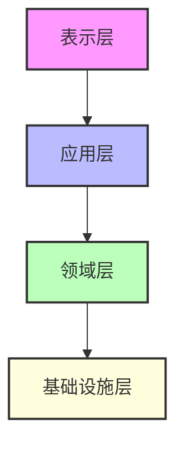
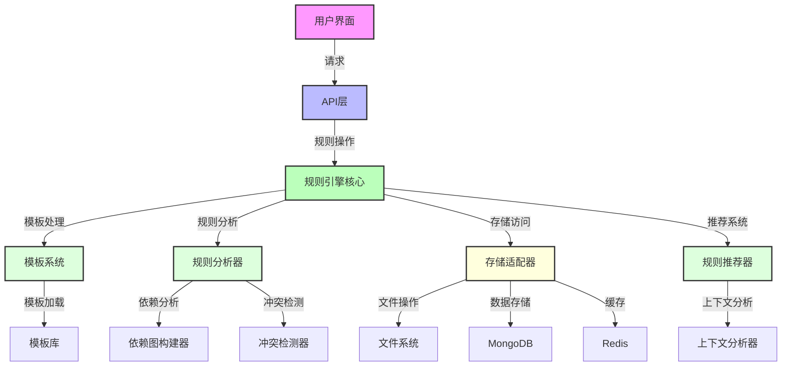
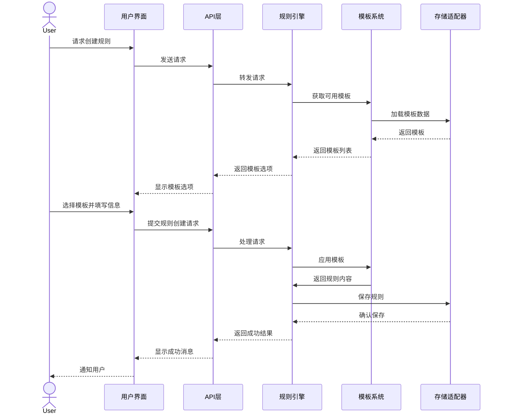
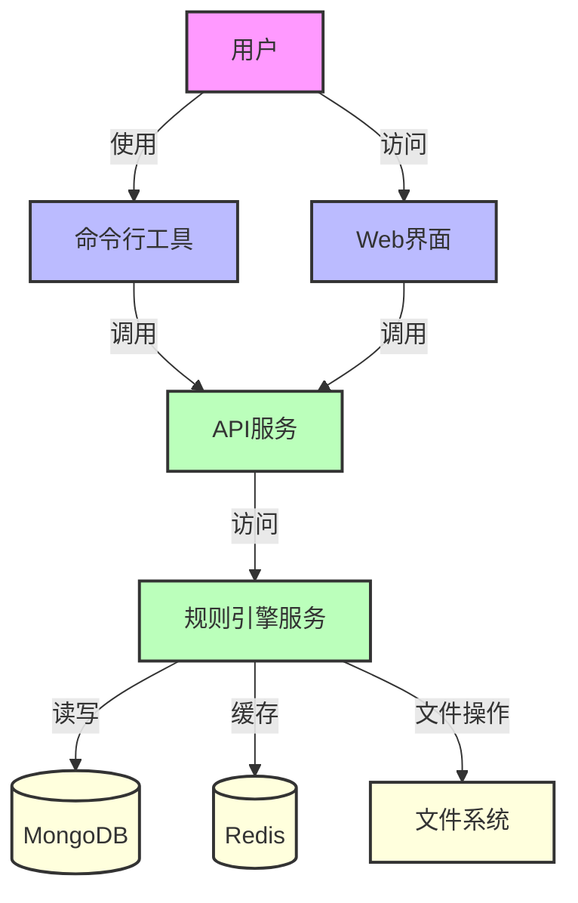

# 规则模板引擎系统架构

## 架构概述

规则模板引擎是一个模块化、可扩展的系统，设计用于生成、管理和应用Cursor规则。架构采用分层设计，清晰划分职责，确保系统的可维护性和扩展性。

## 系统分层

### 表示层

负责用户交互，包括命令行界面和Web UI。

### 应用层

协调领域对象和服务，实现业务用例。

### 领域层

包含核心业务逻辑和领域模型。

### 基础设施层

提供技术支持，包括数据持久化、外部服务集成等。

## 组件架构

## 主要组件职责

### 1. 规则引擎核心

作为系统中枢，协调各组件工作，实现规则的生成、分析和应用。

**关键职责**:

- 规则生命周期管理
- 组件间通信协调
- 业务流程编排
- 事件处理

### 2. 模板系统

管理规则模板，支持模板的创建、修改和应用。

**关键职责**:

- 模板加载和解析
- 模板验证
- 模板应用（将模板转换为规则）
- 模板版本管理

### 3. 规则分析器

分析规则内容，检测依赖关系和潜在冲突。

**关键职责**:

- 规则解析
- 依赖分析
- 冲突检测
- 规则验证

### 4. 存储适配器

提供统一的存储接口，支持多种存储后端。

**关键职责**:

- 文件系统操作
- 数据库交互
- 缓存管理
- 数据同步

### 5. 推荐系统

基于上下文提供规则推荐。

**关键职责**:

- 上下文分析
- 规则相关性评估
- 推荐生成
- 效果反馈收集

## 数据流

## 扩展点

系统设计了以下关键扩展点，支持未来功能扩展：

1. **存储后端接口**：允许添加新的存储实现
2. **模板解析器**：支持不同格式的模板
3. **规则分析策略**：可扩展的分析算法
4. **推荐算法插件**：可替换的推荐策略
5. **UI适配器**：支持不同的用户界面

## 部署架构

### 部署选项

1. **单体部署**：适合个人开发环境
2. **微服务部署**：适合团队协作环境
3. **云原生部署**：支持容器化和Kubernetes

## 安全考量

1. **访问控制**：基于角色的访问控制
2. **数据验证**：严格的输入验证
3. **审计日志**：操作记录和追踪
4. **版本控制**：防止意外更改

## 性能优化

1. **缓存策略**：多级缓存设计
2. **异步处理**：非阻塞操作
3. **批处理**：高效处理大量规则
4. **索引优化**：加速查询操作

## 技术债务管理

1. **版本兼容性**：确保向后兼容
2. **代码质量**：遵循最佳实践
3. **测试覆盖**：全面的测试用例
4. **文档维护**：保持文档更新

## 附录：组件依赖矩阵

| 组件 | 依赖组件 |
|------|---------|
| 用户界面 | API层 |
| API层 | 规则引擎核心 |
| 规则引擎核心 | 模板系统, 规则分析器, 存储适配器, 推荐系统 |
| 模板系统 | 存储适配器, 模板库 |
| 规则分析器 | 依赖图构建器, 冲突检测器 |
| 推荐系统 | 上下文分析器, 规则分析器 |
| 存储适配器 | 文件系统, MongoDB, Redis |
