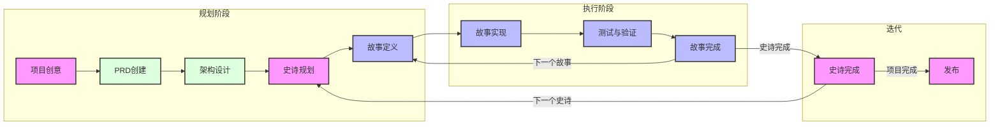

# Cursor敏捷工作流使用指南

本文档提供了与Cursor AI功能集成的敏捷工作流系统的完整说明。该工作流旨在通过结构化的开发方法，维持项目焦点和记忆，确保开发过程的一致性进展。

## 概述

Cursor-敏捷工作流将传统敏捷方法与AI辅助开发相结合，创造出高效强大的开发流程。它可以通过以下两种主要方式使用：

1. **基于规则的实现**（自动化）

   - 使用`.cursor/rules/workflows/workflow-agile-manual`和`.cursor/templates`
   - 自动对匹配的文件应用标准
   - 提供一致的结构执行

2. **基于记事本的实现**（灵活）
   - 使用`xnotes/`模板
   - 更轻量级且适应性更强
   - 适合专注的开发会话

## 工作项层次结构

```mermaid
graph TD
    E[史诗(Epic)] --> S[故事(Story)]
    S --> T[任务(Task)]
    T --> ST[子任务(Subtask)]

    style E fill:#f9f,stroke:#333,stroke-width:2px
    style S fill:#dfd,stroke:#333,stroke-width:2px
    style T fill:#bbf,stroke:#333,stroke-width:2px
    style ST fill:#ffd,stroke:#333,stroke-width:2px
```

1. **史诗(Epic)**

   - 大型、自包含的功能
   - 同一时间只能有一个活跃史诗
   - 示例："在线匹配系统"

2. **故事(Story)**

   - 较小的、可实现的工作单元
   - 必须属于一个史诗
   - 示例："用户资料创建"

3. **任务(Task)**

   - 技术实现步骤
   - 明确的完成标准
   - 示例："实现数据库架构"

4. **子任务(Subtask)**
   - 更细粒度的工作项
   - 通常包括测试需求
   - 示例："编写单元测试"

## AI项目计划与工作流产生的记忆结构

```
.ai/
├── prd.md                 # 产品需求文档
├── arch.md                # 架构决策记录
├── epic-1/               # 当前史诗目录
│   ├── story-1.story.md  # 史诗1的故事文件
│   ├── story-2.story.md
│   └── story-3.story.md
├── epic-2/               # 未来史诗目录
│   └── ...
└── epic-3/               # 未来史诗目录
    └── ...
```

## 工作流阶段

### 1. 初始规划阶段

- 专注于文档和规划
- 只修改`.ai/`、docs、readme和rules
- 需要对PRD和架构进行审批

### 2. 开发阶段

- 生成第一个或下一个故事并等待审批
- 实现已审批的进行中故事
- 逐任务执行故事
- 持续测试和验证



## 实施指南

### 故事实现过程

1. **初始化**

   - 验证`.ai`目录是否存在
   - 查找已审批的架构和当前故事
   - 确保故事正确标记为进行中

2. **开发流程**

   - 遵循测试驱动开发(TDD)
   - 定期更新任务/子任务状态
   - 记录所有实现笔记
   - 记录使用的重要命令

3. **完成要求**
   - 所有测试必须通过
   - 文档必须更新
   - 用户必须批准完成

### 关键规则

> 🚨 **关键规则：**
>
> - 未经PRD和架构批准，不创建第一个故事
> - 同一时间只能有一个史诗处于进行中
> - 同一时间只能有一个故事处于进行中
> - 故事必须按照PRD指定的顺序实现
> - 没有用户批准（故事文件中标记为进行中）不得实施

## 使用工作流

在Cursor 0.47.x+版本中，最佳方法是使用基于规则的方法，可以是手动、代理选择或始终开启规则。我个人更喜欢对工作流使用手动选择类型规则，这样当不需要时它们不会在上下文中（解释如下）。

如果我正在开始一个全新项目（有或没有现有代码模板），我有几个选择：

- 使用外部工具生成PRD（如ChatGPT Canvas、Claude或Google AI Studio）
- 使用Cursor中的工作流和代理生成PRD
  （这取决于个人偏好和Cursor内Token消耗的考虑）

如果我在Cursor中进行，我会用Claude 3.7 Thinking（或者如果担心信用消耗，选择不同的模型）启动新的代理聊天，并输入类似内容：

`让我们按照@workflow-agile-manual创建一个新项目的PRD，这个项目将实现XYZ，具有以下功能等等。让我们首先专注于提供X的最小可行产品功能，但也规划一些快速跟进或未来增强的史诗，如A、B和C。`

由于这可能相当冗长，我通常会在xnotes文件夹中撰写这个提示，然后粘贴到聊天中，确保@workflow仍然正确添加。

注意：你也可以将workflow-agile-manual修改为代理自动选择，这也能可靠地工作 - 你只需要确保在frontmatter中给出的描述能确保它在需要时使用（PRD故事和工作实施阶段）- 或者干脆使其成为始终规则。开始时，将其设为始终规则是可以的，直到项目规模变得非常大，然后我建议手动关闭它，因为此时你可能只是进入并对特定文件或功能进行非常有针对性的更新 - 不需要整个工作流作为开销 - 或者你可能想要选择不同的工作流（也许是重构工作流、测试工作流、外部MCP代理等...）

代理应该在.ai文件夹中生成一个prd.md草稿文件。

我建议在这一点上，不要批准并立即跳入 - 无论是在Cursor中与代理交流，还是使用外部工具 - 进一步与代理交流以完善文档，让代理就文档中可能想知道答案的空白提出问题，询问代理是否需要澄清以便一个非常初级的代理开发者能理解并实现故事，询问代理故事的排序是否合理等等...

一旦你觉得它处于良好状态 - 你可以将文件标记为status: approved。

此时，我会开始另一个聊天并使用工作流 - 代理会首先检查prd，然后如果它已批准，会提议创建（如果尚未存在并批准）架构文件 - 类似地，使用工作流的新聊天窗口将搜索新的或进行中的第一个故事。

一旦故事进行中并得到用户批准 - 代理可以被指示执行该故事。一旦一个故事或部分故事完成，故事文件由代理更新了进度，经常提交（我使用我的手动gitpush.mdc手动规则宏）。之后，我可能会使用新的聊天窗口，有新的上下文和再次加载的工作流。一旦一个故事完成（状态：完成）并测试和推送，我总是会用工作流开始一个新的聊天窗口，并要求代理"创建下一个故事草稿" - 或者只是问它认为下一步应该做什么，它应该能从prd和最后标记为完成的故事中识别出下一个要做的故事，并为下一个故事生成草稿，然后停止并在进行任何进一步编码前寻求我的批准。

更详细的示例、最新仓库和视频即将推出，但这应该提供主要思路...

注意：一些模型（如Sonnet 3.7 thinking）变得有点过于积极，所以规则可能需要调整，以进一步确保代理在故事获得批准前不会开始更新代码。

## 最佳实践

1. **文档和提示**

   - AI将保持PRD和架构文档更新 - 有时你需要指示它根据需要更新prd和arch文件
   - 记录所有重要决策
   - 维持清晰的实现笔记
   - 让AI在每个src子文件夹中创建readme.md文件，帮助提供方向

2. **测试**

   - 让AI在实现前编写测试 - TDD的有趣练习
   - 维持高测试覆盖率
   - 完成前验证所有测试通过

3. **进度跟踪**

   - 让AI（或你）定期更新故事状态
   - 记录所有实现笔记
   - 记录命令历史

4. **上下文管理**
   - 为每个故事或在记录了重大进展后（在任务完成更新中记录）启动新的composer实例
   - 使用适当的上下文级别
   - 最小化上下文开销
   - 考虑在故事执行模式下使用更精简的工作流 - 不需要关于如何创建prd和架构的所有模板和开销。但你需要考虑它可能需要引用的其他文件或文件部分以保持情节。这就是为什么我目前仍然使用完整工作流的原因。

## 状态进展

故事遵循严格的状态进展：

```
草稿 -> 进行中 -> 完成
```

史诗遵循类似的进展：

```
未来 -> 当前 -> 完成
```

## 与Cursor AI的集成

工作流设计为与Cursor的AI功能无缝协作：

1. **AI辅助规划**

   - AI帮助创建和完善PRD
   - AI建议架构改进
   - AI协助故事拆分

2. **AI辅助实现**

   - AI实现故事任务
   - AI维护测试覆盖率
   - AI更新文档

3. **AI辅助审查**
   - AI验证完成标准
   - AI提出改进建议
   - AI维持一致性

## 成本节约

- Cursor外部的LLM，如果你有的话，例如ChatGPT、Claude、Gemini等，也非常适合生成初始PRD和架构，并真正对其进行迭代。
- 在Cursor内部，目前你可以使用例如DeepSeek R1，它似乎是免费的，也相当不错，可以更新PRD和架构 - 但我发现它在按照我想要的格式进行操作时不如使用Claude那么可靠 - 但如果尝试在Cursor中进行所有规划，则更便宜。
