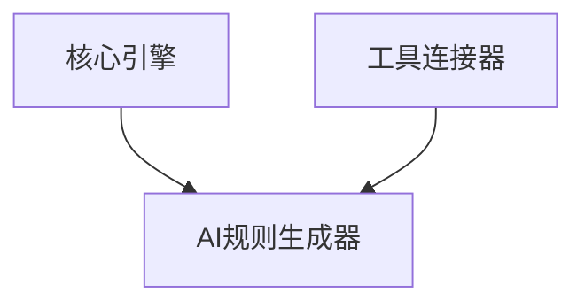

# VibeCopilot AI规则生成器模块开发指南

> **文档元数据**
> 版本: 1.0
> 上次更新: 2024-04-21
> 负责人: 系统架构团队

## 1. AI规则生成器模块概述

AI规则生成器是 VibeCopilot 的核心模块之一，负责管理和优化 AI 交互的提示词，实现高效的 AI 辅助开发。本模块特别支持 Cursor 自定义代理规则的生成、验证和部署，是提升 AI 开发效率的重要组件。

### 1.1 核心职责

- 管理 Cursor 自定义代理规则
- 提供场景化提示词模板
- 验证和优化 AI 规则
- 导出规则到 Cursor 环境

### 1.2 架构位置

AI规则生成器位于业务层，依赖于工具连接器和核心引擎：



## 2. 开发环境准备

### 2.1 依赖安装

```bash
# 安装 AI 规则生成器所需依赖
npm install --save langchain openai tiktoken handlebars
```

### 2.2 环境配置

在 `.env` 文件中配置必要的环境变量：

```
OPENAI_API_KEY=your_api_key_here
AI_MODEL=gpt-4-turbo
AI_TEMPERATURE=0.1
AI_MAX_TOKENS=2048
RULES_TEMPLATES_DIR=./templates/rules
```

## 3. 模块接口实现

### 3.1 AI规则生成器接口

```typescript
// src/ai_rules/interfaces.ts
import { Module } from '../core/interfaces';

export interface AIRuleGenerator extends Module {
  /**
   * 获取规则模板
   * @param category 模板类别
   * @param taskType 任务类型
   * @returns 模板对象
   */
  getTemplate(category: string, taskType: string): Promise<Template>;

  /**
   * 生成自定义代理规则
   * @param template 模板对象
   * @param variables 变量映射
   * @returns 生成的规则
   */
  generateRule(template: Template, variables: Record<string, string>): Promise<Rule>;

  /**
   * 验证规则有效性
   * @param rule 规则对象
   * @returns 验证结果
   */
  validateRule(rule: Rule): Promise<ValidationResult>;

  /**
   * 部署规则到Cursor
   * @param rule 规则对象
   * @returns 部署结果
   */
  deployToCursor(rule: Rule): Promise<DeployResult>;
}

export interface Template {
  id: string;
  name: string;
  description: string;
  category: string;
  taskType: string;
  content: string;
  requiredVariables: string[];
  version: string;
  author: string;
}

export interface Rule {
  id: string;
  name: string;
  content: string;
  metadata: {
    createdAt: string;
    updatedAt: string;
    generatedBy: string;
    templateId?: string;
    variables?: Record<string, string>;
    version: string;
  };
}

export interface ValidationResult {
  valid: boolean;
  score: number;
  issues: ValidationIssue[];
  suggestions: string[];
}

export interface ValidationIssue {
  severity: 'error' | 'warning' | 'info';
  message: string;
  location?: {
    line: number;
    column: number;
  };
}

export interface DeployResult {
  success: boolean;
  deployedAt: string;
  location: string;
  error?: Error;
}
```

### 3.2 模板仓库接口

```typescript
// src/ai_rules/template_repository_interface.ts
import { Template } from './interfaces';

export interface TemplateRepository {
  /**
   * 获取所有模板
   * @returns 所有模板列表
   */
  getAllTemplates(): Promise<Template[]>;

  /**
   * 通过ID获取模板
   * @param id 模板ID
   * @returns 模板对象
   */
  getTemplateById(id: string): Promise<Template>;

  /**
   * 按类别和任务类型查找模板
   * @param category 类别
   * @param taskType 任务类型
   * @returns 匹配的模板列表
   */
  findTemplates(category: string, taskType: string): Promise<Template[]>;

  /**
   * 保存模板
   * @param template 模板对象
   * @returns 保存的模板
   */
  saveTemplate(template: Template): Promise<Template>;

  /**
   * 删除模板
   * @param id 模板ID
   * @returns 是否成功删除
   */
  deleteTemplate(id: string): Promise<boolean>;
}
```

### 3.3 规则仓库接口

```typescript
// src/ai_rules/rule_repository_interface.ts
import { Rule } from './interfaces';

export interface RuleRepository {
  /**
   * 获取所有规则
   * @returns 所有规则列表
   */
  getAllRules(): Promise<Rule[]>;

  /**
   * 通过ID获取规则
   * @param id 规则ID
   * @returns 规则对象
   */
  getRuleById(id: string): Promise<Rule>;

  /**
   * 保存规则
   * @param rule 规则对象
   * @returns 保存的规则
   */
  saveRule(rule: Rule): Promise<Rule>;

  /**
   * 删除规则
   * @param id 规则ID
   * @returns 是否成功删除
   */
  deleteRule(id: string): Promise<boolean>;

  /**
   * 查询规则
   * @param filter 过滤条件
   * @returns 匹配的规则列表
   */
  queryRules(filter: RuleFilter): Promise<Rule[]>;
}

export interface RuleFilter {
  name?: string;
  templateId?: string;
  createdAfter?: Date;
  createdBefore?: Date;
}
```

## 4. 核心实现

### 4.1 AI规则生成器实现

```typescript
// src/ai_rules/implementations/ai_rule_generator.ts
import { injectable, inject } from 'inversify';
import {
  AIRuleGenerator, Template, Rule, ValidationResult, DeployResult
} from '../interfaces';
import { TemplateRepository } from '../template_repository_interface';
import { RuleRepository } from '../rule_repository_interface';
import { ToolConnector } from '../../tool_connector/interfaces';
import { Module, ModuleStatus } from '../../core/interfaces';
import { v4 as uuidv4 } from 'uuid';
import * as Handlebars from 'handlebars';
import { OpenAI } from 'langchain/llms/openai';

@injectable()
export class AIRuleGeneratorImpl implements AIRuleGenerator {
  private status: ModuleStatus = ModuleStatus.STOPPED;
  private llm: OpenAI;

  constructor(
    @inject('TemplateRepository') private templateRepo: TemplateRepository,
    @inject('RuleRepository') private ruleRepo: RuleRepository,
    @inject('ToolConnector') private toolConnector: ToolConnector,
    @inject('ConfigSystem') private configSystem: any
  ) {
    // 初始化LLM
    this.llm = new OpenAI({
      openAIApiKey: this.configSystem.get('env.OPENAI_API_KEY'),
      modelName: this.configSystem.get('env.AI_MODEL', 'gpt-4-turbo'),
      temperature: this.configSystem.get('env.AI_TEMPERATURE', 0.1),
      maxTokens: this.configSystem.get('env.AI_MAX_TOKENS', 2048)
    });
  }

  async initialize(): Promise<void> {
    this.status = ModuleStatus.INITIALIZED;
    return Promise.resolve();
  }

  async start(): Promise<void> {
    if (this.status !== ModuleStatus.INITIALIZED) {
      throw new Error('Cannot start AI rule generator: not initialized');
    }
    this.status = ModuleStatus.STARTED;
  }

  async stop(): Promise<void> {
    this.status = ModuleStatus.STOPPED;
  }

  getStatus(): ModuleStatus {
    return this.status;
  }

  async getTemplate(category: string, taskType: string): Promise<Template> {
    const templates = await this.templateRepo.findTemplates(category, taskType);

    if (templates.length === 0) {
      throw new Error(`No template found for category=${category}, taskType=${taskType}`);
    }

    // 返回最匹配的模板（这里简单返回第一个）
    return templates[0];
  }

  async generateRule(template: Template, variables: Record<string, string>): Promise<Rule> {
    // 验证所有必需的变量都已提供
    this.validateVariables(template, variables);

    // 使用Handlebars编译模板
    const templateCompiler = Handlebars.compile(template.content);
    const ruleContent = templateCompiler(variables);

    // 创建规则对象
    const now = new Date().toISOString();
    const rule: Rule = {
      id: uuidv4(),
      name: this.compileRuleName(template.name, variables),
      content: ruleContent,
      metadata: {
        createdAt: now,
        updatedAt: now,
        generatedBy: 'AIRuleGenerator',
        templateId: template.id,
        variables: variables,
        version: '1.0'
      }
    };

    // 保存规则
    return await this.ruleRepo.saveRule(rule);
  }

  async validateRule(rule: Rule): Promise<ValidationResult> {
    // 实现规则验证逻辑
    const prompt = `
    请评估以下Cursor AI自定义代理规则，检查有效性、一致性、完整性和优化空间。
    规则内容:
    ${rule.content}

    请以JSON格式返回评估结果，包括:
    1. valid: 布尔值，表示规则是否有效
    2. score: 0-100的分数
    3. issues: 问题列表，每个问题包含severity和message
    4. suggestions: 改进建议列表
    `;

    try {
      const response = await this.llm.call(prompt);
      return JSON.parse(response) as ValidationResult;
    } catch (error) {
      console.error('Error validating rule:', error);
      return {
        valid: false,
        score: 0,
        issues: [{
          severity: 'error',
          message: `验证过程中出错: ${error}`
        }],
        suggestions: ['请检查规则格式是否正确']
      };
    }
  }

  async deployToCursor(rule: Rule): Promise<DeployResult> {
    try {
      // 获取Cursor适配器
      const cursorAdapter = this.toolConnector.getAdapter('cursor');

      // 部署规则
      const result = await cursorAdapter.execute('deployRule', {
        ruleName: rule.name,
        ruleContent: rule.content
      });

      return {
        success: true,
        deployedAt: new Date().toISOString(),
        location: result.path,
      };
    } catch (error) {
      console.error('Error deploying rule to Cursor:', error);
      return {
        success: false,
        deployedAt: new Date().toISOString(),
        location: '',
        error: error as Error
      };
    }
  }

  // 私有辅助方法
  private validateVariables(template: Template, variables: Record<string, string>): void {
    for (const requiredVar of template.requiredVariables) {
      if (!variables[requiredVar]) {
        throw new Error(`Missing required variable: ${requiredVar}`);
      }
    }
  }

  private compileRuleName(templateName: string, variables: Record<string, string>): string {
    const nameCompiler = Handlebars.compile(templateName);
    return nameCompiler(variables);
  }
}
```

### 4.2 文件系统模板仓库实现

```typescript
// src/ai_rules/implementations/file_template_repository.ts
import { injectable, inject } from 'inversify';
import { TemplateRepository } from '../template_repository_interface';
import { Template } from '../interfaces';
import * as fs from 'fs';
import * as path from 'path';
import * as yaml from 'js-yaml';

@injectable()
export class FileTemplateRepository implements TemplateRepository {
  private templatesDir: string;

  constructor(@inject('ConfigSystem') private configSystem: any) {
    this.templatesDir = this.configSystem.get('env.RULES_TEMPLATES_DIR', './templates/rules');
  }

  async getAllTemplates(): Promise<Template[]> {
    const templates: Template[] = [];
    const files = this.getAllTemplateFiles();

    for (const file of files) {
      try {
        const template = await this.loadTemplateFromFile(file);
        templates.push(template);
      } catch (error) {
        console.error(`Error loading template from ${file}:`, error);
      }
    }

    return templates;
  }

  async getTemplateById(id: string): Promise<Template> {
    const templates = await this.getAllTemplates();
    const template = templates.find(t => t.id === id);

    if (!template) {
      throw new Error(`Template with ID ${id} not found`);
    }

    return template;
  }

  async findTemplates(category: string, taskType: string): Promise<Template[]> {
    const allTemplates = await this.getAllTemplates();
    return allTemplates.filter(t =>
      t.category === category &&
      (taskType === '*' || t.taskType === taskType)
    );
  }

  async saveTemplate(template: Template): Promise<Template> {
    const filename = `${template.id}.yml`;
    const filePath = path.join(this.templatesDir, filename);

    // 确保目录存在
    if (!fs.existsSync(this.templatesDir)) {
      fs.mkdirSync(this.templatesDir, { recursive: true });
    }

    const templateData = {
      id: template.id,
      name: template.name,
      description: template.description,
      category: template.category,
      taskType: template.taskType,
      requiredVariables: template.requiredVariables,
      version: template.version,
      author: template.author,
      content: template.content
    };

    const yamlContent = yaml.dump(templateData);
    fs.writeFileSync(filePath, yamlContent, 'utf8');

    return template;
  }

  async deleteTemplate(id: string): Promise<boolean> {
    const templates = await this.getAllTemplates();
    const template = templates.find(t => t.id === id);

    if (!template) {
      return false;
    }

    const filename = `${id}.yml`;
    const filePath = path.join(this.templatesDir, filename);

    if (fs.existsSync(filePath)) {
      fs.unlinkSync(filePath);
      return true;
    }

    return false;
  }

  // 私有辅助方法
  private getAllTemplateFiles(): string[] {
    if (!fs.existsSync(this.templatesDir)) {
      return [];
    }

    return fs.readdirSync(this.templatesDir)
      .filter(file => file.endsWith('.yml') || file.endsWith('.yaml'))
      .map(file => path.join(this.templatesDir, file));
  }

  private async loadTemplateFromFile(filePath: string): Promise<Template> {
    const content = fs.readFileSync(filePath, 'utf8');
    const data = yaml.load(content) as any;

    return {
      id: data.id,
      name: data.name,
      description: data.description,
      category: data.category,
      taskType: data.taskType,
      content: data.content,
      requiredVariables: data.requiredVariables || [],
      version: data.version,
      author: data.author
    };
  }
}
```

### 4.3 本地存储规则仓库实现

```typescript
// src/ai_rules/implementations/local_rule_repository.ts
import { injectable, inject } from 'inversify';
import { RuleRepository, RuleFilter } from '../rule_repository_interface';
import { Rule } from '../interfaces';
import * as fs from 'fs';
import * as path from 'path';

@injectable()
export class LocalRuleRepository implements RuleRepository {
  private rulesDir: string;
  private rules: Map<string, Rule> = new Map();

  constructor(@inject('ConfigSystem') private configSystem: any) {
    this.rulesDir = this.configSystem.get('rules.storageDir', './data/rules');
    this.loadRules();
  }

  private loadRules(): void {
    if (!fs.existsSync(this.rulesDir)) {
      fs.mkdirSync(this.rulesDir, { recursive: true });
      return;
    }

    const files = fs.readdirSync(this.rulesDir)
      .filter(file => file.endsWith('.json'))
      .map(file => path.join(this.rulesDir, file));

    for (const file of files) {
      try {
        const content = fs.readFileSync(file, 'utf8');
        const rule = JSON.parse(content) as Rule;
        this.rules.set(rule.id, rule);
      } catch (error) {
        console.error(`Error loading rule from ${file}:`, error);
      }
    }
  }

  async getAllRules(): Promise<Rule[]> {
    return Array.from(this.rules.values());
  }

  async getRuleById(id: string): Promise<Rule> {
    const rule = this.rules.get(id);
    if (!rule) {
      throw new Error(`Rule with ID ${id} not found`);
    }
    return rule;
  }

  async saveRule(rule: Rule): Promise<Rule> {
    // 确保目录存在
    if (!fs.existsSync(this.rulesDir)) {
      fs.mkdirSync(this.rulesDir, { recursive: true });
    }

    // 更新修改时间
    rule.metadata.updatedAt = new Date().toISOString();

    // 保存到内存
    this.rules.set(rule.id, rule);

    // 保存到文件
    const filePath = path.join(this.rulesDir, `${rule.id}.json`);
    fs.writeFileSync(filePath, JSON.stringify(rule, null, 2), 'utf8');

    return rule;
  }

  async deleteRule(id: string): Promise<boolean> {
    const rule = this.rules.get(id);
    if (!rule) {
      return false;
    }

    // 从内存中删除
    this.rules.delete(id);

    // 从文件系统删除
    const filePath = path.join(this.rulesDir, `${id}.json`);
    if (fs.existsSync(filePath)) {
      fs.unlinkSync(filePath);
    }

    return true;
  }

  async queryRules(filter: RuleFilter): Promise<Rule[]> {
    let rules = Array.from(this.rules.values());

    if (filter.name) {
      rules = rules.filter(r => r.name.includes(filter.name!));
    }

    if (filter.templateId) {
      rules = rules.filter(r => r.metadata.templateId === filter.templateId);
    }

    if (filter.createdAfter) {
      rules = rules.filter(r => new Date(r.metadata.createdAt) >= filter.createdAfter!);
    }

    if (filter.createdBefore) {
      rules = rules.filter(r => new Date(r.metadata.createdAt) <= filter.createdBefore!);
    }

    return rules;
  }
}
```

## 5. 模板设计

### 5.1 模板格式

规则模板应使用 YAML 格式定义，包含元数据和内容两部分：

```yaml
# templates/rules/code_review.yml
id: code-review-template
name: "Code Review - {{language}}"
description: "为{{language}}代码提供全面的代码审查"
category: "code-quality"
taskType: "review"
version: "1.0"
author: "VibeCopilot Team"
requiredVariables:
  - language
  - focus_areas
  - code_conventions
content: |
  # {{language}} 代码审查助手

  你是一个专业的{{language}}代码审查专家。请根据以下重点领域进行代码审查：

  ## 重点关注
  {{focus_areas}}

  ## 代码规范
  {{code_conventions}}

  ## 审查流程
  1. 首先分析代码的整体结构和架构
  2. 检查代码质量、可读性和性能
  3. 验证错误处理和边缘情况
  4. 提供具体的改进建议，包括代码示例

  请提供详细、建设性的反馈，帮助开发者提升代码质量。
```

### 5.2 变量插入

模板使用 Handlebars 语法插入变量：

```
{{variable_name}}
```

## 6. 测试策略

### 6.1 单元测试

```typescript
// tests/ai_rules/rule_generator.spec.ts
import { AIRuleGeneratorImpl } from '../../src/ai_rules/implementations/ai_rule_generator';
import { Mock } from 'jest-mock';

describe('AIRuleGenerator', () => {
  let generator: AIRuleGeneratorImpl;
  let mockTemplateRepo: any;
  let mockRuleRepo: any;
  let mockToolConnector: any;
  let mockConfigSystem: any;

  beforeEach(() => {
    mockTemplateRepo = {
      findTemplates: jest.fn(),
      getTemplateById: jest.fn(),
      saveTemplate: jest.fn()
    };

    mockRuleRepo = {
      saveRule: jest.fn(rule => Promise.resolve(rule)),
      getRuleById: jest.fn()
    };

    mockToolConnector = {
      getAdapter: jest.fn()
    };

    mockConfigSystem = {
      get: jest.fn()
    };

    generator = new AIRuleGeneratorImpl(
      mockTemplateRepo,
      mockRuleRepo,
      mockToolConnector,
      mockConfigSystem
    );

    generator.initialize();
  });

  test('should generate rule from template', async () => {
    // 准备
    const template = {
      id: 'test-template',
      name: 'Test Template - {{type}}',
      description: 'A test template',
      category: 'test',
      taskType: 'test',
      content: 'This is a {{type}} template with {{value}}',
      requiredVariables: ['type', 'value'],
      version: '1.0',
      author: 'Test'
    };

    const variables = {
      type: 'example',
      value: 'test value'
    };

    mockTemplateRepo.findTemplates.mockResolvedValue([template]);

    // 执行
    await generator.start();
    const result = await generator.generateRule(template, variables);

    // 断言
    expect(result.content).toBe('This is a example template with test value');
    expect(result.name).toBe('Test Template - example');
    expect(mockRuleRepo.saveRule).toHaveBeenCalled();
  });

  test('should throw error when required variables are missing', async () => {
    // 准备
    const template = {
      id: 'test-template',
      name: 'Test Template',
      description: 'A test template',
      category: 'test',
      taskType: 'test',
      content: 'Template content {{required}}',
      requiredVariables: ['required'],
      version: '1.0',
      author: 'Test'
    };

    const variables = {
      optional: 'value'
    };

    // 执行与断言
    await expect(generator.generateRule(template, variables))
      .rejects.toThrow('Missing required variable: required');
  });
});
```

### 6.2 集成测试

```typescript
// tests/ai_rules/rule_generator_integration.spec.ts
import { Container } from 'inversify';
import { AIRuleGeneratorImpl } from '../../src/ai_rules/implementations/ai_rule_generator';
import { FileTemplateRepository } from '../../src/ai_rules/implementations/file_template_repository';
import { LocalRuleRepository } from '../../src/ai_rules/implementations/local_rule_repository';

describe('AIRuleGenerator Integration', () => {
  let container: Container;
  let generator: AIRuleGeneratorImpl;

  beforeEach(() => {
    // 设置测试环境
    process.env.RULES_TEMPLATES_DIR = './tests/fixtures/templates';
    process.env.OPENAI_API_KEY = 'test-key';

    // 设置依赖注入容器
    container = new Container();
    container.bind('TemplateRepository').to(FileTemplateRepository);
    container.bind('RuleRepository').to(LocalRuleRepository);
    container.bind('ToolConnector').toConstantValue(mockToolConnector);
    container.bind('ConfigSystem').toConstantValue(mockConfigSystem);
    container.bind('AIRuleGenerator').to(AIRuleGeneratorImpl);

    generator = container.get('AIRuleGenerator');
    generator.initialize();
  });

  // 集成测试用例...
});
```

## 7. 最佳实践与建议

### 7.1 模板管理

- 按功能领域组织模板
- 使用版本控制管理模板变更
- 提供模板验证工具
- 实现模板质量评分机制

### 7.2 规则生成与验证

- 使用标准化的评估标准
- 针对不同场景提供示例变量
- 支持规则草稿和发布流程
- 实现规则测试和评估工具

### 7.3 性能优化

- 缓存常用模板
- 实现批量规则生成
- 使用 API 的流式响应
- 提供本地 LLM 选项降低延迟

## 8. 常见问题与解决方案

### 8.1 规则生成失败

**问题**: 规则生成过程中失败或超时。

**解决方案**:

- 检查 API 密钥和网络连接
- 减小模板复杂度
- 优化提示词长度
- 实现重试机制

### 8.2 规则质量问题

**问题**: 生成的规则质量不佳或效果不理想。

**解决方案**:

- 提高模板质量
- 添加更具体的变量说明
- 实现规则质量审核流程
- 收集用户反馈持续改进

### 8.3 模板参数混淆

**问题**: 用户不清楚应提供哪些变量值。

**解决方案**:

- 为每个变量提供清晰文档
- 实现变量类型检查
- 提供示例值
- 开发交互式表单收集变量

## 9. 扩展与未来发展

- 支持基于用户历史的规则推荐
- 实现自动规则优化
- 添加更多 AI 模型支持
- 开发可视化规则编辑器
- 支持团队共享和规则协作

---

本文档提供了 VibeCopilot AI规则生成器模块开发的指南。开发者应遵循本指南，确保模块的设计与实现符合项目规范。随着项目发展，本指南将持续更新以反映最佳实践。
