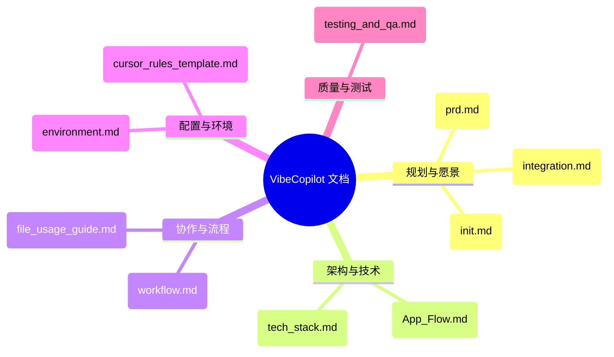

# VibeCopilot 文档索引

本文档提供 VibeCopilot 项目所有关键文档的索引，帮助团队成员快速找到所需文档。

## 文档地图

## 文档目录

### 1. 规划与愿景文档

| 文档名称 | 路径 | 说明 |
|---------|------|------|
| 产品需求文档 | `docs/dev/architecture/prd.md` | 定义项目核心定位、目标和功能需求 |
| 项目对齐与实施指南 | `docs/dev/architecture/integration.md` | 确保项目实施与初始设想对齐，提供实施路径 |
| 初始化文档 | `docs/init.md` | 项目初始构想和方向指南 |

### 2. 架构与技术文档

| 文档名称 | 路径 | 说明 |
|---------|------|------|
| 应用流程设计 | `docs/dev/architecture/App_Flow.md` | 详细描述应用交互流程和系统组件关系 |
| 技术栈文档 | `docs/dev/tech_stack.md` | 明确项目使用的技术栈和工具链 |

### 3. 协作与流程文档

| 文档名称 | 路径 | 说明 |
|---------|------|------|
| 工作流程指南 | `docs/user/workflow.md` | 定义标准化的AI辅助开发流程，解决团队痛点 |
| 文件使用范围指南 | `docs/dev/guides/file_usage_guide.md` | 明确各文档的使用范围、场景和受众 |

### 4. 配置与环境文档

| 文档名称 | 路径 | 说明 |
|---------|------|------|
| 开发环境配置指南 | `docs/dev/environment.md` | 提供详细的环境配置步骤和最佳实践 |
| AI规则模板 | `docs/ai/rules/cursor_rules_template.md` | 提供AI工具配置模板，统一AI工具使用方式 |

### 5. 质量与测试文档

| 文档名称 | 路径 | 说明 |
|---------|------|------|
| 测试与质量保障指南 | `docs/dev/guides/testing_and_qa.md` | 规范化测试策略和质量控制流程 |

## 文档使用建议

### 按角色查找

1. **产品经理**：`prd.md` → `workflow.md` → `integration.md`
2. **技术负责人**：`prd.md` → `App_Flow.md` → `tech_stack.md` → `integration.md`
3. **开发人员**：`workflow.md` → `environment.md` → `App_Flow.md` → `cursor_rules_template.md`
4. **测试人员**：`App_Flow.md` → `testing_and_qa.md` → `workflow.md`
5. **新团队成员**：`workflow.md` → `file_usage_guide.md` → `environment.md`

### 按阶段查找

1. **项目启动阶段**：`init.md` → `prd.md` → `workflow.md`
2. **设计阶段**：`prd.md` → `App_Flow.md` → `tech_stack.md`
3. **开发阶段**：`workflow.md` → `App_Flow.md` → `cursor_rules_template.md` → `environment.md`
4. **测试阶段**：`testing_and_qa.md` → `App_Flow.md`
5. **维护阶段**：`integration.md` → `workflow.md` → `testing_and_qa.md`

## 文档维护指南

1. 文档更新后，请同步更新本索引
2. 新增重要文档时，应添加到本索引中
3. 请保持文档命名的一致性和路径的稳定性
4. 文档重大变更时，应通知团队并在变更日志中记录

---

最后更新时间: 2023-10-20
