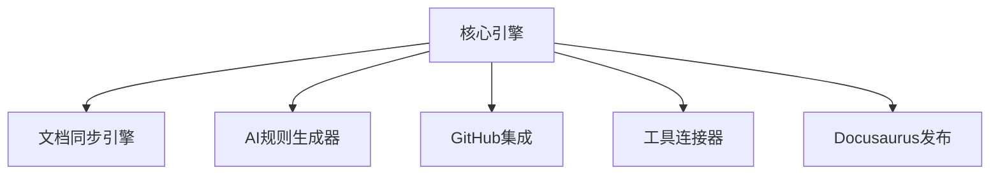

# VibeCopilot 核心引擎模块开发指南

> **文档元数据**
> 版本: 1.0
> 上次更新: 2024-04-21
> 负责人: 系统架构团队

## 1. 核心引擎模块概述

核心引擎模块作为 VibeCopilot 的中央协调器，是整个系统的基础。它负责模块注册与发现、生命周期管理、事件分发和配置管理等核心功能。本指南将帮助开发者理解并实现核心引擎模块。

### 1.1 核心职责

- 模块注册与发现
- 模块生命周期管理
- 全局事件分发
- 统一配置管理
- 插件系统的支持

### 1.2 架构位置

核心引擎位于系统架构的核心层，为所有其他模块提供基础支持：



## 2. 开发环境准备

### 2.1 依赖安装

```bash
# 安装核心引擎所需依赖
npm install --save reflect-metadata rxjs inversify
```

### 2.2 TypeScript 配置

在 `tsconfig.json` 中确保以下配置：

```json
{
  "compilerOptions": {
    "experimentalDecorators": true,
    "emitDecoratorMetadata": true,
    "target": "ES2020",
    "moduleResolution": "node",
    "strictNullChecks": true
  }
}
```

## 3. 模块接口实现

按照模块设计规范，核心引擎模块需要实现以下关键接口：

### 3.1 核心引擎接口定义

```typescript
// src/core/interfaces.ts
import { EventHandler, Subscription } from './events';
import { Module } from './module';

export interface CoreEngine {
  /**
   * 注册模块到核心引擎
   * @param moduleId 模块唯一标识
   * @param module 模块实例
   */
  registerModule(moduleId: string, module: Module): void;

  /**
   * 获取已注册的模块实例
   * @param moduleId 模块唯一标识
   * @returns 模块实例
   */
  getModule<T extends Module>(moduleId: string): T;

  /**
   * 发布事件到事件总线
   * @param eventType 事件类型
   * @param payload 事件数据
   */
  publishEvent(eventType: string, payload: any): void;

  /**
   * 订阅事件总线中的事件
   * @param eventType 事件类型
   * @param handler 事件处理函数
   * @returns 订阅对象
   */
  subscribeToEvent(eventType: string, handler: EventHandler): Subscription;

  /**
   * 获取配置值
   * @param configPath 配置路径
   * @returns 配置值
   */
  getConfig(configPath: string): any;
}

export interface Module {
  /**
   * 模块初始化
   */
  initialize(): Promise<void>;

  /**
   * 模块启动
   */
  start(): Promise<void>;

  /**
   * 模块停止
   */
  stop(): Promise<void>;

  /**
   * 获取模块状态
   */
  getStatus(): ModuleStatus;
}

export enum ModuleStatus {
  INITIALIZED = 'initialized',
  STARTED = 'started',
  STOPPED = 'stopped',
  ERROR = 'error'
}
```

### 3.2 事件总线接口定义

```typescript
// src/core/events.ts
export interface EventBus {
  /**
   * 发布事件到总线
   * @param eventType 事件类型
   * @param payload 事件数据
   */
  publish(eventType: string, payload: any): void;

  /**
   * 订阅事件
   * @param eventType 事件类型
   * @param handler 事件处理函数
   * @returns 订阅对象
   */
  subscribe(eventType: string, handler: EventHandler): Subscription;

  /**
   * 取消订阅
   * @param subscription 订阅对象
   */
  unsubscribe(subscription: Subscription): void;
}

export interface Subscription {
  /**
   * 取消订阅
   */
  unsubscribe(): void;

  /**
   * 检查订阅是否有效
   */
  isActive(): boolean;
}

export type EventHandler = (eventType: string, payload: any) => void;
```

### 3.3 依赖注入容器定义

```typescript
// src/core/di.ts
export interface DependencyContainer {
  /**
   * 注册依赖
   * @param token 依赖标识
   * @param implementation 依赖实现
   */
  register<T>(token: symbol | string, implementation: Constructor<T> | T): void;

  /**
   * 解析依赖
   * @param token 依赖标识
   * @returns 依赖实例
   */
  resolve<T>(token: symbol | string): T;

  /**
   * 创建对象及其依赖
   * @param ctor 构造函数
   * @returns 创建的实例
   */
  createInstance<T>(ctor: Constructor<T>): T;
}

export interface Constructor<T> {
  new (...args: any[]): T;
}

export const Inject = (token: symbol | string): ParameterDecorator => {
  return (target: Object, propertyKey: string | symbol, parameterIndex: number) => {
    // 实现依赖注入逻辑
  };
};
```

## 4. 核心引擎实现

以下是核心引擎各组件的实现示例：

### 4.1 事件总线实现

```typescript
// src/core/implementations/event_bus.ts
import { EventBus, EventHandler, Subscription } from '../events';

export class EventBusImpl implements EventBus {
  private eventHandlers: Map<string, Set<EventHandler>> = new Map();

  publish(eventType: string, payload: any): void {
    const handlers = this.eventHandlers.get(eventType);
    if (handlers) {
      handlers.forEach(handler => {
        try {
          handler(eventType, payload);
        } catch (error) {
          console.error(`Error handling event ${eventType}:`, error);
        }
      });
    }
  }

  subscribe(eventType: string, handler: EventHandler): Subscription {
    if (!this.eventHandlers.has(eventType)) {
      this.eventHandlers.set(eventType, new Set());
    }

    const handlers = this.eventHandlers.get(eventType)!;
    handlers.add(handler);

    let active = true;

    return {
      unsubscribe: () => {
        if (active) {
          handlers.delete(handler);
          active = false;
        }
      },
      isActive: () => active
    };
  }

  unsubscribe(subscription: Subscription): void {
    subscription.unsubscribe();
  }
}
```

### 4.2 依赖注入容器实现

```typescript
// src/core/implementations/dependency_container.ts
import { Container, injectable, inject } from 'inversify';
import { DependencyContainer, Constructor } from '../di';

@injectable()
export class DependencyContainerImpl implements DependencyContainer {
  private container: Container;

  constructor() {
    this.container = new Container();
  }

  register<T>(token: symbol | string, implementation: Constructor<T> | T): void {
    if (typeof implementation === 'function') {
      this.container.bind<T>(token).to(implementation as any);
    } else {
      this.container.bind<T>(token).toConstantValue(implementation);
    }
  }

  resolve<T>(token: symbol | string): T {
    return this.container.get<T>(token);
  }

  createInstance<T>(ctor: Constructor<T>): T {
    return this.container.resolve<T>(ctor);
  }
}
```

### 4.3 配置系统实现

```typescript
// src/core/implementations/config_system.ts
import * as dotenv from 'dotenv';
import * as path from 'path';
import * as fs from 'fs';
import { ConfigurationSystem } from '../interfaces';

export class ConfigSystemImpl implements ConfigurationSystem {
  private config: Record<string, any> = {};

  constructor(private configFilePath?: string) {
    this.loadEnvConfig();
    if (configFilePath && fs.existsSync(configFilePath)) {
      this.loadFileConfig(configFilePath);
    }
  }

  private loadEnvConfig(): void {
    dotenv.config();
    // 将环境变量加载到配置中
    this.config.env = { ...process.env };
  }

  private loadFileConfig(filePath: string): void {
    try {
      const configContent = fs.readFileSync(filePath, 'utf8');
      const fileConfig = JSON.parse(configContent);
      this.config = { ...this.config, ...fileConfig };
    } catch (error) {
      console.error(`Error loading config from ${filePath}:`, error);
    }
  }

  get<T>(path: string, defaultValue?: T): T {
    const parts = path.split('.');
    let current: any = this.config;

    for (const part of parts) {
      if (current === undefined || current === null) {
        return defaultValue as T;
      }
      current = current[part];
    }

    return (current !== undefined) ? current : defaultValue as T;
  }

  set<T>(path: string, value: T): void {
    const parts = path.split('.');
    let current = this.config;

    for (let i = 0; i < parts.length - 1; i++) {
      const part = parts[i];
      if (!current[part]) {
        current[part] = {};
      }
      current = current[part];
    }

    current[parts[parts.length - 1]] = value;
  }

  async reload(): Promise<void> {
    if (this.configFilePath) {
      this.loadFileConfig(this.configFilePath);
    }
    this.loadEnvConfig();
  }
}
```

### 4.4 核心引擎实现

```typescript
// src/core/implementations/core_engine.ts
import { CoreEngine, Module, ModuleStatus } from '../interfaces';
import { EventBus, EventHandler, Subscription } from '../events';
import { ConfigurationSystem } from '../interfaces';
import { injectable, inject } from 'inversify';

@injectable()
export class CoreEngineImpl implements CoreEngine {
  private modules = new Map<string, Module>();

  constructor(
    @inject('EventBus') private eventBus: EventBus,
    @inject('ConfigSystem') private configSystem: ConfigurationSystem
  ) {}

  registerModule(moduleId: string, module: Module): void {
    if (this.modules.has(moduleId)) {
      throw new Error(`Module with ID ${moduleId} is already registered`);
    }
    this.modules.set(moduleId, module);
  }

  getModule<T extends Module>(moduleId: string): T {
    const module = this.modules.get(moduleId);
    if (!module) {
      throw new Error(`Module with ID ${moduleId} is not registered`);
    }
    return module as T;
  }

  publishEvent(eventType: string, payload: any): void {
    this.eventBus.publish(eventType, payload);
  }

  subscribeToEvent(eventType: string, handler: EventHandler): Subscription {
    return this.eventBus.subscribe(eventType, handler);
  }

  getConfig(configPath: string): any {
    return this.configSystem.get(configPath);
  }

  async initializeAllModules(): Promise<void> {
    const initializePromises: Promise<void>[] = [];

    for (const [moduleId, module] of this.modules.entries()) {
      console.log(`Initializing module: ${moduleId}`);
      initializePromises.push(module.initialize());
    }

    await Promise.all(initializePromises);
    console.log('All modules initialized');
  }

  async startAllModules(): Promise<void> {
    const startPromises: Promise<void>[] = [];

    for (const [moduleId, module] of this.modules.entries()) {
      if (module.getStatus() === ModuleStatus.INITIALIZED) {
        console.log(`Starting module: ${moduleId}`);
        startPromises.push(module.start());
      }
    }

    await Promise.all(startPromises);
    console.log('All modules started');
  }

  async stopAllModules(): Promise<void> {
    const stopPromises: Promise<void>[] = [];

    // 逆序停止模块
    const moduleEntries = Array.from(this.modules.entries()).reverse();

    for (const [moduleId, module] of moduleEntries) {
      if (module.getStatus() === ModuleStatus.STARTED) {
        console.log(`Stopping module: ${moduleId}`);
        stopPromises.push(module.stop());
      }
    }

    await Promise.all(stopPromises);
    console.log('All modules stopped');
  }
}
```

## 5. 插件系统实现

核心引擎还应实现插件系统，支持功能扩展：

```typescript
// src/core/plugin.ts
export interface PluginSystem {
  /**
   * 注册插件
   * @param plugin 插件实例
   */
  registerPlugin(plugin: Plugin): void;

  /**
   * 加载插件
   * @param pluginPath 插件路径
   * @returns 加载的插件
   */
  loadPlugin(pluginPath: string): Promise<Plugin>;

  /**
   * 获取已注册插件
   * @returns 插件列表
   */
  getRegisteredPlugins(): Plugin[];

  /**
   * 启用/禁用插件
   * @param pluginId 插件ID
   * @param enabled 是否启用
   */
  setPluginEnabled(pluginId: string, enabled: boolean): Promise<void>;
}

export interface Plugin {
  /**
   * 插件元数据
   */
  readonly metadata: PluginMetadata;

  /**
   * 插件初始化
   * @param context 插件上下文
   */
  initialize(context: PluginContext): Promise<void>;

  /**
   * 插件启动
   */
  start(): Promise<void>;

  /**
   * 插件停止
   */
  stop(): Promise<void>;
}

export interface PluginMetadata {
  id: string;
  name: string;
  version: string;
  description: string;
  author: string;
  dependencies: string[];
}

export interface PluginContext {
  coreEngine: CoreEngine;
}
```

### 5.1 插件系统实现

```typescript
// src/core/implementations/plugin_system.ts
import * as fs from 'fs';
import * as path from 'path';
import { injectable, inject } from 'inversify';
import { CoreEngine } from '../interfaces';
import { PluginSystem, Plugin, PluginContext } from '../plugin';

@injectable()
export class PluginSystemImpl implements PluginSystem {
  private plugins: Map<string, Plugin> = new Map();
  private enabledPlugins: Set<string> = new Set();

  constructor(@inject('CoreEngine') private coreEngine: CoreEngine) {}

  registerPlugin(plugin: Plugin): void {
    const pluginId = plugin.metadata.id;
    if (this.plugins.has(pluginId)) {
      throw new Error(`Plugin with ID ${pluginId} is already registered`);
    }
    this.plugins.set(pluginId, plugin);
    this.enabledPlugins.add(pluginId);
  }

  async loadPlugin(pluginPath: string): Promise<Plugin> {
    if (!fs.existsSync(pluginPath)) {
      throw new Error(`Plugin path ${pluginPath} does not exist`);
    }

    try {
      // 动态导入插件
      const pluginModule = await import(pluginPath);
      const PluginClass = pluginModule.default;

      if (!PluginClass || typeof PluginClass !== 'function') {
        throw new Error(`Invalid plugin at ${pluginPath}: no default export`);
      }

      const plugin = new PluginClass() as Plugin;
      this.validatePlugin(plugin);

      await plugin.initialize({
        coreEngine: this.coreEngine
      });

      this.registerPlugin(plugin);
      return plugin;
    } catch (error) {
      throw new Error(`Failed to load plugin at ${pluginPath}: ${error}`);
    }
  }

  getRegisteredPlugins(): Plugin[] {
    return Array.from(this.plugins.values());
  }

  async setPluginEnabled(pluginId: string, enabled: boolean): Promise<void> {
    const plugin = this.plugins.get(pluginId);
    if (!plugin) {
      throw new Error(`Plugin with ID ${pluginId} is not registered`);
    }

    const isCurrentlyEnabled = this.enabledPlugins.has(pluginId);

    if (enabled === isCurrentlyEnabled) {
      return; // 状态未改变
    }

    if (enabled) {
      await plugin.start();
      this.enabledPlugins.add(pluginId);
    } else {
      await plugin.stop();
      this.enabledPlugins.delete(pluginId);
    }
  }

  private validatePlugin(plugin: Plugin): void {
    // 验证插件是否符合接口规范
    if (!plugin.metadata || !plugin.metadata.id) {
      throw new Error('Invalid plugin: missing metadata or ID');
    }

    if (!plugin.initialize || !plugin.start || !plugin.stop) {
      throw new Error('Invalid plugin: missing required methods');
    }
  }
}
```

## 6. 模块测试示例

为确保核心引擎模块正确工作，需要编写相应的单元测试：

### 6.1 事件总线测试

```typescript
// tests/core/event_bus.spec.ts
import { EventBusImpl } from '../../src/core/implementations/event_bus';

describe('EventBus', () => {
  let eventBus: EventBusImpl;

  beforeEach(() => {
    eventBus = new EventBusImpl();
  });

  test('should publish and receive events', () => {
    // 准备
    const handler = jest.fn();
    const subscription = eventBus.subscribe('test-event', handler);
    const payload = { data: 'test-data' };

    // 执行
    eventBus.publish('test-event', payload);

    // 断言
    expect(handler).toHaveBeenCalledWith('test-event', payload);
    expect(subscription.isActive()).toBe(true);
  });

  test('should unsubscribe from events', () => {
    // 准备
    const handler = jest.fn();
    const subscription = eventBus.subscribe('test-event', handler);

    // 执行
    subscription.unsubscribe();
    eventBus.publish('test-event', {});

    // 断言
    expect(handler).not.toHaveBeenCalled();
    expect(subscription.isActive()).toBe(false);
  });

  test('should handle errors in event handlers', () => {
    // 准备
    const consoleSpy = jest.spyOn(console, 'error').mockImplementation();
    const errorHandler = jest.fn().mockImplementation(() => {
      throw new Error('Test error');
    });

    eventBus.subscribe('error-event', errorHandler);

    // 执行
    eventBus.publish('error-event', {});

    // 断言
    expect(errorHandler).toHaveBeenCalled();
    expect(consoleSpy).toHaveBeenCalled();

    // 清理
    consoleSpy.mockRestore();
  });
});
```

### 6.2 核心引擎测试

```typescript
// tests/core/core_engine.spec.ts
import { CoreEngineImpl } from '../../src/core/implementations/core_engine';
import { EventBusImpl } from '../../src/core/implementations/event_bus';
import { ConfigSystemImpl } from '../../src/core/implementations/config_system';
import { Module, ModuleStatus } from '../../src/core/interfaces';

// 模拟模块实现
class MockModule implements Module {
  private status: ModuleStatus = ModuleStatus.STOPPED;

  initialize = jest.fn().mockImplementation(async () => {
    this.status = ModuleStatus.INITIALIZED;
    return Promise.resolve();
  });

  start = jest.fn().mockImplementation(async () => {
    this.status = ModuleStatus.STARTED;
    return Promise.resolve();
  });

  stop = jest.fn().mockImplementation(async () => {
    this.status = ModuleStatus.STOPPED;
    return Promise.resolve();
  });

  getStatus = jest.fn().mockImplementation(() => this.status);
}

describe('CoreEngine', () => {
  let coreEngine: CoreEngineImpl;
  let eventBus: EventBusImpl;
  let configSystem: ConfigSystemImpl;

  beforeEach(() => {
    eventBus = new EventBusImpl();
    configSystem = new ConfigSystemImpl();
    coreEngine = new CoreEngineImpl(eventBus, configSystem);
  });

  test('should register and retrieve modules', () => {
    // 准备
    const mockModule = new MockModule();

    // 执行
    coreEngine.registerModule('test-module', mockModule);
    const retrievedModule = coreEngine.getModule('test-module');

    // 断言
    expect(retrievedModule).toBe(mockModule);
  });

  test('should throw error when retrieving non-existent module', () => {
    expect(() => {
      coreEngine.getModule('non-existent');
    }).toThrow();
  });

  test('should initialize all modules', async () => {
    // 准备
    const mockModule1 = new MockModule();
    const mockModule2 = new MockModule();

    coreEngine.registerModule('module1', mockModule1);
    coreEngine.registerModule('module2', mockModule2);

    // 执行
    await coreEngine.initializeAllModules();

    // 断言
    expect(mockModule1.initialize).toHaveBeenCalled();
    expect(mockModule2.initialize).toHaveBeenCalled();
  });

  test('should start all initialized modules', async () => {
    // 准备
    const mockModule = new MockModule();
    coreEngine.registerModule('test-module', mockModule);
    await mockModule.initialize();

    // 执行
    await coreEngine.startAllModules();

    // 断言
    expect(mockModule.start).toHaveBeenCalled();
    expect(mockModule.getStatus()).toBe(ModuleStatus.STARTED);
  });

  test('should publish and subscribe to events', () => {
    // 准备
    const handler = jest.fn();
    coreEngine.subscribeToEvent('test-event', handler);

    // 执行
    coreEngine.publishEvent('test-event', { data: 'test' });

    // 断言
    expect(handler).toHaveBeenCalledWith('test-event', { data: 'test' });
  });
});
```

## 7. 最佳实践与建议

### 7.1 模块依赖管理

- 使用反转控制原则，通过依赖注入解耦模块
- 在模块初始化时注册所有可用的服务
- 避免模块间的直接依赖，尽量通过事件总线或核心引擎通信

### 7.2 错误处理

- 为每个模块实现错误处理策略
- 使用日志系统记录关键操作和错误
- 提供用户友好的错误信息
- 对关键系统使用错误恢复机制

### 7.3 性能优化

- 对长时间运行的操作使用异步处理
- 避免不必要的事件发布，特别是大型数据载荷
- 实现缓存机制减少重复计算和 I/O 操作
- 定期清理不再使用的资源

### 7.4 扩展性考虑

- 设计为可插拔式架构，便于添加新模块
- 使用约定优于配置的原则简化集成
- 对插件提供明确的扩展点和接口文档
- 版本控制和向后兼容性保障

## 8. 常见问题与解决方案

### 8.1 模块依赖循环

**问题**: 模块间存在循环依赖导致初始化失败。

**解决方案**:

- 使用依赖注入延迟模块加载
- 使用事件总线代替直接依赖
- 重构模块边界，创建中介层

### 8.2 配置管理问题

**问题**: 配置变更不生效或错误配置导致应用崩溃。

**解决方案**:

- 实现配置验证机制
- 提供默认值和降级策略
- 添加配置热重载能力
- 使用强类型配置接口

## 9. 学习资源与参考

- [InversifyJS 依赖注入库](https://inversify.io/.md)
- [RxJS 响应式编程库](https://rxjs.dev/.md)
- [TypeScript 官方文档](https://www.typescriptlang.org/docs/.md)
- [设计模式：依赖注入与控制反转](https://en.wikipedia.org/wiki/Dependency_injection.md)
- [事件驱动架构](https://en.wikipedia.org/wiki/Event-driven_architecture.md)

---

本文档提供了 VibeCopilot 核心引擎模块开发的详细指南。开发者应遵循本指南，确保核心引擎模块的设计与实现符合项目规范。随着项目发展，本指南将持续更新以反映最佳实践。
