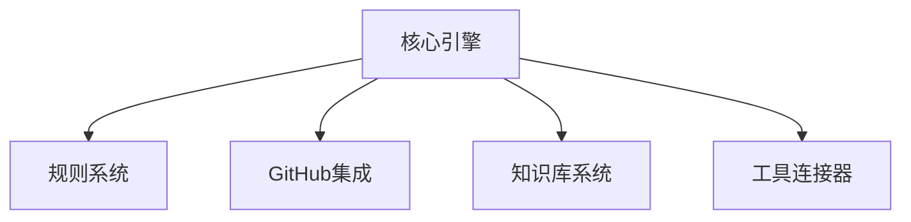

# VibeCopilot 核心引擎模块概览

> **文档元数据**
> 版本: 2.0
> 上次更新: 2024-04-25
> 负责人: 系统架构团队

## 1. 核心引擎概述

核心引擎作为VibeCopilot的中央协调器，负责处理命令解析、规则应用和工具集成等核心功能。在新的架构中，核心引擎以Python脚本实现，配合规则系统工作。

### 1.1 核心职责

- 命令解析与处理
- 规则应用与执行
- 工具集成与调用
- 事件分发与处理
- 配置管理

### 1.2 架构位置

核心引擎位于系统架构的中心，协调各个组件工作：

## 2. 核心概念

### 2.1 命令处理流程

核心引擎负责处理用户输入的命令，应用相应规则，并调用合适的工具完成任务。命令处理流程如下：

1. 解析用户输入的命令
2. 识别命令类型和参数
3. 查找并应用相关规则
4. 调用相应的工具或脚本
5. 处理执行结果并返回

### 2.2 规则应用机制

规则系统是VibeCopilot的核心特性，核心引擎负责应用这些规则：

- 规则以MDC(Markdown Components)格式存储
- 根据命令和上下文选择适用规则
- 规则可以级联应用，形成规则链
- 通过规则控制AI行为和工具调用

### 2.3 事件处理系统

核心引擎实现简单的事件系统，用于组件间通信：

- 事件发布与订阅
- 异步事件处理
- 命令执行生命周期事件
- 规则应用事件

## 3. 实现要点

### 3.1 模块结构

核心引擎的主要组件：

- 命令解析器：解析用户输入命令
- 规则选择器：选择合适的规则
- 工具调用器：调用外部工具和API
- 配置管理器：管理系统配置

### 3.2 关键接口

核心引擎提供的主要接口：

- `process_command(command, context)`: 处理用户命令
- `apply_rule(rule, context)`: 应用特定规则
- `invoke_tool(tool, params)`: 调用外部工具
- `emit_event(event_type, payload)`: 发布事件

## 4. 与其他组件集成

### 4.1 与规则系统集成

- 从规则目录加载规则
- 根据命令选择适用规则
- 应用规则控制执行流程

### 4.2 与GitHub集成

- 处理GitHub相关命令
- 同步项目状态信息
- 创建和更新任务

### 4.3 与知识库系统集成

- 处理知识库查询命令
- 同步文档和笔记
- 管理长期记忆

## 5. 最佳实践

### 5.1 命令设计

- 保持命令结构简单清晰
- 使用一致的命令格式
- 提供有用的帮助信息和错误提示
- 支持命令参数验证

### 5.2 错误处理

- 实现全局异常捕获
- 提供用户友好的错误消息
- 记录错误日志便于调试
- 添加自我修复机制

### 5.3 性能考虑

- 优化规则加载和匹配过程
- 缓存频繁使用的规则和配置
- 异步处理长时间运行的操作
- 合理使用系统资源

---

本文档提供了VibeCopilot核心引擎的概览。核心引擎采用轻量级设计，通过规则系统和命令处理实现对各种工具的集成和控制。
