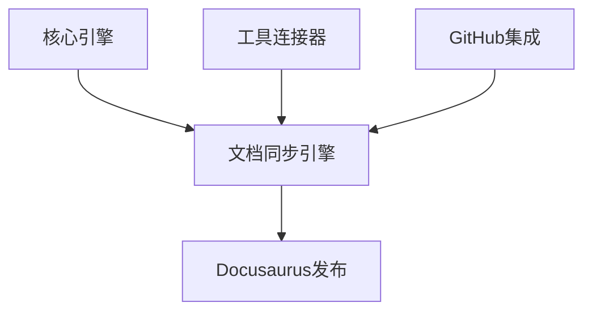

# VibeCopilot 文档同步引擎模块开发指南

> **文档元数据**
> 版本: 1.0
> 上次更新: 2024-04-21
> 负责人: 系统架构团队

## 1. 文档同步引擎模块概述

文档同步引擎是 VibeCopilot 的核心模块之一，负责在不同系统间同步文档内容，确保一致性。本模块支持与 Obsidian、本地文件系统以及 Docusaurus 之间的文档同步，处理格式转换、冲突检测与解决等关键功能。

### 1.1 核心职责

- 文档变更监控
- 双向同步逻辑实现
- 冲突检测与解决
- 格式转换与兼容性处理

### 1.2 架构位置

文档同步引擎位于业务层，与工具连接器和核心引擎紧密交互：



## 2. 开发环境准备

### 2.1 依赖安装

```bash
# 安装文档同步所需依赖
npm install --save chokidar diff markdown-it gray-matter yaml
```

### 2.2 类型定义

确保安装相关类型声明：

```bash
npm install --save-dev @types/markdown-it @types/diff
```

## 3. 模块接口实现

### 3.1 文档同步引擎接口

```typescript
// src/document_sync/interfaces.ts
import { Module } from '../core/interfaces';

export interface DocumentSyncEngine extends Module {
  /**
   * 同步特定文档
   * @param docPath 文档路径
   * @param direction 同步方向
   * @returns 同步结果
   */
  syncDocument(docPath: string, direction: SyncDirection): Promise<SyncResult>;

  /**
   * 检测并处理变更
   * @returns 变更结果列表
   */
  detectAndProcessChanges(): Promise<ChangeResult[]>;

  /**
   * 解决冲突
   * @param conflict 冲突信息
   * @param resolution 解决方案
   */
  resolveConflict(conflict: SyncConflict, resolution: Resolution): Promise<void>;

  /**
   * 获取同步状态
   * @param docPath 文档路径
   * @returns 同步状态
   */
  getSyncStatus(docPath: string): Promise<SyncStatus>;
}

export enum SyncDirection {
  LOCAL_TO_REMOTE = 'local_to_remote',
  REMOTE_TO_LOCAL = 'remote_to_local',
  BIDIRECTIONAL = 'bidirectional'
}

export interface SyncResult {
  success: boolean;
  docPath: string;
  direction: SyncDirection;
  conflicts?: SyncConflict[];
  error?: Error;
}

export interface ChangeResult {
  docPath: string;
  changeType: ChangeType;
  processed: boolean;
  error?: Error;
}

export enum ChangeType {
  CREATED = 'created',
  MODIFIED = 'modified',
  DELETED = 'deleted'
}

export interface SyncConflict {
  docPath: string;
  localContent: string;
  remoteContent: string;
  baseContent?: string;
  conflictType: ConflictType;
}

export enum ConflictType {
  CONTENT_CONFLICT = 'content_conflict',
  DELETE_MODIFY_CONFLICT = 'delete_modify_conflict'
}

export interface Resolution {
  type: ResolutionType;
  customContent?: string;
}

export enum ResolutionType {
  USE_LOCAL = 'use_local',
  USE_REMOTE = 'use_remote',
  MERGE = 'merge',
  CUSTOM = 'custom'
}

export interface SyncStatus {
  docPath: string;
  lastSynced: Date | null;
  syncState: SyncState;
  lastSyncDirection?: SyncDirection;
}

export enum SyncState {
  IN_SYNC = 'in_sync',
  LOCAL_AHEAD = 'local_ahead',
  REMOTE_AHEAD = 'remote_ahead',
  CONFLICT = 'conflict',
  UNKNOWN = 'unknown'
}
```

### 3.2 文档转换器接口

```typescript
// src/document_sync/transformer_interface.ts
export interface DocumentTransformer {
  /**
   * 转换文档格式
   * @param doc 源文档
   * @param targetFormat 目标格式
   * @returns 转换后的文档
   */
  transform(doc: Document, targetFormat: DocumentFormat): Document;

  /**
   * 合并文档内容
   * @param base 基础文档
   * @param local 本地文档
   * @param remote 远程文档
   * @returns 合并后的文档
   */
  mergeDocuments(base: Document, local: Document, remote: Document): Document;

  /**
   * 检测文档冲突
   * @param local 本地文档
   * @param remote 远程文档
   * @returns 冲突列表
   */
  detectConflicts(local: Document, remote: Document): Conflict[];
}

export interface Document {
  path: string;
  content: string;
  metadata: Record<string, any>;
  format: DocumentFormat;
  lastModified: Date;
}

export enum DocumentFormat {
  MARKDOWN = 'markdown',
  OBSIDIAN = 'obsidian',
  DOCUSAURUS = 'docusaurus'
}

export interface Conflict {
  path: string;
  section: {
    start: number;
    end: number;
  };
  localContent: string;
  remoteContent: string;
  type: ConflictType;
}
```

## 4. 核心实现

### 4.1 文档同步引擎实现

```typescript
// src/document_sync/implementations/sync_engine.ts
import { injectable, inject } from 'inversify';
import { DocumentSyncEngine, SyncDirection, SyncResult, ChangeResult, SyncConflict, Resolution, SyncStatus } from '../interfaces';
import { DocumentTransformer, Document } from '../transformer_interface';
import { ToolConnector } from '../../tool_connector/interfaces';
import { Module, ModuleStatus } from '../../core/interfaces';
import { EventBus } from '../../core/events';

@injectable()
export class DocumentSyncEngineImpl implements DocumentSyncEngine {
  private status: ModuleStatus = ModuleStatus.STOPPED;
  private syncStatus: Map<string, SyncStatus> = new Map();
  private changeDetectionInterval: NodeJS.Timeout | null = null;

  constructor(
    @inject('DocumentTransformer') private transformer: DocumentTransformer,
    @inject('ToolConnector') private toolConnector: ToolConnector,
    @inject('EventBus') private eventBus: EventBus,
    @inject('ConfigSystem') private configSystem: any
  ) {}

  async initialize(): Promise<void> {
    this.status = ModuleStatus.INITIALIZED;
    // 初始化逻辑...
    return Promise.resolve();
  }

  async start(): Promise<void> {
    if (this.status !== ModuleStatus.INITIALIZED) {
      throw new Error('Cannot start document sync engine: not initialized');
    }

    // 启动文件监控
    this.startFileWatcher();

    // 启动定期检查
    const changeDetectionInterval = this.configSystem.get('sync.changeDetectionInterval', 5000);
    this.changeDetectionInterval = setInterval(() => {
      this.detectAndProcessChanges().catch(error => {
        console.error('Error detecting changes:', error);
      });
    }, changeDetectionInterval);

    this.status = ModuleStatus.STARTED;
  }

  async stop(): Promise<void> {
    if (this.changeDetectionInterval) {
      clearInterval(this.changeDetectionInterval);
      this.changeDetectionInterval = null;
    }

    // 停止文件监控
    this.stopFileWatcher();

    this.status = ModuleStatus.STOPPED;
  }

  getStatus(): ModuleStatus {
    return this.status;
  }

  async syncDocument(docPath: string, direction: SyncDirection): Promise<SyncResult> {
    try {
      // 获取本地和远程文档
      const localDoc = await this.getLocalDocument(docPath);
      const remoteDoc = await this.getRemoteDocument(docPath);

      // 检测冲突
      const conflicts = this.transformer.detectConflicts(localDoc, remoteDoc);

      if (conflicts.length > 0) {
        // 有冲突，返回冲突信息
        return {
          success: false,
          docPath,
          direction,
          conflicts: conflicts.map(c => this.convertToSyncConflict(c, localDoc, remoteDoc))
        };
      }

      // 根据同步方向执行同步
      if (direction === SyncDirection.LOCAL_TO_REMOTE || direction === SyncDirection.BIDIRECTIONAL) {
        await this.syncLocalToRemote(localDoc);
      }

      if (direction === SyncDirection.REMOTE_TO_LOCAL || direction === SyncDirection.BIDIRECTIONAL) {
        await this.syncRemoteToLocal(remoteDoc);
      }

      // 更新同步状态
      this.updateSyncStatus(docPath, {
        docPath,
        lastSynced: new Date(),
        syncState: SyncState.IN_SYNC,
        lastSyncDirection: direction
      });

      return {
        success: true,
        docPath,
        direction
      };
    } catch (error) {
      return {
        success: false,
        docPath,
        direction,
        error: error as Error
      };
    }
  }

  async detectAndProcessChanges(): Promise<ChangeResult[]> {
    // 实现变更检测和处理逻辑...
    return [];
  }

  async resolveConflict(conflict: SyncConflict, resolution: Resolution): Promise<void> {
    // 实现冲突解决逻辑...
  }

  async getSyncStatus(docPath: string): Promise<SyncStatus> {
    const status = this.syncStatus.get(docPath);
    if (status) {
      return status;
    }

    return {
      docPath,
      lastSynced: null,
      syncState: SyncState.UNKNOWN
    };
  }

  // 私有辅助方法...
  private async getLocalDocument(path: string): Promise<Document> {
    // 实现获取本地文档的逻辑...
    return {} as Document;
  }

  private async getRemoteDocument(path: string): Promise<Document> {
    // 实现获取远程文档的逻辑...
    return {} as Document;
  }

  private async syncLocalToRemote(doc: Document): Promise<void> {
    // 实现本地到远程的同步逻辑...
  }

  private async syncRemoteToLocal(doc: Document): Promise<void> {
    // 实现远程到本地的同步逻辑...
  }

  private startFileWatcher(): void {
    // 启动文件监控...
  }

  private stopFileWatcher(): void {
    // 停止文件监控...
  }

  private updateSyncStatus(docPath: string, status: SyncStatus): void {
    this.syncStatus.set(docPath, status);
    this.eventBus.publish('sync:status-updated', status);
  }

  private convertToSyncConflict(conflict: Conflict, localDoc: Document, remoteDoc: Document): SyncConflict {
    // 将内部冲突转换为同步冲突格式...
    return {} as SyncConflict;
  }
}
```

### 4.2 文档转换器实现

```typescript
// src/document_sync/implementations/document_transformer.ts
import { injectable } from 'inversify';
import { DocumentTransformer, Document, DocumentFormat, Conflict } from '../transformer_interface';
import * as MarkdownIt from 'markdown-it';
import * as diff from 'diff';
import * as matter from 'gray-matter';

@injectable()
export class DocumentTransformerImpl implements DocumentTransformer {
  private markdownParser: MarkdownIt;

  constructor() {
    this.markdownParser = new MarkdownIt({
      html: true,
      linkify: true,
      typographer: true
    });
  }

  transform(doc: Document, targetFormat: DocumentFormat): Document {
    // 如果格式已经匹配，无需转换
    if (doc.format === targetFormat) {
      return { ...doc };
    }

    // 提取前置元数据
    const { data: metadata, content } = matter(doc.content);

    // 根据目标格式进行转换
    let transformedContent = content;
    switch (targetFormat) {
      case DocumentFormat.OBSIDIAN:
        transformedContent = this.transformToObsidian(content);
        break;
      case DocumentFormat.DOCUSAURUS:
        transformedContent = this.transformToDocusaurus(content, metadata);
        break;
      case DocumentFormat.MARKDOWN:
        transformedContent = this.transformToStandardMarkdown(content);
        break;
    }

    // 重新组合元数据和内容
    const newContent = matter.stringify(transformedContent, metadata);

    return {
      ...doc,
      content: newContent,
      format: targetFormat
    };
  }

  mergeDocuments(base: Document, local: Document, remote: Document): Document {
    // 三路合并实现...
    return {} as Document;
  }

  detectConflicts(local: Document, remote: Document): Conflict[] {
    // 冲突检测实现...
    return [];
  }

  // 私有转换方法
  private transformToObsidian(content: string): string {
    // 标准Markdown转Obsidian格式...
    return content;
  }

  private transformToDocusaurus(content: string, metadata: Record<string, any>): string {
    // 转换为Docusaurus格式...
    return content;
  }

  private transformToStandardMarkdown(content: string): string {
    // 其他格式转标准Markdown...
    return content;
  }
}
```

### 4.3 冲突解决器实现

```typescript
// src/document_sync/implementations/conflict_resolver.ts
import { injectable } from 'inversify';
import { SyncConflict, Resolution, ResolutionType } from '../interfaces';
import { Document } from '../transformer_interface';
import * as diff from 'diff';

@injectable()
export class ConflictResolverImpl {
  resolveConflict(conflict: SyncConflict, resolution: Resolution, base?: Document): Document {
    switch (resolution.type) {
      case ResolutionType.USE_LOCAL:
        return this.createResolvedDocument(conflict, conflict.localContent);

      case ResolutionType.USE_REMOTE:
        return this.createResolvedDocument(conflict, conflict.remoteContent);

      case ResolutionType.MERGE:
        return this.createMergedDocument(conflict, base);

      case ResolutionType.CUSTOM:
        if (!resolution.customContent) {
          throw new Error('Custom resolution requires content');
        }
        return this.createResolvedDocument(conflict, resolution.customContent);

      default:
        throw new Error(`Unknown resolution type: ${resolution.type}`);
    }
  }

  private createResolvedDocument(conflict: SyncConflict, content: string): Document {
    // 创建解决冲突后的文档...
    return {} as Document;
  }

  private createMergedDocument(conflict: SyncConflict, base?: Document): Document {
    // 创建合并文档...
    return {} as Document;
  }
}
```

## 5. 事件处理

文档同步引擎应发布以下事件以通知其他模块：

```typescript
// 同步开始
eventBus.publish('sync:started', { docPath, direction });

// 同步完成
eventBus.publish('sync:completed', { docPath, direction, success });

// 冲突检测
eventBus.publish('sync:conflict-detected', { docPath, conflicts });

// 冲突解决
eventBus.publish('sync:conflict-resolved', { docPath, resolution });

// 文档变更
eventBus.publish('doc:changed', { docPath, changeType });
```

## 6. 测试策略

### 6.1 单元测试

```typescript
// tests/document_sync/transformer.spec.ts
import { DocumentTransformerImpl } from '../../src/document_sync/implementations/document_transformer';
import { Document, DocumentFormat } from '../../src/document_sync/transformer_interface';

describe('DocumentTransformer', () => {
  let transformer: DocumentTransformerImpl;

  beforeEach(() => {
    transformer = new DocumentTransformerImpl();
  });

  test('transform should maintain document format if target format matches', () => {
    // 准备
    const doc: Document = {
      path: 'test.md',
      content: '# Test Heading',
      metadata: {},
      format: DocumentFormat.MARKDOWN,
      lastModified: new Date()
    };

    // 执行
    const result = transformer.transform(doc, DocumentFormat.MARKDOWN);

    // 断言
    expect(result).toEqual(expect.objectContaining({
      path: doc.path,
      content: doc.content,
      format: DocumentFormat.MARKDOWN
    }));
  });

  // 更多测试...
});
```

### 6.2 集成测试

```typescript
// tests/document_sync/sync_engine.spec.ts
import { Container } from 'inversify';
import { DocumentSyncEngineImpl } from '../../src/document_sync/implementations/sync_engine';
import { DocumentTransformerImpl } from '../../src/document_sync/implementations/document_transformer';
import { EventBusImpl } from '../../src/core/implementations/event_bus';
import { SyncDirection } from '../../src/document_sync/interfaces';

describe('DocumentSyncEngine Integration', () => {
  let container: Container;
  let syncEngine: DocumentSyncEngineImpl;

  beforeEach(() => {
    // 设置依赖注入容器
    container = new Container();
    container.bind('EventBus').to(EventBusImpl);
    container.bind('DocumentTransformer').to(DocumentTransformerImpl);
    container.bind('ToolConnector').toConstantValue(mockToolConnector);
    container.bind('ConfigSystem').toConstantValue(mockConfigSystem);
    container.bind('DocumentSyncEngine').to(DocumentSyncEngineImpl);

    syncEngine = container.get('DocumentSyncEngine');
    syncEngine.initialize();
  });

  test('should sync document successfully', async () => {
    // 测试同步功能...
  });

  // 更多集成测试...
});
```

## 7. 最佳实践与建议

### 7.1 文档处理

- 使用标准化的文档模型，避免硬编码格式细节
- 处理文档前始终提取和保留元数据
- 使用反向引用索引优化文档间链接处理
- 实现增量同步策略减少数据传输

### 7.2 冲突处理

- 始终保留冲突版本以便用户回退
- 使用三路合并算法减少假冲突
- 提供友好的冲突解决界面
- 支持自动合并策略配置

### 7.3 性能考虑

- 使用文件系统事件而非轮询
- 实现文档缓存减少重复解析
- 批量处理变更，避免频繁同步
- 大型文档使用流式处理

## 8. 故障排除

### 8.1 常见问题与解决方案

1. **同步失败**
   - 检查连接状态与权限
   - 验证文件路径和格式
   - 确认工具连接器状态

2. **冲突频繁**
   - 调整同步间隔
   - 检查时钟同步
   - 实现智能合并策略

3. **性能问题**
   - 启用增量同步
   - 限制监控文件数量
   - 优化文件监控配置

## 9. 扩展与未来发展

- 支持更多文档格式（如 AsciiDoc, ReStructuredText）
- 实现分布式冲突解决算法
- 添加差异可视化组件
- 支持自定义同步策略插件

---

本文档提供了 VibeCopilot 文档同步引擎模块开发的指南。开发者应遵循本指南，确保模块的设计与实现符合项目规范。随着项目发展，本指南将持续更新以反映最佳实践。
