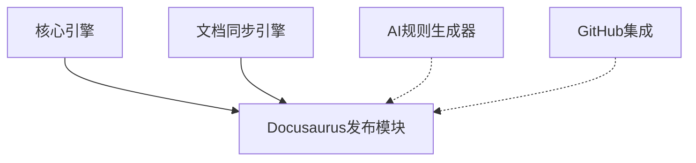

# VibeCopilot Docusaurus 发布模块开发指南

> **文档元数据**
> 版本: 1.0
> 上次更新: 2024-04-21
> 负责人: 文档团队

## 1. Docusaurus 发布模块概述

Docusaurus 发布模块负责将 VibeCopilot 生成的文档自动发布到 Docusaurus 站点。该模块处理文档格式转换、元数据管理和站点构建过程，实现文档的持续集成与部署。

### 1.1 核心职责

- 文档 Markdown 格式标准化与转换
- 管理 Docusaurus 前端元数据
- 处理文档间链接与引用
- 自动化构建与部署流程
- 版本化文档管理

### 1.2 架构位置

发布模块位于输出层，与核心模块协作：



## 2. 开发环境准备

### 2.1 依赖安装

```bash
# 核心依赖
npm install --save @docusaurus/core @docusaurus/preset-classic

# 工具依赖
npm install --save remark remark-rehype rehype-stringify gray-matter
```

### 2.2 环境配置

```bash
# Docusaurus 站点初始化（如果尚未创建）
npx @docusaurus/init@latest init my-website classic

# 本地开发服务器
cd my-website
npm start
```

## 3. 模块接口定义

### 3.1 发布模块接口

```typescript
// src/docusaurus_publisher/interfaces.ts
import { Module } from '../core/interfaces';

export interface DocusaurusPublisher extends Module {
  /**
   * 发布单个文档
   * @param source 源文档路径
   * @param options 发布选项
   * @returns 发布结果
   */
  publishDocument(source: string, options?: PublishOptions): Promise<PublishResult>;

  /**
   * 批量发布文档
   * @param sources 源文档路径列表
   * @param options 发布选项
   * @returns 批量发布结果
   */
  publishDocuments(sources: string[], options?: PublishOptions): Promise<PublishResult[]>;

  /**
   * 构建并部署站点
   * @param options 部署选项
   * @returns 部署结果
   */
  deployWebsite(options?: DeployOptions): Promise<DeployResult>;
}

export interface PublishOptions {
  category?: string;
  slug?: string;
  metadata?: Record<string, any>;
  overwrite?: boolean;
  generateSidebar?: boolean;
}

export interface PublishResult {
  success: boolean;
  source: string;
  destination?: string;
  errors?: Error[];
}

export interface DeployOptions {
  version?: string;
  environment?: 'production' | 'staging' | 'development';
  baseUrl?: string;
}

export interface DeployResult {
  success: boolean;
  url?: string;
  buildTime?: number;
  errors?: Error[];
}
```

### 3.2 文档转换器接口

```typescript
// src/docusaurus_publisher/transformer_interface.ts
export interface DocusaurusTransformer {
  /**
   * 转换文档为Docusaurus格式
   * @param content 原始文档内容
   * @param options 转换选项
   * @returns 转换后的文档内容
   */
  transform(content: string, options?: TransformOptions): Promise<string>;
}

export interface TransformOptions {
  frontMatter?: Record<string, any>;
  processCodeBlocks?: boolean;
  resolveLinks?: boolean;
  addTableOfContents?: boolean;
}
```

## 4. 核心实现

### 4.1 发布模块实现

```typescript
// src/docusaurus_publisher/implementations/docusaurus_publisher.ts
import { injectable, inject } from 'inversify';
import * as path from 'path';
import * as fs from 'fs/promises';
import {
  DocusaurusPublisher, PublishOptions, PublishResult,
  DeployOptions, DeployResult
} from '../interfaces';
import { DocusaurusTransformer } from '../transformer_interface';
import { Module, ModuleStatus } from '../../core/interfaces';
import { spawn } from 'child_process';

@injectable()
export class DocusaurusPublisherImpl implements DocusaurusPublisher {
  private status: ModuleStatus = ModuleStatus.STOPPED;
  private websitePath: string = '';
  private docsPath: string = '';

  constructor(
    @inject('DocusaurusTransformer') private transformer: DocusaurusTransformer,
    @inject('ConfigSystem') private configSystem: any,
    @inject('LogSystem') private logger: any
  ) {}

  async initialize(): Promise<void> {
    this.websitePath = this.configSystem.get('docusaurus.path', '');
    this.docsPath = path.join(this.websitePath, 'docs');

    // 验证Docusaurus站点路径
    try {
      await fs.access(this.websitePath);
      await fs.access(this.docsPath);
    } catch (error) {
      throw new Error(`Invalid Docusaurus website path: ${this.websitePath}`);
    }

    this.status = ModuleStatus.INITIALIZED;
    return Promise.resolve();
  }

  async start(): Promise<void> {
    if (this.status !== ModuleStatus.INITIALIZED) {
      throw new Error('Cannot start Docusaurus publisher: not initialized');
    }

    this.status = ModuleStatus.STARTED;
  }

  async stop(): Promise<void> {
    this.status = ModuleStatus.STOPPED;
  }

  getStatus(): ModuleStatus {
    return this.status;
  }

  async publishDocument(source: string, options: PublishOptions = {}): Promise<PublishResult> {
    if (this.status !== ModuleStatus.STARTED) {
      throw new Error('Docusaurus publisher not started');
    }

    try {
      // 读取源文档
      const content = await fs.readFile(source, 'utf-8');

      // 确定目标路径
      const fileName = options.slug || path.basename(source);
      const category = options.category || 'default';
      const categoryPath = path.join(this.docsPath, category);
      const destPath = path.join(categoryPath, fileName);

      // 创建目录（如果不存在）
      await fs.mkdir(categoryPath, { recursive: true });

      // 检查是否存在且不允许覆盖
      if (!options.overwrite) {
        try {
          await fs.access(destPath);
          return {
            success: false,
            source,
            errors: [new Error(`Destination file already exists: ${destPath}`)]
          };
        } catch (error) {
          // 文件不存在，可以继续
        }
      }

      // 转换文档
      const transformedContent = await this.transformer.transform(content, {
        frontMatter: options.metadata,
        processCodeBlocks: true,
        resolveLinks: true,
        addTableOfContents: true
      });

      // 写入目标文件
      await fs.writeFile(destPath, transformedContent, 'utf-8');

      // 更新侧边栏（如果需要）
      if (options.generateSidebar) {
        await this.updateSidebar();
      }

      return {
        success: true,
        source,
        destination: destPath
      };
    } catch (error) {
      this.logger.error(`Failed to publish document: ${source}`, error);
      return {
        success: false,
        source,
        errors: [error as Error]
      };
    }
  }

  async publishDocuments(sources: string[], options: PublishOptions = {}): Promise<PublishResult[]> {
    return Promise.all(sources.map(source => this.publishDocument(source, options)));
  }

  async deployWebsite(options: DeployOptions = {}): Promise<DeployResult> {
    if (this.status !== ModuleStatus.STARTED) {
      throw new Error('Docusaurus publisher not started');
    }

    const startTime = Date.now();

    try {
      // 设置环境变量
      const env = {
        ...process.env,
        NODE_ENV: options.environment || 'production',
        BASE_URL: options.baseUrl || '/'
      };

      // 执行构建
      const result = await this.runCommand('npm', ['run', 'build'], {
        cwd: this.websitePath,
        env
      });

      if (result.code !== 0) {
        throw new Error(`Build failed with code ${result.code}: ${result.stderr}`);
      }

      // 获取部署URL
      const deployUrl = this.configSystem.get('docusaurus.deployUrl', '');

      return {
        success: true,
        url: deployUrl,
        buildTime: Date.now() - startTime
      };
    } catch (error) {
      this.logger.error('Failed to deploy website', error);
      return {
        success: false,
        errors: [error as Error]
      };
    }
  }

  // 内部方法

  private async updateSidebar(): Promise<void> {
    // 实现侧边栏自动生成逻辑
    const sidebarPath = path.join(this.websitePath, 'sidebars.js');

    // 这里简化实现，实际应该分析文档结构生成合适的侧边栏
    // ...
  }

  private runCommand(command: string, args: string[], options: any): Promise<{code: number, stdout: string, stderr: string}> {
    return new Promise((resolve, reject) => {
      const process = spawn(command, args, options);

      let stdout = '';
      let stderr = '';

      process.stdout.on('data', (data) => {
        stdout += data.toString();
      });

      process.stderr.on('data', (data) => {
        stderr += data.toString();
      });

      process.on('close', (code) => {
        resolve({ code: code || 0, stdout, stderr });
      });

      process.on('error', (err) => {
        reject(err);
      });
    });
  }
}
```

### 4.2 文档转换器实现

```typescript
// src/docusaurus_publisher/implementations/transformer.ts
import { injectable } from 'inversify';
import { DocusaurusTransformer, TransformOptions } from '../transformer_interface';
import matter from 'gray-matter';
import { remark } from 'remark';
import remarkRehype from 'remark-rehype';
import rehypeStringify from 'rehype-stringify';

@injectable()
export class DocusaurusTransformerImpl implements DocusaurusTransformer {
  async transform(content: string, options: TransformOptions = {}): Promise<string> {
    // 解析前置元数据
    const { data: existingFrontMatter, content: markdownContent } = matter(content);

    // 合并元数据
    const frontMatter = {
      ...existingFrontMatter,
      ...options.frontMatter,
      // 添加默认元数据
      sidebar_position: existingFrontMatter.sidebar_position || 1,
      slug: existingFrontMatter.slug || options.frontMatter?.slug
    };

    // 处理内容
    let processedContent = markdownContent;

    // 处理代码块
    if (options.processCodeBlocks) {
      processedContent = this.processCodeBlocks(processedContent);
    }

    // 解析内部链接
    if (options.resolveLinks) {
      processedContent = this.resolveLinks(processedContent);
    }

    // 添加目录
    if (options.addTableOfContents && !frontMatter.hide_table_of_contents) {
      frontMatter.toc_min_heading_level = frontMatter.toc_min_heading_level || 2;
      frontMatter.toc_max_heading_level = frontMatter.toc_max_heading_level || 3;
    }

    // 重新组合文档
    const result = matter.stringify(processedContent, frontMatter);
    return result;
  }

  private processCodeBlocks(content: string): string {
    // 实现代码块增强，例如添加行号、高亮等
    return content.replace(/```(\w+)/g, (match, lang) => {
      return `\`\`\`${lang} showLineNumbers`;
    });
  }

  private resolveLinks(content: string): string {
    // 转换相对链接为Docusaurus格式
    return content.replace(/\[([^\]]+)\]\(([^)]+)\)/g, (match, text, url) => {
      if (url.startsWith('http') || url.startsWith('#')) {
        return match; // 外部链接或锚点保持不变
      }

      // 识别Markdown文件链接
      if (url.endsWith('.md')) {
        // 移除.md扩展名，Docusaurus会自动处理
        const docUrl = url.replace(/\.md$/, '');
        return `[${text}](${docUrl})`;
      }

      return match;
    });
  }
}
```

## 5. 测试策略

### 5.1 单元测试

```typescript
// tests/docusaurus_publisher/docusaurus_publisher.spec.ts
import { DocusaurusPublisherImpl } from '../../src/docusaurus_publisher/implementations/docusaurus_publisher';
import { PublishOptions } from '../../src/docusaurus_publisher/interfaces';
import * as fs from 'fs/promises';

jest.mock('fs/promises');
jest.mock('child_process', () => ({
  spawn: jest.fn().mockImplementation(() => {
    const process = {
      stdout: { on: jest.fn() },
      stderr: { on: jest.fn() },
      on: jest.fn()
    };

    process.on.mockImplementation((event, callback) => {
      if (event === 'close') {
        setTimeout(() => callback(0), 10);
      }
      return process;
    });

    process.stdout.on.mockImplementation((event, callback) => {
      if (event === 'data') {
        setTimeout(() => callback(Buffer.from('Build completed')), 5);
      }
      return process;
    });

    process.stderr.on.mockImplementation((event, callback) => {
      return process;
    });

    return process;
  })
}));

describe('DocusaurusPublisher', () => {
  let publisher: DocusaurusPublisherImpl;
  let mockTransformer: any;
  let mockConfigSystem: any;
  let mockLogger: any;

  beforeEach(() => {
    mockTransformer = {
      transform: jest.fn().mockResolvedValue('transformed content')
    };

    mockConfigSystem = {
      get: jest.fn().mockImplementation((key, defaultValue) => {
        if (key === 'docusaurus.path') return '/test/website';
        if (key === 'docusaurus.deployUrl') return 'https://example.com/docs';
        return defaultValue;
      })
    };

    mockLogger = {
      error: jest.fn()
    };

    (fs.access as jest.Mock).mockResolvedValue(undefined);
    (fs.readFile as jest.Mock).mockResolvedValue('test content');
    (fs.writeFile as jest.Mock).mockResolvedValue(undefined);
    (fs.mkdir as jest.Mock).mockResolvedValue(undefined);

    publisher = new DocusaurusPublisherImpl(
      mockTransformer,
      mockConfigSystem,
      mockLogger
    );
  });

  test('should initialize correctly', async () => {
    await publisher.initialize();
    expect(publisher.getStatus()).toBe('initialized');
    expect(fs.access).toHaveBeenCalledWith('/test/website');
    expect(fs.access).toHaveBeenCalledWith('/test/website/docs');
  });

  test('should publish document successfully', async () => {
    // 安排
    await publisher.initialize();
    await publisher.start();

    const options: PublishOptions = {
      category: 'guides',
      slug: 'test-guide.md',
      metadata: { title: 'Test Guide' }
    };

    // 执行
    const result = await publisher.publishDocument('/source/test.md', options);

    // 断言
    expect(result.success).toBe(true);
    expect(result.destination).toBe('/test/website/docs/guides/test-guide.md');
    expect(fs.mkdir).toHaveBeenCalledWith('/test/website/docs/guides', { recursive: true });
    expect(fs.readFile).toHaveBeenCalledWith('/source/test.md', 'utf-8');
    expect(mockTransformer.transform).toHaveBeenCalledWith('test content', expect.objectContaining({
      frontMatter: { title: 'Test Guide' }
    }));
    expect(fs.writeFile).toHaveBeenCalledWith(
      '/test/website/docs/guides/test-guide.md',
      'transformed content',
      'utf-8'
    );
  });

  // 更多测试...
});
```

### 5.2 转换器测试

```typescript
// tests/docusaurus_publisher/transformer.spec.ts
import { DocusaurusTransformerImpl } from '../../src/docusaurus_publisher/implementations/transformer';

describe('DocusaurusTransformer', () => {
  let transformer: DocusaurusTransformerImpl;

  beforeEach(() => {
    transformer = new DocusaurusTransformerImpl();
  });

  test('should merge front matter', async () => {
    // 准备
    const content = '---\ntitle: Original Title\n---\n\nContent';

    // 执行
    const result = await transformer.transform(content, {
      frontMatter: {
        description: 'Test description'
      }
    });

    // 断言
    expect(result).toContain('title: Original Title');
    expect(result).toContain('description: Test description');
  });

  test('should process code blocks', async () => {
    // 准备
    const content = 'Test\n\n```javascript\nconst x = 1;\n```';

    // 执行
    const result = await transformer.transform(content, {
      processCodeBlocks: true
    });

    // 断言
    expect(result).toContain('```javascript showLineNumbers');
  });

  test('should resolve markdown links', async () => {
    // 准备
    const content = '[Link](./other-doc.md)';

    // 执行
    const result = await transformer.transform(content, {
      resolveLinks: true
    });

    // 断言
    expect(result).toContain('[Link](./other-doc)');
  });

  // 更多测试...
});
```

## 6. 最佳实践与建议

### 6.1 文档组织

- 按照明确的目录结构组织文档
- 使用一致的元数据格式
- 实现自动化侧边栏生成
- 维护文档间引用关系

### 6.2 构建与部署

- 使用持续集成自动构建站点
- 实现预览环境与生产环境分离
- 添加构建前验证步骤
- 使用版本化管理重要文档

### 6.3 性能优化

- 优化图片资源
- 实现增量构建
- 使用内容散列缓存
- 优化搜索索引生成

## 7. 常见问题与解决方案

### 7.1 文档转换错误

**问题**: 转换复杂Markdown格式失败。

**解决方案**:

- 添加详细日志以识别问题点
- 实现格式验证预检
- 考虑使用更精细的解析器
- 为特殊格式添加自定义处理器

### 7.2 构建失败

**问题**: Docusaurus构建过程失败。

**解决方案**:

- 确保Node.js版本兼容
- 检查依赖项冲突
- 增加构建内存限制
- 隔离处理大型文档

### 7.3 链接断裂

**问题**: 文档间链接在发布后断裂。

**解决方案**:

- 实现链接验证工具
- 使用相对路径而非绝对路径
- 维护文档ID映射表
- 自动修复常见链接问题

## 8. 扩展与未来发展

- 集成更多主题和插件
- 添加国际化支持
- 实现文档分析和使用统计
- 支持交互式内容（如嵌入式代码示例）
- 提供API文档生成工具集成

---

本文档提供了 VibeCopilot Docusaurus 发布模块开发的指南。开发者应遵循本指南，确保模块与整体系统的无缝集成。随着项目发展，本指南将持续更新以反映最新的最佳实践。
