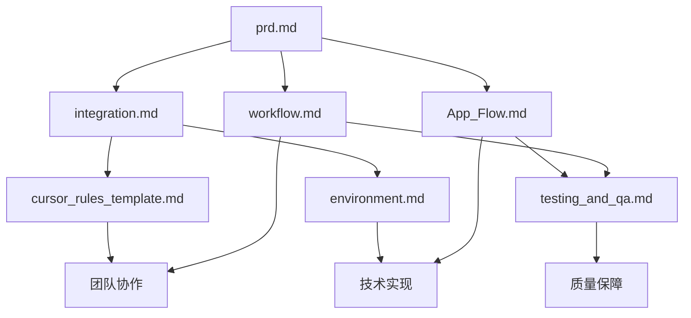

# VibeCopilot 文件使用范围指南

本文档明确定义了 VibeCopilot 项目中各核心文档的使用范围、适用场景和主要受众，帮助团队成员理解不同文档的定位和用途。

## 1. 核心文档分类与职责

| 文档类别 | 主要职责 | 适用阶段 | 主要受众 |
|---------|--------|---------|---------|
| 规划文档 | 定义项目方向和需求 | 项目启动前/初期 | 产品经理、技术负责人 |
| 架构文档 | 描述系统架构和技术方案 | 设计阶段 | 开发人员、架构师 |
| 流程文档 | 规范化开发/协作流程 | 全生命周期 | 全体团队成员 |
| 指南文档 | 提供具体操作步骤 | 实施阶段 | 具体执行者 |
| 规范文档 | 定义标准和准则 | 全生命周期 | 全体团队成员 |

## 2. 关键文档使用范围

### 2.1 规划与愿景文档

#### `docs/dev/architecture/prd.md`

- **使用范围**：项目立项和规划阶段
- **主要功能**：定义项目核心定位、目标、用户画像及功能需求
- **使用场景**：
  - 项目启动会议参考文档
  - 与利益相关者沟通项目范围
  - 指导开发团队理解产品愿景
- **维护责任**：产品经理
- **更新频率**：项目初期密集更新，之后在重大方向变更时更新

#### `docs/dev/architecture/integration.md`

- **使用范围**：项目规划与执行对齐
- **主要功能**：确保项目实施与初始设想保持一致，提供实施路径图
- **使用场景**：
  - 项目进度检查
  - 团队方向调整决策
  - 资源分配规划
- **维护责任**：项目经理/技术负责人
- **更新频率**：按阶段里程碑更新

### 2.2 架构与技术文档

#### `docs/dev/architecture/App_Flow.md`

- **使用范围**：系统设计和实现阶段
- **主要功能**：详细描述应用交互流程、数据流和系统组件关系
- **使用场景**：
  - 开发人员理解系统交互机制
  - 实现具体功能模块时的参考
  - 测试人员设计测试用例
- **维护责任**：架构师/技术负责人
- **更新频率**：架构变更时更新

#### `docs/dev/tech_stack.md`

- **使用范围**：技术选型和开发环境配置
- **主要功能**：明确项目使用的技术栈和工具链
- **使用场景**：
  - 新开发人员入职参考
  - 环境搭建指南
  - 依赖管理决策
- **维护责任**：技术负责人
- **更新频率**：技术栈变更时更新

### 2.3 流程与协作文档

#### `docs/dev/architecture/workflow.md`

- **使用范围**：团队协作流程和工作方式
- **主要功能**：定义标准化的AI辅助开发流程，解决团队痛点
- **使用场景**：
  - 团队成员理解工作流程
  - 规范化协作方式
  - 明确各阶段工作内容和交付物
- **维护责任**：项目经理/流程负责人
- **更新频率**：流程优化时更新

#### `docs/ai/rules/cursor_rules_template.md`

- **使用范围**：AI工具配置和使用
- **主要功能**：提供AI规则模板，统一AI工具使用方式
- **使用场景**：
  - 配置AI编程助手
  - 标准化AI输出
  - 指导AI工具正确使用
- **维护责任**：AI工程师/提示词工程师
- **更新频率**：AI工具升级或规则优化时更新

### 2.4 指南文档

#### `docs/dev/environment.md`

- **使用范围**：开发环境搭建和配置
- **主要功能**：提供详细的环境配置步骤和最佳实践
- **使用场景**：
  - 新团队成员入职
  - 环境迁移或重建
  - 开发工具配置统一
- **维护责任**：开发运维人员
- **更新频率**：环境变更或工具更新时更新

#### `docs/dev/guides/testing_and_qa.md`

- **使用范围**：测试和质量保障活动
- **主要功能**：规范化测试策略和质量控制流程
- **使用场景**：
  - 编写和执行测试
  - 代码审查
  - 质量指标监控
- **维护责任**：测试负责人/质量工程师
- **更新频率**：测试策略调整时更新

## 3. 关键文档区别与配合

### 3.1 `workflow.md` vs `App_Flow.md`

这两个文档经常被混淆，但它们有明显的区别和互补关系：

| 特性 | workflow.md | App_Flow.md |
|-----|------------|------------|
| 主要关注点 | 团队工作流程和协作方式 | 应用系统内部交互流程 |
| 受众 | 项目团队成员 | 主要面向开发人员 |
| 内容类型 | 工作方法论和最佳实践 | 技术流程图和系统设计 |
| 使用时机 | 指导日常工作流程和协作 | 指导具体功能实现和集成 |
| 描述内容 | 人与人、人与AI的协作流程 | 系统组件间的交互和数据流 |

#### 使用建议

- **先参考 workflow.md**：了解"我们如何工作"
- **再参考 App_Flow.md**：了解"系统如何工作"

### 3.2 文档间的协作关系

## 4. 文档使用最佳实践

### 4.1 根据角色选择起点文档

- **项目经理/产品经理**：从 `prd.md` 和 `workflow.md` 开始
- **架构师/技术负责人**：从 `prd.md` 和 `App_Flow.md` 开始
- **开发人员**：从 `workflow.md`、`App_Flow.md` 和 `environment.md` 开始
- **测试人员**：从 `App_Flow.md` 和 `testing_and_qa.md` 开始
- **新加入成员**：从 `workflow.md` 和 `environment.md` 开始

### 4.2 文档更新原则

1. **集中修改**：相关变更应集中在一次提交中完成
2. **保持一致**：更新一个文档时检查相关文档是否需要同步更新
3. **明确记录**：在变更日志中记录重要修改
4. **及时通知**：重要文档更新后通知相关团队成员

### 4.3 文档查找指南

当遇到问题时，按以下顺序查找文档：

1. 工作流程问题 → `workflow.md`
2. 系统设计问题 → `App_Flow.md`
3. 开发环境问题 → `environment.md`
4. 测试和质量问题 → `testing_and_qa.md`
5. AI工具使用问题 → `cursor_rules_template.md`

## 5. 文档版本和演进

所有文档都应该按照项目的演进进行更新：

- **V1 (MVP阶段)**：基础文档框架，明确核心概念
- **V2 (增强阶段)**：增加详细示例，完善最佳实践
- **V3 (成熟阶段)**：增加高级用例，优化流程，提取跨项目经验

每个阶段的文档更新都应该与 `integration.md` 中的实施路线图保持一致。

---

本指南帮助团队成员理解各文档的使用范围和时机，确保文档驱动的开发流程能够高效执行。如有问题，请联系文档维护团队。
