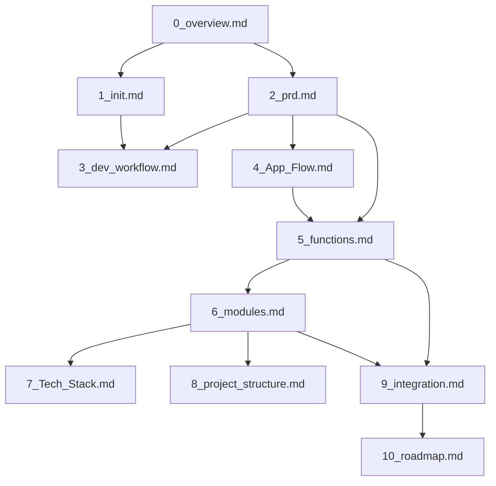

# VibeCopilot 文件使用范围指南

> **文档元数据**
> 版本: 1.1
> 上次更新: 2024-04-20
> 负责人: 文档架构团队

本文档明确定义了 VibeCopilot 项目架构文档的使用范围、适用场景和主要受众，帮助团队成员理解不同文档的定位和用途。

## 1. 架构文档体系概览

VibeCopilot 项目采用结构化的文档体系，按照从概念到实现的顺序组织：

| 文档序号 | 文档名称 | 主要职责 | 主要受众 |
|---------|---------|---------|---------|
| 0 | `0_overview.md` | 项目总体概述与架构 | 所有相关人员 |
| 1 | `1_init.md` | 项目初始愿景与核心理念 | 产品经理、技术负责人 |
| 2 | `2_prd.md` | 产品需求与功能定义 | 开发团队、产品经理 |
| 3 | `3_dev_workflow.md` | 开发流程与贡献指南 | 开发团队成员 |
| 4 | `4_App_Flow.md` | 应用流程与组件交互 | 开发人员、架构师 |
| 5 | `5_functions.md` | 功能模块与API设计 | 开发人员 |
| 6 | `6_modules.md` | 模块设计与接口定义 | 开发人员 |
| 7 | `7_Tech_Stack.md` | 技术栈与实现映射 | 开发人员、架构师 |
| 8 | `8_project_structure.md` | 项目结构与代码组织 | 开发人员 |
| 9 | `9_integration.md` | 功能模块与设计对齐 | 项目经理、技术负责人 |
| 10 | `10_roadmap.md` | 开发路线图与资源规划 | 项目经理、开发团队 |

## 2. 核心文档使用指南

### 2.1 顶层文档

#### `0_overview.md`

- **使用范围**：项目初识和整体理解
- **主要内容**：
  - 项目定位和核心价值
  - 整体架构概览
  - 主要模块间关系
- **使用场景**：
  - 新成员快速了解项目
  - 项目介绍会议参考资料
  - 高层决策者了解项目范围
- **维护责任**：技术负责人
- **更新频率**：重大架构调整时更新

#### `1_init.md`

- **使用范围**：理解项目愿景和初始理念
- **主要内容**：
  - 项目愿景和初始理念
  - "文档先于代码"核心思想
  - 与传统AI辅助开发的区别
  - 原创贡献说明
- **使用场景**：
  - 了解项目创立初衷
  - 团队价值观与方法论对齐
- **维护责任**：产品负责人
- **更新频率**：核心理念变更时更新

### 2.2 需求与流程文档

#### `2_prd.md`

- **使用范围**：产品需求与功能定义
- **主要内容**：
  - 产品定位和用户画像
  - 核心功能需求
  - 验收标准与风险评估
- **使用场景**：
  - 功能开发参考
  - 产品设计决策依据
  - 项目范围控制
- **维护责任**：产品经理
- **更新频率**：产品需求变更时更新

#### `3_dev_workflow.md`

- **使用范围**：开发流程与协作规范
- **主要内容**：
  - VibeCopilot项目开发步骤
  - 贡献指南与最佳实践
  - 问题解决方案
  - 项目目录结构说明
- **使用场景**：
  - 日常开发工作参考
  - 新成员融入团队流程
  - 规范化开发过程
- **维护责任**：开发负责人
- **更新频率**：开发流程优化时更新

### 2.3 设计与架构文档

#### `4_App_Flow.md`

- **使用范围**：系统设计与组件交互
- **主要内容**：
  - 应用流程图
  - 用户交互场景
  - 组件间数据流转
- **使用场景**：
  - 理解系统整体流程
  - 开发具体功能时的上下文参考
  - 接口设计决策依据
- **维护责任**：架构师
- **更新频率**：系统流程变更时更新

#### `5_functions.md`

- **使用范围**：功能接口设计与API定义
- **主要内容**：
  - 功能模块优先级映射
  - 核心功能API定义
  - 功能依赖关系
  - 功能实现路径
- **使用场景**：
  - API接口开发参考
  - 功能实现优先级确定
  - 跨模块集成规划
- **维护责任**：技术设计负责人
- **更新频率**：功能接口变更时更新

#### `6_modules.md`

- **使用范围**：模块设计与接口定义
- **主要内容**：
  - 模块架构与分层
  - 核心模块接口定义
  - 模块间通信机制
  - 插件系统设计
- **使用场景**：
  - 模块实现参考
  - 系统扩展设计
  - 组件封装和集成
- **维护责任**：架构师
- **更新频率**：模块架构变更时更新

### 2.4 实现与规划文档

#### `7_Tech_Stack.md`

- **使用范围**：技术选型与实现映射
- **主要内容**：
  - 核心技术栈与模块映射
  - 技术整合策略
  - 模块间通信实现
  - 技术债务管理
- **使用场景**：
  - 技术选型决策
  - 实现方案设计
  - 代码结构规划
- **维护责任**：技术架构团队
- **更新频率**：技术栈变更时更新

#### `8_project_structure.md`

- **使用范围**：项目目录与代码组织
- **主要内容**：
  - 基于模块的目录结构
  - 文件命名和组织规范
  - 模块封装策略
  - 开发流程与模块关系
- **使用场景**：
  - 代码组织参考
  - 新文件创建位置决策
  - 模块实现位置确定
- **维护责任**：技术负责人
- **更新频率**：项目结构调整时更新

#### `9_integration.md`

- **使用范围**：功能与初始设计对齐
- **主要内容**：
  - 功能模块与初始理念对应关系
  - 架构与模块映射
  - 实现差距与优先级
  - 技术债务管理
- **使用场景**：
  - 项目进度与方向评估
  - 资源分配决策
  - 实施路径调整
- **维护责任**：项目经理/技术负责人
- **更新频率**：里程碑更新时更新

#### `10_roadmap.md`

- **使用范围**：开发计划与资源规划
- **主要内容**：
  - 基于功能模块的开发路线图
  - 里程碑与优先级规划
  - 详细任务分解
  - 资源分配与风险管理
- **使用场景**：
  - 开发计划制定
  - 进度跟踪与调整
  - 团队资源规划
- **维护责任**：项目经理
- **更新频率**：计划调整或里程碑达成时更新

## 3. 文档之间的关系与导航

### 3.1 文档依赖关系

### 3.2 文档阅读路径

根据不同角色和目的，建议的文档阅读路径：

#### 1. 项目概览路径

对项目需要快速了解：`0_overview.md` → `2_prd.md` → `4_App_Flow.md`

#### 2. 开发实施路径

需要开始功能开发：`3_dev_workflow.md` → `5_functions.md` → `6_modules.md` → `8_project_structure.md`

#### 3. 架构设计路径

需要理解系统架构：`0_overview.md` → `4_App_Flow.md` → `6_modules.md` → `7_Tech_Stack.md`

#### 4. 项目管理路径

需要管理项目进度：`2_prd.md` → `9_integration.md` → `10_roadmap.md`

## 4. 文档使用最佳实践

### 4.1 根据角色选择文档

- **产品经理**：`0_overview.md` → `1_init.md` → `2_prd.md`
- **架构师**：`0_overview.md` → `4_App_Flow.md` → `6_modules.md` → `7_Tech_Stack.md`
- **开发人员**：`3_dev_workflow.md` → `5_functions.md` → `8_project_structure.md`
- **项目经理**：`2_prd.md` → `9_integration.md` → `10_roadmap.md`
- **新团队成员**：`0_overview.md` → `3_dev_workflow.md` → 根据角色选择后续文档

### 4.2 文档更新原则

1. **同步更新**：当一个文档内容变更时，检查相关依赖文档是否需要同步更新
2. **版本标记**：重要更新应在文档元数据中更新版本号
3. **变更说明**：每次重要更新应在文件末尾添加变更记录
4. **评审流程**：核心文档变更应经过相关负责人评审

### 4.3 问题定位指导

当遇到不同类型的问题，应参考的文档：

- **功能应该做什么**：参考 `2_prd.md`
- **功能应该怎么做**：参考 `5_functions.md` 和 `6_modules.md`
- **代码应该放在哪里**：参考 `8_project_structure.md`
- **应该用什么技术实现**：参考 `7_Tech_Stack.md`
- **开发流程是什么**：参考 `3_dev_workflow.md`
- **什么时候完成**：参考 `10_roadmap.md`

## 5. 文档维护与演进

### 5.1 文档生命周期

所有架构文档遵循一致的生命周期管理：

1. **草稿阶段**：初始编写，标记为"草稿"
2. **评审阶段**：团队评审，收集反馈
3. **发布阶段**：正式发布，可作为开发依据
4. **维护阶段**：定期更新，保持与实现一致
5. **归档阶段**：当被新版本替代时归档

### 5.2 文档质量标准

高质量的架构文档应具备：

1. **完整性**：覆盖所有必要内容
2. **一致性**：与其他文档保持一致
3. **清晰性**：表述清晰，避免歧义
4. **简洁性**：避免冗余内容
5. **适用性**：满足目标读者需求

---

本指南帮助团队成员理解和有效使用VibeCopilot架构文档体系，确保文档驱动的开发模式能够高效执行。如有问题，请联系文档架构团队。
