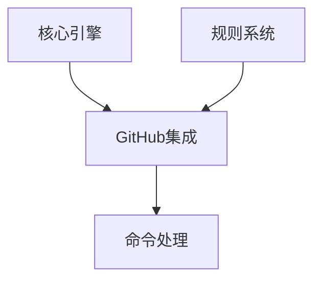

# VibeCopilot GitHub集成概览

> **文档元数据**
> 版本: 2.0
> 上次更新: 2024-04-25
> 负责人: 系统架构团队

## 1. GitHub集成概述

GitHub集成是VibeCopilot的核心组件之一，提供与GitHub平台的深度集成能力，支持项目管理和任务同步。该模块通过Python脚本和规则系统实现，使开发者能够在文档和代码之间建立紧密联系。

### 1.1 核心职责

- GitHub API 交互
- 任务和Issue管理
- 项目状态监控
- 通过命令行控制GitHub功能

### 1.2 架构位置

GitHub集成与核心引擎和规则系统紧密协作：



## 2. 功能组件

### 2.1 命令处理

GitHub集成模块处理以下类型的命令：

- `github status`: 显示当前仓库状态
- `github issue`: 管理GitHub Issues
- `github pr`: 管理Pull Requests
- `github branch`: 分支管理相关操作

### 2.2 API封装

该模块对GitHub API进行轻量级封装，提供以下功能：

- 身份验证与授权
- Issue和PR创建与更新
- 仓库信息查询
- 提交和分支管理

### 2.3 规则集成

与VibeCopilot规则系统的集成允许：

- 通过规则触发GitHub操作
- 将GitHub事件映射到规则执行
- 通过规则管理项目工作流

## 3. 实现方法

### 3.1 认证配置

GitHub集成使用个人访问令牌(PAT)进行身份验证：

```python
# 基本配置示例
def setup_github_client(token=None):
    """设置GitHub客户端"""
    if not token:
        token = os.environ.get('GITHUB_TOKEN')

    if not token:
        raise ValueError("GitHub token not found")

    return github.Github(token)
```

### 3.2 命令实现

命令通过Python脚本实现，例如：

```python
# Issue创建命令示例
def create_issue(repo_name, title, body=None, labels=None):
    """创建GitHub Issue"""
    client = setup_github_client()
    repo = client.get_repo(repo_name)

    if not labels:
        labels = []

    issue = repo.create_issue(
        title=title,
        body=body,
        labels=labels
    )

    return issue.number
```

### 3.3 与规则系统集成

GitHub集成可以在规则系统中被调用：

```markdown
# Issue创建规则

## 执行条件
当用户请求创建任务或提出问题时触发

## 执行步骤
1. 解析用户请求内容
2. 格式化Issue标题和描述
3. 调用GitHub API创建Issue
4. 返回Issue链接

## 实现脚本
```python
from scripts.github.issues import create_issue

def process_issue_request(request):
    # 解析请求
    title = extract_title(request)
    body = format_body(request)

    # 创建Issue
    issue_number = create_issue(
        repo_name="user/repo",
        title=title,
        body=body
    )

    # 返回结果
    return f"Issue #{issue_number} created successfully"
```
```

## 4. 与其他组件集成

### 4.1 与核心引擎集成

- 核心引擎调用GitHub集成命令
- GitHub事件可以触发核心引擎动作
- 共享配置和上下文信息

### 4.2 与知识库集成

- 将GitHub Issue链接到知识库文档
- 从知识库内容创建GitHub Issue
- 将项目状态信息存储在知识库中

## 5. 最佳实践

### 5.1 GitHub交互

- 使用合适的认证方式
- 实现请求缓存减少API调用
- 处理API速率限制
- 错误处理和重试机制

### 5.2 命令设计

- 保持命令简洁明了
- 提供详细的帮助信息
- 支持批处理操作
- 提供可读的输出格式

### 5.3 安全考虑

- 安全存储GitHub令牌
- 使用最小权限原则
- 避免在日志中泄露敏感信息
- 实现令牌轮换机制

## 6. 常见问题与解决方案

### 6.1 认证失败

**问题**: GitHub认证失败或令牌无效

**解决方案**:
- 检查环境变量配置
- 验证令牌权限范围
- 检查令牌是否过期
- 使用命令行测试认证

### 6.2 API限制

**问题**: 达到GitHub API请求限制

**解决方案**:
- 实现请求缓存
- 添加限速控制
- 批量处理请求
- 优化API调用频率

---

本文档提供了VibeCopilot GitHub集成模块的概览。该模块采用轻量级设计，通过Python脚本和规则系统实现与GitHub的无缝集成，支持项目管理和开发流程自动化。
