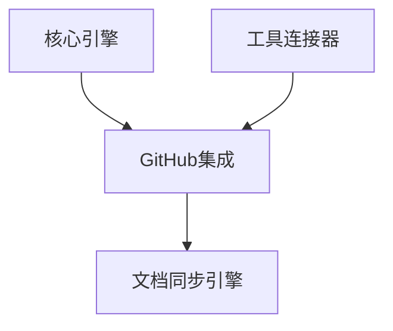

# VibeCopilot GitHub集成模块开发指南

> **文档元数据**
> 版本: 1.0
> 上次更新: 2024-04-21
> 负责人: 系统架构团队

## 1. GitHub集成模块概述

GitHub集成模块提供 VibeCopilot 与 GitHub 平台的深度集成能力，支持项目管理和文档同步。该模块使开发者能够在文档和代码之间建立紧密联系，提高团队协作效率。

### 1.1 核心职责

- GitHub API 交互
- 文档与 Issues 关联
- 项目结构分析
- 路线图与报告生成

### 1.2 架构位置

GitHub集成模块位于业务层，依赖于工具连接器和核心引擎：



## 2. 开发环境准备

### 2.1 依赖安装

```bash
# 安装 GitHub 集成模块所需依赖
npm install --save @octokit/rest @octokit/webhooks @octokit/auth-token
```

### 2.2 环境配置

在 `.env` 文件中配置必要的环境变量：

```
GITHUB_TOKEN=your_github_token
GITHUB_WEBHOOK_SECRET=your_webhook_secret
```

## 3. 模块接口实现

### 3.1 GitHub集成接口

```typescript
// src/github/interfaces.ts
import { Module } from '../core/interfaces';

export interface GitHubIntegration extends Module {
  /**
   * 关联文档与Issue
   * @param docPath 文档路径
   * @param issueNumber Issue编号
   */
  linkDocumentToIssue(docPath: string, issueNumber: number): Promise<void>;

  /**
   * 从文档创建Issue
   * @param docPath 文档路径
   * @returns 创建的Issue编号
   */
  createIssueFromDocument(docPath: string): Promise<number>;

  /**
   * 分析仓库结构
   * @param owner 仓库所有者
   * @param repo 仓库名称
   * @returns 仓库分析结果
   */
  analyzeRepository(owner: string, repo: string): Promise<RepositoryAnalysis>;

  /**
   * 生成项目路线图
   * @param owner 仓库所有者
   * @param repo 仓库名称
   * @returns 路线图数据
   */
  generateRoadmap(owner: string, repo: string): Promise<Roadmap>;
}

export interface RepositoryAnalysis {
  owner: string;
  repo: string;
  structure: RepoStructure;
  stats: RepoStats;
  contributors: Contributor[];
  lastUpdated: string;
}

export interface RepoStructure {
  dirs: DirectoryInfo[];
  files: FileInfo[];
  totalSize: number;
}

export interface DirectoryInfo {
  path: string;
  files: number;
  size: number;
}

export interface FileInfo {
  path: string;
  size: number;
  type: string;
  lastModified: string;
}

export interface RepoStats {
  commits: number;
  branches: number;
  pulls: number;
  issues: {
    open: number;
    closed: number;
  };
  lastActivity: string;
}

export interface Contributor {
  login: string;
  contributions: number;
  avatar: string;
}

export interface Roadmap {
  milestones: Milestone[];
  issues: RoadmapIssue[];
  timeline: TimelineItem[];
}

export interface Milestone {
  id: number;
  title: string;
  description: string;
  dueDate: string | null;
  progress: number;
}

export interface RoadmapIssue {
  number: number;
  title: string;
  state: 'open' | 'closed';
  milestone: number | null;
  assignees: string[];
  labels: string[];
  createdAt: string;
  updatedAt: string;
}

export interface TimelineItem {
  date: string;
  title: string;
  type: 'milestone' | 'issue' | 'release';
  id: number;
}
```

### 3.2 GitHub API 客户端接口

```typescript
// src/github/github_client_interface.ts
export interface GitHubAPIClient {
  /**
   * 获取Issue详情
   * @param owner 仓库所有者
   * @param repo 仓库名称
   * @param number Issue编号
   * @returns Issue详情
   */
  getIssue(owner: string, repo: string, number: number): Promise<Issue>;

  /**
   * 创建Issue
   * @param owner 仓库所有者
   * @param repo 仓库名称
   * @param data Issue数据
   * @returns 创建的Issue
   */
  createIssue(owner: string, repo: string, data: IssueData): Promise<Issue>;

  /**
   * 获取仓库内容
   * @param owner 仓库所有者
   * @param repo 仓库名称
   * @param path 文件路径
   * @returns 内容详情
   */
  getRepositoryContent(owner: string, repo: string, path: string): Promise<Content>;

  /**
   * 获取仓库结构
   * @param owner 仓库所有者
   * @param repo 仓库名称
   * @returns 仓库结构
   */
  getRepositoryStructure(owner: string, repo: string): Promise<RepoStructure>;
}

export interface Issue {
  number: number;
  title: string;
  body: string;
  state: 'open' | 'closed';
  html_url: string;
  user: {
    login: string;
    avatar_url: string;
  };
  labels: {
    name: string;
    color: string;
  }[];
  assignees: {
    login: string;
  }[];
  created_at: string;
  updated_at: string;
  milestone?: {
    number: number;
    title: string;
  };
}

export interface IssueData {
  title: string;
  body: string;
  labels?: string[];
  assignees?: string[];
  milestone?: number;
}

export interface Content {
  type: 'file' | 'dir';
  name: string;
  path: string;
  content?: string;
  encoding?: string;
  size: number;
  sha: string;
  url: string;
  git_url: string;
  html_url: string;
  download_url?: string;
}
```

## 4. 核心实现示例

### 4.1 GitHub集成实现

```typescript
// src/github/implementations/github_integration.ts
import { injectable, inject } from 'inversify';
import { GitHubIntegration, RepositoryAnalysis, Roadmap } from '../interfaces';
import { GitHubAPIClient } from '../github_client_interface';
import { Module, ModuleStatus } from '../../core/interfaces';
import { EventBus } from '../../core/events';

@injectable()
export class GitHubIntegrationImpl implements GitHubIntegration {
  private status: ModuleStatus = ModuleStatus.STOPPED;

  constructor(
    @inject('GitHubAPIClient') private githubClient: GitHubAPIClient,
    @inject('EventBus') private eventBus: EventBus,
    @inject('ConfigSystem') private configSystem: any
  ) {}

  async initialize(): Promise<void> {
    this.status = ModuleStatus.INITIALIZED;
    return Promise.resolve();
  }

  async start(): Promise<void> {
    if (this.status !== ModuleStatus.INITIALIZED) {
      throw new Error('Cannot start GitHub integration: not initialized');
    }
    this.status = ModuleStatus.STARTED;
  }

  async stop(): Promise<void> {
    this.status = ModuleStatus.STOPPED;
  }

  getStatus(): ModuleStatus {
    return this.status;
  }

  async linkDocumentToIssue(docPath: string, issueNumber: number): Promise<void> {
    // 获取文档内容
    // 更新文档中的YAML前置元数据
    // 更新Issue添加文档链接
    // 发布事件通知其他模块
  }

  async createIssueFromDocument(docPath: string): Promise<number> {
    // 读取文档内容
    // 提取标题和描述
    // 使用GitHub API创建Issue
    // 更新文档元数据关联Issue
    // 返回Issue编号
    return 0;
  }

  async analyzeRepository(owner: string, repo: string): Promise<RepositoryAnalysis> {
    // 获取仓库结构
    // 分析目录和文件
    // 获取贡献者信息
    // 计算统计数据
    // 返回完整分析
    return {} as RepositoryAnalysis;
  }

  async generateRoadmap(owner: string, repo: string): Promise<Roadmap> {
    // 获取里程碑信息
    // 获取Issue列表
    // 组织时间线信息
    // 生成路线图数据
    return {} as Roadmap;
  }
}
```

### 4.2 Octokit 客户端实现

```typescript
// src/github/implementations/octokit_client.ts
import { injectable, inject } from 'inversify';
import { Octokit } from '@octokit/rest';
import { createAppAuth } from '@octokit/auth-app';
import { GitHubAPIClient, Issue, IssueData, Content } from '../github_client_interface';
import { RepoStructure } from '../interfaces';

@injectable()
export class OctokitClient implements GitHubAPIClient {
  private octokit: Octokit;

  constructor(@inject('ConfigSystem') private configSystem: any) {
    const token = this.configSystem.get('env.GITHUB_TOKEN');
    if (!token) {
      throw new Error('GitHub token not configured');
    }

    this.octokit = new Octokit({
      auth: token
    });
  }

  async getIssue(owner: string, repo: string, number: number): Promise<Issue> {
    const response = await this.octokit.issues.get({
      owner,
      repo,
      issue_number: number
    });

    return response.data as Issue;
  }

  async createIssue(owner: string, repo: string, data: IssueData): Promise<Issue> {
    const response = await this.octokit.issues.create({
      owner,
      repo,
      title: data.title,
      body: data.body,
      labels: data.labels,
      assignees: data.assignees,
      milestone: data.milestone
    });

    return response.data as Issue;
  }

  async getRepositoryContent(owner: string, repo: string, path: string): Promise<Content> {
    const response = await this.octokit.repos.getContent({
      owner,
      repo,
      path
    });

    return response.data as Content;
  }

  async getRepositoryStructure(owner: string, repo: string): Promise<RepoStructure> {
    // 递归获取仓库结构实现
    return {} as RepoStructure;
  }

  // 其他API方法实现...
}
```

## 5. 主要功能实现

### 5.1 文档与Issue关联

文档与Issue的关联通过两种方式实现：

1. **文档中的YAML前置元数据**:

```yaml
---
title: 功能需求文档
description: 描述新功能的需求
github_issue: 42
---
```

2. **Issue中的标准化文档引用**:

```markdown
## 相关文档
- [功能需求文档](docs/requirements/feature.md) #doc-link
```

### 5.2 从文档创建Issue

实现从文档自动创建Issue的流程：

1. 解析文档前置元数据
2. 提取标题、描述和标签信息
3. 调用GitHub API创建Issue
4. 更新文档元数据关联新Issue
5. 发布事件通知文档同步引擎

### 5.3 仓库分析

实现仓库结构分析功能：

1. 递归遍历仓库目录
2. 分析文件类型和大小
3. 计算目录统计信息
4. 分析贡献者数据
5. 生成结构化分析报告

## 6. 测试策略

### 6.1 单元测试

```typescript
// tests/github/github_integration.spec.ts
import { GitHubIntegrationImpl } from '../../src/github/implementations/github_integration';
import { Mock } from 'jest-mock';

describe('GitHubIntegration', () => {
  let integration: GitHubIntegrationImpl;
  let mockGithubClient: any;
  let mockEventBus: any;
  let mockConfigSystem: any;

  beforeEach(() => {
    mockGithubClient = {
      getIssue: jest.fn(),
      createIssue: jest.fn(),
      getRepositoryContent: jest.fn(),
      getRepositoryStructure: jest.fn()
    };

    mockEventBus = {
      publish: jest.fn()
    };

    mockConfigSystem = {
      get: jest.fn()
    };

    integration = new GitHubIntegrationImpl(
      mockGithubClient,
      mockEventBus,
      mockConfigSystem
    );

    integration.initialize();
  });

  test('should create issue from document', async () => {
    // 测试从文档创建Issue的功能
  });

  test('should link document to issue', async () => {
    // 测试文档与Issue关联功能
  });

  // 更多测试...
});
```

### 6.2 模拟测试

使用 Jest 的模拟功能测试 GitHub API 交互：

```typescript
// 模拟 Octokit 响应
mockGithubClient.createIssue.mockResolvedValue({
  number: 42,
  title: 'Test Issue',
  body: 'Test body',
  html_url: 'https://github.com/owner/repo/issues/42'
});
```

## 7. 最佳实践与建议

### 7.1 API 使用

- 实现 API 请求限流和重试机制
- 缓存频繁请求的数据减少 API 调用
- 使用 Webhook 接收实时更新
- 处理 GitHub API 限制异常

### 7.2 安全考虑

- 安全存储 GitHub 令牌
- 实施最小权限原则
- 验证 Webhook 签名
- 不在日志中泄露敏感信息

### 7.3 性能优化

- 实现数据缓存策略
- 使用批量操作减少 API 调用次数
- 异步处理长时间运行的分析任务
- 分页处理大型结果集

## 8. 常见问题与解决方案

### 8.1 API 限流

**问题**: 达到 GitHub API 速率限制。

**解决方案**:

- 实现指数退避重试策略
- 缓存频繁访问的数据
- 使用 GitHub App 提高限制
- 优化请求，减少 API 调用

### 8.2 认证问题

**问题**: 认证令牌过期或权限不足。

**解决方案**:

- 实现令牌刷新机制
- 明确错误提示
- 验证令牌权限范围
- 实现降级策略

## 9. 扩展与未来发展

- 支持 GitLab 和 Bitbucket 平台
- 实现高级项目分析和可视化
- 添加代码质量和依赖分析
- 支持自动化 PR 创建和管理
- 实现 CI/CD 状态监控

---

本文档提供了 VibeCopilot GitHub集成模块开发的指南。开发者应遵循本指南，确保模块的设计与实现符合项目规范。随着项目发展，本指南将持续更新以反映最佳实践。
