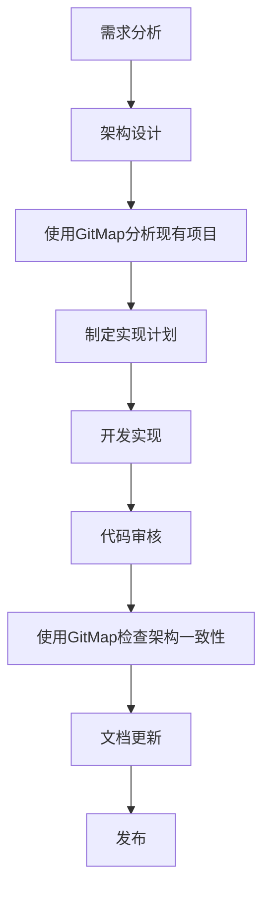
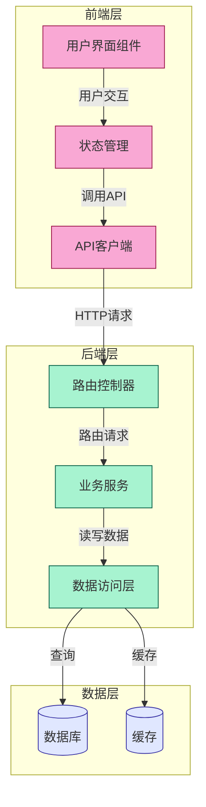

# GitMap集成指南

GitMap是VibeCopilot集成的项目结构分析工具，基于GitDiagram技术，能够自动分析项目代码结构并生成可视化架构图。这一功能帮助开发者快速理解项目框架、生成路线图或在代码重构后更新架构文档。

## 功能概述

GitMap提供以下核心功能：

1. **项目结构自动分析** - 分析代码库结构，识别核心组件和架构
2. **架构图可视化** - 生成Mermaid格式的交互式架构图
3. **组件映射** - 将架构图中的组件映射到实际代码文件/目录
4. **重构分析** - 支持代码重构前后的项目分析和对比
5. **路线图生成** - 基于分析结果协助开发路线图制定

## 使用方法

### 基本命令

GitMap通过VibeCopilot的命令行界面使用：

```bash
/gitmap [选项] <项目路径>
```

### 常用选项

| 选项 | 描述 |
|------|------|
| `-h, --help` | 显示帮助信息 |
| `-o, --output DIR` | 指定输出目录，默认为 `./gitmap_output` |
| `-i, --instructions TEXT` | 自定义分析指令，如 "突出显示数据流" |
| `-k, --key KEY` | 指定OpenAI API密钥(如未在环境变量中设置) |
| `-r, --refactor` | 重构模式，适用于分析重构后的项目 |

### 使用示例

#### 基本项目分析

分析一个项目并生成架构图：

```bash
/gitmap /path/to/your/project
```

#### 自定义分析指令

添加特定的分析重点：

```bash
/gitmap -i "请重点分析数据流和API接口，并突出显示核心业务逻辑组件" /path/to/your/project
```

#### 重构后分析

分析重构后的项目，更新架构图：

```bash
/gitmap -r /path/to/refactored/project
```

#### 指定输出目录

将分析结果保存到特定目录：

```bash
/gitmap -o ./docs/architecture /path/to/your/project
```

## 集成到开发流程

### 何时使用GitMap

GitMap适合在以下场景中使用：

1. **项目初始阶段** - 了解项目整体架构，制定开发计划
2. **新成员入职** - 帮助新开发者快速理解项目结构
3. **代码重构前后** - 对比重构前后的架构变化
4. **文档更新** - 自动生成并更新项目架构文档
5. **规划新功能** - 分析现有架构以确定新功能的最佳实现位置

### 与VibeCopilot工作流集成

GitMap可以与VibeCopilot的开发工作流无缝集成：



## 输出结果说明

GitMap会生成两个主要文件：

1. **project_explanation.md** - 项目架构的详细文字解释
2. **project_diagram.md** - 包含Mermaid格式架构图的文件

### 架构图示例



## 高级用法

### 自定义分析指令

通过精心设计的指令可以让GitMap的分析更加精准。以下是一些有效的指令示例：

- **识别架构模式**: "识别项目中使用的架构模式，如MVC、MVVM、微服务等"
- **依赖分析**: "分析组件间的依赖关系，识别潜在的循环依赖"
- **数据流分析**: "跟踪数据如何在系统中流动，从输入到存储再到输出"
- **性能瓶颈**: "识别可能的性能瓶颈点和优化机会"
- **安全分析**: "识别处理敏感数据的组件和安全边界"

### 集成到CI/CD流程

可以将GitMap集成到持续集成流程中，自动更新项目架构文档：

```bash
# 示例CI脚本片段
echo "更新项目架构文档..."
./scripts/gitdiagram/gitmap.sh -o ./docs/architecture -i "更新项目架构图" ./
git add ./docs/architecture
git commit -m "docs: 更新项目架构文档"
```

## 实现原理

GitMap基于GitDiagram技术，结合AI分析和Mermaid可视化实现。其工作流程包括：

1. **文件收集** - 收集项目中的文件和目录结构
2. **README分析** - 分析项目README以了解项目目的
3. **结构分析** - 使用AI分析项目结构和组件关系
4. **组件映射** - 将识别的组件映射到实际文件路径
5. **图表生成** - 生成交互式Mermaid架构图

## 注意事项与限制

- **API密钥要求**: 需要OpenAI API密钥才能进行分析
- **项目大小限制**: 对于非常大的项目，可能需要分模块分析
- **精度限制**: AI分析可能不能完全理解特定领域的自定义架构
- **私有依赖**: 可能无法正确分析私有或内部依赖的关系

## 故障排除

### 常见问题

1. **分析失败**
   - 检查API密钥是否有效
   - 确认项目路径正确且可访问
   - 对于大型项目，尝试只分析特定子目录

2. **架构图不准确**
   - 尝试使用更具体的分析指令
   - 检查README是否清晰描述了项目功能和结构
   - 对于复杂项目，考虑手动调整生成的图表

3. **执行权限问题**
   - 确保脚本有执行权限: `chmod +x ./scripts/gitdiagram/gitmap.sh`

## 参考资源

- [GitDiagram原始项目](https://github.com/ahmedkhaleel2004/gitdiagram)
- [Mermaid官方文档](https://mermaid-js.github.io/mermaid/)
- [OpenAI API文档](https://platform.openai.com/docs/api-reference)
