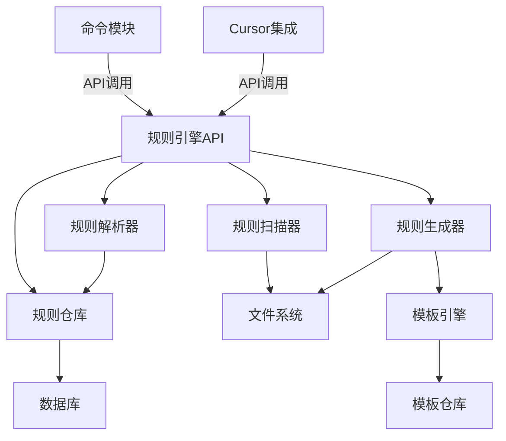

# VibeCopilot 规则引擎开发指南

## 目录

1. [概述](#概述)
2. [架构设计](#架构设计)
3. [核心功能](#核心功能)
4. [开发计划](#开发计划)
5. [模块详解](#模块详解)
6. [数据模型](#数据模型)
7. [API设计](#api设计)
8. [测试计划](#测试计划)
9. [集成方案](#集成方案)

## 概述

VibeCopilot规则引擎是管理和应用规则的核心模块，负责扫描、解析、存储和生成规则。规则引擎独立于命令模块和其他业务逻辑，专注于规则的生命周期管理。

### 目标

1. 扫描并解析现有的`.mdc`规则文件
2. 将规则条目结构化存储到数据库
3. 基于规则模板生成标准化的规则文件
4. 提供统一的规则管理API

### 关键原则

- **职责分离**：规则引擎专注于规则处理，其他模块通过API调用规则引擎
- **模块化设计**：每个组件负责单一职责，易于维护和扩展
- **标准化**：确保规则格式一致，便于AI助手理解和应用
- **性能优化**：高效处理大量规则，避免性能瓶颈

## 架构设计

### 目录结构

```
src/
  ├── rule_engine/               # 独立的规则引擎模块
  │   ├── __init__.py
  │   ├── core/                  # 核心引擎
  │   │   ├── parser.py          # 规则解析器
  │   │   ├── scanner.py         # 规则扫描器
  │   │   └── executor.py        # 规则执行器
  │   ├── models/                # 数据模型
  │   │   ├── rule.py            # 规则模型
  │   │   └── condition.py       # 条件模型
  │   ├── storage/               # 持久化层
  │   │   ├── repository.py      # 规则仓库
  │   │   └── db_adapter.py      # 数据库适配器
  │   └── templates/             # 模板系统
  │       ├── engine.py          # 模板引擎
  │       └── generator.py       # 规则生成器
  ├── cli/                       # 命令行接口
  │   └── commands/              # 命令处理
  │       └── rule_command.py    # 规则命令(只负责调用规则引擎API)
  └── cursor/                    # Cursor集成
      └── rule_handler.py        # Cursor规则处理器
```

### 组件关系



## 核心功能

### 1. 规则扫描与解析

- 递归扫描目录中的`.mdc`规则文件
- 解析规则文件头部的YAML/Frontmatter元数据
- 解析Markdown格式的规则内容，提取规则条目
- 识别和分类规则示例

### 2. 规则存储管理

- 将规则元数据和内容结构化存储到数据库
- 支持按类型、标签、适用条件等多维度查询规则
- 维护规则之间的依赖关系
- 实现规则版本控制

### 3. 规则模板与生成

- 管理规则模板库
- 根据数据库中的规则内容和模板生成标准化规则文件
- 支持变量替换和条件渲染
- 确保生成的规则符合标准格式

### 4. 规则引擎API

- 提供统一的规则管理接口
- 支持规则验证、冲突检测、优先级管理
- 提供规则应用和执行接口
- 集成到Cursor和命令行工具

## 开发计划

### 阶段1：规则扫描与解析 (2周)

**目标**：实现MDC规则文件的扫描和解析

**任务**：

- 创建规则扫描器，支持递归目录扫描
- 实现Frontmatter解析，提取规则元数据
- 实现Markdown解析，提取规则条目和示例
- 设计核心数据模型，表示规则和其组成部分

**里程碑**：能正确解析所有现有规则文件

### 阶段2：规则存储系统 (1周)

**目标**：实现规则的持久化存储

**任务**：

- 设计数据库模式，支持规则数据模型
- 实现数据库适配器，支持多种存储后端
- 实现规则仓库，提供CRUD操作
- 实现缓存机制，优化读取性能

**里程碑**：规则可以存入数据库并正确查询

### 阶段3：模板系统优化 (2周)

**目标**：增强模板引擎，支持规则特定需求

**任务**：

- 改进现有模板引擎，支持规则特定变量和过滤器
- 实现模板版本控制和依赖管理
- 开发模板验证工具，确保模板有效性
- 创建常用规则类型的标准模板

**里程碑**：模板能正确渲染不同类型的规则

### 阶段4：规则生成系统 (1周)

**目标**：实现从数据库到规则文件的生成

**任务**：

- 开发规则生成器，根据规则数据和模板生成文件
- 实现不同规则类型的生成策略
- 确保生成的规则符合格式标准
- 实现文件系统适配器，处理文件读写

**里程碑**：能从规则对象生成符合标准的规则文件

### 阶段5：CLI集成更新 (1周)

**目标**：更新命令行工具，使用新规则引擎

**任务**：

- 重构规则命令处理器，使用规则引擎API
- 添加新的规则管理命令
- 改进命令行接口和反馈机制
- 编写新功能的使用文档

**里程碑**：完成命令行工具的改进，支持全部规则管理功能

## 模块详解

### 规则扫描器 (Scanner)

负责从文件系统扫描规则文件，是规则引入系统的入口点。

```python
class RuleScanner:
    def scan_directory(self, directory: str, recursive: bool = True) -> List[str]:
        """扫描目录中的所有.mdc文件，返回文件路径列表"""

    def scan_rule_content(self, file_path: str) -> str:
        """读取规则文件内容"""

    def scan_all(self, base_directory: str) -> Dict[str, str]:
        """扫描所有规则，返回{文件路径:内容}字典"""
```

### 规则解析器 (Parser)

负责解析规则文件内容，提取结构化数据。

```python
class RuleParser:
    def parse_file(self, file_path: str) -> Rule:
        """解析整个规则文件，返回规则对象"""

    def parse_frontmatter(self, content: str) -> Dict[str, Any]:
        """解析规则头部元数据"""

    def parse_rule_items(self, content: str) -> List[RuleItem]:
        """解析规则条目"""

    def parse_examples(self, content: str) -> List[Example]:
        """解析示例"""

    def validate_rule_structure(self, rule: Rule) -> List[str]:
        """验证规则结构，返回错误列表"""
```

### 规则仓库 (Repository)

负责规则的持久化存储和检索。

```python
class RuleRepository:
    def __init__(self, db_adapter: DbAdapter):
        self.db_adapter = db_adapter

    def save_rule(self, rule: Rule) -> bool:
        """保存规则到数据库"""

    def get_rule_by_id(self, rule_id: str) -> Optional[Rule]:
        """按ID获取规则"""

    def find_rules_by_criteria(self, criteria: Dict[str, Any]) -> List[Rule]:
        """按条件查询规则"""

    def delete_rule(self, rule_id: str) -> bool:
        """删除规则"""

    def update_rule(self, rule_id: str, updates: Dict[str, Any]) -> bool:
        """更新规则"""
```

### 模板引擎 (Template Engine)

负责渲染模板，生成规则内容。

```python
class RuleTemplateEngine:
    def __init__(self, template_repository: TemplateRepository):
        self.template_repository = template_repository

    def render_template(self, template_id: str, variables: Dict[str, Any]) -> str:
        """渲染模板，返回内容"""

    def get_template_variables(self, template_id: str) -> List[TemplateVariable]:
        """获取模板所需变量"""

    def validate_template_variables(self, template_id: str, variables: Dict[str, Any]) -> List[str]:
        """验证变量值，返回错误列表"""
```

### 规则生成器 (Generator)

负责生成规则文件。

```python
class RuleGenerator:
    def __init__(self, template_engine: RuleTemplateEngine):
        self.template_engine = template_engine

    def generate_rule_file(self, rule: Rule, template_id: str, output_path: str) -> bool:
        """根据规则对象和模板生成规则文件"""

    def generate_rule_content(self, rule: Rule, template_id: str) -> str:
        """生成规则内容"""

    def generate_from_db(self, rule_id: str, template_id: str, output_path: str) -> bool:
        """从数据库中读取规则，生成文件"""
```

### 规则引擎API

提供统一的规则管理接口。

```python
class RuleEngineAPI:
    def __init__(self, scanner, parser, repository, generator):
        self.scanner = scanner
        self.parser = parser
        self.repository = repository
        self.generator = generator

    def scan_and_import_rules(self, directory: str) -> int:
        """扫描并导入规则，返回导入数量"""

    def create_rule(self, rule_data: Dict[str, Any], template_id: str, output_path: str = None) -> Rule:
        """创建新规则"""

    def get_rule(self, rule_id: str) -> Optional[Rule]:
        """获取规则"""

    def update_rule(self, rule_id: str, updates: Dict[str, Any]) -> bool:
        """更新规则"""

    def delete_rule(self, rule_id: str) -> bool:
        """删除规则"""

    def validate_rule(self, rule_data: Dict[str, Any]) -> List[str]:
        """验证规则数据，返回错误列表"""

    def generate_rule_file(self, rule_id: str, template_id: str, output_path: str) -> bool:
        """生成规则文件"""
```

## 数据模型

### 规则模型 (Rule)

```python
class RuleType(Enum):
    AGENT = "agent"
    AUTO = "auto"
    MANUAL = "manual"
    ALWAYS = "always"

class RuleMetadata(BaseModel):
    author: str
    tags: List[str]
    version: str
    created_at: datetime
    updated_at: datetime
    dependencies: List[str]

class RuleItem(BaseModel):
    content: str
    priority: int = 0
    category: Optional[str] = None

class Example(BaseModel):
    content: str
    is_valid: bool = True
    description: Optional[str] = None

class Rule(BaseModel):
    id: str
    name: str
    type: RuleType
    description: str
    globs: List[str]
    always_apply: bool
    items: List[RuleItem]
    examples: List[Example]
    content: str
    metadata: RuleMetadata
```

### 模板模型 (Template)

```python
class TemplateVariable(BaseModel):
    name: str
    type: str
    description: str
    default: Optional[Any] = None
    required: bool = True

class TemplateMetadata(BaseModel):
    author: str
    tags: List[str]
    version: str
    created_at: datetime
    updated_at: datetime

class Template(BaseModel):
    id: str
    name: str
    description: str
    type: str
    variables: List[TemplateVariable]
    content: str
    metadata: TemplateMetadata
```

## API设计

### REST API

规则引擎将提供RESTful API，方便与其他系统集成。

| 路径 | 方法 | 描述 |
|------|------|------|
| `/api/rules` | GET | 列出所有规则 |
| `/api/rules` | POST | 创建新规则 |
| `/api/rules/{id}` | GET | 获取规则详情 |
| `/api/rules/{id}` | PUT | 更新规则 |
| `/api/rules/{id}` | DELETE | 删除规则 |
| `/api/rules/scan` | POST | 扫描并导入规则 |
| `/api/rules/validate` | POST | 验证规则数据 |
| `/api/templates` | GET | 列出所有模板 |
| `/api/templates/{id}` | GET | 获取模板详情 |
| `/api/generate` | POST | 生成规则文件 |

### Python API

```python
# 初始化规则引擎
engine = RuleEngineAPI()

# 扫描并导入规则
imported_count = engine.scan_and_import_rules("/path/to/rules")

# 创建规则
rule = engine.create_rule({
    "name": "My Rule",
    "type": "agent",
    "description": "Example rule",
    "items": [{"content": "- Always format code consistently"}]
}, "agent_template")

# 生成规则文件
engine.generate_rule_file(rule.id, "markdown_template", "/output/path/my-rule.md")
```

## 测试计划

### 单元测试

- **规则扫描器测试**：验证文件扫描逻辑
- **规则解析器测试**：验证正确解析各种规则格式
- **规则仓库测试**：验证CRUD操作和查询功能
- **模板引擎测试**：验证模板渲染和变量处理
- **规则生成器测试**：验证规则文件生成

### 集成测试

- **扫描到存储流程**：验证完整的规则导入流程
- **存储到生成流程**：验证从数据库生成规则文件
- **API接口测试**：验证所有API端点功能
- **命令行工具测试**：验证CLI命令行为

### 性能测试

- **大规模规则处理**：测试处理100+规则文件的性能
- **并发操作**：测试多用户同时使用API的性能
- **内存消耗**：监控规则处理过程中的内存使用

## 集成方案

### 命令行工具集成

更新现有的规则命令，使用新规则引擎API：

```python
class RuleCommand(BaseCommand):
    def __init__(self):
        super().__init__("rule", "规则管理命令")
        self.rule_engine = RuleEngineAPI()

    def execute(self, args):
        if args.action == "scan":
            count = self.rule_engine.scan_and_import_rules(args.directory)
            return {"success": True, "count": count}
        elif args.action == "create":
            # 处理创建规则...
```

### Cursor集成

在Cursor集成模块中使用规则引擎API：

```python
class CursorRuleHandler:
    def __init__(self):
        self.rule_engine = RuleEngineAPI()

    def handle_rule_command(self, command, args):
        # 处理Cursor中的规则命令
```

## 结论

这个规则引擎开发计划将VibeCopilot的规则系统提升到一个新的水平，使其更加模块化、可扩展和功能完整。通过明确职责分离、标准化接口和全面的测试，确保规则系统的健壮性和可维护性。

开发将分5个阶段进行，总计7周时间，每个阶段都有明确的目标和可测量的里程碑。完成后，VibeCopilot将拥有一个功能全面的规则引擎，为AI辅助开发提供强大支持。
