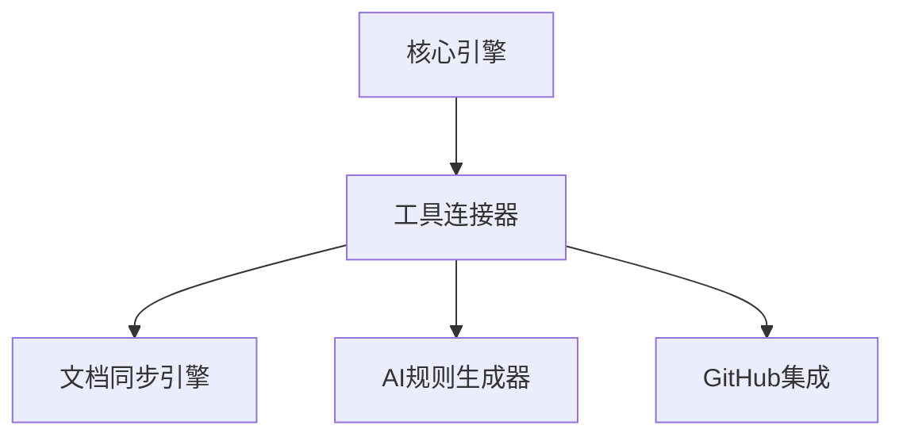

# VibeCopilot 工具连接器模块开发指南

> **文档元数据**
> 版本: 1.0
> 上次更新: 2024-04-21
> 负责人: 系统架构团队

## 1. 工具连接器模块概述

工具连接器模块是 VibeCopilot 的基础设施组件，负责与各种外部工具建立和维护连接。该模块通过标准化的适配器接口，实现与 Cursor、Obsidian、GitHub 等工具的集成，是 VibeCopilot 整合能力的核心。

### 1.1 核心职责

- 工具发现与连接
- 统一适配器管理
- 工具状态监控
- 连接配置管理

### 1.2 架构位置

工具连接器位于核心层，为业务层模块提供工具访问能力：



## 2. 开发环境准备

### 2.1 依赖安装

```bash
# 安装工具连接所需依赖
npm install --save socket.io node-ipc ws
```

### 2.2 特定工具依赖

```bash
# Cursor连接
npm install --save cursor-node-api

# Obsidian连接
npm install --save obsidian-api

# GitHub连接
npm install --save @octokit/rest
```

## 3. 模块接口定义

### 3.1 工具连接器接口

```typescript
// src/tool_connector/interfaces.ts
import { Module } from '../core/interfaces';
import { Observable } from 'rxjs';

export interface ToolConnector extends Module {
  /**
   * 连接工具
   * @param type 工具类型
   * @param config 连接配置
   * @returns 连接是否成功
   */
  connectTool(type: ToolType, config: ToolConfig): Promise<boolean>;

  /**
   * 获取工具状态
   * @param type 工具类型
   * @returns 工具状态
   */
  getToolStatus(type: ToolType): Promise<ToolStatus>;

  /**
   * 监听工具状态变化
   * @param type 工具类型
   * @returns 状态变化Observable
   */
  watchToolStatus(type: ToolType): Observable<ToolStatus>;

  /**
   * 获取适配器实例
   * @param type 工具类型
   * @returns 适配器实例
   */
  getAdapter<T extends ToolAdapter>(type: ToolType): T;
}

export enum ToolType {
  CURSOR = 'cursor',
  OBSIDIAN = 'obsidian',
  GITHUB = 'github',
  VS_CODE = 'vscode',
  DOCUSAURUS = 'docusaurus',
  FILE_SYSTEM = 'filesystem'
}

export interface ToolConfig {
  connectionParams: Record<string, any>;
  autoReconnect?: boolean;
  reconnectInterval?: number;
  timeout?: number;
}

export interface ToolStatus {
  type: ToolType;
  connected: boolean;
  lastConnected?: Date;
  error?: Error;
  details?: Record<string, any>;
}
```

### 3.2 工具适配器接口

```typescript
// src/tool_connector/adapter_interface.ts
export interface ToolAdapter {
  /**
   * 连接工具
   * @param config 连接配置
   * @returns 连接是否成功
   */
  connect(config: ToolConfig): Promise<boolean>;

  /**
   * 执行操作
   * @param action 操作名称
   * @param params 操作参数
   * @returns 操作结果
   */
  execute<T>(action: string, params: any): Promise<T>;

  /**
   * 断开连接
   */
  disconnect(): Promise<void>;

  /**
   * 获取连接状态
   * @returns 工具状态
   */
  getConnectionStatus(): ToolStatus;
}
```

### 3.3 适配器工厂接口

```typescript
// src/tool_connector/adapter_factory_interface.ts
import { ToolAdapter } from './adapter_interface';
import { ToolType } from './interfaces';

export interface AdapterFactory {
  /**
   * 创建适配器实例
   * @param type 工具类型
   * @returns 适配器实例
   */
  createAdapter(type: ToolType): ToolAdapter;

  /**
   * 注册适配器实现
   * @param type 工具类型
   * @param adapterClass 适配器类
   */
  registerAdapter(type: ToolType, adapterClass: new () => ToolAdapter): void;
}
```

## 4. 核心实现

### 4.1 工具连接器实现

```typescript
// src/tool_connector/implementations/tool_connector.ts
import { injectable, inject } from 'inversify';
import { Observable, Subject, BehaviorSubject } from 'rxjs';
import {
  ToolConnector, ToolType, ToolConfig, ToolStatus
} from '../interfaces';
import { ToolAdapter } from '../adapter_interface';
import { AdapterFactory } from '../adapter_factory_interface';
import { Module, ModuleStatus } from '../../core/interfaces';

@injectable()
export class ToolConnectorImpl implements ToolConnector {
  private status: ModuleStatus = ModuleStatus.STOPPED;
  private adapters: Map<ToolType, ToolAdapter> = new Map();
  private statusSubjects: Map<ToolType, BehaviorSubject<ToolStatus>> = new Map();
  private connectionTimers: Map<ToolType, NodeJS.Timeout> = new Map();

  constructor(
    @inject('AdapterFactory') private adapterFactory: AdapterFactory,
    @inject('ConfigSystem') private configSystem: any
  ) {
    // 初始化状态监控
    Object.values(ToolType).forEach(type => {
      this.statusSubjects.set(type as ToolType, new BehaviorSubject<ToolStatus>({
        type: type as ToolType,
        connected: false
      }));
    });
  }

  async initialize(): Promise<void> {
    this.status = ModuleStatus.INITIALIZED;
    return Promise.resolve();
  }

  async start(): Promise<void> {
    if (this.status !== ModuleStatus.INITIALIZED) {
      throw new Error('Cannot start tool connector: not initialized');
    }

    // 自动连接配置的工具
    const autoConnectTools = this.configSystem.get('tools.autoConnect', []);
    for (const toolConfig of autoConnectTools) {
      try {
        await this.connectTool(toolConfig.type, toolConfig.config);
      } catch (error) {
        console.error(`Error auto-connecting tool ${toolConfig.type}:`, error);
      }
    }

    this.status = ModuleStatus.STARTED;
  }

  async stop(): Promise<void> {
    // 断开所有连接
    const disconnectPromises: Promise<void>[] = [];

    for (const [type, adapter] of this.adapters.entries()) {
      disconnectPromises.push(adapter.disconnect());

      // 清除重连定时器
      if (this.connectionTimers.has(type)) {
        clearTimeout(this.connectionTimers.get(type)!);
        this.connectionTimers.delete(type);
      }
    }

    await Promise.all(disconnectPromises);
    this.adapters.clear();

    this.status = ModuleStatus.STOPPED;
  }

  getStatus(): ModuleStatus {
    return this.status;
  }

  async connectTool(type: ToolType, config: ToolConfig): Promise<boolean> {
    try {
      let adapter: ToolAdapter;

      if (!this.adapters.has(type)) {
        // 创建新适配器
        adapter = this.adapterFactory.createAdapter(type);
        this.adapters.set(type, adapter);
      } else {
        adapter = this.adapters.get(type)!;
      }

      // 连接工具
      const connected = await adapter.connect(config);

      // 更新状态
      const status = adapter.getConnectionStatus();
      this.updateToolStatus(type, status);

      // 如果配置了自动重连，设置监控
      if (config.autoReconnect && connected) {
        this.setupReconnection(type, config);
      }

      return connected;
    } catch (error) {
      // 更新错误状态
      this.updateToolStatus(type, {
        type,
        connected: false,
        error: error as Error
      });

      throw error;
    }
  }

  async getToolStatus(type: ToolType): Promise<ToolStatus> {
    if (this.adapters.has(type)) {
      return this.adapters.get(type)!.getConnectionStatus();
    }

    return {
      type,
      connected: false
    };
  }

  watchToolStatus(type: ToolType): Observable<ToolStatus> {
    return this.statusSubjects.get(type)!.asObservable();
  }

  getAdapter<T extends ToolAdapter>(type: ToolType): T {
    if (!this.adapters.has(type)) {
      throw new Error(`Adapter for tool ${type} not found or not connected`);
    }

    return this.adapters.get(type) as T;
  }

  // 私有方法
  private updateToolStatus(type: ToolType, status: ToolStatus): void {
    const subject = this.statusSubjects.get(type);
    if (subject) {
      subject.next(status);
    }
  }

  private setupReconnection(type: ToolType, config: ToolConfig): void {
    // 清除现有定时器
    if (this.connectionTimers.has(type)) {
      clearTimeout(this.connectionTimers.get(type)!);
    }

    // 监控连接状态
    const subscription = this.watchToolStatus(type).subscribe(status => {
      if (!status.connected && config.autoReconnect) {
        const interval = config.reconnectInterval || 5000;

        // 设置重连定时器
        this.connectionTimers.set(type, setTimeout(async () => {
          try {
            await this.connectTool(type, config);
          } catch (error) {
            console.error(`Error reconnecting to ${type}:`, error);
          }
        }, interval));
      }
    });

    // 当模块停止时清理订阅
    subscription.add(() => {
      if (this.connectionTimers.has(type)) {
        clearTimeout(this.connectionTimers.get(type)!);
      }
    });
  }
}
```

### 4.2 适配器工厂实现

```typescript
// src/tool_connector/implementations/adapter_factory.ts
import { injectable, inject } from 'inversify';
import { AdapterFactory } from '../adapter_factory_interface';
import { ToolAdapter } from '../adapter_interface';
import { ToolType } from '../interfaces';

@injectable()
export class AdapterFactoryImpl implements AdapterFactory {
  private adapterRegistry: Map<ToolType, new () => ToolAdapter> = new Map();

  constructor(@inject('ConfigSystem') private configSystem: any) {
    // 注册默认适配器
    this.registerDefaultAdapters();
  }

  createAdapter(type: ToolType): ToolAdapter {
    const AdapterClass = this.adapterRegistry.get(type);

    if (!AdapterClass) {
      throw new Error(`No adapter registered for tool type: ${type}`);
    }

    return new AdapterClass();
  }

  registerAdapter(type: ToolType, adapterClass: new () => ToolAdapter): void {
    this.adapterRegistry.set(type, adapterClass);
  }

  private registerDefaultAdapters(): void {
    // 根据配置注册默认适配器
    const defaultAdapters = this.configSystem.get('tools.defaultAdapters', {});

    for (const [type, adapterPath] of Object.entries(defaultAdapters)) {
      try {
        // 动态导入适配器
        const AdapterClass = require(adapterPath as string).default;
        this.registerAdapter(type as ToolType, AdapterClass);
      } catch (error) {
        console.error(`Error registering default adapter for ${type}:`, error);
      }
    }
  }
}
```

## 5. 适配器实现示例

### 5.1 Cursor适配器

```typescript
// src/tool_connector/adapters/cursor_adapter.ts
import { injectable } from 'inversify';
import { ToolAdapter } from '../adapter_interface';
import { ToolConfig, ToolStatus, ToolType } from '../interfaces';

@injectable()
export class CursorAdapter implements ToolAdapter {
  private connected: boolean = false;
  private client: any; // Cursor客户端API

  async connect(config: ToolConfig): Promise<boolean> {
    try {
      // 初始化Cursor客户端
      // const { cursorPath } = config.connectionParams;
      // this.client = await initCursorClient(cursorPath);

      this.connected = true;
      return true;
    } catch (error) {
      this.connected = false;
      throw error;
    }
  }

  async execute<T>(action: string, params: any): Promise<T> {
    if (!this.connected || !this.client) {
      throw new Error('Cursor not connected');
    }

    switch (action) {
      case 'deployRule':
        // return await this.client.deployRule(params.ruleName, params.ruleContent);
      case 'getSettings':
        // return await this.client.getSettings();
      default:
        throw new Error(`Unknown action: ${action}`);
    }
  }

  async disconnect(): Promise<void> {
    if (this.client) {
      // await this.client.disconnect();
      this.client = null;
    }
    this.connected = false;
  }

  getConnectionStatus(): ToolStatus {
    return {
      type: ToolType.CURSOR,
      connected: this.connected,
      lastConnected: this.connected ? new Date() : undefined,
      details: {
        // 可以添加特定于Cursor的状态信息
      }
    };
  }
}
```

### 5.2 Obsidian适配器

```typescript
// src/tool_connector/adapters/obsidian_adapter.ts
import { injectable } from 'inversify';
import { ToolAdapter } from '../adapter_interface';
import { ToolConfig, ToolStatus, ToolType } from '../interfaces';

@injectable()
export class ObsidianAdapter implements ToolAdapter {
  private connected: boolean = false;
  private vault: any;
  private apiClient: any;

  async connect(config: ToolConfig): Promise<boolean> {
    try {
      const { vaultPath } = config.connectionParams;

      // 连接Obsidian vault
      // this.vault = await connectToVault(vaultPath);
      // this.apiClient = createObsidianClient(this.vault);

      this.connected = true;
      return true;
    } catch (error) {
      this.connected = false;
      throw error;
    }
  }

  async execute<T>(action: string, params: any): Promise<T> {
    if (!this.connected || !this.apiClient) {
      throw new Error('Obsidian not connected');
    }

    switch (action) {
      case 'getNote':
        // return await this.apiClient.getNote(params.path);
      case 'saveNote':
        // return await this.apiClient.saveNote(params.path, params.content);
      case 'getVaultInfo':
        // return await this.apiClient.getVaultInfo();
      default:
        throw new Error(`Unknown action: ${action}`);
    }
  }

  async disconnect(): Promise<void> {
    if (this.apiClient) {
      // await this.apiClient.disconnect();
      this.apiClient = null;
      this.vault = null;
    }
    this.connected = false;
  }

  getConnectionStatus(): ToolStatus {
    return {
      type: ToolType.OBSIDIAN,
      connected: this.connected,
      lastConnected: this.connected ? new Date() : undefined,
      details: {
        // Obsidian特定状态信息
      }
    };
  }
}
```

## 6. 测试策略

### 6.1 单元测试

```typescript
// tests/tool_connector/tool_connector.spec.ts
import { ToolConnectorImpl } from '../../src/tool_connector/implementations/tool_connector';
import { AdapterFactoryImpl } from '../../src/tool_connector/implementations/adapter_factory';
import { ToolType, ToolConfig } from '../../src/tool_connector/interfaces';

describe('ToolConnector', () => {
  let connector: ToolConnectorImpl;
  let mockAdapterFactory: any;
  let mockConfigSystem: any;
  let mockAdapter: any;

  beforeEach(() => {
    mockAdapter = {
      connect: jest.fn().mockResolvedValue(true),
      execute: jest.fn(),
      disconnect: jest.fn().mockResolvedValue(undefined),
      getConnectionStatus: jest.fn().mockReturnValue({
        type: ToolType.CURSOR,
        connected: true
      })
    };

    mockAdapterFactory = {
      createAdapter: jest.fn().mockReturnValue(mockAdapter),
      registerAdapter: jest.fn()
    };

    mockConfigSystem = {
      get: jest.fn().mockReturnValue([])
    };

    connector = new ToolConnectorImpl(mockAdapterFactory, mockConfigSystem);
    connector.initialize();
  });

  test('should connect tool successfully', async () => {
    // 准备
    const config: ToolConfig = {
      connectionParams: { path: '/test' }
    };

    // 执行
    await connector.start();
    const result = await connector.connectTool(ToolType.CURSOR, config);

    // 断言
    expect(result).toBe(true);
    expect(mockAdapterFactory.createAdapter).toHaveBeenCalledWith(ToolType.CURSOR);
    expect(mockAdapter.connect).toHaveBeenCalledWith(config);
  });

  test('should get adapter', async () => {
    // 准备
    const config: ToolConfig = {
      connectionParams: { path: '/test' }
    };

    // 执行
    await connector.connectTool(ToolType.CURSOR, config);
    const adapter = connector.getAdapter(ToolType.CURSOR);

    // 断言
    expect(adapter).toBe(mockAdapter);
  });

  test('should throw error when getting non-existent adapter', () => {
    expect(() => {
      connector.getAdapter(ToolType.OBSIDIAN);
    }).toThrow();
  });

  // 更多测试...
});
```

### 6.2 模拟适配器测试

```typescript
// tests/tool_connector/adapters/cursor_adapter.spec.ts
import { CursorAdapter } from '../../../src/tool_connector/adapters/cursor_adapter';
import { ToolConfig } from '../../../src/tool_connector/interfaces';

// 模拟Cursor客户端
jest.mock('cursor-node-api', () => ({
  initCursorClient: jest.fn().mockResolvedValue({
    deployRule: jest.fn().mockResolvedValue({ path: '/rules/test.md' }),
    getSettings: jest.fn().mockResolvedValue({ theme: 'dark' }),
    disconnect: jest.fn().mockResolvedValue(undefined)
  })
}));

describe('CursorAdapter', () => {
  let adapter: CursorAdapter;

  beforeEach(() => {
    adapter = new CursorAdapter();
  });

  test('should connect to Cursor', async () => {
    // 准备
    const config: ToolConfig = {
      connectionParams: { cursorPath: '/path/to/cursor' }
    };

    // 执行
    const result = await adapter.connect(config);

    // 断言
    expect(result).toBe(true);
    expect(adapter.getConnectionStatus().connected).toBe(true);
  });

  // 更多测试...
});
```

## 7. 最佳实践与建议

### 7.1 工具集成

- 使用标准化抽象层隔离具体工具实现
- 实现优雅的降级策略处理工具不可用情况
- 避免在适配器中包含业务逻辑
- 为自定义工具提供扩展点

### 7.2 连接管理

- 实现自动重连机制
- 提供明确的连接状态和错误信息
- 使用超时机制避免长时间挂起
- 添加连接池管理大量并发连接

### 7.3 异常处理

- 为每种工具实现特定的错误类型
- 提供详细的诊断信息
- 记录连接失败日志，但避免暴露敏感信息
- 实现回退机制处理工具暂时不可用

## 8. 常见问题与解决方案

### 8.1 连接失败

**问题**: 无法连接到外部工具。

**解决方案**:

- 验证工具路径和配置参数
- 检查权限和认证信息
- 确保工具已安装并启动
- 使用诊断工具检查网络连接

### 8.2 工具兼容性

**问题**: 工具版本不兼容。

**解决方案**:

- 实现版本检测机制
- 提供多版本适配器
- 记录最低和推荐版本要求
- 提供升级或降级指导

### 8.3 性能问题

**问题**: 工具连接导致性能瓶颈。

**解决方案**:

- 实现连接池和请求队列
- 优化连接频率
- 使用缓存减少请求
- 异步处理长时间运行的操作

## 9. 扩展与未来发展

- 添加更多工具适配器（VS Code、JetBrains、Notion 等）
- 实现工具插件发现和动态加载
- 添加工具使用指标和诊断
- 支持更丰富的连接认证机制
- 实现跨设备工具同步

---

本文档提供了 VibeCopilot 工具连接器模块开发的指南。开发者应遵循本指南，确保模块的设计与实现符合项目规范。随着项目发展，本指南将持续更新以反映最佳实践。
