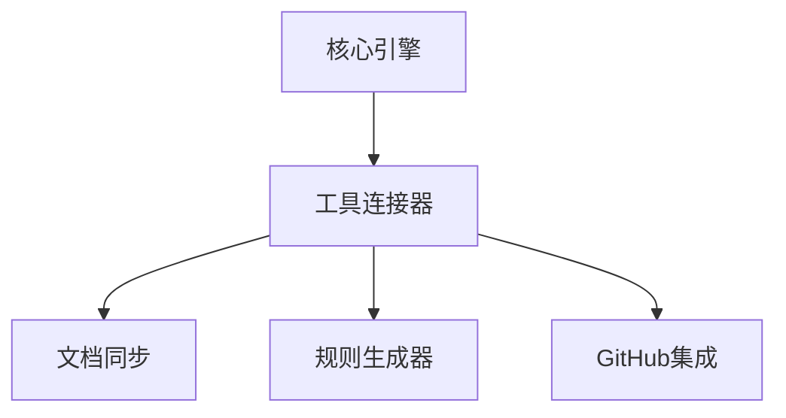

# 工具连接器模块概览

## 模块定位

工具连接器是VibeCopilot的基础设施组件，通过标准化适配器接口实现与Cursor、Obsidian、GitHub等外部工具的连接与管理，是系统整合能力的核心。

### 核心职责

- 工具发现与连接管理
- 统一适配器接口
- 工具状态监控
- 连接配置及重连

### 架构位置



## 快速开始

### 环境准备

```bash
# 核心依赖
npm install --save socket.io rxjs

# 特定工具依赖
npm install --save @octokit/rest  # GitHub
```

### 核心接口

```typescript
// 工具连接器接口
interface ToolConnector {
  connectTool(type: ToolType, config: ToolConfig): Promise<boolean>;
  getToolStatus(type: ToolType): Promise<ToolStatus>;
  watchToolStatus(type: ToolType): Observable<ToolStatus>;
  getAdapter<T extends ToolAdapter>(type: ToolType): T;
}

// 工具适配器接口
interface ToolAdapter {
  connect(config: ToolConfig): Promise<boolean>;
  execute<T>(action: string, params: any): Promise<T>;
  disconnect(): Promise<void>;
  getConnectionStatus(): ToolStatus;
}
```

## 适配器实现示例

以下是GitHub适配器的简化实现示例：

```typescript
class GitHubAdapter implements ToolAdapter {
  private client: Octokit;
  private connected: boolean = false;

  async connect(config: ToolConfig): Promise<boolean> {
    try {
      const { token } = config.connectionParams;
      this.client = new Octokit({ auth: token });
      this.connected = true;
      return true;
    } catch (error) {
      this.connected = false;
      throw error;
    }
  }

  async execute<T>(action: string, params: any): Promise<T> {
    if (!this.connected) throw new Error('GitHub not connected');

    switch (action) {
      case 'getIssue':
        return await this.client.issues.get(params) as unknown as T;
      case 'createIssue':
        return await this.client.issues.create(params) as unknown as T;
      default:
        throw new Error(`Unknown action: ${action}`);
    }
  }

  // 其他方法实现...
}
```

## 最佳实践

### 工具集成原则

- 使用抽象层隔离具体实现细节
- 采用观察者模式监控连接状态
- 实现自动重连和优雅降级
- 避免在适配器中包含业务逻辑

### 异常处理

- 为每种工具定义特定的错误类型
- 提供详细诊断信息但隐藏敏感数据
- 实现连接超时和重试机制
- 记录重要连接事件日志

### 扩展新工具

1. 实现ToolAdapter接口
2. 注册到AdapterFactory
3. 提供连接配置示例
4. 编写单元测试验证功能

## 常见问题解决

| 问题 | 解决方案 |
|------|---------|
| 连接失败 | 验证配置、检查网络、确认工具状态 |
| 版本不兼容 | 实现版本检测、提供多版本支持 |
| 性能瓶颈 | 使用连接池、请求队列、缓存减少调用 |
| 意外断开 | 实现事件监听、自动重连、状态同步 |

## 测试策略

- **单元测试**: 使用模拟对象测试各个适配器
- **集成测试**: 验证与实际工具的交互
- **故障测试**: 模拟连接失败和异常情况
- **性能测试**: 测试多连接并发情况

## 未来发展

- 支持更多外部工具(VS Code、JetBrains等)
- 实现工具插件动态发现与加载
- 添加工具使用分析与诊断
- 实现跨设备工具同步机制

---

本文档提供了工具连接器模块的核心概念和使用方法。完整实现细节请参考源代码及注释。
