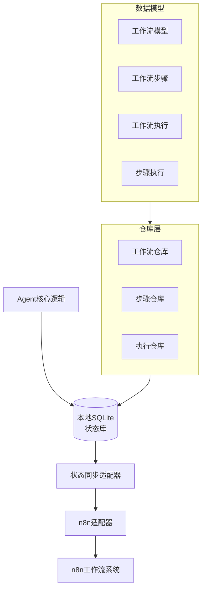
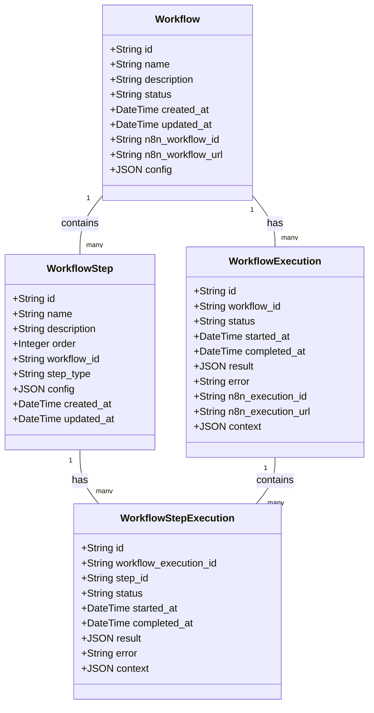
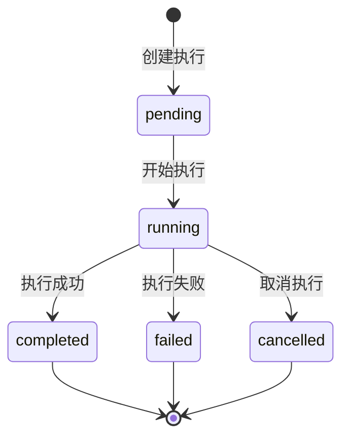

# 工作流模型与n8n集成指南

**文档版本**: 1.0.0
**创建日期**: 2025-04-05
**作者**: VibeCopilot Team

## 目录

1. [概述](#概述)
2. [架构设计](#架构设计)
3. [数据模型](#数据模型)
4. [适配器模式](#适配器模式)
5. [状态同步机制](#状态同步机制)
6. [使用指南](#使用指南)
7. [开发指南](#开发指南)
8. [常见问题](#常见问题)

## 概述

工作流模型与n8n集成是VibeCopilot项目的状态管理引擎的重要组成部分，它允许Agent执行状态与外部工作流系统(n8n)进行双向同步。通过这种集成，我们可以利用n8n强大的自动化工作流能力，同时保持系统的解耦和可扩展性。

本文档详细介绍了工作流模型的设计、n8n适配器的实现以及如何使用这些组件来构建自动化工作流。

## 架构设计

工作流模型与n8n集成采用了适配器模式，主要包含以下核心组件：



### 核心组件

1. **工作流模型**: 定义工作流、步骤和执行的数据结构
2. **n8n适配器**: 封装与n8n API的交互
3. **状态同步适配器**: 负责本地状态与n8n状态的同步
4. **命令行工具**: 提供工作流管理和执行的命令行接口

## 数据模型

工作流模型采用了关系型数据库设计，主要包含以下实体：

### Workflow (工作流)

工作流是一系列步骤的集合，代表一个完整的自动化流程。



### 状态流转

工作流执行的状态流转如下：



## 适配器模式

适配器模式是本设计的核心，它通过以下方式解耦系统组件：

### n8n适配器

n8n适配器封装了与n8n API的所有交互，主要功能包括：

1. 工作流管理：创建、更新、删除、激活/停用工作流
2. 工作流执行：触发工作流执行、查询执行状态
3. 凭证管理：获取凭证信息

### 状态同步适配器

状态同步适配器负责协调本地状态与n8n状态的同步，主要功能包括：

1. 同步工作流状态：将本地工作流状态同步到n8n
2. 同步执行状态：将本地执行状态同步到n8n，或从n8n更新本地执行状态
3. 导入n8n工作流：将n8n中的工作流导入到本地数据库

## 状态同步机制

状态同步采用了以下策略：

1. **本地状态优先**: 本地SQLite数据库作为执行状态的权威来源
2. **定时同步**: 通过定时任务或手动触发同步本地状态到n8n
3. **事件驱动**: 当本地状态发生变化时，触发同步操作
4. **双向更新**: 支持从n8n更新本地状态，以及从本地更新n8n状态

### 状态映射

本地状态与n8n工作流的映射关系如下：

| 本地状态 | n8n工作流 | 描述 |
|---------|----------|------|
| pending | notification_workflow | 等待执行的工作流 |
| running | execution_workflow | 正在执行的工作流 |
| completed | completion_workflow | 执行完成的工作流 |
| failed | failure_workflow | 执行失败的工作流 |

## 使用指南

### 命令行工具

项目提供了命令行工具 `workflow_manager.py` 用于管理工作流和执行。

#### 列出工作流

```bash
python src/cli/workflow_manager.py list [-v]
```

#### 查看工作流详情

```bash
python src/cli/workflow_manager.py view <workflow_id> [-v]
```

#### 创建工作流

```bash
python src/cli/workflow_manager.py create <name> [-d <description>] [--active] [--n8n-id <n8n_workflow_id>]
```

#### 更新工作流

```bash
python src/cli/workflow_manager.py update <workflow_id> [-n <name>] [-d <description>] [-s <status>] [--n8n-id <n8n_workflow_id>]
```

#### 删除工作流

```bash
python src/cli/workflow_manager.py delete <workflow_id> [-f]
```

#### 执行工作流

```bash
python src/cli/workflow_manager.py execute <workflow_id> [-c <context_json>]
```

#### 同步n8n工作流

```bash
# 导入n8n工作流
python src/cli/workflow_manager.py sync --import-workflows

# 同步工作流状态
python src/cli/workflow_manager.py sync -w <workflow_id>

# 同步执行状态
python src/cli/workflow_manager.py sync -w <workflow_id> -e <execution_id>

# 从n8n更新执行状态
python src/cli/workflow_manager.py sync --update-from-n8n -n <n8n_execution_id>

# 同步所有待处理的执行
python src/cli/workflow_manager.py sync --sync-pending
```

### 配置n8n连接

n8n连接配置可以通过环境变量设置：

```bash
export N8N_BASE_URL=http://localhost:5678
export N8N_API_KEY=your_api_key
```

或者在代码中直接指定：

```python
from src.adapters.n8n_adapter import N8nAdapter

adapter = N8nAdapter(
    base_url="http://localhost:5678",
    api_key="your_api_key"
)
```

## 开发指南

### 扩展工作流模型

要添加新的工作流相关实体，请按照以下步骤操作：

1. 在 `src/db/models/workflow.py` 中定义新的模型类
2. 在 `src/db/repositories` 目录下创建对应的仓库类
3. 更新 `src/adapters/status_sync_adapter.py` 以支持新实体的同步

### 自定义n8n适配器

要扩展n8n适配器功能，可以在 `src/adapters/n8n_adapter.py` 中添加新的方法：

```python
def custom_n8n_operation(self, param1, param2):
    """自定义n8n操作

    Args:
        param1: 参数1
        param2: 参数2

    Returns:
        操作结果
    """
    endpoint = f"api/v1/custom/{param1}"
    data = {"param2": param2}
    return self._make_request("POST", endpoint, data)
```

### 集成其他工作流系统

要集成其他工作流系统（如Airflow、Prefect等），可以创建新的适配器类：

1. 创建新的适配器类，如 `src/adapters/airflow_adapter.py`
2. 实现与工作流系统API的交互
3. 在状态同步适配器中添加对新系统的支持

## 常见问题

### 1. n8n连接失败

**问题**: 无法连接到n8n API。

**解决方案**:

- 确认n8n服务正在运行
- 检查n8n基础URL配置是否正确
- 验证API密钥是否有效
- 检查网络连接和防火墙设置

### 2. 工作流执行状态不同步

**问题**: 本地工作流执行状态与n8n中的状态不一致。

**解决方案**:

- 手动触发同步: `python src/cli/workflow_manager.py sync -w <workflow_id> -e <execution_id>`
- 从n8n更新状态: `python src/cli/workflow_manager.py sync --update-from-n8n -n <n8n_execution_id>`
- 检查日志以排查同步失败的原因

### 3. n8n工作流未触发

**问题**: 执行工作流时，n8n工作流未被触发。

**解决方案**:

- 确认工作流已关联n8n工作流ID
- 检查n8n工作流是否处于活跃状态
- 验证n8n工作流的触发器配置是否正确
- 检查API调用日志以排查问题
