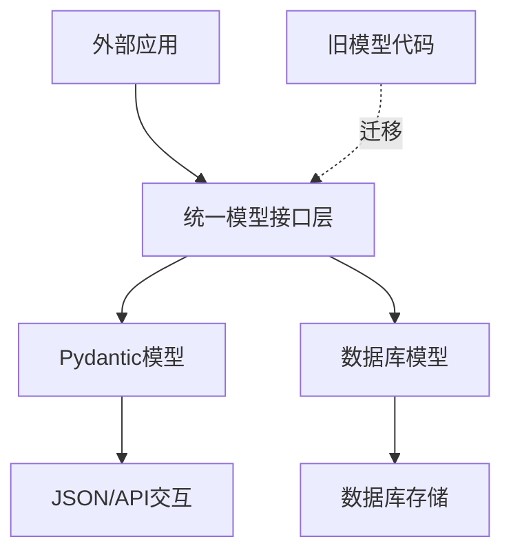

# 模型统一迁移开发计划

**关联PRD**: docs/dev/model-migration-guide.md
**状态**: approved
**版本**: 1.0.0
**创建日期**: 2024-06-01
**预计完成时间**: 2024-06-15

## 1. 技术选型

本次迁移保持现有技术栈不变，主要涉及以下技术组件：

- **数据模型层**: Pydantic V2（数据验证和序列化）
- **数据库映射**: SQLAlchemy（ORM框架）
- **单元测试**: pytest（测试框架）
- **代码分析**: mypy（类型检查）

技术选型理由：

- 继续使用Pydantic确保与现有代码兼容
- SQLAlchemy提供稳定成熟的ORM支持
- pytest易于编写和维护测试用例
- mypy有助于在迁移过程中发现类型错误

## 2. 架构设计



### 核心架构变更

1. **统一模型定义**
   - 将散布在多个位置的模型定义整合到`src/models/`目录
   - 建立清晰的模型层次结构
   - 提供一致的模型转换接口

2. **导入路径标准化**
   - 所有模型类型从统一位置导入
   - 消除重复定义，减少维护成本
   - 简化依赖关系

3. **模型转换标准化**
   - 统一使用内置转换方法
   - 减少手动映射代码
   - 降低维护成本和出错可能性

## 3. 数据模型

### 核心模型结构

```
src/models/
  ├── __init__.py         # 导出所有模型
  ├── base.py             # 基础类型和共享枚举
  ├── rule.py             # 统一的规则模型
  ├── template.py         # 统一的模板模型
  └── db/                 # 数据库模型
      ├── __init__.py     # 导出数据库模型
      ├── base.py         # SQLAlchemy Base定义
      ├── rule.py         # 规则数据库模型
      └── template.py     # 模板数据库模型
```

### 主要数据实体

1. **Rule** - 规则模型
   - 核心字段：id, name, type, description, content
   - 关联实体：RuleItem, Example
   - 元数据：RuleMetadata

2. **Template** - 模板模型
   - 核心字段：id, name, description, type, content
   - 关联实体：TemplateVariable
   - 元数据：TemplateMetadata

3. **共享枚举和基类**
   - RuleType：规则类型枚举
   - TemplateVariableType：模板变量类型枚举
   - BaseMetadata：共享元数据基类

## 4. 接口设计

不涉及外部API变更，主要是内部模型API的统一：

1. **模型实例化接口**: 保持一致的构造方法
2. **模型转换接口**:
   ```python
   # 数据库转Pydantic
   def to_pydantic(self) -> PydanticModel

   # Pydantic转数据库
   @classmethod
   def from_pydantic(cls, model: PydanticModel) -> Self
   ```

3. **导入接口统一**:
   ```python
   # 统一从models包导入
   from src.models import Rule, Template, RuleType
   from src.models.db import Rule as DBRule
   ```

## 5. 工作分解

| 任务ID | 任务名称 | 描述 | 预计工时 | 优先级 |
|--------|---------|------|----------|--------|
| T-MM-01 | 更新导入路径 | 将所有导入语句更新为使用新的模型路径 | 4h | P1 |
| T-MM-02 | 更新数据库模型引用 | 更新所有使用旧数据库模型的代码 | 3h | P1 |
| T-MM-03 | 更新模型转换逻辑 | 使用新的转换方法替换旧的手动转换 | 4h | P1 |
| T-MM-04 | 处理枚举类型 | 更新所有使用枚举类型的代码 | 2h | P1 |
| T-MM-05 | 测试和验证 | 全面测试和验证迁移结果 | 3h | P1 |

## 6. 风险评估

| 风险 | 影响 | 可能性 | 缓解措施 |
|------|------|--------|---------|
| 导入变更破坏现有功能 | 高 | 中 | 增量修改并及时测试；使用类型检查捕获错误 |
| 模型字段变更导致兼容性问题 | 中 | 低 | 编写详细的字段映射文档；添加验证测试 |
| 性能下降 | 低 | 低 | 在迁移前后进行性能基准测试，确保没有回归 |
| 数据库迁移问题 | 高 | 低 | 准备数据库回滚计划；使用事务确保一致性 |

## 7. 测试策略

1. **单元测试**:
   - 每个修改后的模块都必须有单元测试覆盖
   - 重点测试模型转换逻辑
   - 测试边界条件和异常情况

2. **集成测试**:
   - 测试使用模型的完整功能流程
   - 确保规则的创建、读取、更新和删除功能正常
   - 确保模板的解析、渲染和应用功能正常

3. **性能测试**:
   - 比较迁移前后的响应时间
   - 验证大量数据场景下的性能表现

## 8. 交付计划

| 里程碑 | 计划日期 | 交付物 |
|--------|----------|--------|
| 导入路径更新 | 2024-06-05 | 更新后的导入语句 |
| 数据库模型更新 | 2024-06-08 | 更新后的数据库引用 |
| 模型转换更新 | 2024-06-11 | 更新后的转换逻辑 |
| 枚举处理完成 | 2024-06-13 | 更新后的枚举使用 |
| 测试完成 | 2024-06-15 | 测试报告和最终代码 |

## 9. 附录

### 迁移路径参考

| 旧路径 | 新路径 |
|-------|--------|
| `from src.rule_engine.models.rule import *` | `from src.models.rule import *` |
| `from src.rule_engine.models.template import *` | `from src.models.template import *` |
| `from src.templates.models.rule import *` | `from src.models.rule import *` |
| `from src.templates.models.template import *` | `from src.models.template import *` |
| `from src.db.models import Base` | `from src.models.db import Base` |
| `from src.db.models.template import *` | `from src.models.db.template import *` |

### 模型转换参考

```python
# 旧代码
pydantic_rule = Rule(
    id=db_rule.id,
    name=db_rule.name,
    # ... 其他字段手动映射
)

# 新代码
pydantic_rule = db_rule.to_pydantic()

# 旧代码
db_rule = models.Rule(
    id=pydantic_rule.id,
    name=pydantic_rule.name,
    # ... 其他字段手动映射
)

# 新代码
db_rule = Rule.from_pydantic(pydantic_rule)
```
