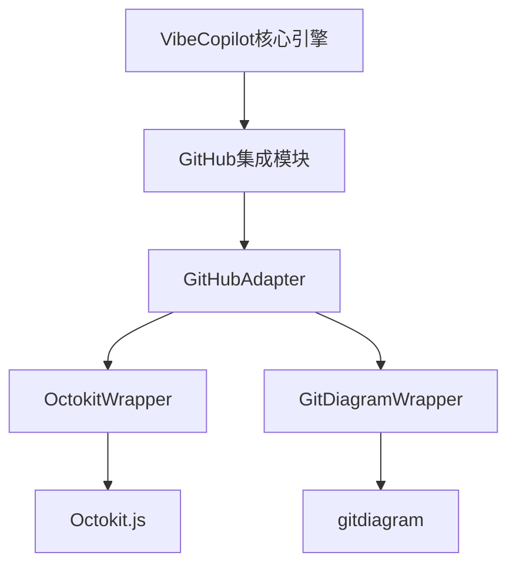

# Octokit集成研究：增强VibeCopilot的GitHub协作能力

## 1. 概述

本文档研究将GitHub官方API客户端库Octokit整合到VibeCopilot项目中，作为GitHub集成模块的核心组件，以实现文档系统与GitHub开发流程的深度集成。

**研究目标：**

- 评估Octokit的功能与VibeCopilot需求的匹配度
- 探索与现有gitdiagram模块的协同方式
- 制定轻量级集成架构
- 确定关键应用场景与实现路径

## 2. Octokit简介

### 2.1 基本信息

Octokit是GitHub官方维护的API客户端库，提供对GitHub API的全面访问能力。

| 特性 | 说明 |
|------|------|
| 开发方 | GitHub官方开发和维护 |
| 语言支持 | JavaScript/TypeScript, Ruby, .NET等 |
| API覆盖 | REST API和GraphQL API完整支持 |
| 许可证 | MIT License |
| GitHub星数 | 4.5k+ (Octokit.js) |
| 最近更新 | 持续活跃（每周更新） |

### 2.2 核心功能

- **认证机制**：支持多种认证方式（token、app、OAuth）
- **资源管理**：完整访问GitHub所有资源（repos, issues, PRs, projects等）
- **分页处理**：自动处理API结果分页
- **请求限制处理**：内置速率限制处理和重试逻辑
- **Webhook处理**：支持GitHub事件订阅
- **插件架构**：支持功能扩展

### 2.3 与VibeCopilot的关联

Octokit补充了gitdiagram在GitHub集成方面的功能空缺：

- gitdiagram专注于GitHub仓库结构分析和系统架构可视化
- Octokit提供GitHub平台功能的程序化访问
- 组合使用可实现项目文档与GitHub工作流的深度集成

## 3. 技术评估

### 3.1 Octokit版本选择

我们推荐使用**Octokit.js**，理由如下：

- 与VibeCopilot核心技术栈（Node.js/TypeScript）一致
- 模块化设计，可按需引入功能
- TypeScript类型支持，提升开发体验
- 完善的文档和示例

### 3.2 依赖分析

Octokit.js采用模块化设计，核心包和常用扩展：

```
@octokit/core        - 核心功能
@octokit/rest        - REST API客户端
@octokit/graphql     - GraphQL API客户端
@octokit/auth        - 认证插件
@octokit/plugin-*    - 各类功能插件
```

对VibeCopilot的影响：

- 包体积：按需引入模块，维持轻量
- 依赖复杂度：中等，但模块化设计降低了耦合
- 兼容性：与现有Node.js环境完全兼容

### 3.3 性能考量

- **API调用效率**：Octokit内置请求缓存和条件请求，减少不必要的网络流量
- **内存占用**：轻量，基本不增加系统资源负担
- **响应性**：支持异步操作，不阻塞主线程

### 3.4 安全性评估

- **认证安全**：支持最新GitHub安全最佳实践
- **令牌管理**：需要妥善保存GitHub访问令牌
- **权限控制**：支持细粒度的权限范围设置
- **数据处理**：本地处理大部分数据，降低敏感信息暴露风险

## 4. 集成架构设计

### 4.1 整体架构

我们采用Adapter Pattern（适配器模式）封装Octokit：



### 4.2 关键接口设计

```typescript
// GitHubAdapter主要接口
interface GitHubAdapter {
  // 仓库管理
  getRepository(owner: string, repo: string): Promise<Repository>;
  createRepository(options: RepoCreateOptions): Promise<Repository>;

  // 问题跟踪
  getIssues(owner: string, repo: string, filters?: IssueFilters): Promise<Issue[]>;
  createIssue(owner: string, repo: string, issueData: IssueCreateData): Promise<Issue>;
  linkDocumentToIssue(issueId: number, documentPath: string): Promise<void>;

  // 项目管理
  getProjects(owner: string, type: 'user'|'org'|'repo'): Promise<Project[]>;
  createProjectItem(projectId: string, contentId: string, type: 'issue'|'pr'): Promise<ProjectItem>;

  // 项目分析与可视化
  analyzeRepositoryStructure(owner: string, repo: string): Promise<RepositoryAnalysis>;
  generateProjectArchitecture(owner: string, repo: string): Promise<ArchitectureData>;
  generateProjectRoadmap(projectId: string): Promise<RoadmapData>;
}
```

### 4.3 与现有模块集成

与gitdiagram集成：

- Octokit提供仓库内容和元数据获取
- gitdiagram负责仓库结构分析和架构可视化
- GitHubAdapter协调二者，增强项目分析能力

与文档模板引擎集成：

- 从文档提取元数据创建GitHub对象
- 文档变更触发GitHub对象更新
- GitHub变更反向同步到文档

## 5. 应用场景实现

### 5.1 文档与Issues双向关联

**实现流程：**

1. 文档创建/更新时：
   ```typescript
   // 从文档中提取元数据
   const metadata = documentEngine.extractMetadata(documentPath);

   // 检查是否已有关联Issue
   if (metadata.issueId) {
     // 更新现有Issue
     await githubAdapter.updateIssue(metadata.owner, metadata.repo, metadata.issueId, {
       title: metadata.title,
       body: generateIssueBodyFromDoc(documentPath)
     });
   } else {
     // 创建新Issue并关联
     const issue = await githubAdapter.createIssue(metadata.owner, metadata.repo, {
       title: metadata.title,
       body: generateIssueBodyFromDoc(documentPath)
     });

     // 更新文档元数据，添加Issue关联
     await documentEngine.updateMetadata(documentPath, { issueId: issue.id });
   }
   ```

2. Issue更新时：
   ```typescript
   // 通过webhook或轮询检测Issue变更
   githubAdapter.onIssueUpdated(async (issue) => {
     // 查找关联文档
     const documentPath = await documentEngine.findDocumentByIssueId(issue.id);

     if (documentPath) {
       // 更新文档内容或状态
       await documentEngine.updateDocumentFromIssue(documentPath, issue);
     }
   });
   ```

### 5.2 项目路线图生成

利用GitHub Projects API结合gitdiagram的项目分析能力创建和管理项目路线图：

```typescript
async function generateRoadmap(owner, repo) {
  // 获取项目数据
  const project = await githubAdapter.getProjectByRepo(owner, repo);

  // 获取项目中的所有任务项
  const items = await githubAdapter.getProjectItems(project.id);

  // 按里程碑和状态组织数据
  const organizedData = organizeByMilestoneAndStatus(items);

  // 使用gitdiagram分析仓库结构
  const repoAnalysis = await gitDiagramWrapper.analyzeRepository(owner, repo);

  // 合并分析结果与项目数据
  const enhancedData = enhanceRoadmapWithAnalysis(organizedData, repoAnalysis);

  // 生成可视化
  const visualization = await visualizationEngine.generateRoadmap(enhancedData);

  return visualization;
}
```

### 5.3 PR创建与文档同步

自动从文档生成PR描述，或从PR更新文档：

```typescript
// 从文档变更创建PR
async function createPRFromDocChanges(docPaths, branchName, title) {
  // 创建分支
  await githubAdapter.createBranch(owner, repo, branchName, 'main');

  // 提交文档变更
  await githubAdapter.commitFiles(owner, repo, branchName, docPaths,
    `Update documentation: ${title}`);

  // 生成PR描述从文档
  const prBody = generatePRBodyFromDocs(docPaths);

  // 创建PR
  const pr = await githubAdapter.createPullRequest(owner, repo, {
    title,
    body: prBody,
    head: branchName,
    base: 'main'
  });

  return pr;
}
```

## 6. 集成步骤与时间规划

### 6.1 集成步骤

1. **准备阶段（1-2天）**
   - 添加Octokit依赖
   - 设置GitHub App/OAuth/Token认证
   - 创建基础测试环境

2. **核心封装（3-4天）**
   - 实现OctokitWrapper基础功能
   - 创建GitHubAdapter接口层
   - 与gitdiagram集成

3. **功能实现（5-7天）**
   - 文档-Issue双向关联
   - 项目路线图可视化
   - PR与文档同步

4. **测试与优化（2-3天）**
   - 单元测试与集成测试
   - 性能优化
   - 文档完善

### 6.2 风险评估与缓解

| 风险 | 影响 | 缓解措施 |
|------|------|---------|
| GitHub API限流 | 可能导致频繁操作失败 | 实现智能缓存和请求合并策略 |
| 认证安全 | 潜在安全隐患 | 使用GitHub App而非个人令牌 |
| 兼容性维护 | API变更可能破坏功能 | 全面的测试覆盖和版本锁定策略 |
| 用户体验 | 权限请求可能影响体验 | 渐进式权限请求，按需授权 |

## 7. 集成示例与代码片段

### 7.1 基础设置

```typescript
// 安装依赖
// npm install @octokit/rest @octokit/auth-token

// 基础认证设置
import { Octokit } from "@octokit/rest";
import { createTokenAuth } from "@octokit/auth-token";

class OctokitWrapper {
  private octokit: Octokit;

  constructor(token: string) {
    const auth = createTokenAuth(token);
    this.octokit = new Octokit({ auth: token });
  }

  // 实现具体方法...
}
```

### 7.2 核心功能示例

```typescript
// Issues管理
async getIssue(owner: string, repo: string, issue_number: number) {
  const response = await this.octokit.issues.get({
    owner,
    repo,
    issue_number
  });
  return response.data;
}

async createIssue(owner: string, repo: string, title: string, body: string, labels?: string[]) {
  const response = await this.octokit.issues.create({
    owner,
    repo,
    title,
    body,
    labels
  });
  return response.data;
}

// 项目管理 (使用GraphQL API)
async getProjectItems(projectId: string) {
  const query = `query($projectId: ID!) {
    node(id: $projectId) {
      ... on ProjectV2 {
        items(first: 100) {
          nodes {
            id
            content {
              ... on Issue {
                title
                number
                state
              }
              ... on PullRequest {
                title
                number
                state
              }
            }
          }
        }
      }
    }
  }`;

  const response = await this.octokit.graphql(query, { projectId });
  return response.node.items.nodes;
}
```

### 7.3 与VibeCopilot集成示例

```typescript
// 在核心引擎中注册GitHub模块
coreEngine.registerModule('github', new GitHubAdapter({
  tokenProvider: () => configManager.getGitHubToken(),
  gitDiagramPath: './modules/gitdiagram'
}));

// 在文档引擎中添加GitHub关联功能
documentEngine.onDocumentUpdated(async (document, changes) => {
  if (document.metadata.syncWithGitHub) {
    const github = coreEngine.getModule('github');
    await github.syncDocumentChanges(document, changes);
  }
});
```

## 8. 总结与建议

### 8.1 主要发现

- Octokit是GitHub官方维护的API客户端，功能全面，质量可靠
- 与VibeCopilot技术栈高度兼容，集成成本低
- 与gitdiagram形成互补关系：gitdiagram提供项目分析能力，Octokit提供GitHub平台交互能力
- 通过轻量级适配器可实现与VibeCopilot核心功能的无缝协作

### 8.2 明确建议

1. **立即集成Octokit**，作为GitHub集成模块的核心依赖
2. **采用适配器模式**封装，保持接口一致性和可替换性
3. **优先实现**文档-Issue关联和项目路线图功能
4. **开发GitHub Apps**而非依赖个人访问令牌，提升安全性
5. **添加相关配置选项**到VibeCopilot配置系统

### 8.3 预期成果

通过Octokit集成，VibeCopilot将获得：

- 文档与GitHub开发流程的深度集成
- 自动化项目管理和路线图生成能力
- 文档与代码协同变更的可追踪性
- 完善的GitHub协作功能支持

集成Octokit将显著增强VibeCopilot作为AI辅助开发文档系统的价值，使其成为连接文档、代码和协作的理想平台。
