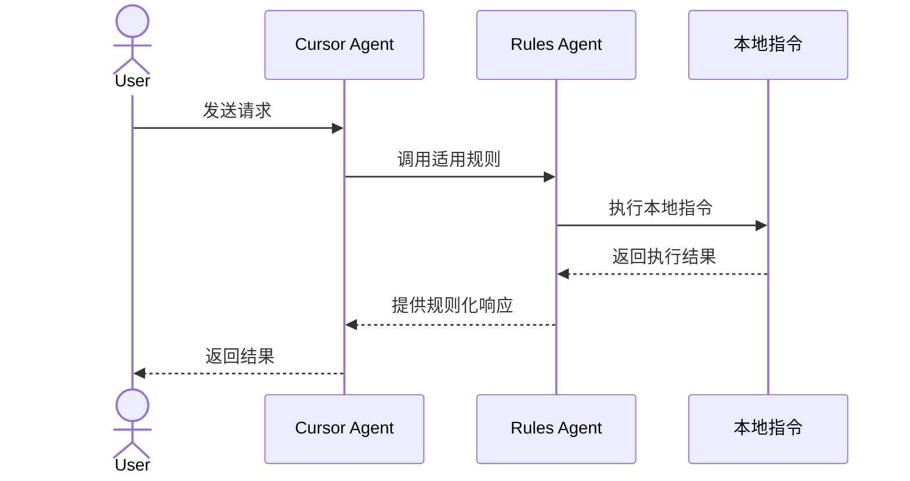
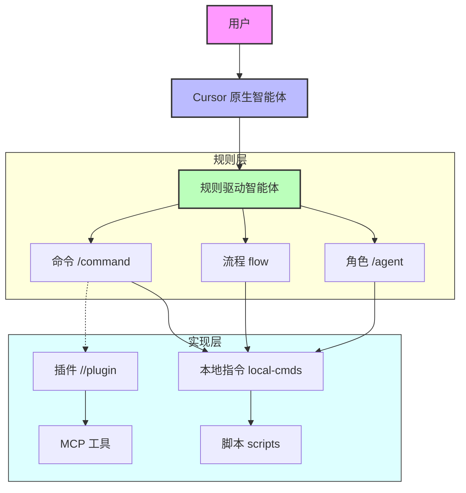

# VibeCopilot组件架构PRD

## 1. 背景与目标

### 1.1 背景

随着VibeCopilot项目的发展，各类组件（规则、命令、脚本、工具）数量快速增长，组件间的关系变得复杂。目前存在概念混淆和调用层次不清晰的问题，特别是工具类命名容易与Claude MCP工具产生冲突，导致智能体无法正确理解用户意图。

### 1.2 目标

- 明确定义VibeCopilot各组件类型及其职责
- 建立统一的命名规范，避免与Cursor/Claude功能冲突
- 规范组件间的调用关系，形成清晰的层次结构
- 设计标准化接口，便于扩展和维护
- 提供简洁明了的文档，帮助开发者和用户理解系统架构

## 2. 系统角色定义

VibeCopilot系统中存在三类关键角色：

| 角色 | 定义 | 职责 | 示例 |
|------|------|------|------|
| User | 最终用户 | 通过文本方式与系统交互，发起请求，获取结果 | 开发者、项目经理 |
| Cursor Agent | Cursor原生智能体 | 解析用户输入，根据上下文调用规则或工具 | Claude 3 Opus |
| Rules Agent | 基于规则的智能体 | 按规则定义执行特定流程和逻辑 | 前端专家、需求分析师 |

### 2.1 角色交互流程



## 3. 组件类型定义

VibeCopilot系统包含以下核心组件类型：

### 3.1 规则类组件

| 组件类型 | 定义 | 调用方式 | 存储位置 | 命名规范 |
|---------|------|---------|---------|---------|
| Command(命令) | 以特定前缀触发的规则 | `/命令名` | .cursor/rules/command-rules/ | kebab-case-command.mdc |
| Flow(流程) | 定义开发流程和检查点 | 间接触发 | .cursor/rules/flow-rules/ | kebab-case-flow.mdc |
| Agent(角色) | 定义专家角色行为 | `/agent 角色名` | .cursor/rules/role-rules/ | kebab-case-expert.mdc |

### 3.2 执行类组件

| 组件类型 | 定义 | 调用方式 | 存储位置 | 命名规范 |
|---------|------|---------|---------|---------|
| Local-Cmd(本地指令) | 封装的标准化脚本接口 | `python src/cli/commands/名称.py` | src/cli/commands/ | command_name.py |
| Script(脚本) | 底层功能实现脚本 | 不直接调用 | scripts/ | function_name.py |
| Plugin(插件) | MCP工具扩展 | `//插件名` | 未来支持 | plugin-name.js |

## 4. 组件关系模型

### 4.1 层次关系

VibeCopilot组件遵循以下层次关系：



### 4.2 数据流向


## 5. 标准接口定义

### 5.1 本地指令接口

所有本地指令必须实现以下标准接口：

```typescript
interface LocalCommand {
  // 指令标识符
  id: string;

  // 指令描述
  description: string;

  // 可用操作列表
  actions: Record<string, ActionDefinition>;

  // 执行入口
  execute(action: string, params: Record<string, any>): CommandResult;
}

interface ActionDefinition {
  description: string;
  params: Record<string, ParamDefinition>;
  examples: string[];
}

interface ParamDefinition {
  type: 'string' | 'number' | 'boolean' | 'array';
  required: boolean;
  description: string;
  default?: any;
}

interface CommandResult {
  success: boolean;
  code: number;
  message: string;
  data?: any;
}
```

### 5.2 命令调用规范

本地指令应通过以下格式调用：

```bash
# 标准调用格式
python src/cli/commands/<command_name>.py --action=<action> [--param1=value1 ...]

# 简写格式
python -m vibe_cmd.<command_name> --action=<action> [--param1=value1 ...]
```

## 6. 命名约定与冲突避免

### 6.1 命名约定

| 组件类型 | 命名前缀/后缀 | 命名风格 | 示例 |
|---------|-------------|---------|------|
| 命令规则 | 后缀 `-command` | kebab-case | `task-command.mdc` |
| 流程规则 | 后缀 `-flow` | kebab-case | `coding-flow.mdc` |
| 角色规则 | 后缀 `-expert` | kebab-case | `frontend-expert.mdc` |
| 本地指令 | 前缀 `vibe_` | snake_case | `vibe_github.py` |
| 本地指令参数 | 无特殊规定 | kebab-case | `--action=check --type=roadmap` |

### 6.2 冲突避免策略

为避免与Claude MCP工具的命名冲突，采取以下策略：

1. **术语区分**：
   - 使用"本地指令"而非"工具"来指代VibeCopilot封装脚本
   - 使用"MCP工具"专指Claude提供的工具

2. **上下文标识**：
   - 本地指令相关规则存放在`local-cmd-rules`目录
   - 执行脚本时明确使用`vibe_`前缀

3. **文档注明**：
   - 所有组件文档中注明组件类型
   - 对可能混淆的术语进行明确解释

## 7. 规范示例

### 7.1 命令规则示例

```markdown
---
description: 任务管理命令，用于创建、更新和跟踪项目任务
globs:
alwaysApply: false
---

# 任务命令

## 命令格式

/task <action> [options]

## 支持的操作

- `create`: 创建新任务
- `update`: 更新任务状态
- `list`: 列出所有任务
```

### 7.2 本地指令示例

```python
#!/usr/bin/env python3
"""GitHub路线图本地指令

此模块提供GitHub路线图管理功能，包括检查、更新和同步操作。
"""

import argparse
import sys
import json

def main():
    parser = argparse.ArgumentParser(description='GitHub路线图管理')
    parser.add_argument('--action', required=True, choices=['check', 'update', 'sync'],
                        help='执行的操作类型')
    parser.add_argument('--type', choices=['roadmap', 'task', 'milestone'],
                        help='操作的资源类型')
    parser.add_argument('--id', help='资源标识符')
    parser.add_argument('--status', help='更新的状态')

    args = parser.parse_args()

    # 执行对应操作
    if args.action == 'check':
        result = check_resource(args.type, args.id)
    elif args.action == 'update':
        result = update_resource(args.type, args.id, args.status)
    elif args.action == 'sync':
        result = sync_resources(args.direction)

    # 输出结构化JSON结果
    print(json.dumps(result, indent=2))
    return 0 if result['success'] else 1

if __name__ == '__main__':
    sys.exit(main())
```

## 8. 实施计划

### 8.1 分阶段实施

| 阶段 | 任务 | 时间估计 | 优先级 |
|------|------|---------|-------|
| 1 | 完善组件架构文档 | 1天 | 高 |
| 2 | 调整目录结构与命名 | 2天 | 高 |
| 3 | 实现本地指令标准接口 | 3天 | 中 |
| 4 | 更新现有规则以符合新架构 | 5天 | 中 |
| 5 | 开发示例组件作为参考 | 2天 | 低 |

### 8.2 向后兼容策略

为确保现有功能不受影响，采取以下兼容策略：

1. 保留原有规则文件，同时创建符合新规范的版本
2. 脚本重构采用渐进式方法，确保功能连续性
3. 添加适配层处理旧格式调用，自动转换为新格式
4. 文档明确标注兼容性信息，帮助用户适应变化

## 9. 验收标准

本架构设计须满足以下验收标准：

1. 所有组件类型有明确定义和文档
2. 组件间调用关系清晰，没有循环依赖
3. 本地指令实现统一接口，可以互换使用
4. 命名规范避免与Claude MCP工具冲突
5. 用户可通过简单命令完成所有操作
6. 开发者可以轻松扩展新功能而不影响现有组件

## 10. 附录

### 10.1 术语表

| 术语 | 定义 |
|------|------|
| 命令(Command) | 以`/`开头触发的规则，如`/task` |
| 本地指令(Local-Cmd) | 项目定义的标准化脚本接口 |
| 插件(Plugin) | MCP工具的扩展，以`//`开头 |
| 规则(Rule) | Cursor规则系统中的规则文件(.mdc) |
| MCP工具 | Claude提供的原生工具集 |

### 10.2 相关文档

- [VibeCopilot - 产品规范与实现白皮书](../architecture/2_prd.md)
- [开发流程规范](../flow/workflow-instruction.md)
- [命令系统使用指南](../user/command-system.md)

---

*注：本PRD为VibeCopilot组件架构定义文档，实际实现可能根据开发进展有所调整。*
